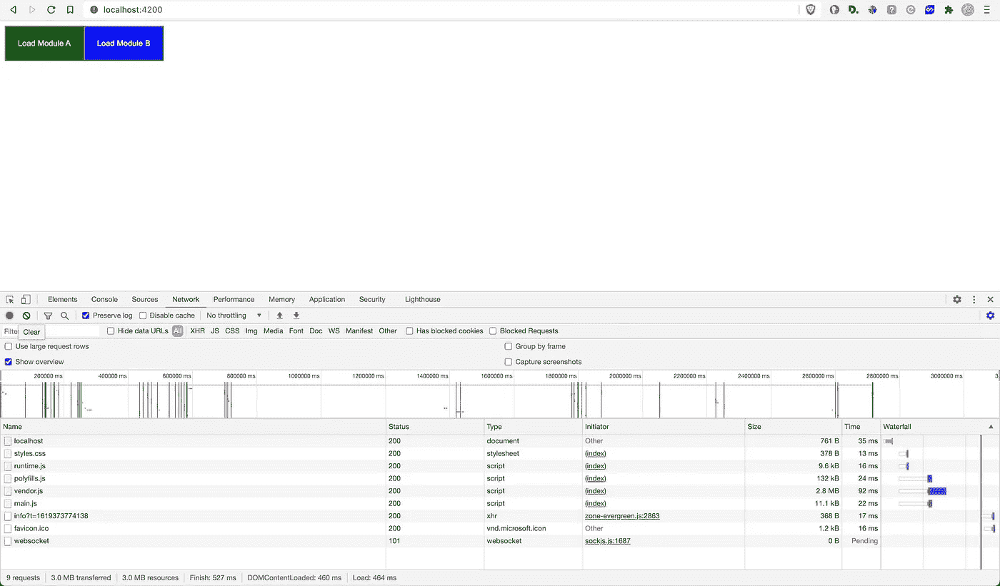

# Angular 中的惰性加载—初学者指南

> 原文：<https://betterprogramming.pub/lazy-loading-in-angular-a-beginners-guide-c09d09738d08>

## 改善网站的用户体验和搜索引擎优化


Alexander Possingham 在 [Unsplash](https://unsplash.com?utm_source=medium&utm_medium=referral) 上拍摄的照片。

惰性加载是根据需要加载组件、模块或网站的其他资产的过程。因为 Angular 创建了一个 SPA ( [单页应用](https://en.wikipedia.org/wiki/Single-page_application))，所以它的所有组件都是一次性加载的。其次，许多不必要的库或模块也可能被加载。

对于一个小的应用程序来说，这是可以的。但是随着应用程序的增长，如果一次加载所有内容，加载时间会增加。惰性加载允许 Angular 在需要的时候加载组件和模块。

为了理解惰性加载是如何工作的，我们首先需要理解 Angular 的构造块:NgModules。

# 什么是 NgModules？

像 RouterModule、BrowserModule 和 FormsModule 这样的 Angular 库是 NgModules。Angular Material 是第三方库，也是 NgModule 的一种。NgModule 由与特定领域相关或具有类似功能集的文件和代码组成。

典型的 NgModule 文件声明组件、指令、管道和服务。它还可以导入当前模块中需要的其他模块。

NgModules 的一个重要优势是它们可以延迟加载。让我们来看看如何配置延迟加载。

# 如何创建 NgModules

在本教程中，我们将创建两个延迟加载的模块(模块 A 和模块 B)。在主屏幕上，我们将有两个按钮来加载每个模块。

## 创建项目

通过执行以下命令，创建一个名为 *lazy-load-demo* 的新 Angular 项目:

```
ng new lazy-load-demo --routing --style css
code lazy-load-demo
```

这里，我们正在创建一个带有路由的新项目。其次，我们向 CSS 提及样式表格式。第二个命令在 VS 代码中打开项目。

## 根模块

默认情况下，根模块或应用模块在 `/src/app`下创建。下面是创建的 NgModule 文件:

应用程序模块文件

首先，我们导入所有需要的模块和组件。

之后，`@NgModule`装饰器声明`AppModule`类是 NgModule 的一种类型。装饰者接受`declarations`、`imports`、`providers`和`bootstrap`、*。*以下是对它们的描述:

*   `declarations`:该模块中的组件。
*   `imports`:当前模块需要的模块。
*   `providers`:服务提供商(如有)。
*   `bootstrap`:Angular 创建的*根*组件，插入到`index.html`宿主网页中。

## 主屏幕

主屏幕上有两个按钮:*加载模块 A* 和*加载模块 B* 。顾名思义，点击这些按钮将延迟加载每个模块。

为此，请用以下内容替换您的`app.component.html`文件:

应用程序组件 HTML

让我们定义路线 *a* 和 *b* 的模块。

## 惰性加载模块

为了创建延迟加载模块，请执行以下命令:

```
ng generate module modulea --route a --module app.module
ng generate module moduleb --route b --module app.module
```

该命令将生成两个文件夹:`modulea`和`moduleb`。随后，每个文件夹将包含自己的`module.ts`、`routing.ts`和`component`文件。

如果您检查您的`app-routing.module.ts`，您将看到以下路线代码:

应用程序路线

这意味着当路径 *a* 或 *b* 被访问时，它们各自的模块将被延迟加载。

使用`ng serve`运行项目时，您会看到下面的屏幕:


主屏幕

当您点击*加载模块 A* 按钮时，您将进入页面 *a* 。您的屏幕应该是这样的:


延迟加载模块 A

您应该会看到一个类似的屏幕，显示“moduleb works！”点击*加载模块 B* 时。

# 如何验证延迟加载有效

为了验证文件是否已加载，请按 F12 打开开发人员工具。之后，访问网络选项卡。当您刷新页面时，它将显示一些被请求的文件。



网络选项卡


点击清除按钮，清除你的请求列表，如上图所示。

当你点击*加载模块 A* 时，你会看到对`modulea-modulea-module.js`的请求，如下图所示。这验证了模块 A 是延迟加载的。


延迟加载模块 A

类似地，当你点击*加载模块 B* 时，`moduleb-moduleb-module.js`文件被加载，验证模块 B 被延迟加载。


延迟加载模块 B

现在，当您尝试单击按钮时，它将不会再次加载这些 JS 文件。

# NgModules 的用例

正如我们所见，创建惰性加载模块非常容易。它们有很多有用的使用案例，例如:

*   为登录前和登录后屏幕创建单独的模块。
*   对于电子商务网站，面向供应商和面向客户的屏幕可以属于不同的模块。您也可以创建一个单独的支付模块。
*   通常会创建一个包含共享组件、指令或管道的单独的`CommonModule`。像*复制代码*按钮这样的指令和像*投赞成票/反对票*这样的组件通常包含在一个公共模块中。

# 结论

对于较小的网站来说，一次加载所有模块可能没什么关系。但是随着站点的增长，根据需要加载独立的模块是很有帮助的。

通过延迟加载，网站的加载时间可以大大减少。当你试图提高搜索引擎优化的排名时，这尤其有用。即使你不是，更短的加载时间意味着更好的用户体验。