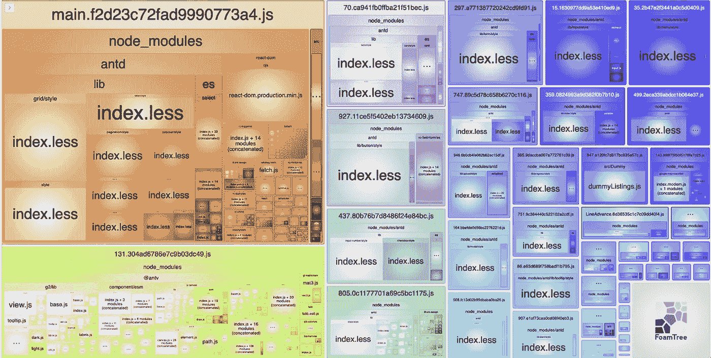

# 惰性加载反应组件

> 原文：<https://betterprogramming.pub/lazy-loading-react-components-cdd76006b35a>

## 延迟加载在服务器和浏览器环境中为各种框架反应组件

[插画](https://undraw.co/search)。

React 应用程序，像任何其他类型的 web 应用程序(Angular，Vue 等)一样，在浏览器中下载和执行时，可能会变得非常大，并且在任何给定的时间都充满了未使用的代码。

常见的 UX 模式有许多组件，如对话框、警告和消息，它们只在用户交互或特定事件后出现。以点击网站上的“添加到购物车”为例，然后出现一个弹出消息说“已成功添加到购物车！”。当 web 应用程序最初被下载到浏览器中时，并不需要弹出组件，因此它可以被代码分割(例如，从主 JS 包中移除)并在用户向购物车添加内容时延迟加载。

捆绑器变得更加聪明，可以为你树摇一些未使用的代码，但是他们不能决定每个文件/组件是否应该被延迟加载并从主 JS 包中完全删除。这种代码分割和延迟加载功能通常由动态`import()`方法完成，该方法是 bundler 编译运行时的一部分*，不同于浏览器方法*。

然而，由于 [React 的 JSX](https://reactjs.org/docs/introducing-jsx.html) ，我们需要做的不仅仅是用动态`import()`导入和渲染组件。在本文中，我们将看到如何在不同的运行时上下文中(服务器对浏览器)以及针对不同的 web 框架(Next.js 和 Gatsby.js)对 React 组件进行代码拆分和延迟加载。

## React.js

**注意:**以下方法适用于在浏览器中执行所有代码的客户端渲染(CSR) web 应用。

在下面的例子中，我们使用 React 自己的惰性加载组件`[lazy](https://reactjs.org/docs/code-splitting.html#reactlazy)` [和](https://reactjs.org/docs/code-splitting.html#reactlazy) `[Suspense](https://reactjs.org/docs/code-splitting.html#reactlazy)`。

React 负责将导入的 JS 文件翻译成 React 组件，以便可以使用 JSX 进行渲染。当 Webpack 看到动态`import()`函数被调用时，它会在编译期间处理代码拆分和延迟加载部分。

**注意:**如果`import()`功能没有被你的捆绑器识别，你可能需要安装[这个巴别塔插件](https://babeljs.io/docs/en/babel-plugin-syntax-dynamic-import.html)。

要延迟加载的组件在下载、解析和呈现时需要一个占位符，所以 React 要求使用`<Suspense>`来提供那个`fallback`组件。这实际上可以是任何东西，一个 spinner、动画 SVG，或者只是一个普通的文本，表示将在它的位置加载一些东西。

一个活生生的例子，请看[这个小故障](https://glitch.com/edit/#!/react-component-lazy-loading)。

## 在 Webpack 中命名输出块

有时你可能想给你的代码分割块命名，因为默认情况下捆绑器**不会给它们命名。当我在一个页面上有许多延迟加载的组件时，它确实有助于我进行调试。**

对于 Webpack，你只需要使用如下的`webpackChunkName`魔法注释:

因此，以前面的例子为例，我们延迟加载了`<NavMenu>`组件，我们会这样做:

## 使用`react-router`

代码膨胀是单页应用程序的常见问题。如果没有正确完成，您最终会得到一个包含 web 应用程序中所有可能路径的主 JS 包，而您一次只需要一个。

幸运的是，这很容易解决。当您指定路由时，只需使用上述方法来延迟加载组件:

## Next.js

**注意:**next . js 的方法不同，因为它处理服务器端呈现(SSR ),其中代码并不总是在浏览器中执行——它也在服务器中执行。

Next.js 提供[开箱即用的动态导入](https://nextjs.org/docs/advanced-features/dynamic-import)，包含 *SSR！*

对任何组件进行代码拆分和转换都相当简单。如果我们以前面的`<Header />`组件为例，它看起来会像这样:

## 盖茨比

**注意:**Gatsby . js 的方法有所不同，因为它处理服务器端呈现(SSR ),其中代码并不总是在浏览器中执行——它也在服务器中执行。

Gatsby 目前不像 Next.js 那样提供带 SSR 的现成惰性加载。要添加延迟加载，我们必须考虑以下三个选项之一。尽管这个列表并不详尽，但我发现它更方便😊。

**注意:** Gatsby.js 默认使用 Webpack 构建并捆绑代码。

## *盖茨比#1:* 反应`lazy`和`Suspense`

就像在浏览器的 plain React.js 中一样，我们可以使用 React `lazy`和`Suspense`但是首先，我们需要检查`window`对象是否不是`undefined`:

关于这个变通办法的更多信息可以在 [Gatsby.js 文档](https://www.gatsbyjs.com/docs/using-client-side-only-packages/#workaround-4-use-reactlazy-and-suspense-on-client-side-only)中找到。

**注意:**上面的懒加载组件不会被服务器端渲染！

## *盖茨比#2:* 可加载组件

[可加载组件](https://loadable-components.com/)是一个内置 SSR 的 React 组件延迟加载库。react-universal-component 库也提供了类似的功能。

关于这个变通办法的更多信息可以在 [Gatsby.js 文档](https://www.gatsbyjs.com/docs/using-client-side-only-packages/#workaround-3-load-client-side-dependent-components-with-loadable-components)中找到。

提示:这篇[深入的文章](https://dev.to/itmayziii/better-performance-using-dynamic-code-splitting-in-gatsby-with-loadable-components-6am)解释了如何用 Gatsby 设置可加载组件。

## *盖茨比选项#3:* 动态`import()` +反应状态

我们要考虑的最后一个变通方法是利用我们之前在 React `lazy`函数中看到的动态`import()`函数以及 React [状态](https://reactjs.org/docs/hooks-state.html)。

我们本质上是在用户交互之后导入组件文件(第 12 行),并通过调用`React.createElement`方法在运行时创建一个新的 React 组件(第 14 行):

对于一个示例项目，请查看这个[演示 Gatsby GitHub 库](https://github.com/charisTheo/gatsby-dynamic-imports)。

# 进一步阅读

*   [反应拆码单据](https://reactjs.org/docs/code-splitting.html#code-splitting)
*   [Webpack 代码拆分文档](https://webpack.js.org/guides/code-splitting/)
*   `[loadable-components](https://github.com/gregberge/loadable-components)` [Github 资源库](https://github.com/gregberge/loadable-components)
*   `[react-lazyload](https://github.com/twobin/react-lazyload)` [Github 资源库](https://github.com/twobin/react-lazyload)
*   `[react-lazy-hydration](https://github.com/hadeeb/react-lazy-hydration)` [Github 资源库](https://github.com/hadeeb/react-lazy-hydration)