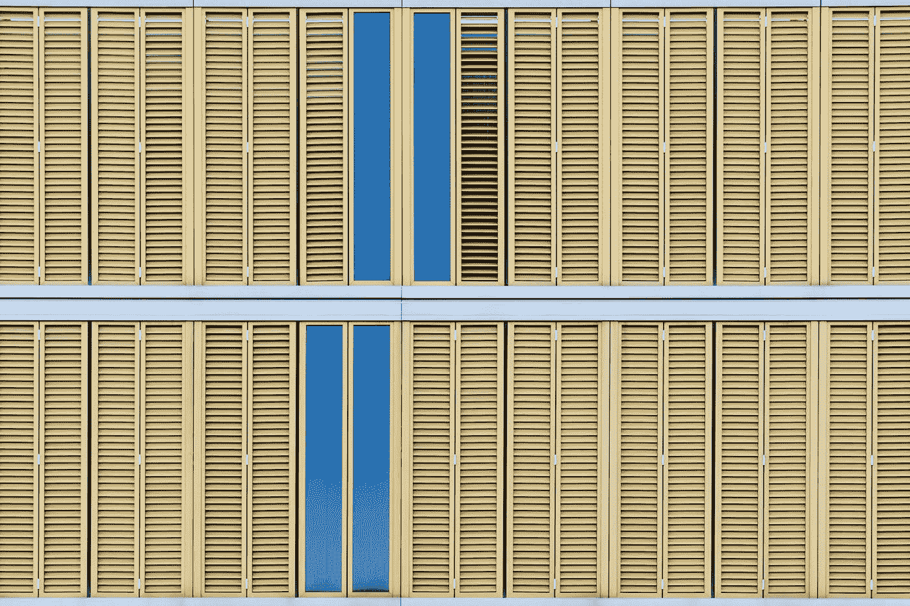
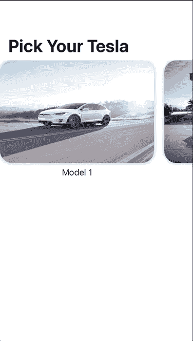

# SwiftUI 中的 LazyHGrids

> 原文：<https://betterprogramming.pub/lazyhgrids-in-swiftui-aced42336f8>

## 可以把它们想象成水平滚动的集合视图



由[paweczerwiński](https://unsplash.com/@pawel_czerwinski?utm_source=medium&utm_medium=referral)在 [Unsplash](https://unsplash.com?utm_source=medium&utm_medium=referral) 上拍摄的照片。

在最近的 WWDC 2020 上，苹果推出了一款`LazyHGrid`。许多开发人员发现 SwiftUI 在首次推出时缺少对 CollectionView 的支持。随着`LazyHGrid`的发布，您现在可以在 UIKit 中模仿与 UICollectionView 相同的行为。

> *“一个容器视图，它在一个水平增长的网格中排列其子视图，仅在需要时创建项目。”—* [*苹果开发者*](https://developer.apple.com/documentation/swiftui/lazyhgrid)

# 先决条件

要学习本教程，您需要了解以下方面的一些基本知识:

*   迅速发生的
*   至少 Xcode 12+

*注意:这只支持 iOS 14+。*

# LazyHGrid 入门

正如您可能注意到的，`Lazy`前缀基本上表示视图只在屏幕上出现时才被渲染，这提高了性能。您不想同时加载所有 1，000 个数据。使用`LazyHGrid`，您只需加载屏幕上出现的任意数量的数据。

为了让事情更有趣，我们来编一个故事情节。特斯拉正在举办一场招聘 iOS 工程师的比赛，他们向所有人开放了提交材料。你热爱特斯拉，想成为团队的一员。

所以你决定用 SwiftUI 和`LazyHGrid`来打动他们。

您首先需要配置布局，您可以使用`GridItem`来完成。`GridItem`基本上允许您配置`size`和`grid`属性:

```
var gridItems: [GridItem] = [GridItem()]
```

接下来，您将创建`LazyHGrid`，它嵌入在`ScrollView`中用于滚动。

如你所见，`Assets.xcassets`中存储的图像基本命名为`1`、`2`、`3`、`4` …

瞧。



# 自定义行

在上面的配置中，只有一行。在 SwiftUI 上添加行变得更加容易，只需添加一行代码即可完成。只需将您的`gridItems`修改如下:

```
var gridItems: [GridItem] = [GridItem(), GridItem()]
```

现在你会看到两行。如果您希望有更多行，您可以自行添加。默认情况下，`GridItem`使用`flexible(minimum: CGFloat = 10, maximum: CGFloat = .infinity)`。


# 定制尺寸

你甚至可以通过使用`GridItem.Sizes`来调整网格的大小，包括`fixed`、`adaptive`和`flexible`。

使用`fixed`，你可以给物品指定高度。下面的代码基本上表明第一行的高度是 200，下一行的高度是 400。

```
var gridItems: [GridItem] = [GridItem(.flexi(200)),
                             GridItem(.fixed(400))]
```


使用`flexible`、**、**可以设置最小和最大高度。在这里，你甚至可以混合一些其他的`GridItem.Sizes`:

```
var gridItems: [GridItem] = [GridItem(.flexible(minimum: 100, maximum: 300)),
                             GridItem(.fixed(400))]
```


使用`adaptive`，`LazyHGrid`将通过检查每个项目的高度来确定需要多少行:

```
var gridItems: [GridItem] = [GridItem(.adaptive(minimum: 150, maximum: 400))]
```

在这里，每个项目的高度重新调整如下。使用`adaptive`，它只是计算要创建多少行:

```
.frame(width: 200, height: 150, alignment: .center)
```


让我们不要被定制分散注意力。相反，让我们发送我们的提交到特斯拉的网站，并希望我们被选中。