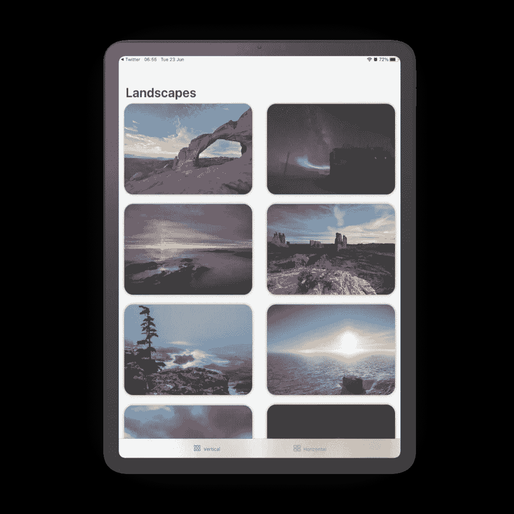
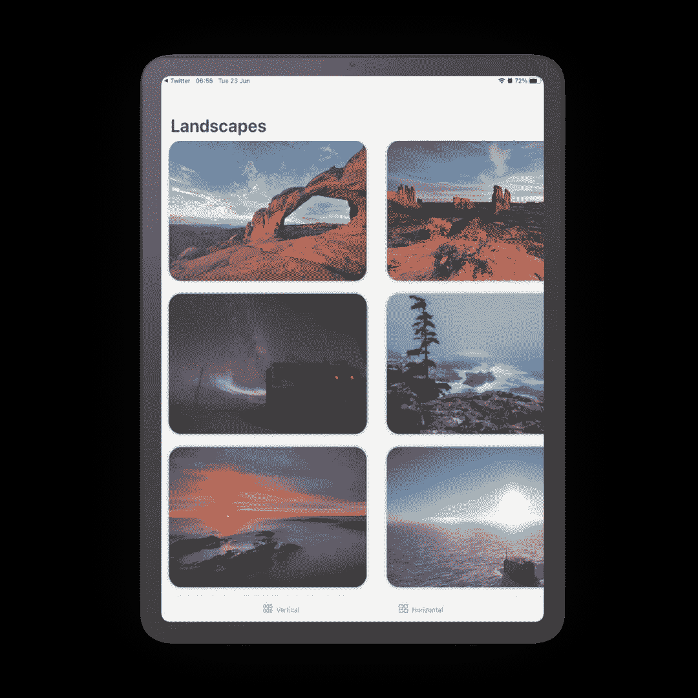

# SwiftUI 中的 LazyVGrid 和 LazyHGrid 布局

> 原文：<https://betterprogramming.pub/lazyvgrid-and-lazyhgrid-layouts-in-swiftui-8e2504544fd9>

## 一个简单的项目，展示在 WWDC 2020 上宣布的 LazyVGrid 和 lazy grid 布局

由[https://smartmockups.com](https://smartmockups.com)生成的模型

SwiftUI 中的 LazyVGrid 和 lazy grid 布局最近在 WWDC 2020 期间公布，我很高兴与您分享一个简单的教程来帮助您开始使用它们！

下面是开始的[演示项目](https://github.com/rudrankriyam/Grid-Example-SwiftUI)。

*注意:使用这些 API 需要 macOS 10.14.5+和 Xcode 12+。*

打开项目，探索`Assets.xcassets`中的 18 处赏心悦目的景观，为简单起见命名为`noaa[number]`。为这些美丽的图片向美国国家海洋和大气管理局(NOAA)大声疾呼。

# LazyVGrid

从[最新文档](https://developer.apple.com/documentation/swiftui/lazyvgrid)来看，LazyVGrid 是一个“容器视图，它在一个垂直增长的网格中排列其子视图，只在需要的时候创建项目。”

网格中的一个项目被称为`GridItem`，文档称之为“对单个网格项目的描述，比如一行或一列”它有许多参数。

打开文件夹`LazyVGrid — Beginning`内的 Xcode 项目。已经有一个名为`ImageView`的文件，用于在网格中显示时对美丽的风景进行样式化。

创建一个新的`SwiftUI View`，命名为`VerticalGrid`。垂直网格接受一些输入，如列数、对齐方式、间距等。最重要的是`columns`。您创建一个类型为`GridItem`的`columns`变量，并将其初始化为一个计数为 3 的灵活重复项数组。在这种情况下，三表示列数。

`flexible(minimum: CGFloat = 10, maximum: CGFloat = .infinity)`的案例默认最大尺寸为无穷大。

现在，你需要一个在垂直方向流动的`ScrollView`。您向`LazyVGrid`提供列数，然后使用`ForEach`指定网格中的项目总数。

在我们的例子中，列的数量是两个，所以在填充了第一行`ImageView`中的两个图像后，它移动到第二行，填充接下来的两个图像，如此类推，直到网格完成。

# 惰性网格

创建另一个`View`，命名为`HorizontalGrid`。

创建`LazyHGrid`的过程与此完全相同。现在，你需要一个在水平方向流动的`ScrollView`。

您向`LazyHGrid`提供行数，然后使用`ForEach`指定网格中的项目总数。在我们的例子中，行数是三，所以在第一列`ImageView`中填充三个图像后，它移动到第二列。

要显示两个网格，将`ContentView`的内容替换为:

这将创建两个选项卡，您可以点击这两个选项卡来查看不同的网格布局。运行该项目会在垂直和水平方向上呈现出美丽的景观网格:

LazyVGrid

惰性网格