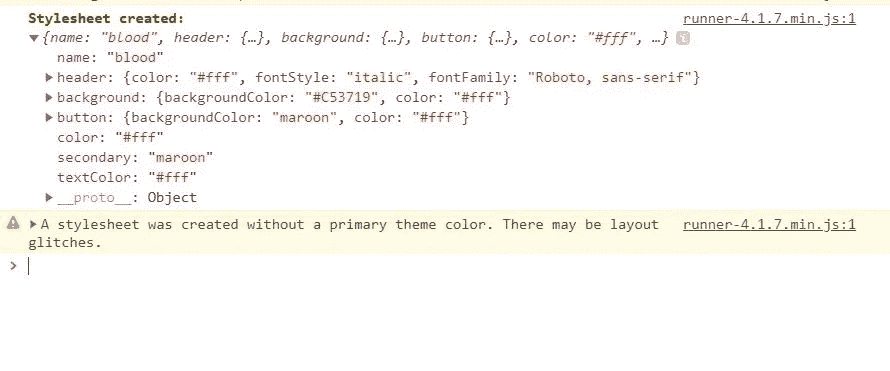

# 了解 JavaScript 中的装饰器

> 原文：<https://betterprogramming.pub/learn-about-decorators-in-javascript-d19c8795e8a>

## 用漂亮的增强装饰你的代码


维多利亚·斯特鲁科夫斯卡娅在 Unsplash[拍摄的照片](https://unsplash.com/s/photos/decorate?utm_source=unsplash&utm_medium=referral&utm_content=creditCopyText)

在 web 开发中，JavaScript 被认为是构建高度复杂的用户界面的最推荐语言，这些用户界面可能来自各种需求，尤其是来自业务需求。

在这篇文章中，我们将讨论 JavaScript 中一种叫做 *decorators* 的有用模式。

装饰器是可以用来动态地向另一个对象*添加额外功能的对象*，而不必改变那个对象*的实现。只要理解了这个定义，我们就很有可能达成共识，它们会对我们的应用程序代码有用。*

如果你和我一样，一开始可能会有点困惑，尤其是在 TypeScript 中，语法与众不同。

当使用现代语法对类应用装饰器时，感觉不太像 JavaScript。(目前在 TypeScript 和 [Babel](https://babeljs.io/) 插件中支持。)

下面是一个使用中的例子:

那些从未见过这种类型代码(特别是`@filterMales`语法)的人，当意识到这是在应用装饰器时，可能会对装饰器感到有点害怕。

这样的装饰者只是语法糖。理解和实现一个装饰器可能比你想象的要容易。如果你已经用 JavaScript 开发了一段时间，你可能已经实现了一个装饰器，甚至没有注意到它。它们简单但功能强大。

我们将看看 JavaScript 中装饰器的一些例子，并创建我们自己的装饰器，看看它如何对我们的代码有用。

# 什么时候是使用装饰器的好时机？

幸运的是，装饰者可以在很多方面对我们有用。

# 向现有对象添加动态行为

如前所述，一个非常有用的场景是当您需要动态地向对象添加额外的逻辑，而不必处理一些替代方案(如子类化或继承)时。

记住这一点:装饰者可以*将东西*注入物体，而外界甚至不知道*他们将如何*做这件事。

例如，假设我们有一个`Frog`类，它将实现一个叫做`lick`的方法。青蛙有牙齿，所以我们也将随机实现一个`getTeeths`方法来返回它们拥有的牙齿数量。

这看起来可能是这样的:

事实上，有不同的青蛙，比如蟾蜍。癞蛤蟆仍然是青蛙，但是青蛙不是癞蛤蟆，这意味着它们之间一定有一些不同的特征，不能和 T21 混为一谈。

因为蟾蜍是一只青蛙，我们可以构建一个`withToad`装饰器，如果需要的话，它会装饰一只青蛙的实例，这样它就可以代表蟾蜍。

记住，装饰者应该只扩展或添加额外的行为，而不是改变它的实现。

了解了这一点，`withToad`装饰者实际上很简单:

我们的装饰器`withToad`重新实现了`getTeeths`以便它返回`0`，因为蟾蜍*没有牙齿*。当我们使用这个装饰器时，我们实际上是在无声地装饰(在本例中是转换)一只青蛙来表示一只蟾蜍青蛙。

使用继承的子类化可以达到同样的目的，如下所示:

这两种方法的区别在于，通过使用 decorators，您不必为蟾蜍创建类。

我们的例子展示了装饰者是如何操纵一只青蛙，使其更符合蟾蜍的特征的。现在让我们看一个更好的例子，看看我们如何使用 decorators 来扩展功能。这就是事情开始变得有点有趣的地方。

让我们假设我们正在构建一个支持各种自定义预定义主题的应用程序，供用户设计他们的控制面板。

我们将使用方法`createStylesheet`实现一个`Theme`来创建一个兼容的样式表，一个`applyStyles`方法来解析这个样式表并将它应用到 DOM，允许它自己调用`applyStyle`来将它们应用到 DOM:

事情看起来很好。我们现在已经定义了我们的`Theme` API，现在我们可以创建一个样式表，如下所示:

```
const theme = new Theme()
const stylesheet = theme.createStylesheet()
```

下面是`stylesheet`目前的样子:

现在我们可以这样使用它，它将相应地装饰我们的网页:

```
theme.applyStylesheet(stylesheet)
```


## 继续记住这一点:提供开放的机会来支持插件开发

当调用`createStylesheet`时，我们如何让`theme`返回给我们一个自定义主题，我们可以使用它来扩展，而不是使用默认主题？

这就是 decorators 可以派上用场的地方，因为它允许我们返回一个不同的、预定义的默认主题。

我们将创建一个装饰器，它将帮助我们应用一个装饰`Theme`的`blood`主题，这样它将生成一个默认样式表来表示`blood`主题，而不是原来的主题。

我们称这个装饰者为`bloodTheme`:

现在我们要做的就是用一行代码装饰一个`theme`:

主题现在为我们提供了一个默认的`blood`样式表:

如你所见，`theme`的代码/实现没有改变。应用自定义样式表也没有改变:

```
theme.applyStylesheet(stylesheet)
```

现在我们的网页将应用`blood`主题样式:


我们可以创建任意多的主题，并随时应用它们。这意味着我们的代码对插件开放，比如自定义主题。

# 应用临时行为

使用 decorators 的另一个好时机是当我们想方设法临时将行为应用到对象上时，因为我们计划在将来移除它们。

例如，如果圣诞节即将来临，我们可以很容易地创建一个圣诞样式表并将其作为装饰应用。这很好，因为当圣诞节结束时，我们可以很容易地从代码中删除它。

在前面的例子中，我们需要做的就是删除`bloodTheme(theme)`行来转换回原来的样式表。

# 子类化/继承

使用 decorators 的另一个好的用例是，当我们的代码变大时，创建子类开始变得难以管理。

然而，与 Java 等静态语言相比，这个问题在 JavaScript 中并不严重——除非您在 JavaScript 中大量使用类继承实现。

# 调试模式

另一个有用的用例是创建一个调试模式装饰器，当应用它时，它将记录控制台发生的所有事情。例如，这里有一个`debugTheme`装饰器，它在开发模式下对我们很有用:

现在，当我们在`development`模式下运行应用时，我们的控制台会提供有用的信息:



# 结论

这个帖子到此结束！我希望你发现这是有价值的，并期待在未来更多！