# 通过制作一个简单的天气应用程序来了解 Flutter Widgets

> 原文：<https://betterprogramming.pub/learn-about-flutter-widgets-by-making-a-simple-weather-app-46c8b9e9b24e>

## 有什么比边做边学更好的？

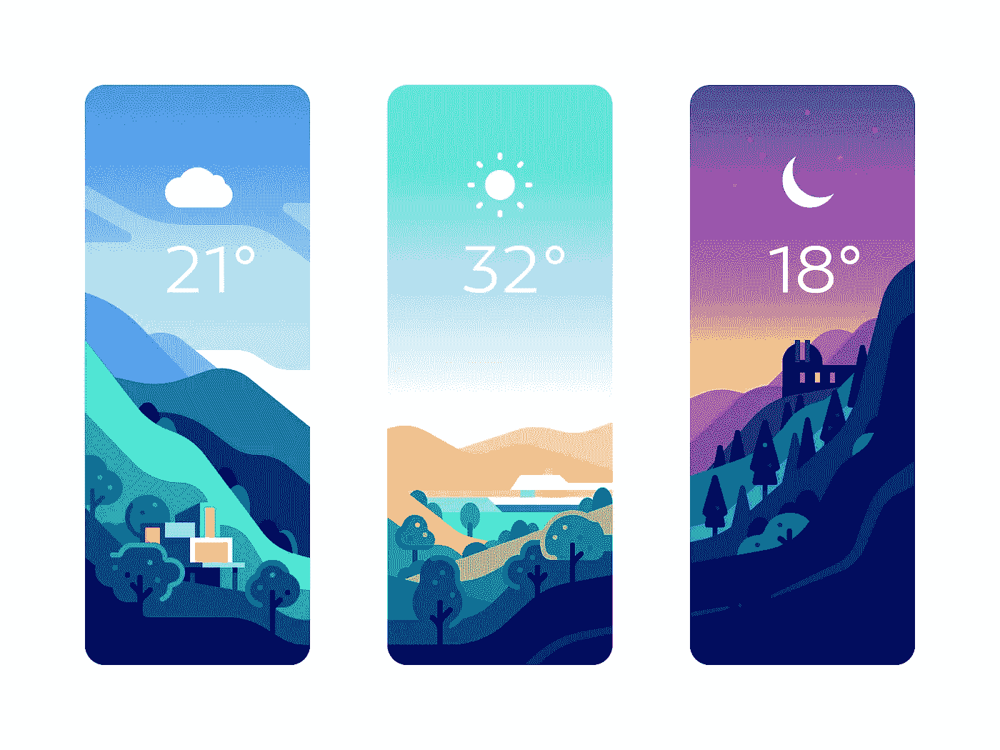

一个非常简单的应用程序，有一个非常漂亮的用户界面(图片来源:[叶戈尔·舒斯托夫](https://dribbble.com/YegorShustov)

没有什么比通过实施来学习更好的了。通过使用我们正在学习的东西做一些小的辅助项目，我们不仅可以增加我们在该领域的信心，还可以提高我们的技能水平。

这些天我在[安吉拉·于博士的颤振发展训练营](https://www.udemy.com/course/flutter-bootcamp-with-dart/)学习颤振，我可以向你保证[颤振](https://flutter.dev/docs)有一个非常平滑的学习曲线。作为一名过去三年的 web 开发人员，我觉得从 web 技术过渡到 Flutter 真的很容易，所以如果你以前有任何其他技术的经验，或者即使你是一个完全的初学者，Flutter 也很适合你。

我非常兴奋能和你一起开发这个应用。

正如我在开始时所说的，每当你学习一项新技术时，动手实践是必不可少的。否则，你可能会感到缺乏自信。

但是人们通常会问我，“嘿，马达夫，是的，我知道建造东西很重要，但是我要建造什么呢？我没有任何 app 想法，也不是设计师。我该怎么做呢？”

让我来帮你。无论何时，当您在处理任何前端技术时，您都可以遵循这个简单的技巧:

*   第一步。想想任何一个应用程序的想法(比如我们的天气应用程序)
*   第二步。转到 [dribbble](https://dribbble.com/)
*   第三步。搜索该应用的用户界面设计
*   第四步。将这些设计付诸实践

这样，你就可以用很酷的用户界面构建令人惊叹的应用程序，并以更高效的方式学习。

但请确保您:

1.  不要在你的商业项目中使用别人的设计(这应该只是为了你个人的学习)
2.  给予设计者适当的肯定

# 我们今天要建造什么？

我遵循了与上面讨论的完全相同的方法，并且我发现了一些非常酷的简单天气应用程序的设计。

非常感谢叶戈尔·舒斯托夫如此漂亮的设计。今天我们将从 dribbble 实现他的设计:[天气卡](https://dribbble.com/shots/6887377-Weather-Cards)


一个非常简单的应用程序，有非常漂亮的用户界面

是的，你想象的没错，app 的流程会很简单。一旦用户打开应用程序，我们将在后台加载用户的当前位置，我们将使用该位置获取当前天气并显示在屏幕上。(背景和图标将基于天气条件。)

如果想直接看代码，可以看看我的 [GitHub repo](https://github.com/MadhavBahl/Flutter-Simple-Weather) 。

让我们也来看看应用程序的运行情况。这是我们的应用程序实现后的样子:

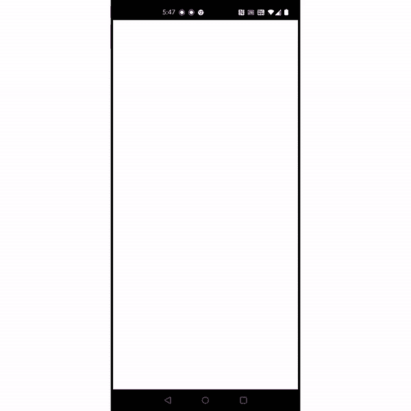

# 一些先决条件

在开始之前，这里是设置环境的三个先决步骤。(这个不会花太多时间。)

1.  [下载并安装 Android Studio](https://developer.android.com/studio)
2.  [安装颤振 SDK](https://flutter.dev/docs/get-started/install)
3.  在 [open weather map](https://openweathermap.org/api.) 上注册(获取 API 密匙)。

现在，我们准备采取一些行动。

# 概观

我们将逐步建立这个应用程序。以下是我们今天旅程中要采取的一些步骤。(跟我到最后。)

1.  设置项目
2.  创建加载程序
3.  设置我们的主屏幕(静态设计)
4.  添加位置逻辑
5.  使用开放天气地图 API 获取天气数据
6.  添加应用程序逻辑

在这些简单的步骤中，我们今天会学到很多东西。我对此超级兴奋，所以让我们开始我们的旅程吧。

# 第一步。设置项目

这可能是最简单的一步。你需要做的就是去 Android Studio 创建一个新的 Flutter 项目。之后，我们将下载这个项目所需的所有资产。

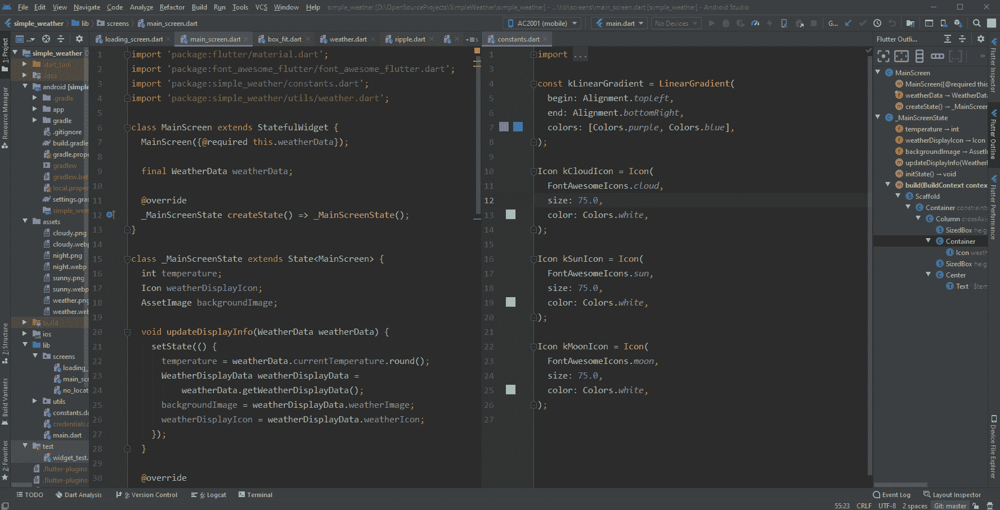

这很简单。

*   打开 Android Studio
*   转到文件>新建>新建颤振项目
*   选择 Flutter 应用程序并添加其他信息

一旦你这样做了，Android Studio 将为你的 Flutter 项目生成一些样板代码。

请注意，我们的源代码(我们将在其上工作)将出现在`lib/`文件夹中，主入口点将是`main.dart`中的`main`函数。

如果您运行该代码，它将如下所示(一个简单的计数器应用程序):

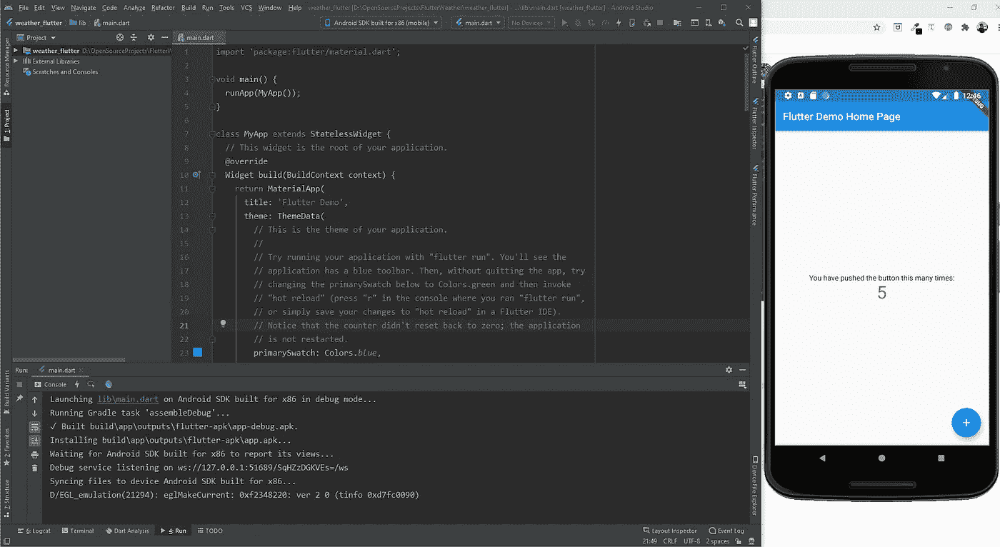

现在移除除 main 函数和一个空的`MyApp`类之外的所有东西(直到`MaterialApp`，第 11 行)。这样做之后，几乎所有预先写好的代码都将被删除，我们将从头开始。

另外，在`MaterialApp`内提供一个空的`Scaffold`，默认为黑色。

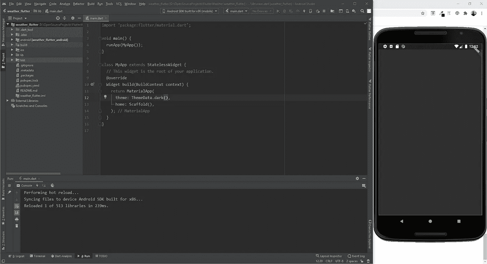

在这之后，我们的`main.dart`将看起来有如下代码:

稍微解释一下代码，`main`函数是我们运行`MyApp`小部件的入口点。

`MyApp`是一个无状态的小部件(也就是说，数据不是从`MyApp`小部件直接存储/维护/更改的；我们将在各种子部件中这样做)。

好了，在我们完成第一步之前还有最后一件事:添加静态资产(图片)。一种方法是直接进入我找到设计的 dribbble 页面，从那里下载各种图片。

为了让事情变得简单，我将这些图片添加到了一个压缩文件夹中。您可以从这里下载并提取资产:[github . com/MadhavBahl/Flutter-Simple-Weather/blob/master/assets . rar](https://github.com/MadhavBahl/Flutter-Simple-Weather/blob/master/assets.rar)

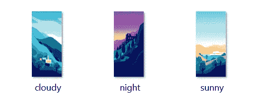

将它们解压到你的项目的根目录下(和`lib`目录在同一层)。资产文件夹将有三个图像-多云、晴朗和夜晚。

我们现在需要做的就是将这些资产添加到我们项目的`pubspec.yaml`中。

如果你想知道`pubspec.yaml`文件是什么，这里有一些信息给你—

> “每个发布包都需要一些元数据，这样它就可以指定它的依赖项。与其他人共享的 Pub 包也需要提供一些其他信息，以便用户可以发现它们。所有这些元数据都放在包的 *pubspec:* 一个用 [YAML](https://yaml.org/) 语言编写的名为`pubspec.yaml`的文件中。”— [灾难援助反应队文件](https://dart.dev/tools/pub/pubspec)

如果你来自 web 开发背景，你可以把它想象成类似于`package.json`文件的东西。

现在打开`pubspec.yaml`文件，并添加以下内容:

```
assets:
  - assets/
```

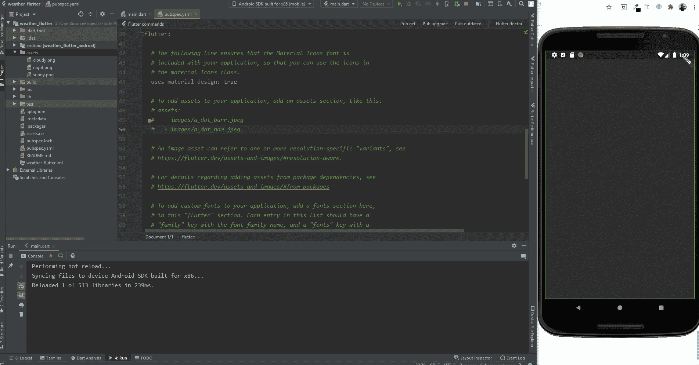

在您的`pubspec`中添加资产后，不要忘记`pub get`。

就这样，我们完成了第一步。现在让我们继续前进。

# 第二步。添加加载屏幕

这个不符合 dribbble 的设计，但这是我们非常需要的东西。

但是为什么呢？为什么我们需要一个加载屏幕？有什么猜测吗？

简单:获取位置数据和天气数据将是异步事件，这意味着它们不会立即提供数据；这需要一些时间。

因此，对于“加载时间”，我们将使用这个微调器。让我们分三步快速完成这一步:

1.  为我们的加载屏幕创建一个新文件。
2.  在其中创建一个有状态的小部件。(为什么有状态？有什么猜测吗？)
3.  为加载器/旋转器找到一个好的库。
4.  整合装载机。

相信我，这些步骤听起来很简单，所以让我们开始吧。

让我们为我们的屏幕创建一个单独的目录。我将把文件夹命名为`screens`，但是你可以随意选择一个你喜欢的名字。

在该目录中，我将创建一个名为`loading_screen.dart`的新 Dart 文件，并在其中添加新的有状态小部件。

(注意，在我的构建方法中，我将返回一个新的`Scaffold`实例，而不是`Container`。)

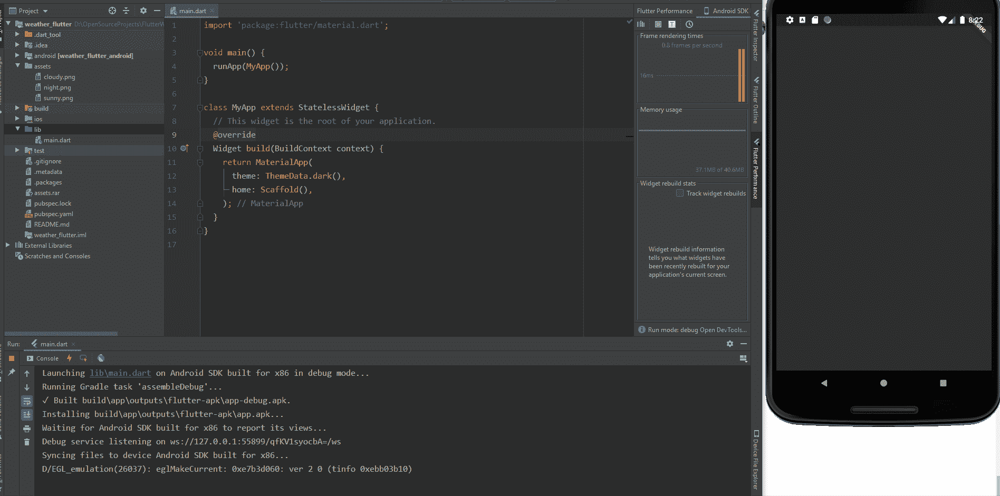

回到你的问题，为什么我们需要一个有状态的部件…

简单:有状态小部件有各种生命周期方法，允许我们在小部件生命周期的不同部分运行不同的代码块。在我们的例子中，我们希望在应用程序启动时获取位置数据和天气数据(加载屏幕一呈现出来)。

太棒了。现在我们已经为加载屏幕准备好了样板文件，让我们添加加载程序。但是等等——如果我们从头开始创建一个加载器，对于一个初级项目来说，这将意味着很多努力。所以让我们寻找一些可以帮助我们的图书馆。

这里有一个秘密窍门:每当你需要任何图书馆的帮助时，就去 [pub.dev](https://pub.dev/) 网站，并尝试搜索它。出结果，查查哪个库人气分好。对你的项目来说，那个可能是个不错的选择。

我做了类似的搜索，发现 [flutter_spinkit](https://pub.dev/packages/flutter_spinkit) 对于我们的用例来说是一个很好的选择，所以让我们试着使用它。

要安装它，请查看安装步骤。通常，步骤很简单。你只需要在你的`pubspec`文件中提到依赖关系，然后运行`pub get`。(附:确保不要弄乱`pubspec.yaml`文件的缩进)

```
dependencies:
  flutter_spinkit: "^4.1.2"
```

现在让我们将库导入到我们的加载屏幕中。

```
import 'package:flutter_spinkit/flutter_spinkit.dart';
```

现在我们将能够在我们的小部件中使用这个加载器。(我喜欢涟漪效应，所以我将使用这个。但是你可以自由选择你喜欢的。)

```
return Scaffold(
  body: Container(
    child: Center(
      child: SpinKitRipple(
        color: Colors.*white*,
        size: 150.0,
        duration: Duration(milliseconds: 1200),
      ),
    ),
  ),
);
```

另外，确保将`main.dart`文件中的`home`改为`LoadingScreen()`而不是`Scaffold()`。

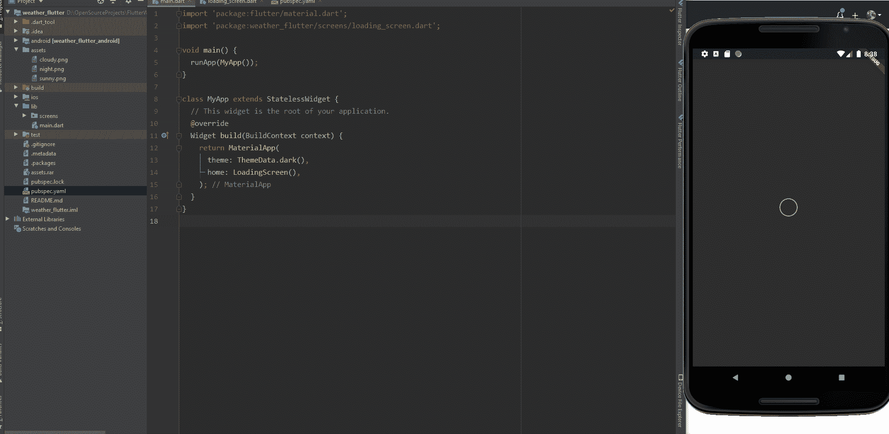

好的，它看起来很酷，但是让我们也添加一点背景装饰。在`Container`里面，我们加上这个`decoration`:

```
decoration: BoxDecoration(
  gradient: LinearGradient(
    begin: Alignment.*topLeft*,
    end: Alignment.*bottomRight*,
    colors: [Colors.*purple*, Colors.*blue*],
  ),
),
```

我喜欢渐变背景，加上这些颜色与我们的主要应用程序主题相匹配，所以我添加了这些渐变。您可以随意添加您选择的装饰。

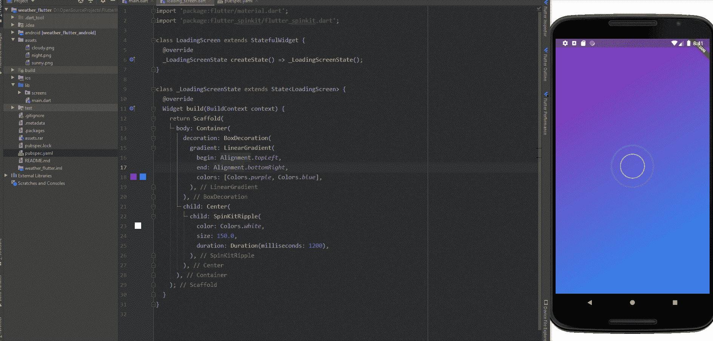

看起来太棒了，不是吗？

酷，我们终于完成了第二步！

这是目前为止我们的`loading_screen.dart`和`main.dart`的代码。

main.dart 中的代码

加载屏幕的代码

# 第三步。设置主屏幕(静态设计)

还记得在我们的第一步中，我们是如何将那些静态资产添加到`pubspec`文件中的吗？现在我们要用这些。我希望你对这一页感到兴奋。(我超级激动！)

但是等等——在继续之前，让我们整合一下图标。我们将在这个项目中使用[字体很棒的图标](https://pub.dev/packages/font_awesome_flutter)。要集成这个库，请转到您的`pubspec.yaml`文件，并在依赖项下添加最新版本的 font_awesome_flutter。

```
font_awesome_flutter: ^8.4.0
```

然后，像往常一样，`pub get`。

现在，让我们为我们的主屏幕创建另一个小部件——我称它为`MainScreen` —在`main_screen.dart`内(在`screens`目录内)。

让我们遵循通常的步骤。导入`material.dart`并创建一个有状态的小部件。但是这一次，我们也需要导入字体 awesome 图标，所以在顶部添加这个 import 语句。

```
import 'package:font_awesome_flutter/font_awesome_flutter.dart';
```

我们也将在我们的主屏幕上有一个类似的架构。build 方法将返回一个`Scaffold`，在其中我们将有一个全屏幕大小的 `Container`和一个背景图像，而`Containe` r 的子对象将是一个`Column`小部件。(想一想:为什么我们在这里需要一个列小部件？)下面是我们的`main_screen.dart`代码的样子:

我们需要一个列小部件，因为根据设计，我们可以清楚地看到，图标和温度在列方向对齐。所以我们的图标和温度文本将是 column 小部件的子部件。(注意，我们使用一个`SizedBox`小部件来创建距离/边距。记住，解决一个问题有很多方法，我们也可以使用`Padding`。)

另外，请注意容器内的盒子装饰。我用它来设置背景图像。我知道，我一气呵成地提到了很多东西，但是不用担心，代码相当简单明了，只要阅读就会很容易理解。尽管如此，如果你有任何疑问，欢迎在评论中问我。

为了测试我们的主屏幕，我们可以暂时从`main.dart`中的`home`属性中移除加载屏幕，并添加主屏幕:

```
class MyApp extends StatelessWidget {
  // This widget is the root of your application.
  [@override](http://twitter.com/override)
  Widget build(BuildContext context) {
    return MaterialApp(
      theme: ThemeData.dark(),
      home: **MainScreen**(),
    );
  }
}
```

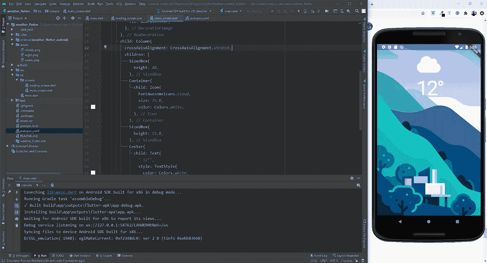

现在我们可以撤销`main.dart`中的更改，使加载屏幕成为主页，我们也完成了第三步。还剩三个。

# 第四步。添加位置逻辑

既然你已经知道如何在你的项目中包含 Flutter 库，那么这个将会非常简单。我们将使用[位置库](https://pub.dev/packages/location)。

同样，第一步是在`pubspec.yaml`和`pub get`中包含依赖关系。

```
location: ^3.0.0
```

现在让我们创建一个新的类`LocationHelper`来保存 fetch 和我们的位置数据。我将在`utils`文件夹— `location.dart`中这样做

下面是`location.dart`的代码。请注意，我已经从库的文档中的示例部分获取了大部分提取位置逻辑，这就是我们开始使用库的方式；).

现在我们需要从`loading_screen.dart`调用这个获取位置逻辑，但是在此之前，你注意到我们在这里使用了一些新的关键字吗？

## 异步和等待

如果你熟悉用其他语言编程和进行 API 调用，你可以跳过这个，直接读代码。但是如果你是新来的，一定要读一读。

关于 `[async](https://dart.dev/codelabs/async-await)` [和](https://dart.dev/codelabs/async-await) `[await](https://dart.dev/codelabs/async-await)` [的一切你都可以](https://dart.dev/codelabs/async-await)[在这里](https://dart.dev/codelabs/async-await)阅读，但我会尽量总结出来供我们使用案例。

进行 API 调用不像做一些算术运算或任何其他同步逻辑那样简单。API 的问题在于，我们知道何时进行调用，但不知道 API 获取结果的确切时间。

因此，当我们进行 API 调用时，我们没有得到具体的结果，我们得到的是一个类型为`Future`的对象，这类似于一个承诺，即该对象在不久的将来会有一些值(如果 API 失败，它可能是一个错误消息，如果它通过，则是我们想要的数据)。

每当我们想让代码在进一步处理之前等待`Future`对象获得一些具体数据时，我们就使用关键字`await`。

等待`Future`数据(或使用`await`)的每个方法/函数必须是一个`async`方法。下面是一个简单的例子:

```
void getWeather() **async** {
  weather = **await** makeApiCallForWeather();
  ... do something else ...
}
```

我希望现在清楚了。让我们继续编码部分，并在加载屏幕中添加获取位置逻辑。

## 当应用程序加载时获取幕后位置

在加载界面中，让我们添加一个对象`LocationHelper`，并用它来获取新方法`getLocationData()`中的位置。

同样，为了测试它，让我们使用有状态小部件中可用的`initState`方法来调用`getLocationData`。注意，对于任何有状态的小部件，每当我们将小部件呈现到屏幕上时，`initState`就会被触发。(BTW，别忘了导入位置助手类。)

```
LocationHelper locationData;Future<void> getLocationData() async {
  locationData = LocationHelper();
  await locationData.getCurrentLocation(); if (locationData.latitude == null || locationData.longitude == null) {
    // todo: Handle no location
  } print(locationData.longitude);
  print(locationData.latitude);
}@override
void initState() {
  // TODO: implement initState
  super.initState();
  getLocationData();
}
```

哇，那很简单。让我们检查一下，是的，应用程序现在要求位置权限。


检查控制台:它现在也打印您的位置，因为我们在`getLocationData`方法中添加了打印语句。

以下是目前为止`loading_screen.dart`的代码:

这样，我们也完成了第四步，接下来是第五步。

# 第五步。使用开放天气地图 API 获取天气数据

如上所述，我们将使用 [open weather map API](https://openweathermap.org/api) 来获取天气数据，因此在继续之前，在他们的网站上创建一个帐户，以便您可以获得 API 密钥。

我们将用来获取天气数据的端点是这样的:

```
api.openweathermap.org/data/2.5/weather?lat={lat}&lon={lon}&appid={API key}&units=metric
```

我知道这篇文章太长了，但是请原谅我，现在已经快结束了。我们将在`utils`文件夹中创建另一个目录，它将包含我们所有的天气逻辑。如果您对目录结构感到困惑，您可以随时查看我的存储库。

为了进行 API 调用，我们将使用`[http](https://pub.dev/packages/http)`[库。](https://pub.dev/packages/http)你知道步骤:添加依赖项和`pub get`。

```
http: ^0.12.2
```

现在，这里是包含我们的`WeatherData`类的`weather.dart`文件的代码。

这里有两件重要的事情:

*   在`apiKey`常量中添加您自己的 API 键。
*   读一遍代码，你就会明白我们得到的是 JSON 形式的结果。我们使用`jsonDecode`反序列化它。

现在让我们在加载屏幕类中添加一个`getWeatherData`方法。此外，一旦我们获取完数据，我们将用主屏幕替换当前屏幕，并传递天气数据。我们将使用 Navigator 来完成这项工作。

```
void getWeatherData() async {
  // Fetch the location
  await getLocationData(); // Fetch the current weather
  WeatherData weatherData = WeatherData(locationData: locationData);
  await weatherData.getCurrentTemperature(); if (weatherData.currentTemperature == null ||
      weatherData.currentCondition == null) {
    // todo: Handle no weather
  } Navigator.pushReplacement(
    context,
    MaterialPageRoute(
      builder: (context) {
        return MainScreen(
          weatherData: weatherData,
        );
      },
    ),
  );
}
```

注意，在我们的`getWeatherData`方法中，我们首先等待`getLocationData`获取位置数据。现在我们可以在`initState`方法中调用`getWeatherData`来代替对`getLocationData`的调用。

但是你会注意到，现在我们得到了一些错误。这是因为我们试图在`MainScreen`类中传递天气数据，但是我们没有相应的构造函数。那么让我们好好修改一下`MainScreen`类吧。

让我们也给我们的`MainScreen`类添加一个天气数据对象。

```
class MainScreen extends StatefulWidget {
  MainScreen({@required this.weatherData}); // constructor

 **final WeatherData weatherData;** 
  @override
  _MainScreenState createState() => _MainScreenState();
}
```

现在你可以看到我们的应用程序在后台加载位置和天气数据并显示加载屏幕，一旦数据加载完毕，它就会进入主屏幕。

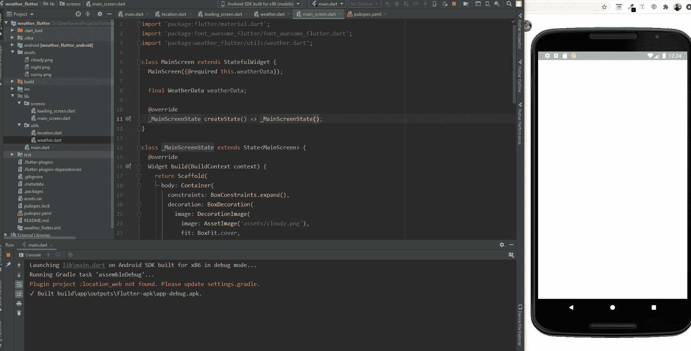

但是`_MainScreenState`是一个独立的类，那么我们如何访问字段`weatherData`，它是`_MainScreenState`中`MainScreen`类的一部分？

简单，我们可以通过`widget.weatherData`访问。让我们在最后一步看一下。

# 第六步。总结应用程序逻辑

我们的应用程序几乎准备好了。我们现在需要做的就是添加主应用程序逻辑，以在主屏幕上显示正确的温度、背景和图标。

为此，我将在包含图标和背景图像(我们希望在主屏幕上显示的内容)的`weather.dart`文件中再添加一个类。我将调用这个类`WeatherDisplayData`。

我将从`WeatherData`类中的一个新方法返回一个对象`WeatherDisplayData`，这样我们就可以直接使用这个显示数据来填充`MainScreen`中的必填字段。

```
class WeatherDisplayData {
  Icon weatherIcon;
  AssetImage weatherImage;

  WeatherDisplayData({@required this.weatherIcon, @required this.weatherImage});
}
```

还有`WeatherData`类里面的方法`getWeatherDisplayData`:

```
WeatherDisplayData getWeatherDisplayData() {
  if (currentCondition < 600) {
    return WeatherDisplayData(
      weatherIcon: Icon(
        FontAwesomeIcons.cloud,
        size: 75.0,
      ),
      weatherImage: AssetImage('assets/cloud.png'),
    );
  } else {
    var now = new DateTime.now(); if (now.hour >= 15) {
      return WeatherDisplayData(
        weatherImage: AssetImage('assets/night.png'),
        weatherIcon: Icon(
          FontAwesomeIcons.moon,
          size: 75.0,
          color: Colors.white,
        ),
      );
    } else {
      return WeatherDisplayData(
        weatherIcon: Icon(
          FontAwesomeIcons.sun,
          size: 75.0,
          color: Colors.white,
        ),
        weatherImage: AssetImage('assets/sunny.png'),
      );
    }
  }
}
```

逻辑很简单。如果天气多云，我们显示多云的背景，与时间无关；否则，我们根据时间显示日/夜图像。

这是我们最后的`weather.dart`文件:

现在到了我们的最后一步，在我们的主屏幕中使用这个逻辑！

在`_MainScreenState`类中，让我们添加三个属性，用于在屏幕上显示所需的信息。

```
int temperature;
Icon weatherDisplayIcon;
AssetImage backgroundImage;
```

让我们创建一个新函数`updateDisplayInfo`，它接受`weatherData`对象并填充上述字段。

```
void updateDisplayInfo(WeatherData weatherData) {
  setState(() {
    temperature = weatherData.currentTemperature.round();
    WeatherDisplayData weatherDisplayData =
        weatherData.getWeatherDisplayData();
    backgroundImage = weatherDisplayData.weatherImage;
    weatherDisplayIcon = weatherDisplayData.weatherIcon;
  });
}
```

注意，这里我们使用了`setState`函数。(用来改变我们 app 的状态。简而言之，*状态*是任何必须在屏幕上显示的数据，并且可以随时间变化。)

`setState`只能在有状态的小部件中使用。通过将我们的逻辑封装在`setState`中，我们为它提供了未来改进的灵活性。假设我想更新我的位置。在这种情况下，我们可以从其他地方传递新的`weatherData`(可能)，它会更新值。

最后一步:让我们从我们的`initState`方法中调用这个`updateDisplayInfo`方法，这样一旦呈现了`MainScreen`小部件，我们就可以获取从加载屏幕传来的`weatherData`并更新值。

```
@override
void initState() {
  super.initState();
  updateDisplayInfo(widget.weatherData);
}
```

现在，我们可以使用这些变量`temperature`、`weatherDisplayIcon`和`backgroundImage`来呈现我们的数据，而不是我们正在呈现的静态数据。

我们最终的`MainScreen`代码看起来会像这样:

就这样，我们在 Flutter 中做了一个简单的天气应用！


我希望你喜欢这篇文章。Flutter 真的很神奇。请让我知道我是否能帮你开始，如果你打算做一些更有趣的项目。

如果你想讨论什么，请随时联系我。

感谢阅读！