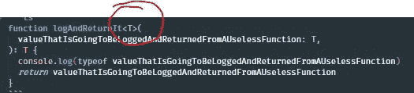
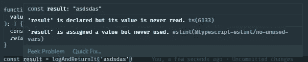
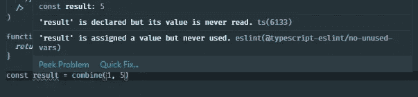
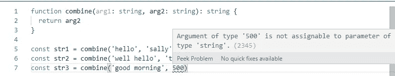
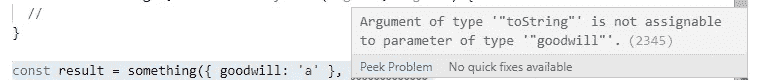

# 了解 TypeScript 中的泛型

> 原文：<https://betterprogramming.pub/learn-about-generics-in-typescript-29a02de882c4>

## 通用代码

*照片由* [*洛伦佐·埃雷拉*](https://unsplash.com/@lorenzoherrera) *上* [*下*](https://unsplash.com/photos/p0j-mE6mGo4)

如果你学习 JavaScript 已经有一段时间了，并且你从未有过使用 [TypeScript](https://typescriptlang.org) 的实践经验，我强烈建议你尽快开始使用 TypeScript，看看你是否想开始使用它来开发你的应用程序。将 TypeScript 集成到您的开发流程中会带来很大的好处，比如编写更好的代码，并在错误发生之前避免它们的发生。

如果您已经使用过 TypeScript，您可能会发现泛型是一个令人困惑的概念，尤其是如果您是 TypeScript 的新手。然而，在对它们有了更多的了解之后，你会发现它们其实并没有那么难理解。

本文旨在回顾 TypeScript 中的泛型，并讨论它们是什么，它们是如何工作的，以及我们为什么需要它们。

# 无商标消费品

我个人认为，在 TypeScript 中实现和使用泛型既有挑战性又很有趣。

它们在编写时很容易让人觉得非常复杂，但当它们在代码中正确实现并增强程序的类型安全性时，它使您能够更轻松地做一些事情，如果没有 TypeScript 来确保代码的安全性，您通常不会这样做。

# 它们是什么？

现代应用程序中最强有力的概念之一是软件中可重用组件的概念。这些组件通常用于部分用户界面的上下文中，但是人们也可以互换使用这个术语来表示其他东西，比如页面上的功能或模块。

当某样东西可以被重复使用时，意思是它们可以被用于不止一个目的或多种情况。

# 为什么？

如果你不使用泛型，它们可能完全没有用。但是当它们被使用时，它们不仅仅确保类型安全——它们还可以让你做出更好的决定，并且可以给你更多关于如何使用类型函数的想法。

# 它们是如何工作的？

那么它们如何帮助我们，为什么它们与可重用性有任何关系呢？

假设您正在构建一个函数，当它被调用时，会对参数调用`typeof`并返回参数。这完全没用，但这不是重点。

让我们看看用 TypeScript 编写时会是什么样子:

尽管这个函数没什么用，我们可以看到它在参数上加了一种类型的`string`。现在，在使用 TypeScript 时，您可以选择对该函数使用任何类型的字符串:

如果我们要让它支持另一种数据类型，我们必须修改代码，就像这样:

在实践中，当我们开发应用程序并使用这个函数时，我们只能通过`null`来使用它。

这意味着该函数不可重用。因此，让我们使这个函数更加可重用——我们有几个选项可以做到这一点。

第一种选择是使用我们第一次学习 TypeScript 时都喜欢使用的`any`类型:

使用`any`类型给了我们处理任何数据类型的能力，这帮助我们实现了我们的目标。这种方法的警告是我们实际上*失去了*类型安全的好处。这意味着，即使我们传入像 error 实例这样奇怪的值，编译器仍然认为这是可以的，因为 TypeScript 会为您处理这一责任。

有一种更强大的方法来对函数进行强类型化，使得它们是类型安全的，并且更加可重用。您可以声明一个新的泛型类型并使用它，就像这样:

语法可能看起来有点奇怪和吓人，但实际上非常容易理解。在 JavaScript 中，您可以声明变量并在以后使用它们，就像这样:

在我们的类型声明例子中，这个概念实际上是完全相同的。我们通过将泛型类型`T`括在箭头中来声明它，位于第一对括号的正前面:

现在，当使用该函数时，您可以看到我们获得了一种更好的方法来重用该函数，同时受到 TypeScript linter 的保护以防止任何错误行为。

此外，值得注意的是，就像普通的 JavaScript 函数一样，您可以声明任意多的类型(就像 JavaScript 函数的参数一样)，因此您不仅限于一种类型声明:

您的 TypeScript 编译器将推断您传递给`arg2`的任何类型也将是返回类型所设置的类型:

所以不用像这样显式声明直接类型…

…您只能使用它来处理字符串:

# 重用函数，同时让 TypeScript 控制您

更通用的方法在重用函数方面更好，因为您可以捕获传递给它的类型，并让 TypeScript 在以后使用它们时始终保持检查状态*，*这取决于您赋予函数的工作内容。

这就是泛型真正变得更加有用的地方。你可能听过人们谈论 TypeScript，以及它如何帮助你“在错误发生之前避免制造错误”这是真的，使用泛型是很好地证明这一点的方法之一:

假设我们想使用这个函数。我们看到它声明了类型`T`和类型`K`，这是类型`*T*`的一个键。我们将类型`T`分配给`arg1`，将类型`K`分配给`arg2`。

我们现在知道，当我们使用这个函数时，第一个参数很可能是某种类型，可以通过某种索引或属性来访问，而第二个参数可能是某种类型的字符串或数字。我们知道这一点是因为`K extends keyof T`意味着`K`是`T`的属性/索引/键。

我们可以像这样使用这个函数:

因为`goodwill`是传递给第一个参数的对象的属性，所以它是完全有效的。我们给了它一个像`{ goodwill: string }`这样的强类型对象。

如果我们试图错误地使用 TypeScript，它可以让我们保持警惕:

这是非常强大的，因为它在错误出现之前就阻止了它们。

为了证明我们可以在保持类型安全的同时以多种方式重用该函数，下面是更多的例子:

# 带类的泛型

泛型类型可以应用于函数，但也可以用类来实现——这非常有用，尤其是对代码的消费者而言。

你可以声明类型，比如类型`<T>`，就像我们声明函数一样。然而，由于语法不同，它看起来有点不同:

当您在初始化实例后使用`button`时，TypeScript 将始终记住`element`属性是一个`button`元素，从而帮助您保持安全；因此，它应该只限于一个`button`的属性、方法、特性等。

# 结论

这篇文章到此结束！我希望你发现这是有价值的，并期待在未来更多。