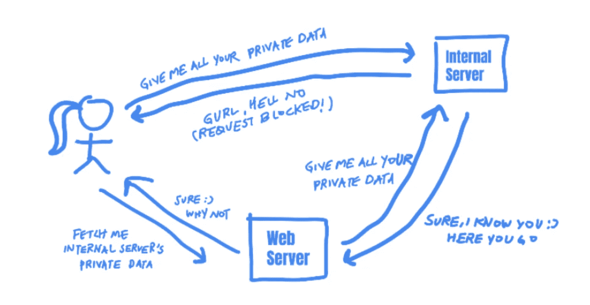

# 了解服务器端请求伪造(SSRFs)

> 原文：<https://betterprogramming.pub/learn-about-server-side-request-forgeries-ssrfs-10f8bd013941>

## 以及如何保护您的网络免受攻击者的攻击


照片由[伊万·阿列克西奇](https://unsplash.com/@ivalex?utm_source=medium&utm_medium=referral)在 [Unsplash](https://unsplash.com?utm_source=medium&utm_medium=referral) 拍摄

成功的网络攻击通常始于“网络边界”。

随着公司的成长，保护网络上成千上万台机器的安全变得越来越困难。通常，攻击者危害网络所需要的只是一台面向公众的机器上的一个 bug！今天，我们将讨论网络边界上的一个常见漏洞:SSRF，它如何允许攻击者进入公司的网络，以及如何防止它。

# 什么是 SSRF？

SSRF，即服务器端请求伪造，是一种当攻击者可以代表服务器发送请求时发生的漏洞。它允许攻击者“伪造”易受攻击的服务器的请求签名，从而在网络上占据特权地位，绕过防火墙控制，并获得对内部服务的访问权限。例如，假设在一个公司的网络上有一个面向公众的 web 服务器:*public.example.com*。

*public.example.com*托管一个位于*public.example.com/proxy*的代理服务，它将获取`URL`参数中指定的网页，并将其显示给用户。例如，当用户访问 URL 时:

```
[https://public.example.com/proxy?url=google.com](https://public.example.com/proxy?url=google.com)
```

web 应用程序将显示“google.com”的主页


现在让我们假设*admin _ panel . example . com*是一个托管隐藏管理面板的内部服务器。为了确保只有员工可以访问管理面板，设置了访问控制，以便不能通过互联网访问该面板，只能通过有效的内部 IP 访问，例如员工的工作站。现在，如果用户访问下面的 URL 会怎么样？

```
[https://public.example.com/proxy?url=admin_panel.example.com](https://public.example.com/proxy?url=admin_panel.example.com)
```

在没有 SSRF 保护机制的情况下，web 应用程序会向用户显示管理面板，因为请求来自*public.example.com*，一台网络上可信的机器！

通常会被防火墙阻止的未授权请求，比如从非公司机器上获取管理面板，现在被允许了。这是因为在面向公众的 web 服务器和互联网机器之间的网络边界上存在的保护，在可信网络上的机器之间或者在*public.example.com*和*admin _ panel . example . com .*之间不存在



作者照片。

利用“伪造”来自可信服务器的请求的能力，攻击者现在可以在网络上进行各种恶意的恶作剧。根据给予易受攻击的服务器的权限，攻击者可能能够读取敏感文件、进行内部 API 调用和访问内部服务，如隐藏的管理面板。

# 防止 SSRFs

当服务器需要发送请求以获取外部资源时，就会出现 SSRFs。例如，当你在 Twitter 上发布一个链接时，它需要从外部站点获取一个图像来创建一个缩略图。这是正常且必要的行为。但是如果服务器不阻止用户访问内部资源，就会出现 SSRF 漏洞。

为了防止 SSRFs，您需要验证用户提供的 URL。根据您试图使用该端点获取的外部资源，您可以实现白名单或黑名单来过滤 URL。

首先，如果您知道需要从哪里获取资源，您可以检查 URL 是否属于批准的白名单。例如，如果您只从特定的服务器获取图像，您可以将请求限制到该 IP 地址或主机名。如果您使用白名单，请确保您修复了白名单域中的开放重定向漏洞。如果攻击者可以在白名单域中找到一个开放的重定向，他们可以请求一个白名单 URL 来重定向到一个受限的内部 URL。并确保您使用的正则表达式设计正确。例如，简单检查 URL 是否包含合法域的弱正则表达式模式可以很容易地被这些 URL 绕过:

```
https://victim.com.attacker.com
https://attacker.com/victim.com
```

另一方面，如果您需要允许用户从任意位置获取资源，您需要使用黑名单来限制对敏感内部资源的访问。当您使用黑名单时，请确保您考虑了不同的编码方案。例如，你的黑名单是否过滤掉了相同的网址，但采用了十六进制、八进制、dword、URL 和混合编码？它是否考虑了内部 IPv4 和 IPv6 地址？

攻击者绕过黑名单的一种方法是使用重定向，即使黑名单是精心设计的。攻击者可以使用他们控制的 URL，但会重定向到黑名单中的地址。例如，他们可以托管一个重定向到本地地址的页面，如下所示:

```
<?php header(“location: http://127.0.0.1"); ?>
```

这样，当您的服务器请求攻击者的页面时，它实际上会被重定向到一个受限的内部地址。您可以通过在 web 客户端中禁用对以下重定向的支持来防止这种类型的攻击。

攻击者绕过黑名单保护的另一种方式是修改他们控制的域的 DNS 记录，并使其指向内部地址。例如，他们可以创建一个 DNS A 记录，并让[http://attacker.com](http://attacker.com)解析到一个敏感的内部地址。当你的服务器请求 http://attacker.com[，](http://attacker.com,)时，它会认为该域名位于内部地址，并访问该地址！因此，在验证域名时，您还需要确保用户提供的域不会解析为内部 IP 地址。

SSRFs 是一个危险的漏洞，可以危及整个网络。但是通过大量的努力和适当的过滤，它们是可以被预防的。

今天的安全课到此结束。感谢阅读！