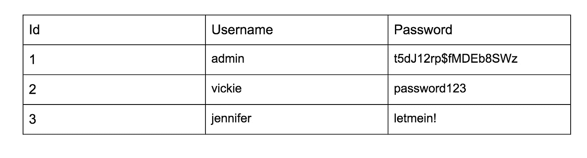
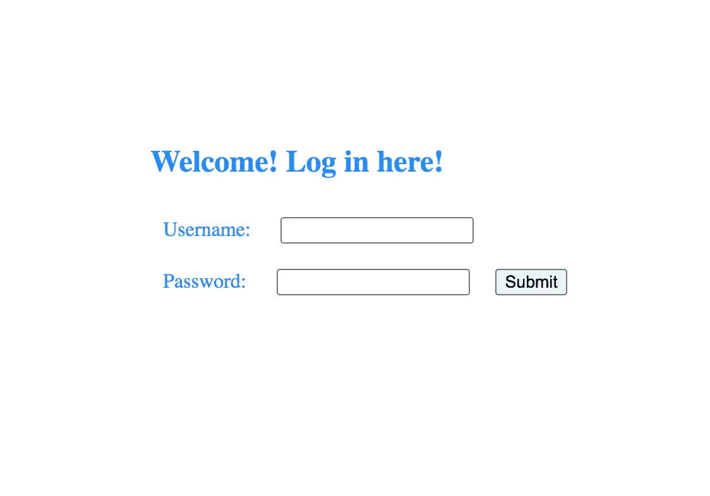
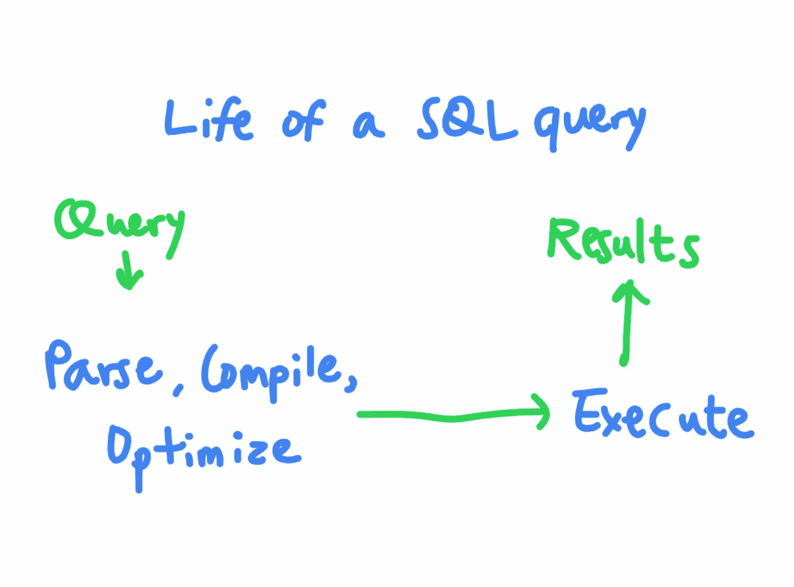
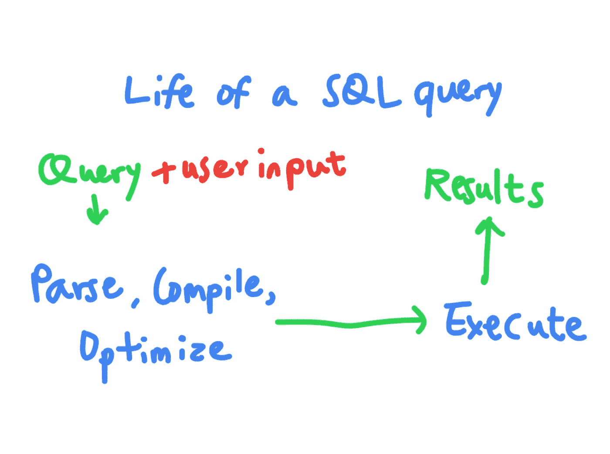
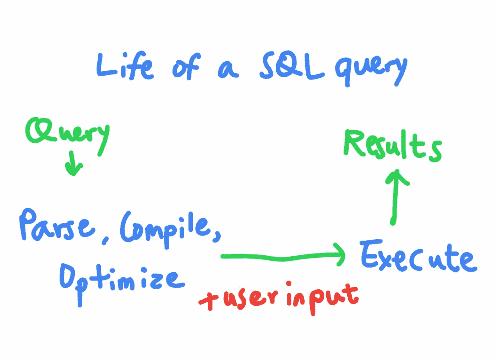

# 了解 SQL 注入攻击

> 原文：<https://betterprogramming.pub/learn-about-sql-injection-attacks-ce9f8940a5ab>

## 攻击者如何注入到 SQL 查询中，您如何防止它


照片由[卡斯帕·卡米尔·鲁宾](https://unsplash.com/@casparrubin?utm_source=medium&utm_medium=referral)在 [Unsplash](https://unsplash.com?utm_source=medium&utm_medium=referral) 上拍摄

让我们来谈谈您的应用程序可能遇到的最严重的漏洞之一:SQL 注入。

SQL 注入允许攻击者代码更改应用程序的 SQL 查询结构，以窃取数据、修改数据或在底层操作系统中执行任意命令。

例如，假设您的 web 应用程序的数据库包含一个名为 Users 的表。该表包含三列:ID、用户名和密码，分别包含每个注册用户的用户 Id、用户名和密码。



在你的网站上，你提示你的用户输入用户名和密码。



用户提交的用户名和密码将被插入到 SQL 查询中，以便用户登录。例如，如果用户输入用户名“user”和密码“password123”，将执行这个 SQL 查询来查找用户名和密码匹配的用户 ID。然后，您的应用程序将使用该用户 ID 登录用户。

```
SELECT Id FROM UsersWHERE Username='user' AND Password='password123';
```

# SQL 注入攻击

那么这里的问题是什么呢？这里的问题是，攻击者可以插入 SQL 语言特有的字符来扰乱查询的逻辑，从而执行任意 SQL 代码。例如，如果攻击者提交这个字符串作为他们的用户名会怎么样？

```
username="**admin'; —-** "&password=""
```

生成的 SQL 查询将变成:

```
SELECT Id FROM UsersWHERE Username='admin'; —- AND Password='';
```

`- -`序列表示 SQL 注释的开始。通过将`- -`添加到查询的用户名部分，攻击者注释掉 SQL 查询的其余部分。该查询实际上将变成:

```
SELECT Id FROM Users WHERE Username='admin';
```

该查询将返回管理员用户的 ID，而不管攻击者提供了什么密码。通过注入到 SQL 查询中，攻击者绕过了身份验证，可以在不知道正确密码的情况下以管理员身份登录！这就是 SQL 注入:通过注入特殊字符和改变 SQL 查询结构，攻击者可以导致数据库执行非预期的 SQL 代码。

# 利用 SQL 注入

绕过身份验证并不是攻击者利用 SQL 注入漏洞可以实现的唯一目标。他们还可以从服务器上检索不允许他们访问的数据。

假设您的网站允许用户通过向服务器提供用户名和访问密钥来证明他们的身份，从而访问他们的电子邮件列表。

```
username="vickie"&accesskey="ZB6w0YLjzvAVmp6zvr"
```

例如，这个请求将使用这个 SQL 语句生成一个对数据库的查询。

```
SELECT Title, Body FROM EmailsWHERE Username='vickie' AND AccessKey='ZB6w0YLjzvAVmp6zvr';
```

在这种情况下，攻击者可以通过提交这个访问键，利用 SQL 查询从其他表中读取他们不应该读取的数据。

```
username="vickie"&accesskey="**ZB6w0YLjzvAVmp6zvr' UNION SELECT Username, Password FROM Users; —-** "
```

让我们把这个有效载荷分解一下。如果攻击者将上述访问密钥发送给服务器，服务器将执行这个 SQL 查询。

```
SELECT Title, Body FROM EmailsWHERE Username='vickie' AND AccessKey='ZB6w0YLjzvAVmp6zvr'UNION SELECT Username, Password FROM Users; —- ;
```

`SQL UNION`操作符用于组合两个不同的`SELECT`语句的结果。这个查询结合了第一个`SELECT`语句(用户的电子邮件)和第二个`SELECT`语句(返回 Users 表中的所有用户名和密码)的结果。现在，攻击者可以读取存储在数据库中的所有用户的用户名和密码！

```
**SELECT Title, Body FROM Emails****WHERE Username='vickie' AND AccessKey='ZB6w0YLjzvAVmp6zvr'**UNION **SELECT Username, Password FROM Users**; —- ;
```

# 不仅仅是 SELECT 语句

SQL 注入不仅仅局限于`SELECT`的言论。攻击者还可以注入用于更新记录的`UPDATE`语句、用于删除现有记录的`DELETE`语句和用于在表中创建新条目的`INSERT`语句。例如，假设用户可以通过在 HTTP 表单中提供新密码来更改他们的密码。

```
new_password="password12345"
```

该表单将使服务器使用当前登录用户的新密码执行 SQL UPDATE 查询。在本例中，用户 ID 为`2`的用户。

```
UPDATE UsersSET Password='password12345'WHERE Id = 2;
```

攻击者可以控制`UPDATE`语句的`SET`子句。那么如果他们提交一个像这样的新密码呢？

```
new_password="**password12345'; —-** "
```

这个请求将导致 `UPDATE SQL`查询变成:

```
**UPDATE Users****SET Password='password12345'**; —- WHERE Id = 2;
```

该查询中的`WHERE`子句被注释掉，因此该查询会将 Users 表中的所有密码更改为“password12345”攻击者现在可以使用密码“password12345”以任何人的身份登录

# 防止 SQL 注入

你可以看到 SQL 注入是一个严重的漏洞，你应该防止。现在让我们来谈谈如何在您的 web 应用程序中防止它们。

你可能听说过几种预防 SQL 注入的技巧，如准备好的陈述、批准列表、类型转换和转义。但是每个选项的优缺点是什么，以及何时应该使用它们？

1.  准备好的声明
2.  批准列表
3.  铅字铸造
4.  逃避

## 准备好的声明

首先，让我们谈谈你的最佳选择:准备好的陈述。预准备语句也被称为*参数化查询*，它们使得 SQL 注入几乎不可能。

在我们深入研究预处理语句如何工作之前，理解 SQL 查询是如何执行的是很重要的。SQL 本质上是一种编程语言，你的 SQL 查询本质上是一个程序。当 SQL 程序到达 SQL server 时，服务器将对其进行解析、编译和优化。最后，服务器将执行程序并返回执行结果。



当您将用户提供的输入直接插入到 SQL 查询中时，您基本上是在使用用户输入动态地重写您的程序。因此，攻击者可以提供干扰程序代码并改变其逻辑的数据。



和预处理语句的工作原理是确保用户提供的数据不会改变 SQL 查询的逻辑。准备好的语句是在插入任何用户提供的参数之前发送到 SQL server 并由 SQL server 编译的 SQL 语句。这意味着，不是将完整的 SQL 查询传递给服务器进行编译，而是首先定义所有的 SQL 逻辑，编译它，然后在执行之前将参数插入到查询中。



将参数插入最终查询后，将不会解析和重新编译该查询。原始语句中没有的任何内容都将被视为字符串数据，而不是可执行的 SQL 代码。所以 SQL 查询的程序逻辑部分将保持不变。这允许数据库区分 SQL 查询的代码部分和数据部分，而不管用户输入看起来像什么。例如，下面是如何用 PHP 实现一个准备好的语句。

```
<?php
  $stmt = $mysqli->prepare(“SELECT Id FROM Users WHERE Username=? AND Password=?”);
  $stmt->bind_param(“ss”, $username, $password);
  $stmt->execute();
?>
```

在预准备语句中，您应该首先定义查询的结构。您写出不带参数的查询，并将问号作为参数的占位符。然后，SQL server 将把这个字符串编译成 SQL 代码。然后，您可以单独发送查询的参数。这里的`ss`表示我们提供两个参数，都是字符串。最后，执行查询。

这里需要记住的另一点是，使用预准备语句并不一定意味着可以避免 SQL 注入。你也必须正确使用它们。例如，这里假设我们在`prepare`函数中连接用户输入，然后立即执行它:

```
<?php
  $stmt = $mysqli->prepare(“SELECT Id FROM Users WHERE Username=’$username’ AND Password=’$password’”);
  $stmt->execute();
?>
```

如果您不将用户输入作为参数单独发送到准备好的语句，而是仍然通过将字符串连接在一起来构建 SQL 查询，那么即使使用准备好的语句，您仍然容易受到 SQL 注入的攻击。

## 批准列表

假设你的程序允许用户根据一些标准对他们的邮件进行分类。如果用户按照邮件发送日期对邮件进行排序，应用程序将执行这个 SQL 查询来检索邮件。

```
SELECT Title, Body FROM EmailsWHERE Username=’vickie’ AND AccessKey=’mykey_123'ORDER BY Date DESC;
```

SQL `ORDER BY`子句允许查询指定根据哪一列对结果进行排序。该查询将返回我们的表中所有用户的电子邮件，这些邮件按`Date`列降序排序。

但是你希望你的用户能够选择他们的电子邮件按照哪个字段排序。在这种情况下，不能使用预处理语句来保护查询。预准备语句只能用于保护编译过程中不需要的字段。不能在列名、表名、SQL 运算符或`ORDER BY`子句中使用预准备语句。因此，如果您需要在这些字段中使用用户提供的输入，批准列表将是针对 SQL 注入的最合适的防御措施。

*批准列表*是指只接受已知合法的输入值，拒绝所有其他输入。在这种情况下，您可以为`ORDER BY`子句使用列名的批准列表，而不是允许用户任意输入。假设用户只能按日期或发件人对邮件进行分类。您可以检查用户输入是否对应于允许的值之一，然后将其插入到 SQL 语句中。下面是如何在 PHP 中实现这种保护。

```
<?php
  **if($_POST[“order_by”] == “Date” || $_POST[“order_by”] == “Sender”) {
   $order_by = $_POST[“order_by”];
  }**
  $stmt = $mysqli->prepare(“SELECT Id FROM Emails WHERE Username=? AND AcessKey=? ORDER BY $order_by”);
  $stmt->bind_param(“ss”, $username, $accesskey);
  $stmt->execute();
?>
```

还可以将用户提供的值映射到程序中预定义的字符串中，以避免将用户输入连接到 SQL 查询中。例如，如果您希望您的用户以升序或降序方式对他们的结果进行排序，您可以让用户指定一个布尔值，然后将该值映射到要插入到查询中的字符串。

```
<?php
  if($_POST[“order_by”] == “Date” || $_POST[“order_by”] == “Sender”)   {
   $order_by = $_POST[“order_by”];
  } **$sort_by = “ASC”;
  if($_POST[“desc”] == “1”) {
   $sort_by = “DESC”;
  }**
  $stmt = $mysqli->prepare(“SELECT Id FROM Emails WHERE Username=? AND AcessKey=? ORDER BY $order_by $sort_by”);
  $stmt->bind_param(“ss”, $username, $accesskey);
  $stmt->execute();
?>
```

## 铅字铸造

如果您的用户输入应该是简单的数据类型，如布尔值、数字或日期，您还可以在将用户输入字符串追加到查询之前将其转换为更安全的数据类型。这被称为*型铸造*，可以用来防止 SQL 注入不使用准备好的声明。

例如，假设您还允许用户使用他们的用户 ID 来检索他们的电子邮件。并且您知道所提供的用户 ID 应该总是一个整数。

```
SELECT Title, Body FROM EmailsWHERE Id='2' AND AcessKey='mykey_123';
```

在这种情况下，您可以在将用户输入字符串插入 SQL 查询之前将其转换为整数。这将确保输入是一个数字，并且没有会影响 SQL 逻辑的特殊字符会在转换后继续存在。

```
<?php
  **$id = (int)$_POST[“id”];**
  $accesskey = $_POST[“access_key”]; $stmt = $mysqli->prepare(“SELECT Title, Body FROM Emails WHERE Id=$id AND AcessKey=?”);
  $stmt->bind_param(“s”, $accesskey);
  $stmt->execute();
?>
```

您可能已经注意到，在这个示例中，我们可以只使用预准备语句。你完全正确。我建议尽可能使用预处理语句，而不是类型转换，因为预处理语句适用于所有数据类型。这样，您的编码风格可以对所有类型的用户输入保持一致。类型转换方法应该保留到预准备语句不可用时使用。

```
<?php
  $id = $_POST[“id”];
  $accesskey = $_POST[“access_key”]; $stmt = $mysqli->prepare(“SELECT Title, Body FROM Emails WHERE Id=? AND AcessKey=?”);
  $stmt->bind_param(“ss”, $id, $accesskey);
  $stmt->execute();
?>
```

## 逃避

防止 SQL 注入的最后一种方法是小心地对用户输入进行净化和转义。这意味着您要编码或删除可能扰乱 SQL 逻辑的特殊字符。例如，应该清理或转义的一些特殊字符包括单引号(')和双引号(")，这通常允许攻击者中断参数字符串。还需要注意每种类型的数据库特有的特殊字符。

这种方法只能作为最后的手段，如果可能的话，你不应该依赖它，因为它不能保证在所有情况下都能预防 SQL 注入。很容易忽略一些可能构成 SQL 注入攻击的特殊字符。

让我们再来看看这个查询。如果您希望您的用户能够通过随机字段对他们的电子邮件进行排序，该怎么办？如果您无法确定在这种情况下可以使用的批准列表，您可以首先对用户输入字符串进行转义，然后将其插入到查询中。

```
<?php
  **$order_by = $mysqli->real_escape_string($_POST[“order_by”]);**
  $stmt = $mysqli->prepare(“SELECT Id FROM Emails WHERE Username=? AND AcessKey=? ORDER BY $order_by”);
  $stmt->bind_param(“ss”, $username, $accesskey);
  $stmt->execute();
?>
```

# 注意安全！

如你所见，你有很多预防 SQL 注入的选择。预防 SQL 注入的最佳方法是尽可能使用预准备语句，并在无法使用预准备语句时使用批准列表。当您无法使用准备好的语句时，类型转换也可以用作批准列表的替代方法。输入转义和净化不应被用作抵御 SQL 注入的唯一保护措施。相反，这种方法与准备好的声明和批准列表结合使用，以获得最大程度的保护并防止其他 web 漏洞。

今天的安全课到此结束。下次见！