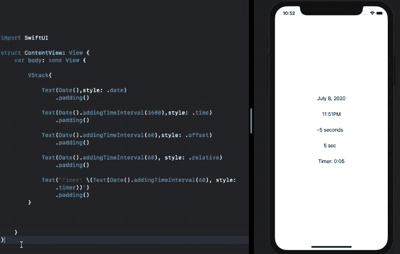
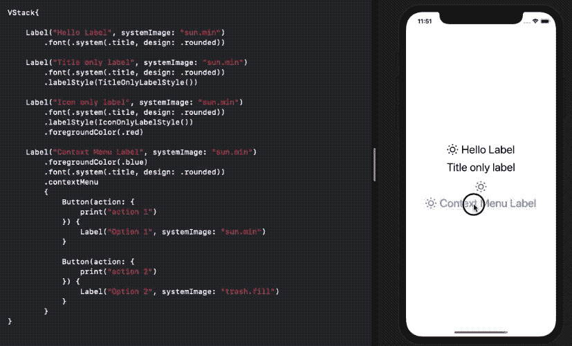

# 了解 iOS 14 中的 SwiftUI 文本和标签

> 原文：<https://betterprogramming.pub/learn-about-swiftui-text-and-label-in-ios-14-bfee41252117>

## 让我们来探索这些强大的文本控件


照片由 [Prateek Katyal](https://unsplash.com/@prateekkatyal?utm_source=medium&utm_medium=referral) 在 [Unsplash](https://unsplash.com?utm_source=medium&utm_medium=referral) 上拍摄

苹果没有确切地将 SwiftUI 的第二次迭代称为 2.0，但在 WWDC 2020 期间确实有一些噼噼啪啪的更新。

除了`Grids`和`MatchedGeometryEffect`的推出，SwiftUI `Text`也得到了巨大的推动。除此之外，`Label`、`Link`和`TextEditor`的引入使得表单、按钮和漂亮文本的构建变得更加容易。

在接下来的几节中，我们将看看你可以在 iOS 14 的 SwiftUI 中使用新的`Text`控件实现什么。

# SwiftUI 文本现在支持强大的插值

SwiftUI `Text`今年已经升级了新的初始化器，允许你格式化日期，用图像插入字符串，并在`Text`中添加`Text`。

让我们看看如何在 SwiftUI `Text`中用 SF 符号包装图像:

```
Text("Hello, \(Image(systemName: "heart.fill"))Text(Image(systemName:))
```

下面的例子展示了通过连接几个 SwiftUI `Text`我们可以实现什么:


SwiftUI `Text`也有两个用于在字符串中包装日期的初始化器——即日期间隔和日期范围，并带有一个可选参数来设置样式。

让我们看看在 Swift `Text`中设置和格式化日期的不同方式:

```
Text(Date().addingTimeInterval(600))
Text(Date().addingTimeInterval(3600),style: .time)
```

`addTimeInterval`只接受绝对值，所以上面两个代码片段以不同的样式将日期设置在`T + 10`分钟和`T + 1`小时。

新语义 API 的惊人之处在于，它允许您使用样式`relative`、`timer`和`offset`在 SwiftUI `Text`初始化器中设置计数器或计时器。

```
//countdown timer to update every minute
Text(Date().addingTimeInterval(60),style: .offset)
```

现在，您可能想知道设置计时器是否会触发 SwiftUI 视图主体每秒刷新一次，但事实并非如此。

SwiftUI `Text`认为计数器是一个动画，这意味着它在开始和结束日期之间插入值。让我们来看看不同种类的`Text` s:



注意三种不同风格的`Timer`的不同表现。并且它们在计数器的末端自动反转。

SwiftUI `Text`也使得在`Text`中插入`Text`成为可能，同时保留他们各自的身份。比如《盗梦空间》。

# SwiftUI 标签可同时显示文本和图像

SwiftUI `Label`是我们经常使用的视图的现成替代品:在`stack`中包装文本和图像

下面是如何定义全新的 SwiftUI `Label`:

```
Label("Hello Label", systemImage: "sun.min")Label("Hello Label", image: "asset_image")Label(title: {Text("..")}, icon: {Image(..)})
```

标签还提供了一个`labelStyle`修饰符，它有两个内置的变体— `TitleOnlyLabelStyle`和`IconOnlyLabelStyle`。尽管您也可以创建自己的自定义标签样式配置。

在下面的屏幕截图中，我们展示了不同类型的`Label`以及如何在`ContextMenu`中使用它们:



大大减少了我们不得不在`ContextMenu`按钮中定义的不必要的`Text`和`Image`视图。

虽然得到一个 SwiftUI 按钮初始化器让我们也能设置图像是一个梦想。

# 创建自己的标签样式

我们可以根据`LabelStyle`为我们的标签创建定制样式。

下面的代码试图垂直设置图标和文本，而不是水平对齐。

```
struct VLabelStyle: LabelStyle {
        func makeBody(configuration: Configuration) -> some View {
            VStack {
                configuration.icon
                configuration.title
            }
        }
}
```

现在，您可以在视图修改器中将它设置为`.labelStyle(VLabelStyle())`。

# 结论

SwiftUI `Text`现在支持更强大的插值，让你在一行中设置定时器(事实上，只有几个字)。

SwiftUI `Label`在列表和上下文菜单中非常方便。

你可以从这个[要点链接](https://gist.github.com/anupamchugh/e4df9b9734634a5cf59b51f784e08610)查看或下载我们所涉及的所有内容的源代码。

这一次到此为止。感谢阅读。