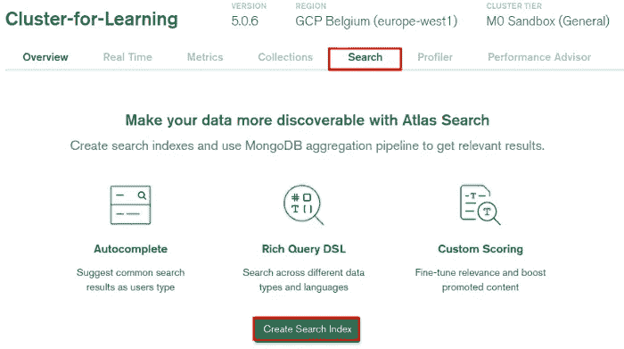
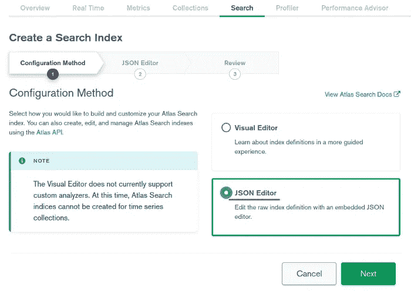

# 使用 MongoDB Atlas Search 学习高级全文搜索

> 原文：<https://betterprogramming.pub/learn-advanced-full-text-searches-with-mongodb-atlas-search-5e4b51719427>

## 让我们用 MongoDB 搜索而不是 Elasticsearch


丹尼尔·勒曼在 Unsplash 的照片。

正如我们在[之前的文章](https://lynn-kwong.medium.com/learn-powerful-full-text-searches-with-mongodb-atlas-search-e3fee4fcc324)中了解到的，我们现在可以使用 MongoDB Atlas Search 运行全文搜索查询。如果你正在实现一个搜索引擎，并且还没有决定使用哪个工具，MongoDB Atlas Search 可能是传统工具如 [Elasticsearch](https://www.elastic.co/what-is/elasticsearch) 的一个很好的替代品。在本帖中，我们将介绍 MongoDB Atlas Search 的一些高级设置和搜索查询。你会发现它们与 Elasticsearch 中的同行非常相似。这是因为，在幕后， [Apache Lucene](https://lucene.apache.org/) 被用作 Elasticsearch 和 MongoDB 的核心。

应该注意的是，只有当您的 MongoDB 数据库由 MongoDB Atlas 托管时，MongoDB Atlas 搜索才可用。如果您在本地管理 MongoDB 服务器，则它不可用。

我们将继续使用我们一直在做的`products`数据库中的`[laptops](https://gist.github.com/lynnkwong/a05a96e76551e49df3a1defc93423ad4)`集合，因为产品名称和属性是演示全文搜索的好例子。

如果你之前没有用过 MongoDB Atlas，建议用[这篇文章](https://lynn-kwong.medium.com/how-to-use-mongodb-atlas-to-manage-your-server-and-data-d97a6e7663c5)快速入门。如果您想跟进，请下载这个 JSON 文件[并使用下面的命令将数据导入 MongoDB Atlas。如果你还没有安装`mongoimport`，请跟随](https://gist.github.com/lynnkwong/a05a96e76551e49df3a1defc93423ad4)[这个链接](https://www.mongodb.com/docs/database-tools/installation/installation-linux/) k 下载并安装 MongoDB 数据库工具。

请注意，您需要为自己的案例更改用户名、密码和集群名称。如果您有网络连接问题，记得检查您的 IP 地址是否被添加到 Atlas UI 中的 IP 访问列表。

当运行上述命令时，您将在 MongoDB Atlas 中自动创建`products`数据库和`laptops`集合，其中包含 200 个笔记本电脑文档，如下所示:

现在让我们创建一个用于全文搜索的 Atlas 搜索索引。您可以使用 Atlas UI、Atlas Search API 或 MongoDB CLI 创建一个 Atlas 搜索索引。最简单的方法是使用 Atlas UI，因为您不需要指定集群元数据，如公钥/私钥、集群名称、组 id 等。

在 Atlas UI 中，找到您的组织、项目和集群。如果您只有一个集群，那么当您打开 Atlas UI 时，它已经显示在那里了。单击集群名称以打开控制面板，您可以在其中找到“搜索”选项卡。单击它打开用于创建搜索索引的页面:



现在点击“创建搜索索引”按钮，为我们在`products`数据库中的`laptops`集合创建一个搜索索引。会打开这样一个页面:



建议选择“JSON 编辑器”,因为那里可以有更高级的配置。除此之外，MongoDB Atlas Search 几乎所有的文档都使用 JSON 配置。因此，最好从一开始就熟悉 JSON 的设置。

在这个高级教程中，我们将使用静态映射。实际上，还建议使用静态映射，这样您就可以选择要索引哪些字段以及如何索引它们。您可以使用高级设置，如自动完成和带有静态映射的同义词。`laptops`系列的映射文档是:

关于索引定义的一些重要注意事项:

*   当文档被索引时使用`analyzer`，而`searchAnalyzer`用于分析搜索查询。它们通常是相同的。默认的也是最常用的分析器是`lucene.standard`，它将一个字符串小写，并通过空格和标点符号将其拆分成记号。此外，删除了常见的停用词，如*中的*、*中的*、*中的*等。
*   我们指定`dynamic`是`false`，所以我们需要明确指定每个字段的映射。
*   `name`字段有两种索引类型，一种是常规的`string`，另一种是`autocomplete`，支持随类型搜索查询。自动完成类型有自己的设置，但是默认设置在大多数情况下应该足够了。
*   `attributes`字段是一个文档数组。Atlas 搜索只需要数组元素的数据类型。

重要的是，请注意我们需要在 **same database** 中为同义词定义创建一个单独的集合。您可以使用`mongosh`运行以下命令来创建`synonyms`集合:

注意，`synonyms`集合应该在与要搜索的目标集合相同的数据库中创建，并且与索引定义中的`synonyms`字段同名。

同义词有两种，分别是`equivalent`和`explicit`。对于一个`equivalent`类型，所有的同义词都是等价的，并且可以互换。然而，对于`explicit`类型，这只是一个方向，即只有`input`字段中的单词可以被`synonyms`字段中的单词替换，而不是相反。因此，如果你搜索“联想”，只包含“ThinkPad”而没有“Lenovo”的笔记本电脑将被返回。但如果搜索“ThinkPad”，只包含“Lenovo”而不包含“ThinkPad”的，则不会返回。后面我们会用一个例子来看。

创建完`synonyms`集合后，您可以继续创建搜索索引，如上所示。

现在已经创建了搜索索引，我们可以继续创建和运行全文搜索查询。使用静态映射，包括像自动完成和同义词这样的高级设置，我们不能使用 Atlas UI 中的“搜索测试器”来运行复杂的查询，而是需要使用带有`mongosh`或驱动程序的聚合管道。在这篇文章中，我们将使用`mongosh`,因为它不局限于特定的编程语言，因此更加通用。

**搜索 1:使用自动完成功能进行搜索:**

```
[
  { _id: 2, name: 'Lenovo IdeaPad Model 2', score: 1 },
  { _id: 8, name: 'Lenovo ThinkPad Model 8', score: 1 }
]
```

我们使用`autocomplete`操作符来执行随键入搜索的查询。`path`字段指定要搜索的字段，它应该具有如上所示定义的`autocomplete`类型。如果你想了解更多关于 MongoDB Atlas 搜索聚合查询的基本语法，请查看[这篇文章](https://lynn-kwong.medium.com/learn-powerful-full-text-searches-with-mongodb-atlas-search-e3fee4fcc324)。

**搜索 2:使用自动完成加模糊搜索功能。**

```
[
  { _id: 2, name: 'Lenovo IdeaPad Model 2', score: 1 },
  { _id: 8, name: 'Lenovo ThinkPad Model 8', score: 1 }
]
```

这个查询与上面的查询有相同的结果，这意味着模糊搜索和自动完成功能工作正常。注意，我们为`fuzzy`指定了`maxEdits`和`prefixLength` [选项](https://www.mongodb.com/docs/atlas/atlas-search/autocomplete/#options)，这样我们就不会得到太多与此查询无关的结果。

**搜索三:用同义词搜索。**

我们先试着用*等价的*同义词进行搜索。

```
[
  { _id: 134, name: 'Apple MacBook Model 134', score: 1.738951921463012 },
  { _id: 184, name: 'Apple MacBook Model 184', score: 1.738951921463012 }
]
```

你可以尝试用“MacBook”、“Macintosh”或“Mac”搜索，总会得到相同的结果，因为它们是等价的同义词，可以互换。

现在让我们尝试用*显式*同义词进行搜索:

```
[
  { _id: 97, name: 'ThinkPad T480 Model 97' },
  { _id: 40, name: 'Lenovo T480 Model 40' },
  { _id: 117, name: 'Lenovo ThinkPad T480 Model 117' }
]
```

```
[
  { _id: 97, name: 'ThinkPad T480 Model 97' },
  { _id: 117, name: 'Lenovo ThinkPad T480 Model 117' }
]
```

这两个例子演示了“ThinkPad”可以被“Lenovo”搜索，但反之则不行。

**搜索 4:用短语搜索。**

有时，我们希望搜索一个有序的术语序列，它必须与输入查询中指定的完全一致。这可以通过`phrase`操作器实现。让我们分别使用`text`和`phrase`操作符搜索“联想 T480 ”,您会立即看到不同之处:

```
[
  { _id: 40, name: 'Lenovo T480 Model 40' },
  { _id: 117, name: 'Lenovo ThinkPad T480 Model 117' },
  { _id: 97, name: 'ThinkPad T480 Model 97' },
  ...
]
```

```
[ { _id: 40, name: 'Lenovo T480 Model 40' } ]
```

使用`phrase`操作符只返回一个结果，因为它要求搜索字符串中的标记在结果文档中以相同的顺序出现。

**搜索 5:将多个运算符组合在一起。**

最后，让我们学习使用`compound`操作符将多个操作符组合在一起。如果你对 Elasticsearch 有所了解，你会发现语法非常相似。我们还在 MongoDB Atlas Search 中使用了`must`、`mustNot`、`should`和`filter`子句。

让我们找到所有仍有库存的惠普笔记本电脑:

```
[
  { _id: 200, name: 'HP ZBook Model 200', quantity: 8 },
  { _id: 196, name: 'HP ZBook Model 196', quantity: 4 }
]
```

奇怪的是，`[equals](https://www.mongodb.com/docs/atlas/atlas-search/equals/#std-label-equals-ref)`操作符只能处理*布尔值*和 *objectId* 值。因此，我们需要使用[范围](https://www.mongodb.com/docs/atlas/atlas-search/range/#std-label-range-ref)运算符来检查数量是否为 0。

让我们编写一个更复杂的查询来查找满足以下条件的笔记本电脑:

*   品牌不是苹果。
*   仍有现货。
*   内存为 32GB 或存储容量为 1TB

哇哦。如此简单的搜索问题会变得非常复杂。与 Elasticsearch 类似，如果某个字段包含一组嵌套文档，我们很容易陷入这样的问题(“bool/compound hell”)。然而，一旦你知道了模式，它实际上并不复杂。只是写起来有点繁琐。

此复合搜索查询的要点:

*   `filter`条款与`must`具有相同的效力。但是，它不用于计算最终的搜索分数。如果你想提高某个领域的分数，你需要使用`must`子句，而不是`filter`。此外，值得指出的是`mustNot`也不会影响搜索分数。它的工作原理类似于`filter`从句的否定。
*   `should`子句，顾名思义，指定了应该满足的条件，因此是可选的。然而，我们可以使用`minimumShouldMatch`选项来指定返回一个结果需要满足多少可选条件。
*   我们可以在`compound`操作符中使用`compound`操作符。这就是事情开始变得复杂的地方。然而，我们应该记住嵌套的`compound`操作符与顶级操作符的工作方式完全相同。它通常用于包含嵌套文档数组的字段，如本例中的`attributes`字段。

在本文中，我们演示了如何使用静态映射创建 MongoDB Atlas 搜索索引。引入了一些特殊的设置，如自动完成随键入搜索和同义词搜索。我们还介绍了一些常见的搜索查询，从基本到高级，可以在您的实际工作中直接使用。

对于嵌套字段的搜索，即那些值是文档数组的字段，不要被看似复杂的查询吓倒。只要您知道`compound`操作符是如何工作的，您就可以自己构建强大的查询，使用`must`、`mustNot`、`should`和`filter`子句作为构建块。

相关文章:

*   [如何在 MongoDB 中进行基本的全文搜索](https://lynn-kwong.medium.com/how-to-do-basic-full-text-searches-in-mongodb-48b17242676?source=your_stories_page----------------------------------------)