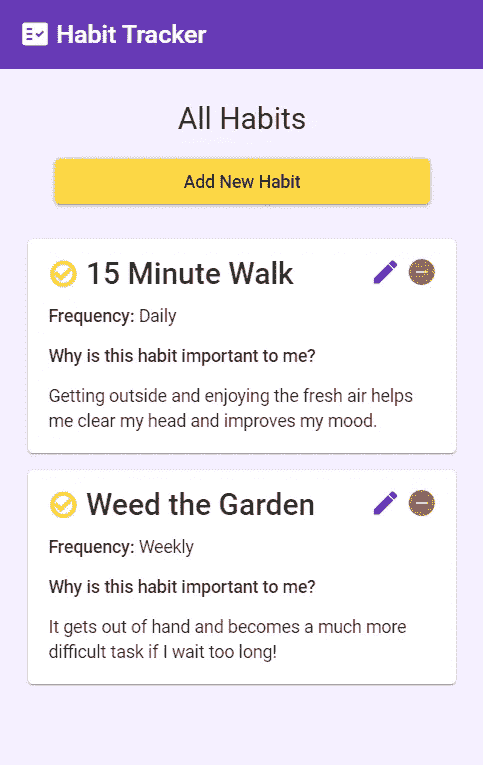
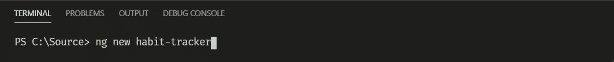
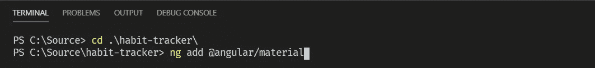
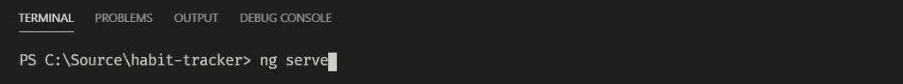
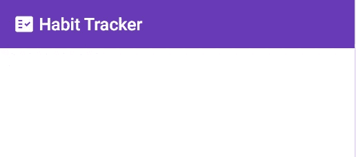
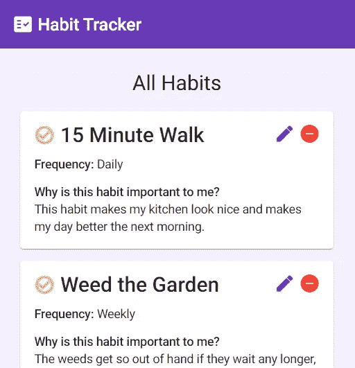
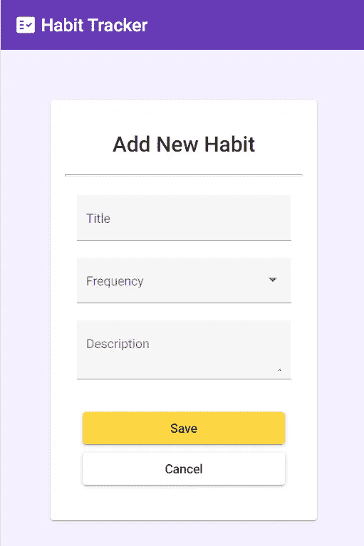
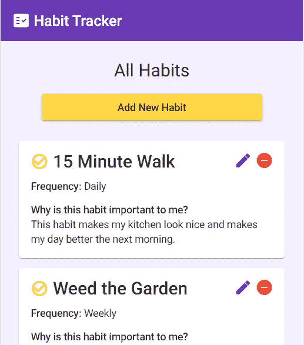

# 通过使用角度材料构建一个简单的应用程序来学习角度基础知识

> 原文：<https://betterprogramming.pub/learn-angular-basics-by-building-a-simple-app-using-angular-material-9bbc19aa33cf>

## 奖励:包括使用角度反应形态的一瞥


杰斯·贝利在 [Unsplash](https://unsplash.com?utm_source=medium&utm_medium=referral) 上的照片

准备好今天建造一些非常棒的东西了吗？我也是！

我目前是一名 Angular 开发人员，为我公司的员工开发工具来完成他们的工作，并希望他们喜欢这样做。我在今年五月初才开始在 Angular 开发，但我喜欢前端工作，并且非常渴望有机会专业地学习这项新技能。

我积极地相信学习任何东西的唯一方法就是开始工作——尝试新事物并开始积累经验和知识是从初学者到摇滚明星的唯一方法。

> “学习是一个主动的过程。我们通过做来学习...只有使用过的知识才会留在你的脑海里。”
> 
> ——戴尔·卡内基

# 我们在学什么？

我们将构建一个习惯跟踪应用程序的基本版本，它将列出当前的习惯记录，允许您管理它们，并添加新的记录。本教程是一个逐步演练。我们将一次添加一个 UI 和后端组件，这样您可以很容易地看到各个部分组合在一起。



*   你将从头开始设置一个 **Angular 应用**——没有启动文件，我们将看到香肠是如何制作的。
*   我们将**安装 Angular Material** 并使用它的一些组件来制作一些漂亮的 UI。
*   UI 的模板包括一些**角度结构指令**来显示和隐藏基于组件状态的东西。
*   您将实现一个简单的**反应式表单**来接收输入数据。

在本教程结束时，您将拥有一个管理习惯列表的应用程序，可以添加、编辑和删除这些习惯。我们直接开始吧，好吗？

TL；DR:在 [StackBlitz](https://stackblitz.com/edit/habit-tracker-basic?file=src%2Fapp%2Fapp.component.html) 上找到演示应用。

# 基本设置

如果你以前从未在你的机器上创建过 Angular 应用程序，确保你已经安装了 [Node.js](https://nodejs.org/en/) 和 [Angular CLI](https://angular.io/guide/setup-local) 。

打开你选择的终端。在本教程中，我将使用 [VSCode](https://code.visualstudio.com/download) 的内置终端。

导航到要创建应用程序的目录，然后输入以下命令:



系统会提示您回答几个问题:

1.  您想要添加角度路由吗？—键入 *y* 并按回车键确认。
2.  您想使用哪种样式表格式？—使用箭头键选择一个选项。我喜欢用 SCSS。

一旦所有这些包都生成了，你就可以开始设置角度材质了。使用这些命令跳到新应用程序的目录，然后将角度材质添加到项目中:



您需要对提示做出回应:

1.  选择深紫色/琥珀色预设主题
2.  设置全局角度材料排版样式？—键入 *y* 并按回车键确认。
3.  为有角度的材质设置浏览器动画？—键入 *y* 并按回车键确认

一旦完成，输入“ng serve”就可以看到 Angular 为您生成的所有代码。



唷。好吧，让我们开始写代码，好吗？

# 创建用户界面元素

首先，让我们使用一些有棱角的材质组件来轻松创建一个非常漂亮的 UI。

## 工具栏

在`app.component.html`中，删除所有生成的代码并添加以下内容:

因为我们使用有角度的材料来创建`mat-toolbar`和`mat-icon`元素，你还需要添加到你的`app.module.ts`文件中:

注意:为了保持简洁，我将省略一些导入以保持我的 GitHub gists 更短。你可以在教程的最后找到完整的代码。

接下来，把这个加到`app.component.scss`里，这样我的眼睛就不会流泪了:

```
.toolbar h1 {
    padding-left: 5px;
}
```

然后转到`styles.scss`并将`background-color: #f5f0fe;`添加到`body`元素的样式中。

保存一切，并检查我们的酷工具栏。

如果你还没有看到工作，你可能需要停止应用程序(通过在终端键入 CTRL+C)并再次运行`ng serve`。有时对`app.module.ts`的更改可能需要重启。

## 使用有角度的材料图标

关于角状材料的一个很棒的事情是你可以免费得到所有的图标功能。在我们继续之前，我想说明几件事:

*   标签之间的文本是你想看到的图标的名称。
*   要找到您可以使用的其他图标，请访问[材料设计图标](https://material.io/resources/icons/?style=baseline)页面。
*   默认情况下，元素中的图标将继承其父元素的字体颜色。您可以通过添加颜色属性来使用您的主题颜色之一。例如，`<mat-icon color="primary">`将使图标颜色成为你的主题的主要颜色。



s

好吧，现在来点更有趣的怎么样？

# 创建列表

现在，我们实际上要进入一点 TypeScript，这样我们可以为我们的模板设置一些要显示的数据。本教程不涉及任何本地持久性主题，所以我们现在只建立一个虚拟列表。

我们需要一个模型来描述一个习惯对我们的应用意味着什么。在 app 文件夹中，新建一个名为`models`的文件夹。在该文件夹中，添加一个名为`habit.ts`的新文件。将以下内容添加到文件中:

```
export class Habit {
    name: string;
    frequency: string;
    description: string;
}
```

回到`app.component.ts`，使用我们的新类型添加一个数组属性:

一定要导入我们的`Habit`型。

在`app.component.html`，在我们的工具栏下，放这个 HTML:

由于模板中的这些新的角形材料组件，我们现在将缺少一些导入。将 MatCardModule 导入您的`app.module.ts`:

在`app.component.scss`中，放入以下类:

```
.all-habits {
    text-align: center;
}.all-habits h1 {
    margin-top: 1em;
}.all-habits mat-card {
    width: 80%;
    margin: 1em auto;
    text-align: left;
}.habit-icon {
    vertical-align: middle;
    padding-bottom: 3px;
    font-weight: 600;
}.detail-label {
    font-weight: 500;
}.detail-options {
    position: absolute;
    top: 14px;
    right: 10px;
}.detail-options mat-icon {
    padding-right: 5px;
}button:hover, .detail-options {
    cursor: pointer;
}
```

就像这样，Angular 和 Angular Material 给了我们一大堆免费的组件、样式和行为，让这个应用程序开箱后非常清晰。

*   注意结构指令`*ngFor`在我们设置的习惯数组上循环。
*   我们还引入了`mat-card`元素。它提供了一些简便的方法来分割卡片内容，这样我们就可以保持有序。在文档中查看`mat-card` [的更多子组件。](https://material.angular.io/components/card/overview)



# 表单用户界面

为了更接近我们能够操作习惯列表的目标，我们需要一个添加和编辑新条目的表单。

现在，让我们把表单的 HTML 代码片段放在工具栏之间，但是在我们所有习惯的现有代码之上(确保它在带有`class="all-habits”`的 div 之外和之上):

要修复我们从表单和按钮元素获得的红色曲线，请确保将 MatButtonModule、MatInputModule 和 MatSelectModule 导入到您的应用程序模块中:

我们将把这些人添加到`app.component.scss`中，让它更有风格一些:

```
.add-form-container {
    padding: 4em;
    text-align: center;
    max-width: 400px;
    margin: auto;
}.add-form-container mat-card-title {
    margin: 1em !important;
}.add-form-container button {
    margin-top: 10px !important;
}mat-card-content {
    margin-bottom: 0;
}form {
    padding-top: 1em;
}mat-form-field {
    width: 90%;
}button {
    width: 80%;
    max-width: 300px;
    margin-bottom: 1em;
}button:hover, .detail-options {
    cursor: pointer;
}
```

还有一个表格！让我们对这个片段做一些笔记:

*   `mat-form-field`为占位符、标签和样式提供了许多很棒的选项。查看文档中的更多信息[。](https://material.angular.io/components/form-field/overview)
*   不是将角度材质输入命名为元素，而是将它们作为指令或属性添加到普通的 HTML 输入中——正如我们在上面的代码中看到的`textarea`:`<textarea matInput>`。在文档中找到更多关于角度材料输入[的信息。](https://material.angular.io/components/input/overview)
*   按钮也是这样工作的。有不同的按钮样式可以作为属性添加到`<button>`元素中。在这种情况下，我们使用的是`mat-raised-button`指令——如果你不喜欢阴影效果，试试`mat-flat-button`。按钮也可以接受`color` 属性，在这里你可以使用你的角度材质`primary`、`accent`和`warn`颜色类。查看文档中的许多按钮选项和样式[。](https://material.angular.io/components/button/overview)



# 添加一些有意义的 UX

现在，我们的表单正在把习惯列表往下推，所以我们看不到它。当我们添加一个新习惯的时候，我们真的需要看这个列表吗？我想我们没有。

首先，让我们进入 TypeScript 并添加一个变量，这样我们就可以知道我们是否处于添加模式，并在默认情况下将其设置为 false:

现在，不要总是显示我们的表单，让我们添加一个添加新习惯按钮，当我们单击它时，它将切换到视图中。更新`all-habits`部分以包含一个按钮:

请注意，这个按钮上有一个 click 事件。当点击它时，它将切换我们的`adding`变量，允许我们在添加和非添加模式之间切换。为了利用这一点，让事情按照我们想要的方式发展，让我们使用`*ngIf`结构指令来隐藏所有习惯列表，并在`adding`为`true`时显示添加表单:

保存后，您应该看到您的表单现在只在您单击按钮时出现。



好吧！现在我们已经将所有的 UI 元素排列好了，是时候让这个应用程序更加动态，让这些按钮都做它们应该做的事情了。坚持不懈；我知道这是一个漫长的过程，但我们就快到了。

# 添加核心功能

## 挂上反应式

现在是有趣的部分。是时候在我们的 Typescript 中加入一个反应式表单了，这样我们就可以操作习惯列表中的数据了。

在`app.component.ts`中，添加以下代码来设置表单:

这里需要注意的是:

*   别忘了从`@angular/core`导入`FormGroup` 和`FormControl`。
*   `FormGroup`类型为我们提供了一种在一个地方管理表单上多个输入的方法。
*   用空字符串填充我们的`FormControls`意味着当表单初始化时，相应输入的值将为空。当我们进行编辑时，我们将学习如何用一个值来初始化它们。
*   在文档中学习更多关于反应式[的知识。](https://angular.io/guide/reactive-forms)
*   另外，请注意`onSubmit()`方法。我们能够访问`FormGroup`的值，并将它转换成我们的`Habit`模型，这样我们就可以获得良好的智能感知和类型检查。

现在我们需要将我们的 TypeScript 表单附加到 HTML 模板上。

为了让 HTML 识别`[formGroup]`绑定，您需要更新您的`app.module.ts`导入，以包含`FormModule`和`ReactiveFormsModule`:

现在，我们不仅有一个有效的反应形式，而且我们还可以在我们的清单上增加新的习惯。

添加后需要特别注意的事项:

*   要求您将`[formGroup]`绑定到`form`元素上。
*   `(ngSubmit)`正在监听类型为`submit`的按钮上的任何点击事件，因此不需要在保存按钮上添加单独的点击事件。
*   您在`formControlName`属性中输入的名称必须与您在 TypeScript 中定义的控件名称完全一致。

## 创建编辑现有条目的功能

我们目前可以添加新的习惯，但我们需要连接我们的小铅笔图标按钮，以便它打开一个编辑表单并更新列表中选择的条目。先给`app.component.ts`添加编辑方法:

关于这些新增内容的快速注释:

*   注意`setEditForm()`方法中`patchValue()`的使用。这允许我们一次直接设置整个表单组的值。
*   注意我们传递给同一方法的参数——这些参数将在我们的 HTML 添加中发挥作用。`index`参数将是我们传入的习惯的索引，以便我们可以在现有数组中找到它来替换它。
*   在 Geeksfor Geeks 了解更多关于`.splice()` [的信息。](https://www.geeksforgeeks.org/typescript-array-splice-method/)
*   最后，注意我们新的`editing`标志也在提交中被设置，这样我们就知道在保存时切换回主列表。

现在来看模板:

什么变了？

*   我们使用相同的表单来编辑我们的列表，就像我们添加列表一样，所以我们添加了`editing`标志到我们的`*ngIf`检查中。
*   如果你看看`*ngFor`的变化，你会看到我们从 Angular 得到的一个简洁的特性。我们能够通过定义一个变量来获取我们所选择的元素的索引，以保持数字正确。然后，我们将该变量传递给我们的`setEditForm()`函数，这样表单就知道要编辑哪个习惯。
*   最后，我们添加了编辑功能，作为铅笔图标按钮上的点击事件。

不错！现在开始删东西吧。

## 添加删除方法

在您的类型脚本中，添加一个`onDelete()`方法。它还会从我们的`*ngFor`中获取索引，就像`setEditForm()`所做的那样。

然后向模板中的删除图标添加一个单击事件:

现在我们可以删除。

## 完成取消按钮并修复一个错误

好了，我们到了最后阶段:这是最后一组片段。

我们还有两件事要做:让取消按钮工作，同时修复一个小错误。您可能已经注意到，如果您编辑了一个习惯，然后直接创建了一个新习惯，那么表单会填充上一次编辑条目的数据。这是为什么呢？

现在，当我们保存新条目时，我们没有清除表单上的字段，所以数据只是挂在那里。让我们创建一个解决方案，在保存或取消时清除它，并挂上那个按钮。

在`app.component.ts`中，我们将添加一个`exitForm()`方法，并在`onSubmit()`函数中使用它:

我们的表单组包含一个`reset()`函数，该函数会将我们的输入重置为未触动的状态，并清空字段中的任何值。

接下来，用一个`exitForm()` click 事件连接添加表单中的取消按钮:

就这样，伙计们，就是这样！

# 我们都完成了什么？

哇——谢谢你陪我度过了这一切！让我们把东西包起来。

*   我们学习了如何使用角度结构指令来管理何时基于状态显示给定内容，以及动态显示项目列表的成员。
*   我们使用反应式表单来管理来自 TypeScript 的表单字段和值，而不是在 HTML 模板中。
*   我们使用 Angular Material 组件轻松地创建了一个好看的 UI，而无需我们自己做太多与样式相关的工作。

你怎么想呢?你准备好成为一名棱角分明的开发者了吗？如果你在教程中发现问题，请告诉我。请一定要抓住这一点，坚持下去:要么增加功能，要么另辟蹊径。这就是你如何获得最大收益的方法。

## 资源摘要

*   [StackBlitz 应用程序演示](https://stackblitz.com/edit/habit-tracker-basic?file=src%2Fapp%2Fapp.component.html)
*   [角材组件文档](https://material.angular.io/components/categories)
*   [材质设计图标](https://material.io/resources/icons/?style=baseline)
*   [英雄角之旅](https://angular.io/tutorial)——如果你正在寻找更多的基本动作！