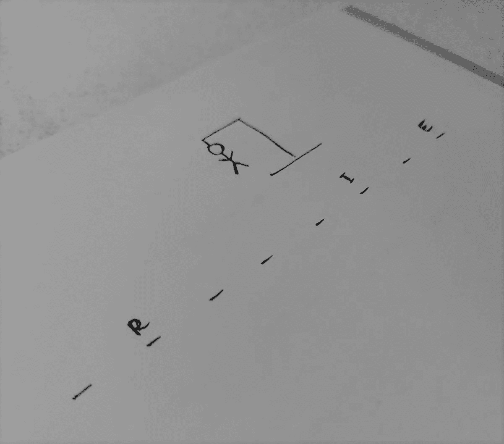
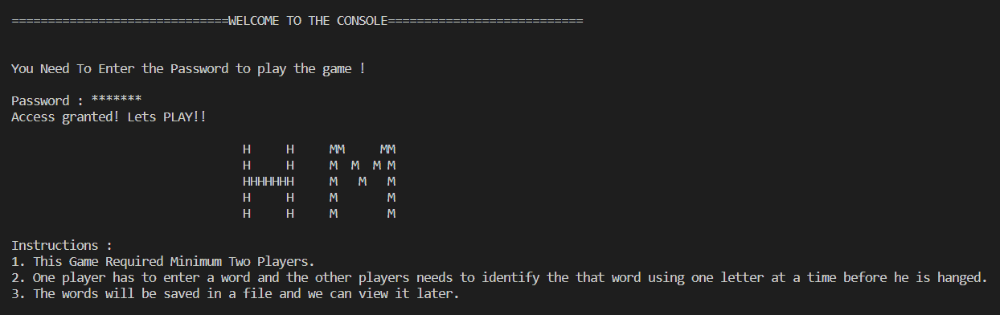
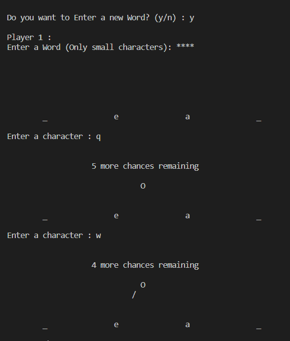
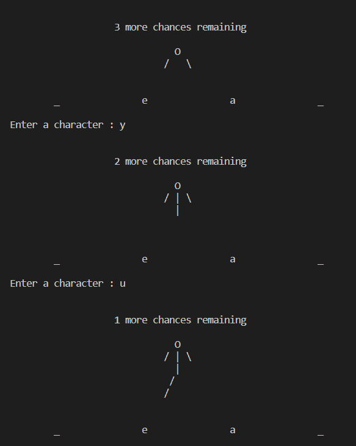
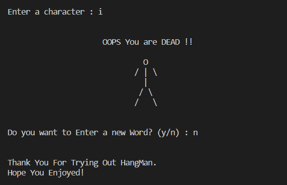

# 通过构建刽子手游戏学习 C++

> 原文：<https://betterprogramming.pub/learn-c-by-building-the-hangman-game-fee218e77f31>

## 如果你是一个初学者，想要动手实践，制作一个游戏可能是一种有趣的学习方式！

C++中的刽子手游戏

# 刽子手规则

在继续之前，让我们重温一下刽子手游戏的规则:

*   Hangman 是一款快速简单的双人游戏。
*   在第一轮中，第一个玩家(“主人”玩家)想到一个秘密单词。
*   然后,“主持人”玩家画一些破折号，其数量相当于密码中的字母数。他们还填写了几个字母作为第二个玩家的主要提示。
*   现在，第二个玩家必须通过一次猜一个字母来找到整个秘密单词。
*   如果秘密单词包含猜测的字母，则“主人”玩家在秘密单词的所有相应空格中填充该字母。如果没有，“主人”玩家画出刽子手身体的一个元素。每猜错一次，第二个玩家就离失败更近一步。
*   如果第二个玩家在“主人”玩家有机会抽到整个刽子手之前猜出了秘密单词，那么第二个玩家就赢了。
*   在下一场比赛中,“东道主”玩家和对手玩家的角色互换。

作者照片

# 我们来编码吧！

这个项目包括一些重要的概念，如对象指针数组、友元函数、继承等。这段代码对初学者来说是友好的，但是，在编码之前要确保你理解了每个概念(特别是如果你是初学者)。

你可以在这个博客(GitHub repo)的底部查看完整代码。

## 步骤 0

首先添加所需的 c++头文件。方法如下:

## 第一步

让我们通过创建一个名为`Game`的新类来开始构建实际的游戏。

*   这个类将作为`Hangman`类的父类。
*   你可以在以后添加另一个游戏作为这个`Game`类的孩子。
*   我们将在`Game`类中添加一个名为`*get_password*`的方法。

## 第二步

在这一步，我们将添加`get_password()`方法以及所有相关组件。

*   `PASSWORD`字符串将存储开始游戏所需的密码。你可以根据你的要求改变它的值。
*   `pass_count`将用于限制不正确密码尝试的次数。
*   `pass`字符串将存储输入的密码，该密码将与“`PASSWORD`”字符串进行比较。

## 第三步

接下来，让我们写一个函数，它将在游戏开始时被调用。

*   这个功能将标志着游戏的开始。
*   它会显示刽子手的规则。

## 第四步

现在，让我们构建`HangMan`类

*   这个类将为`HangMan`游戏的多个实例提供一个蓝图。
*   我们也将使用一个名为`chance`的好友功能来继续游戏。

## 第五步

让我们构建`chance`方法。

*   这个方法将运行`Hangman`游戏背后的逻辑。
*   它将接受一个`HangMan`对象作为函数参数。
*   这个方法将调用另一个方法`draw`，它负责绘制刽子手的当前状态。

## 第六步

要显示刽子手的状态，将使用'`draw`'方法。

*   整数将作为参数传递。
*   基于整数值，将决定“刽子手”的状态。
*   这个方法将返回一个整数，指示刽子手的下一个状态。

## 第七步

最后，我们把`main`函数写出来。

*   我们将创建一个`Game`对象。
*   根据输入的密码，刽子手游戏将开始或结束。
*   我们将创建一个对象指针数组，指向新创建的对象。
*   每一轮都将使用一个新的物体。
*   最后，`delete`关键字将用于销毁所有创建的对象。

# 输出

欢迎信息和游戏规则

游戏开始

第二个玩家猜字母

第二名玩家在多次尝试失败后失败

# 潜在的改进

虽然可以做许多小的调整来使这个游戏更好，但以下是更大的潜在改进，可能会使游戏更加令人印象深刻:

## 添加积分系统

*   我们可以为每个球员增加一个标记系统。
*   玩家的分数可以基于他们尝试猜测秘密单词的次数。
*   累积的分数可以稍后显示，以宣布获胜者。

## 添加附加游戏

*   我们可以添加新的类作为`Game`类的子类。
*   这些新类可以包含其他游戏。

## 添加用户界面

*   另一个可以做的改进是为玩家增加一个干净的 UI。
*   这个游戏不仅吸引人，而且对用户友好。

以下是完整代码供参考:

 [## GitHub-sohambure/hangman

### 此时您不能执行该操作。您已使用另一个标签页或窗口登录。您已在另一个选项卡中注销，或者…

github.com](https://github.com/SohamBhure/hangman) 

快乐编码:)。