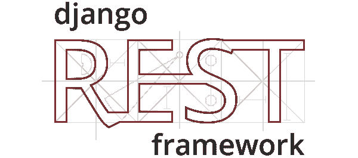
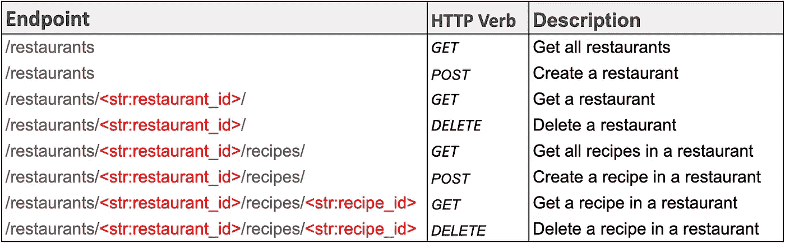
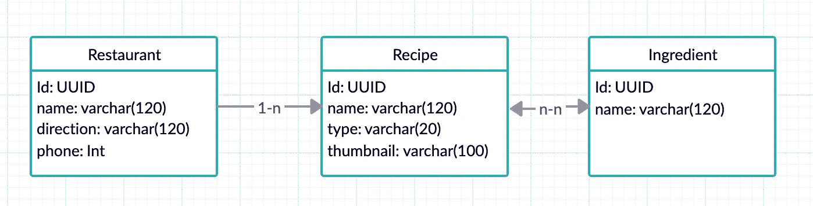

# 几分钟内学会 Django REST 框架

> 原文：<https://betterprogramming.pub/learn-django-rest-framework-in-minutes-ef5159dc60ab>

## 让我们构建我们的第一个 API

如今，编写 REST APIs 对于开发人员来说已经很平常了。当面临技术堆栈的选择时，我倾向于将 [Django](https://www.djangoproject.com/) 作为我的首选之一。

“为什么？”你应该问问。原因相当简单:

*   它是用 Python 开发的(我喜欢 Python)。
*   这是一个久经考验的框架，可以让您快速部署到生产环境中并测试您的 API。
*   Django Rest 框架(从现在开始是 DRF)非常灵活并且易于理解。

所以，说了这么多，让我们写一个 REST API 来管理餐馆里的食物。在项目结束时，您应该有一个可以使用的 API，它具有以下端点:

# 项目设置

1.  安装 Python(我用的是 Python 3.6)。
2.  初始化一个虚拟环境`python3 -m venv env`并激活它:`source env/bin/activate`。
3.  安装 Django、DRF 和 [psycopg2](https://pypi.org/project/psycopg2/) (我们数据库的 SQL 适配器):`pip install django djangorestframework psycopg2`。
4.  创建 Django 项目:`django-admin startproject restaurants`。
5.  创建一个 [Postgres](https://www.postgresql.org/) 数据库，并替换项目的`settings.py`文件中的配置。
6.  应用迁移:`python3 manage.py migrate`。
7.  创建超级用户:`python3 manage.py createsuperuser`。
8.  启动本地服务器:`python3 manage.py runserver`。

太好了！现在，如果你在浏览器中进入`[http://127.0.0.1:8000/](http://127.0.0.1:8000/)`，你应该会看到一个功能性的 starter Django 站点。

# **Django Rest 框架设置**

要将 DRF 添加到项目中，请转到`settings.py`并将 *rest_framework* 添加到您已安装的应用中。让我们也为 API 创建一个应用程序:`python3 manage.py startapp api`并将其添加到您已安装的应用程序中。

现在将 API 项目 URL 添加到餐馆项目中的主`url.py`文件中:

# 创建模型

我们将非常简单地模拟我们的餐馆。每个餐馆都有许多食谱，每个食谱都有许多配料。配料可以属于一个以上的食谱。

由于`Recipe`模型中的属性缩略图是图像，我们需要安装带有`pip install pillow`的[枕头](https://pypi.org/project/Pillow/2.1.0/)。

这是`models.py`中的代码:

为了创建我们的数据库模式，我们需要进行适当的迁移:

`python3 manage.py makemigrations`和`python3 manage.py migrate` …现在你的模型应该是你数据库中的表格了。

# 创建序列化程序

在 Django REST 框架中，序列化器将 JSON 或 XML 中的 querysets 或 model 实例等复杂数据转换为 Python 数据类型，反之亦然。

序列化程序还提供了额外的功能，允许您在操作资源时封装 CRUD 操作的逻辑。

我们将在 API 项目中的一个单独的`serializers.py`文件中为我们的模型定义序列化程序，如下所示:

如你所见，我们为每个模型定义了一个`serializer`类。序列化程序的行为有点像表单，它验证数据，控制响应的输出，并提供创建和更新模型的功能。

现在，我们的请求将由我们的视图来处理，视图将使用这些序列化器来验证数据并在 JSON 之间转换数据。

# 创建视图

Django 提供了不同的方法来创建视图:基于类的视图和基于函数的视图。

在 Django REST 框架中，您可以通过用`@api_view`修饰基于函数的视图来创建 API 视图，或者如果您更喜欢基于类的视图，可以子类化`APIView`。

在本教程中，我将使用基于类的视图，但切换到基于函数的视图是一件小事。Django REST 框架还通过 mixin 类实现了一些常见的操作，比如基于类的视图的 CRUD 操作。

Django REST 框架甚至提供了一组已经混合的基于类的视图，称为*通用的基于类的视图*，如`ListCreateAPIView`或`RetrieveUpdateDestroyAPIView`。

我们将在`views.py`文件中定义我们的`APIViews`:

注意我们的视图如何使用我们之前定义的序列化器来验证和序列化数据。

现在，难题的最后一部分是定义 URL 并将它们指向我们的视图。

# 定义 URL

当 Django 服务器收到请求时，它将请求 URL 与`urls.py`中描述的 URL 进行匹配，找到的第一个匹配由路径中定义的相应视图处理。

让我们在`urls.py`文件中编写餐馆 API 的 URL:

现在，这应该是我们 API 的最后一部分。

# 结论

现在，如果我们启动服务器并前往`[http://127.0.0.1:8000/restaurants/](http://127.0.0.1:8000/restaurants/)`,我们应该会看到 Django REST 框架测试站点，在那里您可以使用刚刚创建的 API。

这个 API 测试站点是 Django REST 框架的一个非常酷的东西，你可以很容易地从你的浏览器测试你的 API。

DRF 还提供了很多其他的好东西，比如不同的授权和认证模型来保护你的 API。

这个项目的工作代码可以在 GitHub(下面的链接)上找到，随时让它成为你的。

 [## agustin Castro/DjangoRestAPI-餐厅

### 用 Django Rest API 制作的 API，用于管理餐馆中的食谱-agustin Castro/DjangoRestAPI-餐馆

github.com](https://github.com/agustincastro/DjangoRestAPI-Restaurant)