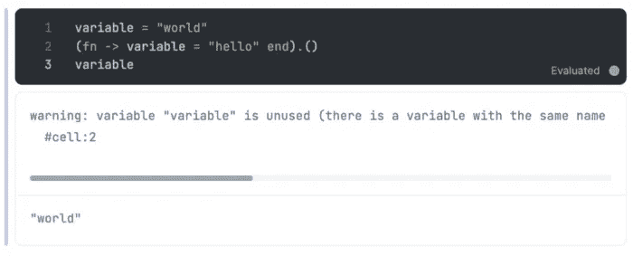

# 长生不老药入门——了解它的种类

> 原文：<https://betterprogramming.pub/learn-elixir-in-2023-a691d37f521>

## 第 1 部分—基础知识

摘自[https://elixir-lang.org/](https://elixir-lang.org/)

它是一种动态的函数式语言，旨在构建可扩展和可维护的应用程序。

它运行在 Erlang 虚拟机之上，该虚拟机以运行低延迟、分布式和容错系统而闻名。

在 Erlang 虚拟机中，所有代码都在小型并发进程中运行。每个进程都包含自己的状态。这些进程通过消息相互交流。

它是一种通用语言，用于 web 开发、嵌入式软件、数据管理和多媒体处理，以及广泛的行业。

二郎生态系统是巨大的，运行药剂，LFE，羊驼，Prolog，卢埃尔(Lua)。一些公司在生产中使用长生不老药，如 Heroku、Discord 和 change.org 等。苹果和 Adobe 也在他们的一些 API 中使用 Elixir。

# 安装药剂

对于 macOS，使用自制软件非常简单:

对于 Ubuntu 或者 Debian 来说，也很简单:

一旦安装了 elixir，我们只需编写 iex 就可以使用它的命令行或 Elixir 交互式控制台。

它完全可以作为计算器使用。然而，其他工具可以让我们更容易地学习这种编程语言。

# Livebook(长生不老药的 Jupyter)

它对于构建代码解决方案的原型非常有用，就像 Jupyter 和 Python 一样。在 Mac 上安装 Livebook 有很多方法。这些文件已经打包在一个 dmg 中，所以只需下载它们并将其移动到您的应用程序文件夹中。

使用 Elixir 安装它也非常容易。Elixir 附带了一个包管理器，像 npm 或 pip，叫做 mix(对于 Erlang，有 hex)。

Livebook 的一个伟大之处在于，我们可以在除代码单元格之外的单元格中添加到数据库和图形的连接。它们被称为智能细胞。

我拍摄的 Livebook 中的智能细胞

# 基本数据类型

让我们来看一些关于灵药基本类型的例子:

加法、减法和乘法与其他编程语言完全相同；然而，除法总是返回一个浮点数。为了避免这种情况，我们使用了一个名为 div/2 的内核模块函数(它是自导入的)。

和 Ruby 一样，在函数中，括号是可选的，例如:

函数存储在模块中。为了识别和记录它们，解剖如下:

正如我已经提到的，唯一可以自我导入的模块是内核模块。

在 Livebook 中，一些助手允许我们以非常直观和友好的方式查看文档。我们放置模块的名称，然后用鼠标悬停。这不仅给我们带来了文档，还带来了很好的例子。

我服用的长生不老药的记录

# 原子或符号

这些变量的值与变量名相同。下面是一些示例代码:

一些操作可以用原子来完成，例如，比较。

在 Elixir 和 Erlang 中，原子通常表示一个操作的状态，最常见的是用`:ok`和`:error`。

布尔值是原子，但为了方便起见，它们没有以冒号开头。

Elixir 有一个以大写字母开头的构造，叫做别名。这些也是原子，通常用来命名模块。

# 用线串

原子可以被插入字符串。值得一提的是，字符串总是使用双引号，就像在许多编程语言中一样。

为了处理字符串，我们使用名为 String 的模块。例如，它们可以帮助我们了解字符串的长度和一些有趣的功能，如大写字母。

# 匿名函数、列表和元组

匿名函数由关键字`fn`和`end`分隔。这些匿名函数，就像在 JavaScript 中一样，我们可以保存在一个变量中。让我们看一个例子:

执行该函数的方法是通过一个点和括号中的参数。

正如我们对布尔函数所做的那样，我们可以通过另一个叫做`is_function`的函数来查看我们的变量 add 是否是一个函数。

我们还可以看到函数接收了多少个参数。为了验证参数的数量，我们向它传递以下内容:

## 关闭

他们可以访问原始函数范围内的变量。例如:

## 功能范围

一个函数不能重定义一个不在同一个函数作用域内的变量，我们来做一个不接受任何参数的匿名函数，我们在同一行执行。

这将返回“hello”的值(以及一个警告，因为我们没有使用该变量)。我们可以添加一个下划线来消除这个警告。

如果在函数范围之外，我们用另一个值初始化变量，在函数范围之外我们不会修改变量的值。

我拍的不变变量截图

## 列表

Elixir 使用括号来指定列表。这里有一个例子:

内核中有一些函数可以让我们了解列表的情况。代码可能如下所示:

为了连接两个列表，我们使用了`++`操作符，因此我们有如下结果:

我们也可以从一个列表中减去另一个列表。可能是这样的:

但是，这只会删除列表中显示的前几项。例如:

返回给我们:

Elixir 中列表上的操作符总是返回一个新列表。也就是说，它们不修改现有的列表，Elixir 中的数据结构是不可变的。

我们可以通过一个叫做 head 和 tail 的函数来访问第一个元素。

然后，我们将看到如何做同样的事情，但模式匹配。这是一个我喜欢的解决方案，它让我可以更有效地使用 Elixir。是天才，和 JS 重组很像。

## 元组

元组是类似列表的结构。然而，它们在内存中是连续存储的，所以比列表快得多。`put_elem/3`函数返回一个新的元组，在给定的位置有一个新元素。

## 更多运算符和布尔值

使用`and`和`or`的操作是严格的。也就是说，它们只计算布尔值。然而，`&&`和`||`评估完整的表达式。让我们看下面的例子:

## && y ||

用于真值和假值

## 不

## 比较

在 Elixir 中，我们可以使用`<`和`>`操作符来比较不同类型的数据。这样做的原因纯粹是实用主义的，所以 Elixir 的内部算法在排序时并不关心不同类型的数据。顺序如下:

在下一期文章中，我们将讨论模式匹配，这是 Elixir 的一个很酷的工具。

干杯。

# 重要参考

 [## 基本运算符

### 从上一章开始，我们看到 Elixir 提供了+、-、*、/作为算术运算符，加上函数…

elixir-lang.org](https://elixir-lang.org/getting-started/basic-operators.html)