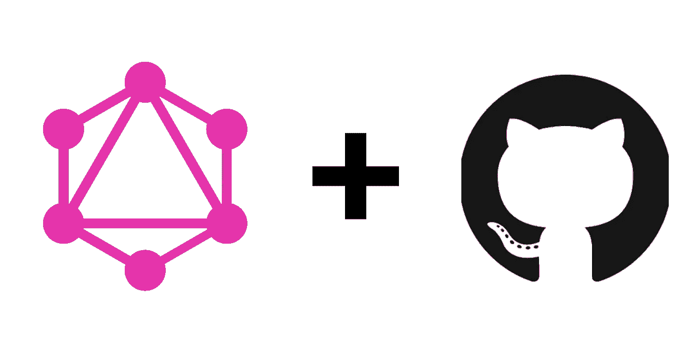
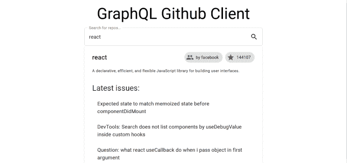
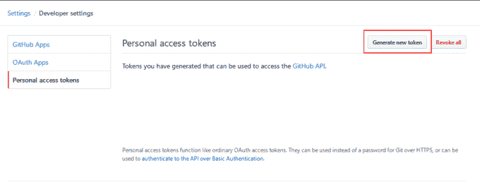
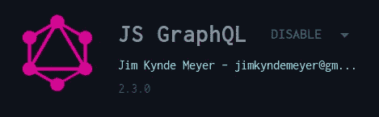
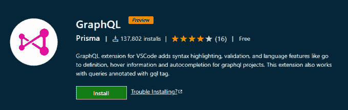
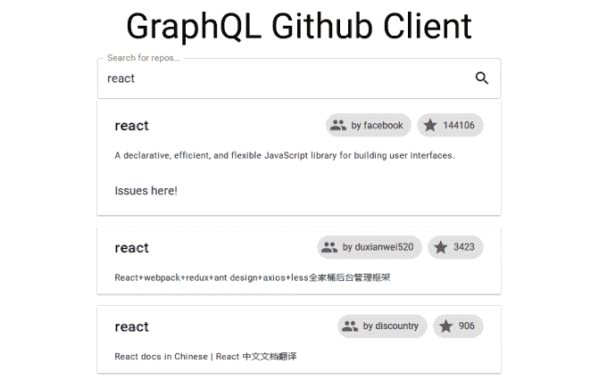
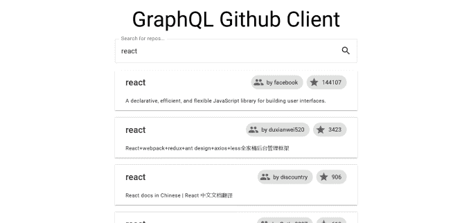
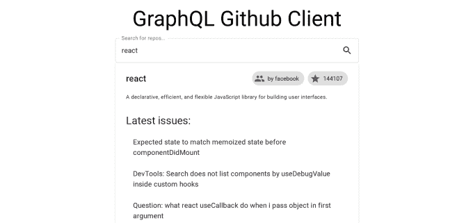
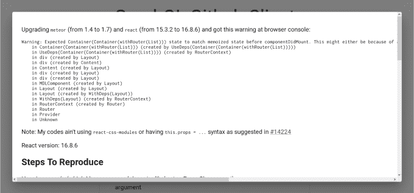

# 通过构建 Github 客户端来学习 GraphQL

> 原文：<https://betterprogramming.pub/learn-graphql-by-building-a-github-client-15c312932e65>

## 掌握 React 中 GraphQL 的基础知识



图片来自 [Pixabay](https://pixabay.com/?utm_source=link-attribution&amp;utm_medium=referral&amp;utm_campaign=image&amp;utm_content=3357642) 的[皮特·林弗斯](https://pixabay.com/users/TheDigitalArtist-202249/?utm_source=link-attribution&amp;utm_medium=referral&amp;utm_campaign=image&amp;utm_content=3357642)

GraphQL 是一种由脸书开发的查询语言，作为 REST 的替代品已经变得非常流行。在本教程中，我们将构建一个使用 GraphQL 从 Github 提取数据的 React 应用程序。

如果你根本没有听说过 GraphQL，我建议你从这篇文章开始。它解释了 GraphQL、REST 和 SQL 之间的区别，并介绍了术语:

[](https://medium.com/javascript-in-plain-english/what-exactly-is-graphql-7a4fc930eae7) [## GraphQL 到底是什么？

### GraphQL 的目的是为数据获取和操作提供一种查询语言。它不完全是 SQL，也不是…

medium.com](https://medium.com/javascript-in-plain-english/what-exactly-is-graphql-7a4fc930eae7) 

# 我们正在建造的东西

我们将构建一个简单的 React 应用程序，通过名称查找存储库并显示相关信息。这是我们完成教程后的样子:



# 第一步。生成访问令牌

在深入研究代码之前，我们需要创建一个访问令牌。访问令牌用于授权 API 调用，并且是与 Github 进行任何通信所必需的。要获取它，打开[https://github.com/settings/tokens](https://github.com/settings/tokens)并点击“生成新令牌”:



出于我们的目的，我们需要`public_repo`范围——其他的是可选的。创建令牌后，请将其复制到安全的地方，稍后您会需要它。

# 第二步。创建新的 React 应用程序

我们使用 React 来构建我们的应用程序。要创建它，请在命令行中运行以下命令:

```
npm init react-app react-graphql-client
```

在实用程序创建完应用程序后，我们需要安装一些依赖项。我们使用`[material-ui](https://material-ui.com/)`作为组件库，使用`[apollo-boost](https://www.npmjs.com/package/apollo-boost)`、`[apollo/react-hooks](https://www.npmjs.com/package/@apollo/react-hooks)`和`[graphql](https://www.npmjs.com/package/graphql)`进行 GraphQL 通信:

```
npm i --save @material-ui/core @material-ui/icons apollo-boost @apollo/react-hooks graphql
```

# 第三步。保护访问令牌

我们将在整个应用程序中引用 Github API 令牌，但是将它直接放在源代码中是不好的做法。另外，你应该*永远不要*在你的 VCS 中有 API 键。为了解决这个问题，使用了一个`.env`文件。在项目根目录下创建一个`.env`文件，并将这一行放入其中:

```
REACT_APP_GITHUB_KEY = your_key_goes_here
```

这一行将使`REACT_APP_GITHUB_KEY`作为一个环境变量被注入到你的应用程序中。它将作为`process.env.REACT_APP_GITHUB_KEY`提供。确保不要提交此文件！

# 第四步。下载模式

GraphQL 的一个很大的优点是语法突出和严格的类型。要为您的 IDE 启用语法高亮，创建一个名为`.graphqlconfig`的文件，并将以下内容放入其中:

要使用这个文件，您需要安装一个扩展。如果你用的是 WebStorm，那就叫 [*JS GraphQL*](https://plugins.jetbrains.com/plugin/8097-js-graphql) :



对于 VS 代码，只需 [*GraphQL*](https://marketplace.visualstudio.com/items?itemName=kumar-harsh.graphql-for-vscode) :



安装后，它会提示您下载在`.graphqlconfig`文件中定义的模式。有了这个模式，语法自动补全应该可以工作了。一个重要的注意事项:您需要您的 API 令牌来访问模式。这不是一个完美的解决方案，这也意味着你不应该把`.graphqlconfig` 也交给 VCS。

# 第四步。定义查询

在我们开始编写 React 代码之前，让我们停下来想一想我们需要什么样的 GraphQL 查询。查询是用 GraphQL 语言编写的表达式，用于从服务器(在我们的例子中是从 Github)检索数据。您可以在 [Github API 参考](https://developer.github.com/v4/)中找到支持的查询列表。

我们可能希望通过名称搜索存储库，并获得它们的描述和链接。`search`查询将适合这种情况。能够查看回购的未结问题也很好——这是通过`repository`查询完成的。

在`src`文件夹中创建一个文件`queries.js`，并将以下代码放入其中:

我们从从`graphql-tag`导入`gql`标签开始。它帮助格式化和解析 GraphQL 查询。在第 3-23 行，我们定义了第一个查询`SEARCH_FOR_REPOS`。它接受`search_term`作为参数(第 5 行),并将返回前 20 个匹配的存储库。响应将包括匹配存储库的总数(第 6 行)、每个回购的名称(第 10 行)、每个所有者的用户名(第 11-13 行)、星级数(第 14-16 行)和描述(第 18 行)。

我们的第二个查询`GET_REPO_ISSUES`，将根据名称和所有者查找存储库的前 20 个问题。它还将按日期、新旧对这些问题进行排序。响应包括问题的标题、正文和时间戳(第 30-32 行)。

## 旁注:在线测试你的查询

虽然我们的应用程序还没有准备好，但你已经可以使用 [Github GraphQL Explorer](https://developer.github.com/v4/explorer/) 来测试你的查询了。例如，通过使用`search_term: "React"`调用我们的第一个查询，您将得到以下响应:

# 第五步。创建搜索栏

现在是时候开始研究 UI 了。我们的应用程序将有一个标题，一个搜索栏来搜索回购，回购列表，以及点击回购扩展的功能，它会向您显示最近 20 个未决问题。让我们从删除 src 文件夹中的所有内容开始，除了`index.js`、`App.js`和`serviceWorker.js`。然后，创建一个`SearchBar.js`并将这段代码放入其中:

如果你不熟悉`material-ui`，可以先阅读[的文档](https://material-ui.com/)。在这个组件中，我们呈现了一个简单的文本输入，带有一个搜索图标和一些基本的样式。请注意，`SearchBar`是一个由*控制的*组件:它从 props 接受它的值，并在您键入时触发`onChange`回调。

**注意:**由于我们删除了`index.css`并且`index.js`导入了它，你需要从`index.js`删除第三行。

# 第六步。创建存储库列表

现在我们有了一个搜索栏，让我们写一个存储库列表。创建一个`RepositoryList.js`文件，并将以下代码放入其中:

我们还没有任何实际的数据，所以我们只是让用户知道目前没有存储库。在我们继续下一步之前，有必要把所有的东西放在一起，以确保我们在正确的轨道上。打开`App.js`，编辑如下:

在其中，我们只是渲染一个标题和我们的两个组件。要打开应用程序，从项目根目录下的终端运行`npm start`。编译完成后，您应该会看到:


恭喜，我们成功了一半！

# 第七步。建立阿波罗

在我们发出任何 API 请求之前，我们需要用一个`ApolloProvider`包装我们的应用程序。Apollo 是 GraphQL 的客户端库，它为 React 提供绑定。一个提供商将为我们应用程序中的每个组件提供 Apollo 客户端，使其更易于使用。如果您熟悉 Redux Provider，它的工作方式与 Redux Provider 类似。要添加提供者，我们需要首先创建一个客户机。用下面的代码创建一个新文件`client.js`:

这段代码将创建一个连接到 Github API 的 Apollo 客户端。注意我们如何使用环境变量在第六行提取 API 令牌。因此，将该文件提交给 VCS 是 100%安全的。

现在，我们将与`App.js`的提供商一起使用这个客户端:

此时您不会注意到任何视觉差异，所以不要惊慌，继续下一步。

# 第八步。查询存储库

最后，是时候做一些实际的查询了！为此，需要一个新的依赖项:`use-debounce`。这解决了去抖动的问题，确保你不会在每次击键时都调用 API，这将是低效的，但是将它限制在某个时间范围内。要安装它，请在项目根目录下运行以下命令:

```
npm i --save use-debounce
```

现在，我们需要从`SearchBox`中获取搜索词，并将其传递给`RepositoryList`。这在`App.js`中完成:

现在，使用这个术语，`RepositoryList`可以执行查询。这样更新`RepositoryList.js`:

首先，注意第 21 行中`useDebounce`的使用。它接受两个参数:我们想要去抖的值和时间间隔。它返回一个最多每秒更新一次的值(可以随意调整时间间隔)。

在第 22–24 行，我们使用`useQuery`钩子从 Github API 获取数据。它接受我们在第四步中定义的`SEARCH_FOR_REPOS`查询和一个带选项的对象。在我们的例子中，我们需要向查询传递参数，即`search_term`。`useQuery`当这些发生变化时会重新运行查询，所以您不必担心。

`useQuery` [返回一个有很多字段的对象](https://www.apollographql.com/docs/react/api/react-hooks/#usequery)，但是我们感兴趣的是`data`、`loading`和`error`。这些都是不言自明的，你可以在 26-45 行看到我们是如何使用它们的。你可以通过将`data`登录到控制台，使用 [Github API Explorer](https://developer.github.com/v4/explorer/) ，或者安装 [Apollo DevTools 扩展](https://github.com/apollographql/apollo-client-devtools)来探索数据结构。

# 第九步。渲染存储库信息

现在我们有了数据，并能够渲染它。对于每个存储库，我们想要显示它的名称、所有者和描述。为此，我们需要一个新组件`Repository`。在`Repository.js`中创建:

该组件接受道具`repo`、`expanded`和`onToggled`。`repo`是包含存储库数据的对象，`expanded`是 true，如果该组件被展开(以查看问题)，而`onToggled`是一个回调，将在展开或收缩该组件时被触发。

在第 32 行，你可以看到回购是如何被分解成`name`、`descriptionHTML`、`login`和`totalStarCount`的。这些稍后用于呈现信息。由于`descriptionHTML`是一个 HTML 字符串，我们在第 51 行使用`dangerouslySetInnerHTML`来呈现它。

注意:未经消毒/检查，切勿在生产中使用`dangerouslySetInnerHTML` 。如果它来自不可信的来源，第三方可以完全控制您的网站。我们用它只是为了教育目的。

为了显示`Repository`组件，我们需要对`RepositoryList.js`中的`RepositoryList`进行一些调整:

现在我们使用第 22 行的`expandedRepo`和`setExpandedRepo`来跟踪哪个回购被打开。第 28-20 行的效果是每次`data`改变时重置它，以确保当我们进行新的搜索时回购收缩。

在第 67–74 行，我们遍历了`data.search.edges`，它包含了一个存储库数组。对于每一个存储库，一个`Repository`组件会呈现所有需要的信息。现在，您的应用程序应该如下所示:



差不多完成了—只剩下几个问题！

# 第十步。渲染问题

这将非常类似于我们如何渲染存储库，所以我在这里会讲得更快一点。为了得到问题，我们需要进行另一个 API 调用，即第四步中的`GET_REPO_ISSUES`。然后，在列表中显示它们，并在单击时显示描述。用以下代码创建文件`IssueList.js`和`Issue.js`:

您看到了对`useQuery`的熟悉调用，只是添加了新的查询和变量。注意，这里我们不需要去抖，因为我们不处理用户输入。一旦`data`被获取，我们检查没有错误并且`data`不为空。如果一切正常，迭代`data.repository.issues.nodes`并为每期渲染一个`Issue`组件。

在`Issue`组件中，呈现了一个`ListItem`和一个`Dialog`。`ListItem`有问题的标题，点击打开对话框。这个对话框有发布主体的 HTML 代码，和你在 Github 上看到的一样。

现在你只需要在`Repository.js`中渲染`IssueList`:

注意第 56 行的`IssueList`的条件渲染。这样做是为了优化，以便 API 请求仅在用户打开 repo 时发出。

这是你的应用程序的最终外观:



主视图



存储库已扩展



问题视图

# 结束注释

谢谢你一直坚持到最后，我希望你喜欢我的 GraphQL 教程。代码可在 [my Github](https://github.com/r3dm1ke/graphql-react-tutorial) 上获得。如果你想知道如何改进这个应用程序，这里有一些建议:

*   能够打开各自的 Github 页面
*   查看对问题的评论
*   对问题发表评论
*   查看 readme.md
*   还有更多！

# 资源

*   [Github 回购](https://github.com/r3dm1ke/graphql-react-tutorial)
*   [GraphQL 主页&文档](https://graphql.org/)
*   [阿波罗主页&文档](https://www.apollographql.com/)