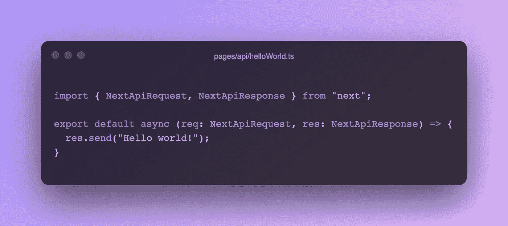
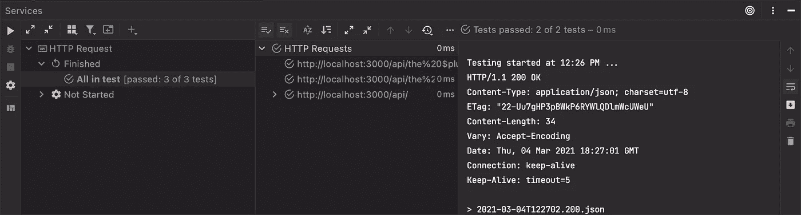
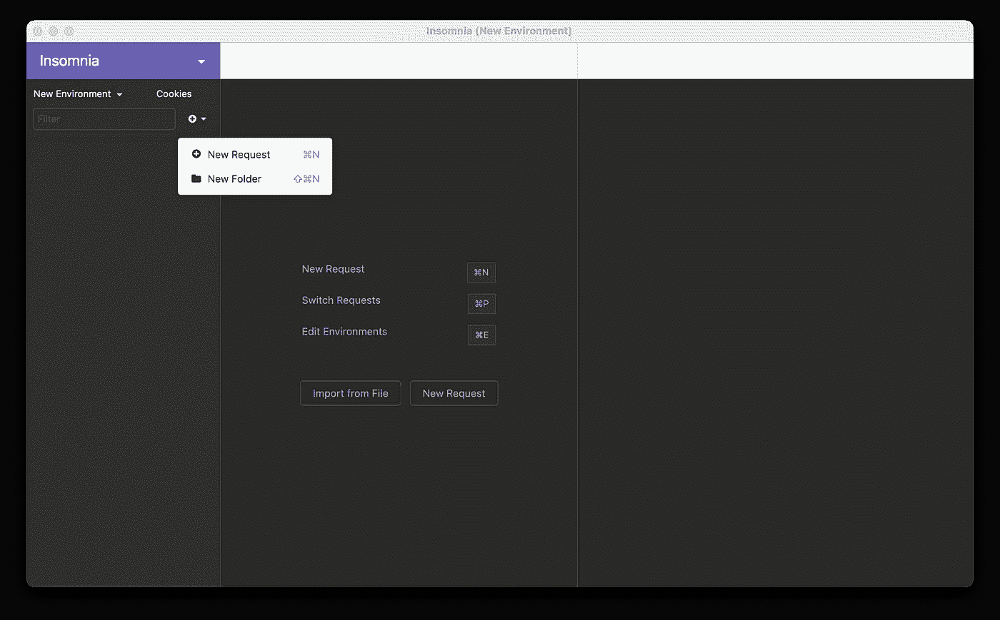
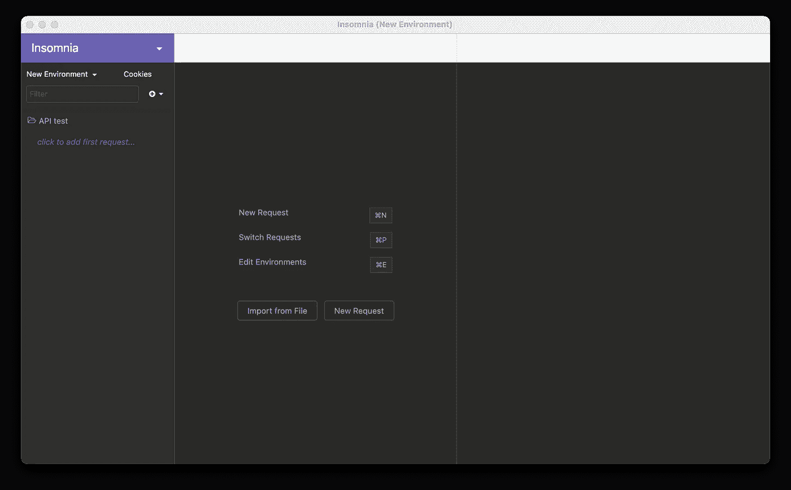
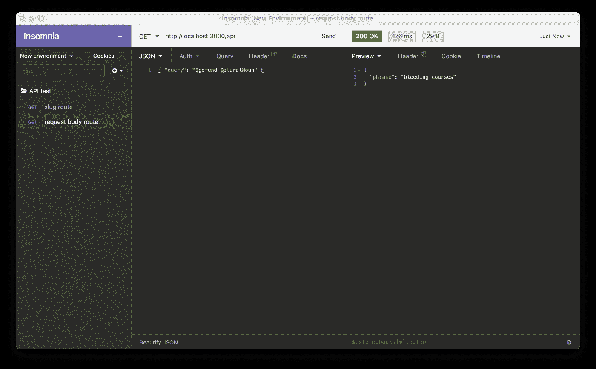

# 了解如何使用 Next.js 构建 API

> 原文：<https://betterprogramming.pub/learn-how-to-build-apis-with-next-js-109d381f8b30>

## 使用 Next.js 中的 API routes 特性来构建可扩展的无服务器 lambda 函数



作者图片

Next.js 是 React 的一个框架，它使得开发者开发 SEO 友好的网站变得简单而有效。因为它装载了很棒的特性和[惊人的文档](https://nextjs.org/docs/getting-started)(以及[入门课程](https://nextjs.org/learn))，Next.js 对于任何经验水平的开发者都是一个很好的选择。

对于大多数听说过 Next.js 的开发人员来说，当提到它时，脑海中浮现的是“前端 web 开发”然而，许多人可能不知道它的 API routes 特性，该特性使您能够在同一个代码库中编写前端和后端代码。当与像 Vercel(专门为 Next.js 开发的)或 Netlify 这样的无服务器平台结合时，Next.js 的 API routes 特性使开发人员能够轻松地为他们的项目 API 编写 lambda 函数。

在本教程中，我们将利用这一创新特性来创建一个真实世界 API 的基本示例。我们将介绍生产性 API 设计和开发的基本步骤，包括诸如[逻辑抽象](https://en.wikipedia.org/wiki/Abstraction_(computer_science))、[自顶向下设计](https://en.wikipedia.org/wiki/Top-down_and_bottom-up_design)和[框架代码](https://en.wikipedia.org/wiki/Skeleton_(computer_programming))等主题。一旦我们完成了 API，如果您有兴趣继续深入，请阅读额外的“集成测试”部分和/或可选的“创建登录页面”和“部署到 Vercel”部分。

# 成品代码

和往常一样，这个项目的代码可以在 GitHub 上找到:[https://github.com/chroline/words-aas](https://github.com/chroline/words-aas)。如果你有兴趣看最终产品，请参观 https://words-aas.vercel.app/。您可以在此 URL 上测试 API 路由。

# 目标

对于这个项目，我们将创建一个基本的 API，让它的最终用户基于给定的查询随机生成短语；你可以把它想象成一台电脑在填补一个 MadLibs 游戏的空白。让我们看一些查询和可能的响应的例子:

*   `the $animal jumped over the $noun`可能会用`the cow jumped over the moon`或`the cat jumped over the river`来回应。
*   `I like $gerund $pluralNoun`可能会用`I like dancing cars`或`I like bubbling buildings`来回应。
*   `my $bodyPart is $adjective`可能会用`my tonsil is arrogant`或`my forearm is dumb`来回应。

从这些例子中可以看出，前面有`$`字符的单词类型通知 API 用一个单词替换它。它将替换的单词是从 API 将访问的单词列表中随机生成的。

# API 设计

在我们开始为项目编码之前，让我们计划 API 将如何工作，然后我们计划如何组织我们的代码。

## 路线

Next.js API 路由遵循 REST(表述性状态转移)协议，这是大多数 internet APIs 使用的标准化协议。因此，我们在设计 API 的路由时有很大的灵活性。

这个 API 将接受两个路由:一个路由将接受一个 slug，而另一个路由将接受一个带有`query`属性的 JSON 对象。

*   **Slug route:** 在 web 开发中， *slug* 是 URL 的唯一标识符，通常位于 URL 的末尾。例如，在 URL `https://example.com/blog/this-is-the-post`中，slug 可能是`this-is-the-post`。对于这个 API，URL 看起来类似于:`http://localhost:3000/api/[slug]`，其中`[slug]`被替换为所需的查询。因为这个路由的 URL 会根据请求而改变，所以它被称为一个*动态路由*。这个 API 路由将通过向服务器发送一个带有所需查询 URL 的`GET`请求来执行。
*   **请求主体 API 路由:**该 API 路由将接受以下格式的 JSON 对象:`{ "query": QUERY }`，其中`QUERY`是所需的格式。此 API 路由不会简单地通过更改 URL 来执行；它必须通过对服务器的`POST`请求来执行，请求的主体是具有所述格式的对象。

所有这些路由都将被写成 lambda 函数，函数接受一个`req`请求参数(用于与用户请求交互)和一个`res`响应参数(用于与发送回用户的响应数据交互)。

## 什么是 lambda 函数？

在计算机科学理论术语中， *lambda 函数*是任何不绑定到标识符的函数，也称为*匿名函数*。lambda 函数背后的理论来自 lambda 微积分领域。本质上，它们允许函数作为参数传递给其他函数。

在无服务器计算方面，短语 *lambda function* 因 AWS Lambda 服务而流行，该服务允许您编写充当 API 端点的函数(类似于我们将对 Next.js API routes 所做的)。就像计算机科学理论中的定义一样，这些无服务器 lambda 函数不绑定到任何服务器，而是在到达 API 端点时提供给无服务器服务调用(因此与计算机科学理论 lambda 函数的“函数作为参数传递”质量相匹配)。

## 代码基础结构

Next.js 项目的最基本结构如下:

```
- pages
  - index.js
- package.json
```

`pages/index.js`文件代表你网站路由器的索引位置。如果你有一个`/about`页面，这将对应于`pages/about.js`文件，等等。

对于这个项目，我们将使用[打字稿](https://www.typescriptlang.org/docs/)，所以我们将使用`.tsx`而不是`.js`。此外，因为我们正在编写 API 路由，所以它们必须位于`pages/api`目录中。

```
- pages
  - api
    - index.tsx
    - [slug].tsx
- package.json
```

`api`目录中的两个文件将是之前描述的两个 API 路由:`index.tsx`将用于请求体路由，`[slug].tsx`将用于 slug 路由。`[slug].tsx`必须用括号`[]`括起来，告诉 Next.js 这是动态路由。

# 建立代码库

## 引导 Next.js 项目

首先，我们可以创建一个基本的 Next.js 项目。为此，请运行:

```
npx create-next-app
# or
yarn create next-app
```

这将运行`create-next-app` CLI，并提示您输入项目名称。为了这个教程，我称它为`words-aas`。

## 安装依赖项

因为这个项目将使用 TypeScript，我们将需要安装`typescript`依赖项，以及`react`、`react-dom`和`node`的类型依赖项。这些依赖项仅用于开发，所以我们将用`-D`标志将它们添加到`devDependencies`中。

```
yarn add -D typescript @types/react @types/react-dom @types/node
```

## 创建 util/api.ts 文件

这个文件将包含 API 的所有逻辑。由于我们将拥有多个共享相同逻辑的 API 路径，因此我们应该坚持 DRY(不要重复)原则，将逻辑抽象到一个单独的文件中，以便以后导入。这样，我们可以将所有复杂的 API 逻辑从实际的 API 路径中分离出来，这将使开发更加高效。

根据您项目的结构，您可以创建/使用一个与`util`目录相对的`lib`目录。

# 创建框架 API 路由

在我们编写 API 逻辑之前，我们可以创建两个框架 API 路由。Next.js 在`pages/api`文件夹中存放 API 路由，因此我们将创建以下两个文件:

*   `pages/api/[slug].ts`—slug API 路线。用括号将`slug`括起来会告诉 Next.js 这是一个动态路由，slug 会被传递给 lambda 函数。
*   `pages/api/index.ts` —请求体 API 路由。这个路由接受一个 JSON 对象，所以没有必要使它成为一个动态路由。

在这两个文件中，我们将创建一个基本的 API 路径:

为了测试这些 API 路径，在您的项目中运行`yarn dev`或者简单地运行`next`。然后，在浏览器中访问`http://localhost:3000/api`和/或`http://localhost:3000/api/[slug]` ( `[slug]`可以是任意字符串)。你应该会得到`Hello, world!`的回应。

## 段塞 API 路线

slug API 路由将获取一个 slug 字符串，并将其转换为一个短语。如前所述，slug 将由逗号`,`连接的单词类型列表组成。

因为 slug API 路由是一个动态路由，slug 会在`req.query`对象中传递给我们。我们需要明确告诉 TypeScript,`req.query`对象包含一个`slug`属性，因此我们可以使用类型注释(`as { slug: string }`)来解决这个问题。

要测试这条路线，在浏览器中访问`http://localhost:3000/api/the $pluralNoun is $gerund`，你输入的 slug 应该就是给你的响应。

## 请求正文 API 路由

与 slug API 路由相比，请求体 API 路由为所需短语提供了更多的可定制性。因此，我们将需要操作所提供的查询字符串，将其转换为单词类型的数组，就像我们对 slug API 路由所做的那样。

因为这个 API 路由接受一个 JSON 对象，我们将使用`req.body`对象，而不是`req.query`对象。我们还将明确告诉 TypeScript】对象包含一个`query`属性。

要测试这条路线，可以打开一个类似失眠或邮差的 REST 客户端，测试向`http://localhost:3000/api`发送一个带有`query`属性的 JSON 对象。

要了解有关测试这些路线的更多信息，请向下滚动到奖金整合测试部分。

# 编写 API 逻辑

有趣的部分来了！既然我们已经在主干 API 路由中将短语分成了单独的单词/单词类型，我们可以打开`util/api.ts`文件来编码 API 逻辑。

为了创建 API 逻辑，我们将遵循*自顶向下的设计*实践，其中我们将总的 API 逻辑(系统)分解成单独的功能(称为子系统)。使用这种实践，我们可以在完成系统时将所有单独的子系统放在一起，这使得我们比从底层开始更有效率。

以下功能将存在于`util/api.ts`文件中。

## getWordFile

`getWordFile`函数接受一个`wordType: string`参数，并返回与给定单词类型匹配的单词列表。

此函数`fetch`为给定的单词类型创建文件。如果你是一个精明的全栈开发者，你可能会注意到我们其实是在服务器端使用`fetch`，你可能会疑惑“fetch 不是只在浏览器端支持吗？ *"* 是的，`fetch` API 只在浏览器中被本机支持，但是 Next.js 为`fetch` API 提供了一个 polyfill，所以我们可以在后端使用它！

word 文件将位于`public/db`文件夹中。要下载它们在你自己的项目中使用，你可以[下载 word 文件夹](https://github.com/chroline/words-aas/releases/tag/word-files)。

## getRandomWord

`getRandomWord`函数接受一个`contents: string`参数，并从给定的内容中返回一个随机单词。

`contents`字符串是来自`getWordFile`函数的返回值，是一个 word 文件的内容。

这个函数用一个空白字符串替换所有回车符。然后，我们可以将`contents`字符串拆分成一个单词列表。从这个单词列表中，我们可以找到一个随机元素并返回它。

## 短语生成器

`phraseGenerator`函数接受一个`words: string[]`参数，并从给定的单词中返回转换后的短语。

`words`参数是我们之前在 slug 和 request 主体路由中获得的单词类型列表。

该函数遍历`words`参数中的所有单词类型，并基于以下条件构建短语:

*   如果单词是空的，或者第一个单词是 *a* (记住，以 *a* 开头的短语是我们后面会处理的边缘情况)，我们会忽略它和`continue`。
*   如果单词以`$`字符开头，那么它就是我们需要处理的单词类型:如果该单词类型不包含在数据库中，则抛出一个错误。否则，从该单词类型中随机选择一个单词，并将其添加到短语中。
*   否则，只需将单词添加到短语中。

现在我们有了一个(几乎)完全生成的短语！因为结尾会有一个额外的空格，所以我们可以把它去掉。

## vowelTester

`vowelTester`函数接受一个`phrase: string`参数并返回一个布尔值。

该函数用于确定所提供的`phrase`中的第一个字母是否是元音字母，然后用于确定第一个单词 *a* 是否应该转换为*a*。

该函数使用一个 RegExp 表达式，该表达式全局(`g`)测试元音字母(`[aeiou]`)是小写还是大写(`i`)。

## 短语解析器

`phraseResolver`函数接受一个`query: string`参数并返回一个`phrase`字符串。

该功能将之前的所有子系统集合在一起。

每出现一个空格字符，就会将`query`分开。从那些`words`中生成一个短语。如果第一个`word`是 *a* ，该函数测试元音以确定该单词是否应该保持为 *a* 或*a*。最后，返回`phrase`。

唷，那是许多编码和许多(希望)简单的逻辑。可以在 GitHub 上查看[完整文件进行回顾。](https://github.com/chroline/words-aas/blob/main/util/api.ts)

# 把它们放在一起

现在我们已经编写了 API 逻辑，我们可以将它连接到我们之前创建的框架 API 路由。

## 段塞 API 路线

下面是 slug API 路径的最终代码:

首先，我们尝试从给定的 slug 中解析一个短语。如果成功，我们将它作为 JSON 对象发送给用户。然而，如果不成功，我们告诉用户我们遇到了一个错误。例如，如果用户请求数据库中不存在的单词类型，这可能会发生。

## 请求正文 API 路由

请求体 API 路由的代码与 slug API 路由几乎相同:

因为我们抽象了 API 逻辑，所以我们可以简单地从两个 API 路径的 lambda 函数中的`util/api.ts`文件导入`phraseResolver`函数。

您可能会注意到，两个 lambda 函数中的逻辑也几乎完全相同。我们能不能也把这个逻辑抽象出来，以便完全遵守干燥原则？是的，我们可以，但是将`req`和`res`对象封装在 lambda 函数本身中通常被认为是最佳实践。这使得 lambda 函数更容易理解，因为程序员可以立即看到从`req`对象中读取了什么，以及用`res`对象将什么发送回最终用户。

# 额外收获:集成测试

在软件开发的世界里，有两种主要类型的代码测试:单元测试和集成测试。

*   **单元测试**包括将你的代码分解成可以测试的最小单元。如果你的代码库使用适当的自顶向下设计，你的代码已经被分解成小的代码单元:每个单独的功能都是可以测试的单元。
*   集成测试包括测试你的项目/服务作为一个整体的行为。单元测试会测试每个单独的子系统，而集成测试会测试整个系统本身。

对于这个项目，集成测试更有意义，因为使用的逻辑数量很少。(对于较大的项目，考虑使用单元测试和集成测试的组合来获得最彻底的结果。)

如果您使用的是 WebStorm 或 IntelliJ 之类的 JetBrains IDE，请遵循方法一。否则，遵循方法二。

## 方法一:使用 JetBrains IDEs

适合 web 开发的 JetBrains IDEs 有一个内置的方法来测试 RESTful API——也就是遵守 REST 协议的 API。

打开您的项目并创建一个名为`test`的新 HTTP 文件。然后输入以下代码:

这段代码对 API 运行两个请求:第一个测试 slug 路由，第二个测试请求体路由。

一旦您通过在您的项目中运行`yarn dev`或`next`启动了您的开发服务器，点击“运行文件中的所有请求”按钮并选择“无环境运行”窗口底部应该会打开一个新面板。



如果一切顺利，您应该会在“All in test”旁边看到一个绿色的复选标记，这意味着您的所有请求都已成功完成。要验证请求的结果，您可以单击输出中的文件名，这将显示来自服务器的响应文本。

## 方法二:使用 REST 客户端

有很多很棒的 REST 客户端可以用来测试你的 RESTful API。最受欢迎的两个是[邮差](https://www.postman.com/product/rest-client/)和[失眠](https://insomnia.rest/)。我将使用 Postman，但大多数步骤应该与 Postman 或其他 REST 客户端类似。

首先，创建一个新文件夹，并将其命名为 API test。



然后添加两个请求:

1.  **蛞蝓路线** : `GET <http://localhost:3000/api/[slug]` >(用短语替换`[slug]`进行测试。)
2.  **请求车身路线** : `POST <http://localhost:3000/api` >。将 body 类型切换到 JSON，并输入一个类似`{ "query": "$gerund $pluralNoun" }`的演示请求对象



您可以发送这两个请求，如果它们成功，您应该会在窗口的右侧面板上看到响应。

# 包扎

恭喜，我们已经使用 Next.js 完成了我们的简单 API 项目！

我们刚刚做的是基础的，但是希望它给你一个很好的概述，在 Next.js 中为 API 路由编写 lambda 函数是什么样的。如果您觉得本教程有帮助，请继续关注关于使用 Next.js 编写 API 的更高级实践的教程

如果你对这个项目感兴趣，请阅读下面的可选和额外部分，给你的项目一个额外的完成感。

# 可选:创建登录页面

为了吸引更多的用户，考虑为您的服务添加一个有吸引力的登录页面。Next.js 不仅非常适合创建无服务器 API 路由，它还是 React 的框架。这意味着您可以在同一个项目中创建您的前端站点和后端逻辑。

Next.js 路由器将 URL 的路径名对应到`pages`目录中的同名文件。例如，`/about`会对应`about.tsx`或`about.js`档，`/`会对应`index.tsx`或`index.js`档。要制作主页，在`pages`目录下创建一个`index.tsx`文件。

在`pages`目录下的每个文件中，应该有一个默认的导出函数。当 Next.js 检索您的文件时，将呈现这个函数。因此，当您的路径为`/`时，将渲染`Home`函数中的 JSX。

利用你的 React 技能为你的 Next.js 服务创建一个登陆页面。

# 可选:部署到 Vercel

[Vercel](https://vercel.com/) 是一个专门为 Next.js 开发的平台，它为用 Next.js 创建的 API 路由提供一流的支持，使用它们的 CLI，您可以轻松地将您的 Next.js 项目部署到 Vercel，并与世界共享。

## 下载 Vercel CLI

要下载 Vercel CLI，请运行:

```
yarn global add vercel
```

您可能必须在 sudo 模式下运行这个命令(只有在绝对必要的情况下)。

## 登录到 Vercel

在部署您的项目之前，您必须首先登录到 Vercel。运行:

```
vercel login
```

这将提示您在浏览器窗口中登录到 Vercel。

## 部署

登录到 Vercel 后，只需运行以下命令即可进行部署:

```
vercel
```

按照步骤部署您的项目。

部署成功后，它应该会为您提供一个指向您托管的项目的链接。现在你可以和你的朋友分享，并向他们展示你的成果！