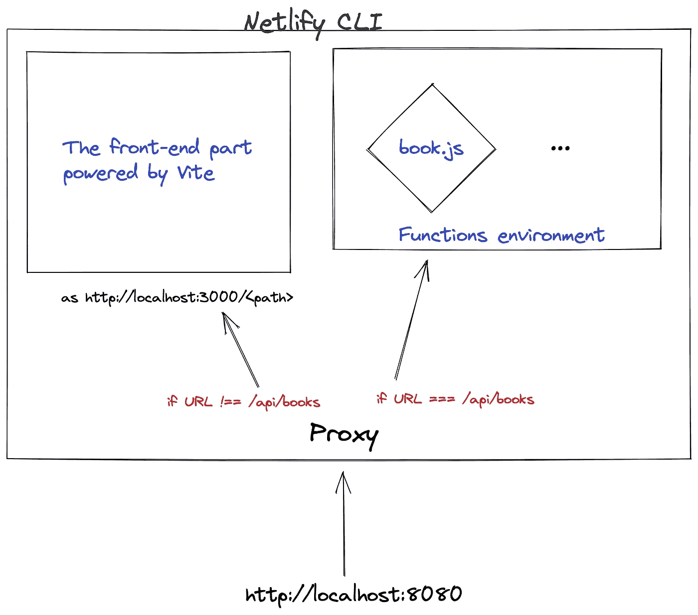
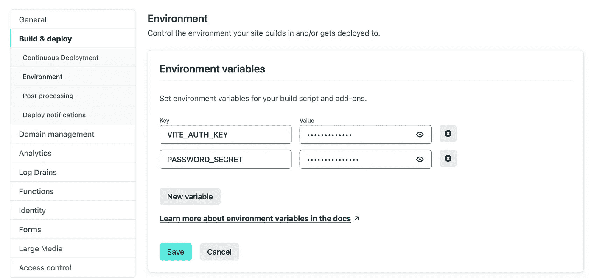
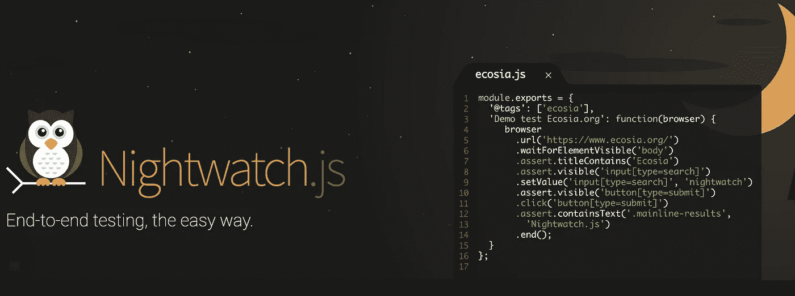

# 了解如何使用 React 18、Vite 和 Netlify 功能构建、测试和部署书店应用程序

> 原文：<https://betterprogramming.pub/learn-how-to-build-test-and-deploy-a-bookstore-app-with-react-18-vite-and-netlify-functions-1e1050c8711>

## 探索这些强大程序的深入指南


[React](https://reactjs.org/) 于 2011 年在脸书(现为 [Meta](https://about.facebook.com/) )出现，并继续快速发展，获得了一个重要的生态系统，在其基础上有各种各样的插件和 UI 框架。

本指南将详细介绍使用最新的 React 18 创建一个工作示例书店单页面应用程序并使用 [Vite](https://vitejs.dev/) 运行它的步骤。它还包括添加定制状态管理解决方案和使用 [wouter](https://github.com/molefrog/wouter) 库进行路由的细节。

这篇文章是我们最近在这个博客上发表的文章的翻版。两者的结果是一样的(一个我们称之为 Middlemarch 的书店单页应用程序)。然而，本教程还包含一个使用无服务器功能的后端解决方案。

以下是我们将在本教程中重点关注的主要任务:

1.  用 Vite 引导应用程序框架
2.  使用 wouter 库管理路线
3.  创建内部状态管理工具
4.  创建并运行[网络功能](https://functions.netlify.com/)
5.  用 Nightwatch 编写 React 组件测试
6.  使用 Nightwatch 编写并运行自动化的端到端测试
7.  用 Github 动作构建和部署应用程序

这是一项大工程，但它准确地描述了整个开发周期。该应用程序将被部署到 Netlify。如果你渴望马上开始编码，你想马上投入进去，你可以让项目启动并运行:

```
git clone https://github.com/pineviewlabs/middlemarch-react
cd middlemarch-react
npm install
npm start
```

或者在[https://github.com/pineviewlabs/middlemarch-react](https://github.com/pineviewlabs/middlemarch-react)分叉项目。


# 步骤 1——用 Vite 引导应用程序框架

我们将使用`[create-vite](https://github.com/vitejs/vite/tree/main/packages/create-vite#readme)` CLI 来引导基本结构和依赖关系。

```
npm create vite middlemarch -- --template react
```

然后按照最后出现的说明进行操作，例如:

```
Scaffolding project in /home/projects/middlemarch...Done. Now run: cd middlemarch
  npm install
  npm run dev
```

文件夹结构可能类似于:

```
/
 ├── src/
 |    ├── App.css
 |    ├── App.jsx
 |    ├── favicon.ico
 |    ├── index.css
 |    ├── logo.svg
 |    └── main.jsx
 ├─── .gitignore
 ├─── index.html
 ├─── package.json
 └─── vite.config.js
```

我们不需要`App.css`和`logo.svg`，所以你可以马上删除它们。我们需要做的最后一件事是用这些脚本替换默认脚本:

```
{
  "scripts": {
    "vite:start": "vite",
    "vite:build": "vite build"
  }
}
```

> 我们添加了`vite:`前缀来区分前端构建部分和无服务器功能。以后再说。

# 准备 App.jsx 文件

至此，我们已经准备好了开发环境。让我们深入研究 React 并更新`App.jsx`文件以匹配以下内容:

> StrictMode 突出了应用程序中的潜在问题，您可能没有注意到这些问题。将整个应用程序包装在其中是一个很好的做法。

现在，运行 npm `vite:start`脚本，让应用程序在`[http://localhost:3000](http://localhost:3000/)`运行。

```
npm run vite:start
```

此时，您将看到一个空页面，在`#root`下有`<main>`元素。下一步是编写包含实际内容的页面，以便在浏览器中看到一些内容。

# 步骤 2-添加路线

是时候创建我们的应用程序的主要路线了。在 React 中，每个页面只是一个单独的组件。对于此应用，我们将考虑以下组件:

*   主页——将在`/`基本 URL 提供的第一个页面
*   购物车—包含产品列表的页面；它只对已登录的用户可用
*   登录—登录表单
*   注册—用户注册表单

为了简单起见，我将只向您展示主页的完整实现。但是你可能总是会去 [GitHub 库](https://github.com/pineviewlabs/middlemarch-react)查看应用程序的最终源代码。

整个应用程序将具有以下标记:


页面标记

让我们创建页眉和页脚组件，它们在每一页上都保持不变:

```
mkdir src/components
mkdir src/components/Header
mkdir src/components/Footer
touch src/components/Header/index.jsx
touch src/components/Footer/index.jsx
```

我使用 Unix 的 [touch](https://en.wikipedia.org/wiki/Touch_(command)) 命令创建文件，使用 [mkdir](https://en.wikipedia.org/wiki/Mkdir) 创建目录。您可以使用自己的编辑器或 IDE 来完成这些任务。

在`Header/index.jsx`文件中，添加以下内容:

> 您可能会注意到这里有一个未知的`[Link](https://github.com/molefrog/wouter#link-hrefpath-)`标签和`wouter`导入。它是 wouter 库提供的导航组件之一，触发从`href`属性到 URL 的导航。我们将很快报道那个图书馆。

而`Footer/index.jsx`:

之后，我们需要将它们包含在应用程序入口点中。代码如下:

页面内容将在`main`元素中呈现。您可能会注意到，我们为 Home 和 Footer 组件文件声明了文件扩展名。区分本地文件和外部依赖项是很有用的，尽管这是完全可选的，并且只取决于您的偏好。

# 沃特是什么？

Wouter 是 React 和 [Preact](https://preactjs.com/) 的最小路由器实现。您已经看到了`Link`组件，它只是引擎盖下的`<a>`元素。

现在是时候引入`Route`组件了，如果 URL 属性匹配当前的`location.pathname`值，它将呈现一个声明的组件。

让我们再次修改`App.jsx`组件并声明路线，如下所示:

我们正在使用 wouter 的另一个组件— [交换机](https://github.com/molefrog/wouter#switch-)，它执行排他路由。这意味着只有第一个匹配的路线会被渲染。

之后，我们必须为每个页面提供默认标记。代码如下:

```
export default () => <div></div>;
```

最后剩下的就是主页了。编辑`src/pages/Home/index.jsx`文件并添加以下代码:

现在，为了简洁起见，我们将省略搜索功能。您可能会注意到新的`useBooks`导入——这是一个定制的钩子，它将管理应用程序的全球图书数据。既然提到了，那就进行到状态管理部分吧。

# 步骤 3——使用上下文+钩子进行状态管理

React 有大量的状态管理库，它们背后有各种各样的想法。它们中的每一个都值得探索，但是在这个小应用程序中，我们不需要添加另一个依赖项，也不需要编写复杂的逻辑来存储我们的数据，数据只是一个包含可用书籍的对象数组。React 已经有了 API，我们可以用它来简洁地实现它。

# 实现“useBooks”挂钩

我们将使用[上下文](https://reactjs.org/docs/context.html)来全局存储数据，并使用钩子将数据传递给需要它的组件。

```
mkdir src/cache
touch src/cache/books.jsx
```

以下是实现这一点的步骤:

1.  创建上下文—不导出，并且是该模块的私有内容。

2.创建提供者组件—默认情况下导出。

这定义了我们将要存储数据的状态，并返回带有值和状态 dispatcher 的上下文`Provider`。最后一点，我们需要分派状态更改，尽管它不会直接暴露给组件。

3.创建钩子。
钩子使用上下文并返回一个新的数组和修改状态的有用方法。

> `useBooks`钩子导出一个元组(两个条目的数组)，其中第一个条目是 books 数组，第二个条目是描述与 books 数组交互的可用方式的方法集合。

目前获取`/api/books` URL 错误。当我们为它提供无服务器功能时，它就会工作。

要使用 books 状态，我们需要使用规则根据[上下文用组件包装应用程序，如下所示:](https://reactjs.org/docs/context.html#examples)

# 步骤 4 —使用 Netlify 创建无服务器功能

无服务器功能是一个相对较新的概念，其思想是将运行和维护服务器端任务委托给云计算服务，只专注于编写代码。一些服务提供商提供这一功能，包括 Netlify、Vercel、Render、Azure 或 Cloudflare。

对于这个例子，我们将使用 Netlify 的功能，但是您可以选择您最喜欢的提供商。

以下是一切工作的模式:



Netlify CLI 工作原理的简单描述。

# 安装 Netlify CLI

首先，我们必须安装 [Netlify CLI](https://www.npmjs.com/package/netlify-cli) 并创建`netlify.toml`配置文件:

```
npm i -D netlify-cli
touch netlify.toml
```

需要 Netlify CLI 来模拟 FaaS(功能即服务)环境并测试我们的功能。CLI 还负责运行应用程序。

我们将调整 Netlify 的配置文件，以便它知道如何运行 Vite 开发服务器，如下所示:

# 添加 lowdb 数据库

现在让我们用数据创建模拟文件。

```
mkdir data
touch data/db.json
```

好了，让我们继续函数。默认情况下，Netlify 会在`netlify/functions`目录中搜索它们。

```
mkdir -p netlify/functions
touch netlify/functions/books.js
```

编辑`netlify/functions/books.js`，增加以下内容:

我们使用 [lowdb](https://github.com/typicode/lowdb) 包来读取 JSON 文件。当然，你可以直接使用`fs.promises.readFile`并从文件中读取。但这是一个例子，在现实世界的应用程序中，你将有一个数据库，你将不得不使用数据库驱动程序，所以这个例子告诉你这是可能的。

# 添加用户验证

无服务器功能允许你实现复杂的行为，如用户认证。如果你检查当前应用程序的源代码，你会看到两个页面:
-[sign in/index . jsx](https://github.com/pineviewlabs/middlemarch-react/blob/main/src/pages/SignIn/index.jsx)-
-[Register/index . js](https://github.com/pineviewlabs/middlemarch-react/blob/main/src/pages/Register/index.jsx)

以及对应的功能:
-[log in . js](https://github.com/pineviewlabs/middlemarch-react/blob/main/netlify/functions/login.js)
-[register . js](https://github.com/pineviewlabs/middlemarch-react/blob/main/netlify/functions/register.js)。

要创建帐户，您必须传递电子邮件和密码。后者将在服务器上被散列，散列将被保存到数据库中。在哈希函数中添加一个所谓的“salt”是一个很好的做法，它应该是私有的。

为此，我们将创建包含`PASSWORD_SECRET`变量的`.env`文件，我们将把它用作“salt”

下面是`.env.example`文件的内容。对于本地开发，将其重命名为`.env`，并填写以下内容:

```
VITE_AUTH_KEY = 'your_super_secret_auth_key'
PASSWORD_SECRET = 'super_secret_password_salt'
```

`VITE_AUTH_KEY`环境变量用于“记住我”功能。

# 在 Netlify 中配置环境变量

在 Netlify 中运行时，使用管理 UI 定义上述环境变量:



[https://app . netlify . com/sites/middle March/settings/deployed # environment](https://app.netlify.com/sites/middlemarch/settings/deploys#environment)

# 步骤 5 —用 Nightwatch.js 测试 React 组件

组件测试是一种 UI 测试，其中组件被隔离呈现，没有应用程序组件的其余部分，以验证其功能。这通常是发生在端到端测试步骤之前的测试策略，我们将在下一节中详细阐述。



# 安装 Nightwatch.js

我们将使用 [Nightwatch](https://nightwatchjs.org/) 进行组件和端到端测试。向您的项目添加 Nightwatch 测试的最简单的方法是使用`create-nightwatch` init 工具。

只需从项目的根文件夹中运行以下命令，并遵循以下步骤:

```
npm init nightwatch@latest
```

# 安装@nightwatch/react 插件

Nightwatch 支持使用@nightwatch/react 测试 React 组件，它在内部使用[Vite-plugin-night watch](https://github.com/nightwatchjs/vite-plugin-nightwatch)Vite 插件。

要安装它，请运行:

```
npm i -D @nightwatch/react
```

在您运行了`npm init nightwatch`命令之后，您应该有一个生成的`nightwatch.conf.js`文件。

您需要编辑它，并让 Nightwatch 知道 React 组件测试插件已安装:

# 编写您的第一个组件测试

现在应该有一个`tests`目录了。我们可以添加我们的第一个组件测试。

```
mkdir tests/component
touch tests/component/basic.js
```

它应包含以下内容:

> Nightwatch.js 使用与 [Mocha](https://mochajs.org/) 或 [Jest](https://jestjs.io/) 相同的`BDD`语法。你甚至可以在 Nightwatch 中使用 Mocha 作为测试运行程序，但是为了简单起见，我们不打算这么做。

因为我们正在发出网络请求，所以我们必须在测试时模拟它。这就是为什么我们必须使用[browser . mocknowleresponse](https://nightwatchjs.org/api/mockNetworkResponse.html#apimethod-container)方法来伪造响应，因为组件测试不涉及运行的服务器。

此外，你可能会注意到，`/tests/component/Books.jsx`路径。这是我们必须创建的一个测试组件，以便能够单独测试组件。原因是我们使用上下文来存储应用程序的数据。

根据 [React 的规则](https://reactjs.org/docs/context.html#contextprovider)，如果上下文的提供者不在树中，我们就不能使用上下文。因此，如果我们想要测试某个组件，并且它通过钩子使用一些上下文(我们已经创建了一个:`useBooks`)，我们必须首先用相应的提供者包装它。

让我们创建一个用于测试的组件。我们将测试主页。

# 运行您的第一个组件测试

现在可以用下面的命令在 Chrome 中运行上面的测试了:

```
npx nightwatch tests/component/basic.js --env chrome
```

如果不想看到打开的浏览器，可以传递`--headless`参数(使用 Safari 时不可用)。

```
npx nightwatch tests/component/basic.js --env chrome --headless
```

> React 中的组件测试目前只适用于 Chrome 和 Edge 浏览器。

# 扩展组件测试

目前，测试没有任何帮助。让我们扩展一下:

在这里，我们创建了一个简单的测试来检查页面上元素和内容的存在。我们已经将组件安装重构到了`before`钩子中，所以我们可以在`it`块中进行唯一的检查。

# 模仿网络请求

我们必须在测试时模拟`/api/books`网络请求，以确保来自服务器端组件的可靠结果。

这就是为什么我们使用了 Nightwatch 提供的[browser . mocknowledge response](https://nightwatchjs.org/api/mockNetworkResponse.html#apimethod-container)方法来伪造响应，因为组件测试不涉及正在运行的服务器。

# 步骤 6——使用 Nightwatch 添加端到端测试

端到端测试(E2E)有助于验证应用程序中最重要的流程。幸运的是，我们不需要安装额外的工具来实现 E2E 测试，因为我们的项目中已经有了 Nightwatch(安装说明见上一步)。

由于与 W3C web driver API 和 Selenium T8 的集成，Nightwatch 可以在所有主流浏览器上运行测试。它还允许您使用分布式云测试平台，如 [BrowserStack](https://www.browserstack.com/) 、 [SauceLabs](https://saucelabs.com/) 、[crossbrowsertest](https://crossbrowsertesting.com/)或 [LambdaTest](https://www.lambdatest.com/) 。

> 对于运行端到端测试，您应该首先构建应用程序，然后用本地 Vite 服务器为其提供服务。这是尽可能模拟生产环境所必需的。

要构建和运行应用程序，请使用 netlify 本地开发服务器:

```
npx netlify dev
```

或者简单地说:

```
npm start
```

# 创建您的第一个端到端测试

```
mkdir tests/e2e
touch tests/e2e/HomePage.js
```

该测试验证页面是否显示并包含我们之前看到的书籍信息。

# 运行您的第一个端到端测试

使用以下命令运行测试:

```
npx nightwatch tests/e2e/HomePage.js --env firefox
```

如果需要，您可以使用另一个或多个浏览器。只要确保你已经安装了相应的驱动程序。

在 Firefox、Chrome 和 Safari 中并行运行测试。代码如下:

```
npx nightwatch tests/e2e/HomePage.js --env firefox,chrome,safari
```

# 步骤 7——添加与 GitHub 动作的持续集成

我们差不多完成了。剩下的最后一件事是添加 CI 来自动运行针对下一个变更的测试。

我们需要做的是在`.github/workflows`目录下创建`main.yaml`文件，内容如下。

我们将使用 Xvfb 在 Github Actions 工作流中运行 Chrome 中的测试。

我们完了。GitHub Actions 将对每个 pull 请求在三个独立的环境中运行测试。

# 从这里去哪里

如果你想深入研究，你可以去 https://github.com/pineviewlabs/middlemarch-react 的[探索代码或者克隆并在本地运行它。](https://github.com/pineviewlabs/middlemarch-react)

也可以访问[https://middle March-react . net lify . app](https://middlemarch-react.netlify.app/)看看结果。


米德尔马契反应网络应用程序。

# 获得支持

# 反应和受伤

*   [React 社区](https://reactjs.org/community/support.html)
*   [Wouter Github 问题](https://github.com/molefrog/wouter/issues)

# 网络功能

*   [网络功能文档](https://docs.netlify.com/functions/overview/)
*   [Netlify 的社区论坛](https://answers.netlify.com/)

# LowDB

*   [Lowdb Github 问题](https://github.com/typicode/lowdb/issues)

# 守夜人. js

要获得与 Nightwatch 相关的一切支持，您可以访问以下渠道:

*   [GitHub 讨论](https://github.com/nightwatchjs/nightwatch)
*   [Nightwatch.js 聊天服务器](https://labs.pineview.io/build-test-and-deploy-an-app-react18-vite-netlify-nightwatch/Nightwatch.js%20chat%20server)上不和谐

本文原载于[https://labs . pineview . io](https://labs.pineview.io/build-test-and-deploy-an-app-react18-vite-netlify-nightwatch/)。

感谢您阅读文章。我希望它能指导你完成整个开发周期，或者给你另一个视角，让你知道如何把事情做得更好。开心点，注意安全。