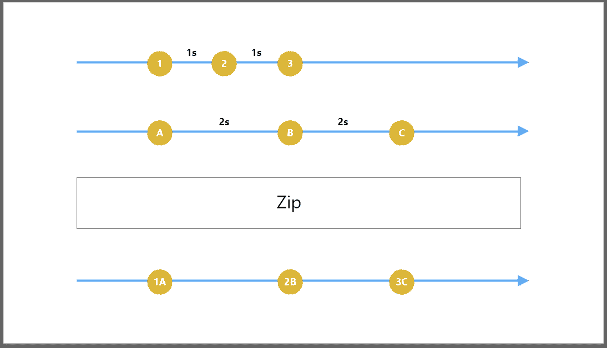

# 如何组合科特林流

> 原文：<https://betterprogramming.pub/learn-how-to-combine-kotlin-flows-317849a71d3e>

## 利用流程扩展简化复杂的操作


由 [Max Templeton](https://unsplash.com/@maxtempleton?utm_source=medium&utm_medium=referral) 在 [Unsplash](https://unsplash.com?utm_source=medium&utm_medium=referral) 上拍摄的照片

# 你将从这篇文章中学到什么

Kotlin 流是协程最新和最强大的特性之一。在本文中，我们将学习如何使用合并操作符来合并 Kotlin 流。

我们如何合并多种流量的排放？协程提供了三个操作符来完成这项工作，即[合并](https://kotlin.github.io/kotlinx.coroutines/kotlinx-coroutines-core/kotlinx.coroutines.flow/combine.html)、[压缩](https://kotlin.github.io/kotlinx.coroutines/kotlinx-coroutines-core/kotlinx.coroutines.flow/zip.html)和[扁平化合并](https://kotlin.github.io/kotlinx.coroutines/kotlinx-coroutines-core/kotlinx.coroutines.flow/flatten-merge.html)。每个运营商都有自己的使用目的。

先从[结合](https://kotlin.github.io/kotlinx.coroutines/kotlinx-coroutines-core/kotlinx.coroutines.flow/combine.html)说起吧。

# 结合

## 功能签名

让我们来看看[联合收割机](https://kotlin.github.io/kotlinx.coroutines/kotlinx-coroutines-core/kotlinx.coroutines.flow/combine.html)操作员的签名。这是`Flow`上的一个扩展函数，它将另一个`Flow`作为参数进行组合。第二个参数是λ，它给出了最近从两个流中发出的值`a: T1` 和`b: T2` 。在 lambda 中，我们可以执行转换。

```
[Flow](https://kotlin.github.io/kotlinx.coroutines/kotlinx-coroutines-core/kotlinx.coroutines.flow/-flow/index.html)<[T1](https://kotlin.github.io/kotlinx.coroutines/kotlinx-coroutines-core/kotlinx.coroutines.flow/combine.html#T1)>.combine(
    **flow**: [Flow](https://kotlin.github.io/kotlinx.coroutines/kotlinx-coroutines-core/kotlinx.coroutines.flow/-flow/index.html)<[T2](https://kotlin.github.io/kotlinx.coroutines/kotlinx-coroutines-core/kotlinx.coroutines.flow/combine.html#T2)>,
    **transform**: suspend (**a**: [T1](https://kotlin.github.io/kotlinx.coroutines/kotlinx-coroutines-core/kotlinx.coroutines.flow/combine.html#T1), **b**: [T2](https://kotlin.github.io/kotlinx.coroutines/kotlinx-coroutines-core/kotlinx.coroutines.flow/combine.html#T2)) -> [R](https://kotlin.github.io/kotlinx.coroutines/kotlinx-coroutines-core/kotlinx.coroutines.flow/combine.html#R)
): [Flow](https://kotlin.github.io/kotlinx.coroutines/kotlinx-coroutines-core/kotlinx.coroutines.flow/-flow/index.html)<[R](https://kotlin.github.io/kotlinx.coroutines/kotlinx-coroutines-core/kotlinx.coroutines.flow/combine.html#R)> [(source](https://github.com/kotlin/kotlinx.coroutines/tree/master/kotlinx-coroutines-core/common/src/flow/operators/Zip.kt#L34))
```

## 它是如何工作的

让我们从一个简单的例子开始。我们有两个流，一个是发射数字 1，2，3，另一个是发射字母 A，B，C，每次发射分别有 1000 和 2000 毫秒的延迟。看一看:

我们这里的目的是结合这两个流并打印结果。这里我们使用一个组合操作符来实现这一点。

看一看:

带联合收割机的科特林流程

现在，让我们看看它是如何工作的。每次来自任一个流的排放发生时，`combine` 算子从两个流中获取最新的排放，并在λ表达式中提供结果作为`number` 和`letter`:

```
**numbersFlow**.**combine**(**lettersFlow**) **{** number, letter **->** "$number$letter"
**}**
```

通过使用 collect 操作符，我们可以得到如下所示的结果。现在让我们看看输出。

```
Output
1A
2A
3A
3B
3C
```

为了更好地理解执行结构和转换结果，请看下图:


将运算符与 Kotlin 流相结合

# 活力

## 功能签名

我们来看看 [zip](https://kotlin.github.io/kotlinx.coroutines/kotlinx-coroutines-core/kotlinx.coroutines.flow/zip.html) 操作者的签名。这是`Flow`上的另一个扩展函数，它将另一个`Flow`作为参数。第二个参数是λ，它给出了值`T1` 和`T2` **。**与合并的关键区别在于，一旦其中一个流完成，生成的流就完成，并对剩余的流调用 cancel。

```
**public fun** <T1, T2, R> Flow<T1>.zip(
    other: Flow<T2>,
    transform: **suspend** (T1, T2) -> R): Flow<R> = **zipImpl**(
        **this**, other, transform )
```

## 它是如何工作的

让我们以与上面相同的例子为例，两个流为具有相同延迟率的`numbersFlow` 和`lettersFlow` 。我们的目标是使用一个 [zip](https://kotlin.github.io/kotlinx.coroutines/kotlinx-coroutines-core/kotlinx.coroutines.flow/zip.html) 扩展来组合两个流。看一看:

带拉链的科特林花

现在，让我们看看这是如何工作的。每次从任一个流中出现发射时，`zip`操作器等待另一个`Flow`的发射。当它发生时，`zip`发出两个结果作为`number` 和`letter`:

```
**numbersFlow**.**zip**(**lettersFlow**) **{** number, letter **->** "$number$letter"
**}**
```

通过使用`collect`我们可以得到如图所示的结果。现在让我们看看输出:

```
Output
1A
2B
3C
```

为了更好地理解执行结构和转换结果，请参见下图:



带 Kotlin 流的 zip 运算符

# 扁平化合并

`flattenMerge`采取稍微不同的方法。它不是组合成流，而是将它们作为单个流来执行。

## 功能签名

我们来看看`[flattenMerge](https://kotlin.github.io/kotlinx.coroutines/kotlinx-coroutines-core/kotlinx.coroutines.flow/flatten-merge.html)`操作符的签名。与上面的操作符不同，`flattenMerge` 是流数组的扩展。它将给定的`Flow`流展平为单个流。调用 collect 时，嵌套流开始执行。看一看:

平坦合并函数签名

## 它是如何工作的

让我们继续同一个例子。我们的目标是使用`[flattenMerge](https://kotlin.github.io/kotlinx.coroutines/kotlinx-coroutines-core/kotlinx.coroutines.flow/flatten-merge.html)`扩展执行两个流。看一看:

科特林流与`flattenMerge`

现在，让我们看看它是如何工作的。在这里，我们将流与`flowOf` 相结合，并调用`[flattenMerge](https://kotlin.github.io/kotlinx.coroutines/kotlinx-coroutines-core/kotlinx.coroutines.flow/flatten-merge.html)`，T3 执行`lettersFlow` 和`numberFlows`，然后在调用 collect 时一次发出一个结果。与`zip`不同，`flattenMerge`不会在其中一个`Flow`完成时停止执行。

看一下输出:

```
Output
1
2
A
3
B
C
```

# 奖金

要了解更多关于 Kotlin 的信息，请阅读 Kotlin 高级编程系列的前几部分:

*   [“使用 Kotlin 进行高级编程](https://medium.com/better-programming/advanced-android-programming-with-kotlin-5e40b1be22bb)”
*   [“使用 Kotlin 进行高级编程—第二部分](https://medium.com/android-dev-hacks/advanced-android-programming-with-kotlin-part-2-aae2a15258b0)”
*   [“使用 Kotlin 进行高级编程—第 3 部分](https://medium.com/better-programming/advanced-programming-in-kotlin-2e01fbc39134)”
*   [“kot Lin 中的高级 Android 编程—第四部分”](https://medium.com/better-programming/advanced-android-programing-in-kotlin-part-4-187b88fea048)

要了解更多关于 Kotlin 协同例程和 Kotlin 的其他高级特性，请阅读以下文章:

*   [“科特林协程，从基础到高级](https://medium.com/better-programming/kotlin-coroutines-from-basics-to-advanced-ad3eb1421006)
*   [“如何使用 Kotlin 密封类进行状态管理”](https://medium.com/better-programming/how-to-use-kotlin-sealed-classes-for-state-management-c1cfb81abc6a)
*   [“使用新 Kotlin 流程进行异步数据加载](https://medium.com/better-programming/asynchronous-data-loading-with-new-kotlin-flow-233f85ae1d8b)
*   [“探索 Kotlin 中的集合和序列”](https://medium.com/better-programming/exploring-collections-and-sequences-in-kotlin-3a324ea08fb9)
*   [为什么以及如何使用 Kotlin 的原生序列化库](https://medium.com/better-programming/why-and-how-to-use-kotlins-native-serialization-library-c88c0f14f93d)

你可以在[中](https://medium.com/@sgkantamani)、[推特](https://twitter.com/SG5202)和 [LinkedIn](https://www.linkedin.com/in/siva-kantamani-bb59309b/) 上找到我。

感谢您的阅读。