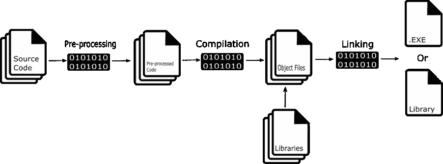
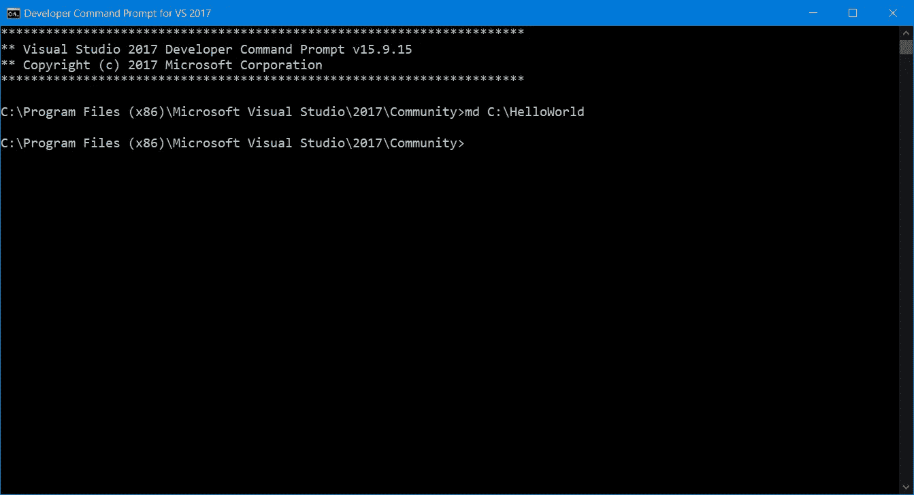
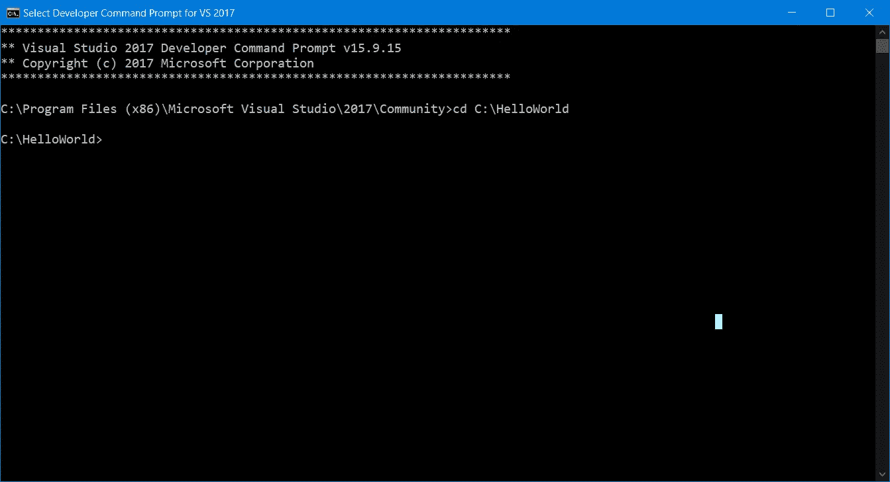
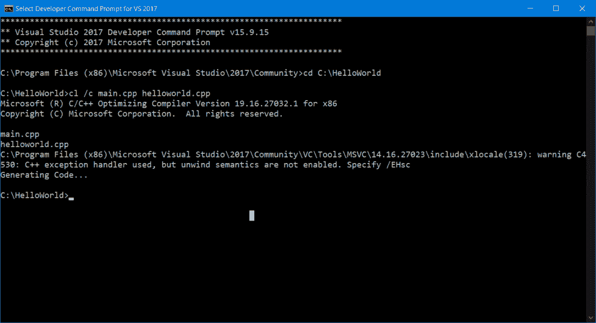
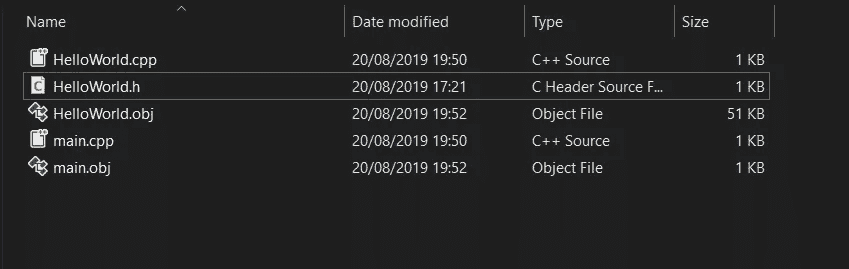
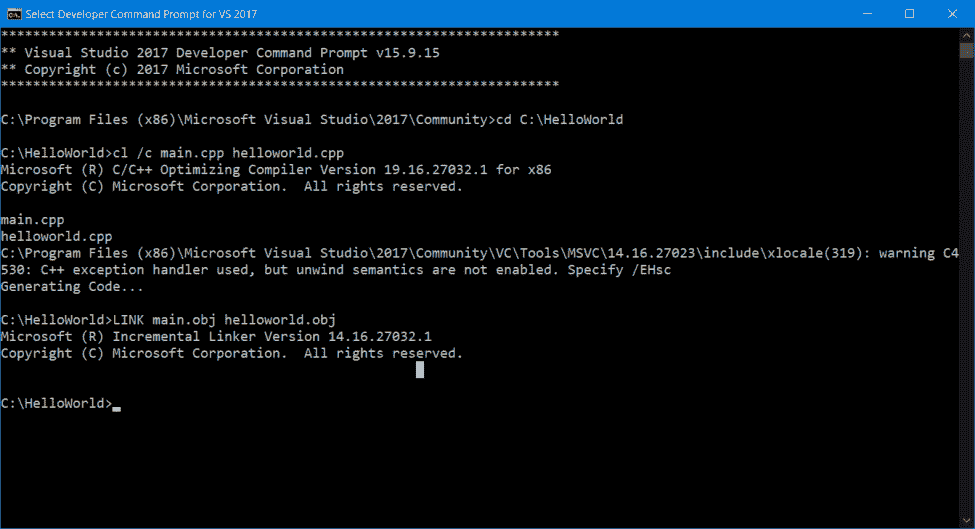
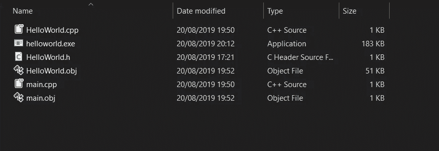

# 学习如何编译 C++程序

> 原文：<https://betterprogramming.pub/learn-how-to-compile-a-c-program-382c4c690bdc>

## 探索我在使用 C++时遇到的问题的一系列文章


由[马库斯·斯皮斯克](https://unsplash.com/@markusspiske?utm_source=unsplash&utm_medium=referral&utm_content=creditCopyText)在 [Unsplash](https://unsplash.com/s/photos/code?utm_source=unsplash&utm_medium=referral&utm_content=creditCopyText) 上拍摄的照片

当我第一次学习 C++时，除了学习指针和内存管理之外，我发现最困难的事情之一是如何使用第三方库成功地编译代码。

作为一名游戏开发人员，你的游戏在很多方面都依赖于库，比如渲染和物理，而成功编译一个包含这些库的空项目可能会非常棘手。

我很纠结，因为我根本不明白 C++程序是如何在互联网上构建和分发的。我不明白我的源代码是如何变成可执行文件或库的，也不明白如何编译与平台无关的代码。

这意味着我根本不知道如何将一个库合并到我的代码中，否则我会在试图解决编译时出现的错误时碰壁。事实上，这不应该是构建游戏的困难部分。

我发现这种知识不是可以教授的。重点主要是解决问题和 C++语法，然而，如果你想用 C++进行任何严肃的游戏编程，而不是从头开始编写任何东西，这些知识是必需的。

因此，我想写一系列文章来探讨我已经讨论过的许多问题。第一篇文章将着眼于学习如何编译 C++程序。

# 三步过程



编译 C++程序包括获取我们编写的源代码(。cpp，。c，。h，。hpp 文件)并将它们转换成可在指定平台上运行的可执行文件或库。

这一过程可分为三个关键阶段:

1.  预处理
2.  汇编
3.  连接

# 预处理

C++有预处理器指令，这些指令在代码中由前缀`#`标识，它定义了源代码在编译前要执行的行为。

你可以在这里阅读更多关于预处理器指令[的信息。使用预处理器编译 C++程序的第一阶段包括执行这些行为。](https://docs.microsoft.com/en-us/cpp/preprocessor/preprocessor-directives?view=vs-2019)

预处理器做什么的确切性质取决于预处理器指令。

例如，我们经常将代码分割成单独的文件，以便于组织和阅读。为了将一个文件中的代码与另一个文件中的代码链接起来，我们使用了`#include`指令。

当编译我们的 C++程序时，预处理器获取这个`#include`并将头文件中定义的代码复制粘贴到包含它的文件中。这节省了我们的时间，并避免了由于我们必须在文件之间手动复制代码而出现错误的可能性。

include 指令只是预定义指令的一个例子，更多例子请参见这篇[文章](http://www.cplusplus.com/doc/tutorial/preprocessor/#conditional_inclusions)。

到预处理器阶段结束时，代码中的所有预处理器指令都已经由编译器预处理器处理过，输出的代码现在可以编译了。

# 收集

编译是这个过程的下一步，它涉及到将我们编写的源代码转换成计算机可以理解的机器代码。

C++编译本身是一个两步的过程。首先，编译器获取源代码，并将其转换成*汇编语言*。汇编语言是一种低级编程语言，更类似于 CPU 的机器指令。

第二，现在被转换成汇编语言的源代码使用一个*汇编器*再次被转换成实际的机器代码。结果输出是一组以中间文件格式存储的文件，称为*对象文件*。

注意:机器码由二进制指令组成，之所以被称为机器语言，是因为它是 CPU 实际理解的代码。

目标文件的扩展名为`.obj`或`.o`，它是为每个源代码文件创建的。目标文件包含该文件的所有机器指令。它被称为中间文件，因为直到最后阶段，链接，我们可以使用的实际可执行文件或库才被创建。

在编译阶段，我们会被警告代码中任何导致代码无法编译的错误。发生的任何错误都是由于编译器不理解我们编写的代码。

代码不能被 C++识别，所以我们基本上在语法上搞砸了。常见的编译例子有缺少分号、拼写错误的 C++关键字，或者在方法末尾添加了过多的花括号。

如果发现错误，编译将完全停止。直到所有的错误都被修复，你才能编译你的 C++代码。

# 连接

该过程的最后一个阶段是*链接，*它涉及到从前面的步骤中获取我们的输出，并将其链接在一起以产生实际的可执行文件或库。

这一阶段的第一步是将所有的目标文件编译成可执行文件或库。一旦成功实现了这一点，下一步就是将这个可执行文件与我们希望在程序中使用的任何外部库链接起来。

注意:一个库只是共享一个共同目的的函数、类和对象的可重用集合，例如，一个数学库。

最后，链接器需要解析任何依赖关系。这是任何与链接相关的错误都会发生的地方。

常见错误包括找不到指定的库，或者试图链接两个文件，例如，两个文件可能有一个共享相同名称的类。

假设在这个阶段没有错误发生，编译器会给我们一个可执行文件或库。

# 建筑物

我认为值得一提的一件额外的事情是，在像 [Visual Studio](https://visualstudio.microsoft.com/) 这样的 IDE 中，所描述的编译步骤被分组到一个叫做 *build* 的过程中。创建程序时一个典型的工作流程是构建然后调试。

正在发生的是，构建通过编译和链接代码产生可执行文件，或者一个错误列表，这取决于自上次构建以来我们是否做了很好的编码工作。当我们点击*开始调试*时，Visual Studio 将运行产生的可执行文件。

# 编译一个简单的 C++程序

现在我们知道了编译 C++程序的基本步骤，我想我们可以通过看一个简单的例子来帮助巩固我们刚刚学到的东西，从而结束这篇文章。

对于这个例子，我计划使用 [MSCV](https://docs.microsoft.com/en-us/cpp/build/building-on-the-command-line?view=vs-2019) 工具集，并且我正在从开发者命令提示符下编译。

这不是一个关于如何从命令行设置和使用 MSCV 工具集的教程，所以如果你想这样做，你可以在这里找到更多信息。

我们将遵循的步骤:

1.为我们的 C++程序创建一个文件夹。

2.导航到该文件夹。

3.从文本编辑器创建我们的 C++程序(我使用了 Visual Studio 代码)。

4.将我们的源代码编译成目标文件。

5.链接我们的目标文件以生成一个可执行文件。

# 创建一个存储我们的 C++程序的地方



我们在这一步中所做的就是使用 Windows 命令`md`在指定的路径下创建一个目录，名称为`HelloWorld`。我们可以直接从文件浏览器中创建文件夹，但是这样做更酷。

# 导航到该文件夹



在这一步中，我们所做的就是使用命令`cd`导航到我们的文件夹，然后是我们想要导航到的路径。在我们的例子中，我们在最后一步中创建的文件夹。

我们这样做是为了让我们的生活更轻松。

如果我们没有导航到我们想要编译的每个文件的文件夹，我们必须指定完整的路径名，但是如果我们已经在文件夹中，那么我们只需要给出文件名。

# 创建 C++代码

```
class HelloWorld{public:void PrintHelloWorld();};#include "HelloWorld.h"
#include <iostream>using namespace std;void HelloWorld::PrintHelloWorld(){std::cout << "Hello World";}#include "HelloWorld.h"int main(){HelloWorld hello;hello.PrintHelloWorld();return 0;}
```

上面的代码是一个非常简单的程序，包含三个文件，`main.cpp`、`HelloWorld.h`和`HelloWorld.cpp`。

我们的`HelloWorld`头文件定义了一个函数`PrintHelloWorld()`，该函数的实现在`HelloWorld.cpp`中定义，而`HelloWorld`对象的实际创建及其函数的调用是从`main.cpp`中完成的。

注意:这些文件保存在我们之前创建的文件夹中。

# 编译程序

要编译和链接我们的程序，我们只需使用`cl`命令，后面跟着我们想要编译的所有`.cpp`文件。如果我们想在没有链接的情况下编译，我们使用命令`cl /c`。

注意:我们没有将`.h`文件包含在编译中，因为由于`#include`前处理器指令，该文件的内容被前处理器自动包含在`main.cpp`和`HelloWorld.cpp`中。



上图显示了我们两个`.cpp`源文件的目标文件。另外，请注意，我们没有可执行文件，因为我们还没有运行链接器。

# 连接

在这最后一步中，我们需要链接我们的目标文件来生成最终的可执行文件。

为此，我们使用`LINK`命令，然后创建目标文件。



现在，我们需要做的就是双击`helloworld.exe`来运行我们的程序。

值得一提的是，鉴于我们的程序只在 main 函数返回之前打印到控制台，您可能看不到控制台出现，或者可能只是非常短暂地出现。

确保控制台保持打开的一个常见解决方案是在程序结束时使用`cin`请求用户输入。

这只是一个简单的例子，但我希望它能解释 C++程序是如何编译的。

还有很多东西我们没有看，比如如何链接外部库，如何跨多个平台编译我们的代码，如何更好地处理编译大型 C++程序。

还有一种比在命令行中输入每个文件更好的编译和链接程序的方法，不，不只是在我们的 IDE 中点击*构建*。

# 摘要

编译 C++程序有三个步骤:预处理、编译和链接。

预处理器处理诸如`#include`的预处理器指令，编译将源代码文件转换成机器代码，存储在目标文件中，并链接目标文件和外部库以产生可执行文件或库文件。

# 参考

*   [https://en.wikipedia.org/wiki/C%2B%2B](https://en.wikipedia.org/wiki/C%2B%2B)
*   [https://stack overflow . com/questions/6264249/how-the-compilation-linking-process-work](https://stackoverflow.com/questions/6264249/how-does-the-compilation-linking-process-work)
*   [http://faculty.cs.niu.edu/~mcmahon/CS241/Notes/compile.html](http://faculty.cs.niu.edu/~mcmahon/CS241/Notes/compile.html)
*   [https://www . learn CPP . com/CPP-tutorial/introduction-to-the-compiler-linker-and-libraries/](https://www.learncpp.com/cpp-tutorial/introduction-to-the-compiler-linker-and-libraries/)