# 如何建立一个发送狗图像的机器人

> 原文：<https://betterprogramming.pub/learn-how-to-create-your-own-texting-bot-that-sends-dog-pictures-532e32c611b3>

## 循序渐进的指南

在我们开始这篇文章之前，我想给任何进入技术/编程世界的人发一条信息:

当我第一次开始学习如何编程时，感觉好像我陷入了学习基础知识的窠臼，从来不知道我可以用我慢慢理解的工具包应用什么。在我看来，不知道如何将编程知识应用到日常活动中，是一个很难克服的障碍。这让我的几个朋友远离了编程。

*每当我学习一项新技术，在熟悉了语法之后，我总会问自己一个问题，“我能用它构建什么？”不管你的技术水平如何，我强烈建议你也这样做。作为开发人员，我们通过解决难题来成长。我们最终建造了一些非常酷的东西！*

我在学习一门新语言时着手的一个项目是创建一个生成狗图片的 API！我想带你了解一下*如何使用一些非常酷的技术创建一个可以根据命令给你发送狗狗照片的短信机器人*。我们开始吧！

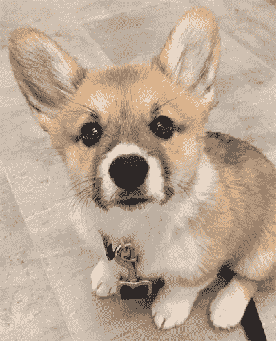

[我最喜欢的柯基 Instagram 上的@ beaorcorgi](https://www.instagram.com/bearorcorgi/)

# 首要任务—先决条件和工作流程:

在本教程中，我们将使用 [Twilio](https://www.twilio.com) 。你需要在 Twilio 账户上注册一个电话号码。如果您还没有注册电话号码，请阅读[本教程](https://www.twilio.com/docs/usage/tutorials/how-to-use-your-free-trial-account#get-your-first-twilio-phone-number)，了解如何使用 Twilio 试用版获得您自己的电话号码，并在注册电话号码后返回。

Twilio 为我们提供了一个非常简洁的无服务器功能特性。无服务器功能允许开发者将他们的代码部署到云中。第三方服务，在我们的例子中是 Twilio，将为我们托管代码。这太棒了，因为它消除了外部服务器托管代码的麻烦！

为了给我们生成狗狗图片，我们将使用[woofbot . io](https://woofbot.io/)——一个免费的 API 服务，为你生成狗狗图片。您可以在这里查看这个 API 的[文档](https://github.com/joey-colon/woofbot-api-docs)，但是这对于本教程的范围来说是不必要的。

当处理任何返回 JSON 的 API 时，我相信 chrome 的一个扩展是 JSON 格式化程序。你可以以后再谢我！

在这个程序中，我们的流程将如下所示:

1.  我们的 Twilio 电话号码收到一条短信，要求提供某一特定品种的狗的图片。
2.  我们联系 woofbot API 说，*“嘿 woofbot，我需要这个品种的照片！”*
3.  我们验证 API 响应并解析出提供给我们的图像 URL。
4.  然后，我们将图像 URL 发送到给 Twilio 发短信的电话号码。

乍一看，这个流程似乎有点让人不知所措，但是我们一次只关注一小部分。在你知道之前，我们已经完成了整个流程。

一只柯基犬肯定对建造他的短信机器人感到兴奋！

# 设置 Twilio 无服务器功能

走向你的 [Twilio 仪表盘](https://www.twilio.com/console)。在左侧栏中，单击*所有产品&服务图标*:

在展开的侧边栏中，向下滚动到*运行时*部分，并点击*功能*项。你应该在这个页面上:

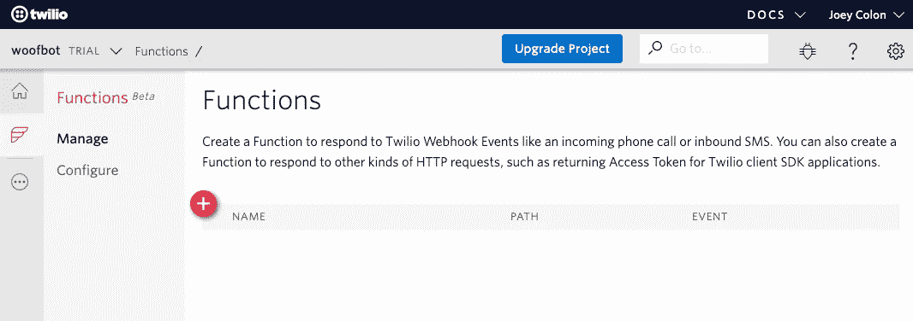

Twilio 运行时函数页面

点击*加*图标。Twilio 非常友好地为我们提供了一套样板模板。继续选择 *Hello SMS* 模板并点击 *Create* 按钮:

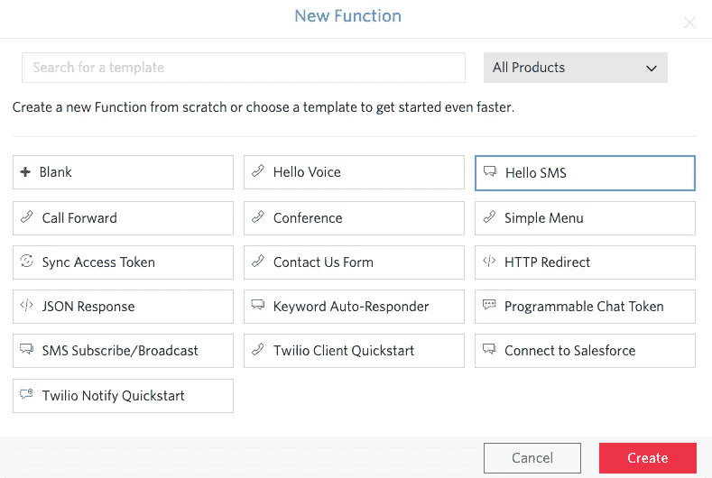

创建新的 Twilio 运行时函数

我们现在已经用 SMS 模板创建了一个运行时函数。如果你愿意，你可以继续修改*函数名*字段，使其更能反映这个项目。我会把我的更新为*狗机器人*。

在我们上面描述的流程中，听起来整个流程都是在收到文本消息时启动的。在*配置*下，点击*事件*下拉菜单，选择*接收消息*，点击*保存*按钮。对于路径，你可以随心所欲——我将使用 *woofbot* 。

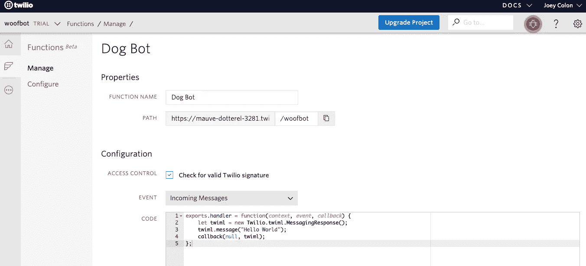

狗机器人初始配置

现在，我们的函数流表示:*“在收到消息的情况下，运行这段代码来回复说 Hello World 的人。”*

保存后，我们可以发送 Twilio 电话号码来验证这一点:

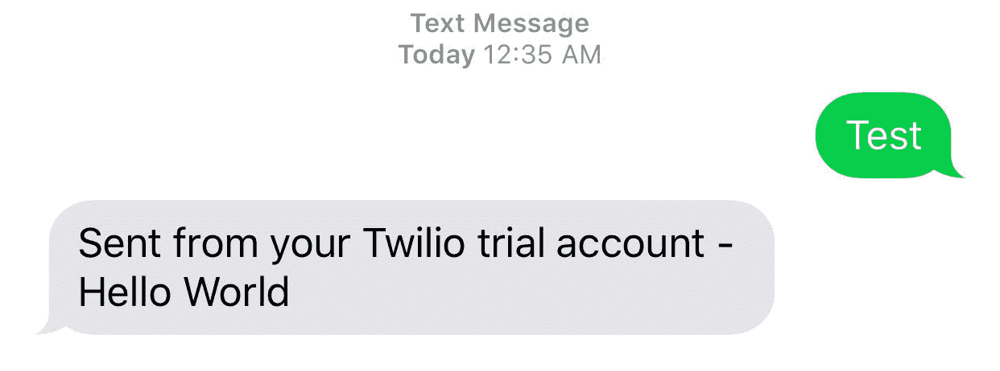

太好了！让我们继续在消息中发送一张狗的照片。在第三行，我们可以用`twiml.message().media(“https://direct_link_to_image.com/image.png”);`替换`twiml.message("Hello World")`。这将附加一个媒体对象，该对象带有提供给我们的`twiml.message()`对象的链接。

我们可以通过调用 woofbot API 来测试这一点。首先，我们需要通过访问[这个 URL](https://api.woofbot.io/v1/breeds/) 来弄清楚 API 支持什么品种:

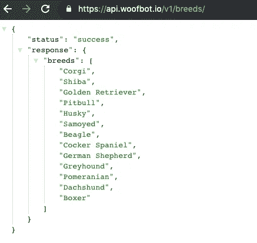

品种列表 woofbot API 端点

基于这个列表，我们可以生成一个 API 调用，通过以下格式获取这些品种的图片:`[https://api.woofbot.io/v1/breeds/{breed}/image](https://api.woofbot.io/v1/breeds/corgi/image)`其中`{breed}`是您感兴趣的品种。

我想要一张柯基犬的照片，所以我要去参观`[https://api.woofbot.io/v1/breeds/corgi/image](https://api.woofbot.io/v1/breeds/corgi/image)`。访问之后，我们将有一个`url`字段，它包含到一个 corgi 映像的直接链接:

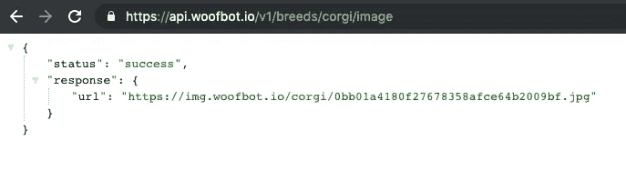

woofbot.io 生成 Corgi 图像端点

复制图片的 URL，我们可以将其粘贴到我们的无服务器功能代码中:

保存更改后，我们现在应该可以发送 Twilio 电话号码并接收一张狗狗照片了。

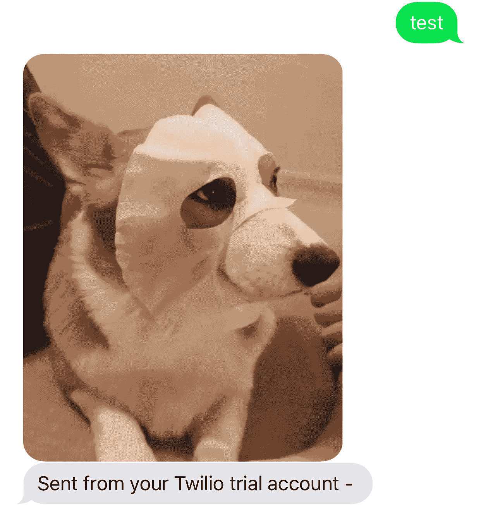

万岁！我们制作了一个程序，可以根据要求发送狗的图片！我们当前的解决方案是*好的*，但是我们怎样才能使这个程序更加动态，正如我们最初的流程所陈述的那样？让我们来看看。

# 创建动态无服务器功能

描述一下我们在寻找一张狗图片时手动做了什么:

1.  我们访问了 woofbot 品种列表，并选择了一个品种。
2.  然后我们访问了特定品种的生成图像 API URL，并复制了`url`字段给我们的直接图像链接。

我们如何将这个流程转移到我们的程序中？通过使用 HTTP 客户端库。用普通语言来说，HTTP 客户端库翻译成应用程序中使用的 web 浏览器。对于本教程，我们将利用 Axios 库。

让我们安装这个库，以便我们的函数可以使用它。

在*功能*下，前往左侧栏的*配置*区域:

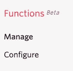

在*依赖关系*下，点击加号图标，输入`axios`作为名称，输入`0.19.0`作为版本。点击*保存*按钮，返回运行时函数的*管理*部分。

要将 Axios 导入到函数中，请在我们的程序顶部添加以下代码行:

`const axios = require(‘axios’);`

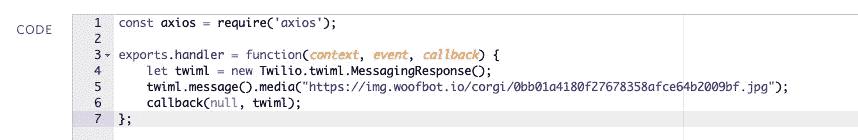

如果你想了解 Axios 提供的方法，可以看看[文档](https://github.com/axios/axios)，里面有很好的例子。从这里开始，让我们在第四行的正下方创建一个到我们想要的品种的端点的 GET 请求。

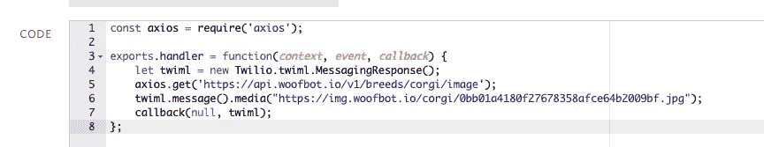

这个调用返回一个承诺。如果您不熟悉承诺，那也没关系——下面是处理返回承诺的代码的基本思想:

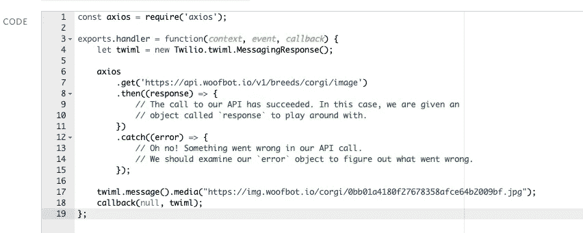

我们的 HTTP 响应的内容是*总是*存储在`response.data`中。直接图像 URL 将特别位于`response.data.response.url`——如果我们查看 JSON:

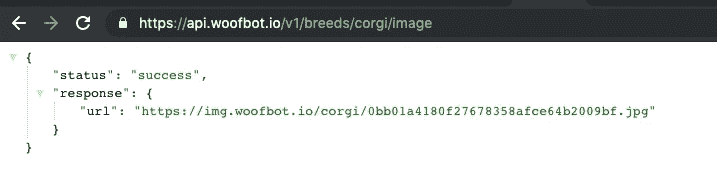

有了这些知识，我们可以在每次联系 API 后，在程序中移动几行来动态地获取一个新的 URL。我们还应该通过使用收到的错误调用回调函数来说明错误:

拯救之后，真相大白的时刻来了！我们应该能够发送两次 Twilio 电话号码的短信，并收到两张不同的狗狗图片！

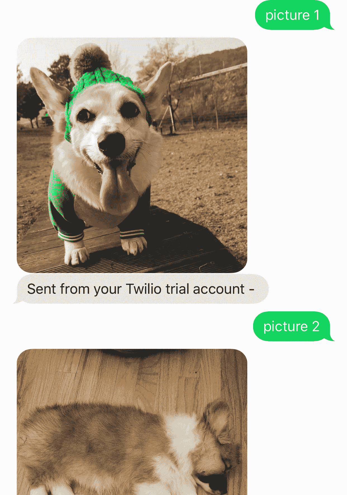

我们已经完成了一些重要的工作！然而，有一个重要的改进我们可以添加:支持多品种！

在我们的无服务器函数中，我们传递了一个`event`变量，该变量包含当前事件的所有相关信息，比如发送者的电话号码和文本消息的正文。为了检索文本消息的字符串，我们通过`event.Body`访问它。

让我们创建一个变量，使我们的 API 调用依赖于用户输入:

现在，您已经通过接受用户输入设置了获取动态狗图片。

干得好！