# 了解如何动态扩展您的 Kubernetes 部署

> 原文：<https://betterprogramming.pub/learn-how-to-scale-your-kubernetes-deployments-dynamically-d6c11344ec08>

## 根据您收到的流量负载，了解扩展平台的不同选项


在 [Unsplash](https://unsplash.com?utm_source=medium&utm_medium=referral) 上由 [SpaceX](https://unsplash.com/@spacex?utm_source=medium&utm_medium=referral) 拍摄的照片。

当谈到 Kubernetes 时，你总是在谈论它提供的灵活性选项。通常，讨论的话题之一是平台附带的弹性选项，尤其是在公共云提供商上工作时。但是怎么才能真正落实呢？

在我们开始展示如何扩展我们的 Kubernetes 平台之前，我们需要快速回顾一下我们可用的选项:

*   集群自动缩放:当整个基础设施的负载达到峰值时，我们可以通过创建新的工作节点来托管更多的服务实例，从而对其进行改进。
*   水平单元自动伸缩:当一个特定单元或一组单元的负载达到峰值时，我们部署一个新的实例，以确保我们可以获得所需的全局可用性。

让我们看看如何使用最流行的 Kubernetes 托管服务之一，亚马逊的弹性 Kubernetes 服务(EKS)来实现这些。

# 设置

我们要做的第一件事是创建一个具有单个工作节点的集群，以轻松演示可伸缩性行为。为此，我们将使用命令行工具 eksctl 来轻松管理 EKS 集群。

为了能够创建集群，我们将使用以下命令:

```
eksctl create cluster --name=eks-scalability --nodes=1 --region=eu-west-2 --node-type=m5.large --version 1.17 --managed --asg-access
```

几分钟后，我们将拥有自己的 Kubernetes 集群，其中有一个节点可以在其上部署应用程序。

现在我们将创建一个样例应用程序来生成负载。我们将使用 TIBCO BusinessWorks 应用程序容器版来生成一个简单的应用程序。这将是一个 REST API，它将执行 100，000 次迭代的循环，充当计数器并返回结果。

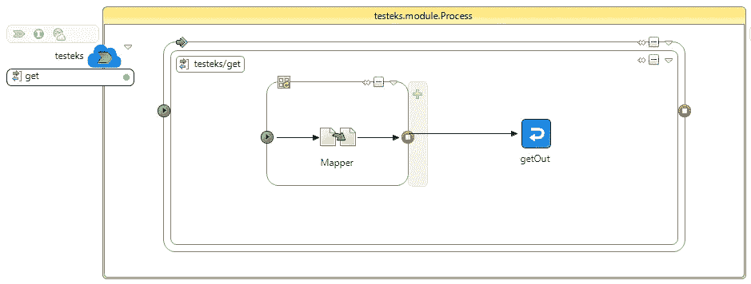

显示可伸缩性选项的 BusinessWorks 示例应用程序

我们将使用 GitHub 资源库中的可用资源:

[](https://github.com/alexandrev/testeks) [## 亚历山德罗夫/泰斯特克斯

### 此时您不能执行该操作。您已使用另一个标签页或窗口登录。您已在另一个选项卡中注销，或者…

github.com](https://github.com/alexandrev/testeks) 

我们将构建容器映像并将其推送到容器注册中心。在我的例子中，我将使用我的 Amazon ECR 实例来这样做，我将使用以下命令:

```
docker build -t testeks:1.0 .
docker tag testeks:1.0 938784100097.dkr.ecr.eu-west-2.amazonaws.com/testeks:1.0
docker push 938784100097.dkr.ecr.eu-west-2.amazonaws.com/testeks:1.0
```

一旦映像被推送到注册中心，我们将使用以下命令在 Kubernetes 集群上部署应用程序:

```
kubectl apply -f .\testeks.yaml
```

之后，我们将在那里部署我们的应用程序，如下图所示:

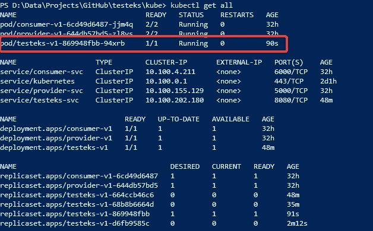

部署在 Kubernetes 集群上的映像

所以，现在我们可以测试应用程序了。为此，我将使用如下端口转发命令使端口 8080 可用:

```
kubectl port-forward pod/testeks-v1-869948fbb-j5jh7 8080:8080
```

这样，我可以使用浏览器查看并测试示例应用程序，如下所示:

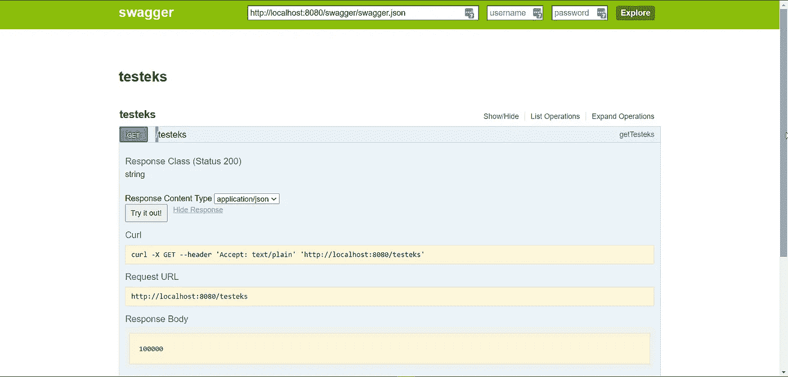

Kubernetes 示例应用程序的 Swagger UI 测试器

## **水平 pod 自动缩放**

现在，我们需要开始定义自动缩放规则，我们将从水平窗格自动缩放(HPA)规则开始。我们将需要选择我们想要用来扩展我们的 pod 的资源。在这个测试中，我将使用 CPU 利用率来完成这项工作，我将使用以下命令:

```
kubectl autoscale deployment testeks-v1 --min=1 --max=5 --cpu-percent=80
```

当 CPU 利用率高于 80%时，该命令会将副本集 *testeks* 从一个(`1`)实例扩展到五个(`5`)实例。

如果现在我们检查组件的状态，我们将得到类似下图的结果:

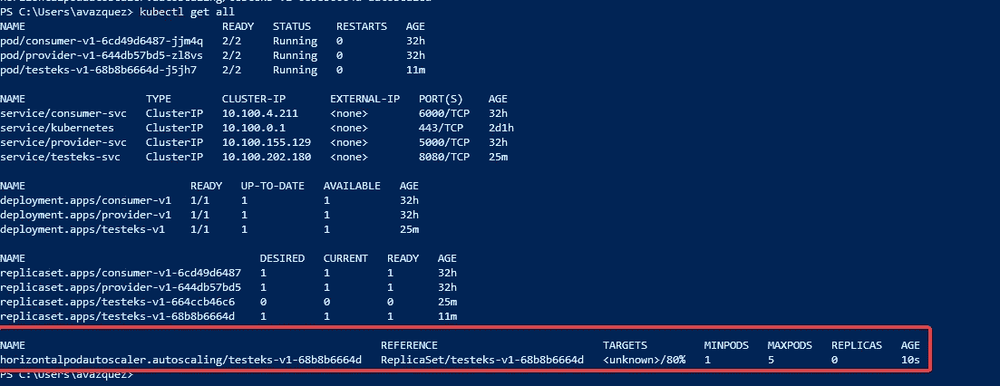

使用 CPU 利用率作为关键指标的应用程序的 HPA 规则定义

如果我们检查*目标*列，我们将看到这个值: *<未知> /80%* 。这意味着 80%是触发新实例的目标，而当前使用情况是 *<未知>。*

我们没有在群集上部署任何东西来获取每个单元的指标。为了解决这个问题，我们需要部署度量服务器。为此，我们将遵循亚马逊 AWS 文档:

 [## 安装 Kubernetes 度量服务器

### Kubernetes Metrics 服务器是集群中资源使用数据的聚合器…docs.aws.amazon.com 没有部署 iton.com](https://docs.aws.amazon.com/eks/latest/userguide/metrics-server.html) 

因此，运行以下命令，我们将安装度量服务器。

```
kubectl apply -f https:*//github.com/kubernetes-sigs/metrics-server/releases/download/v0.3.7/components.yaml*
```

在这样做之后，如果我们再次检查，我们可以看到当前用户已经替换了未知的*<>*:

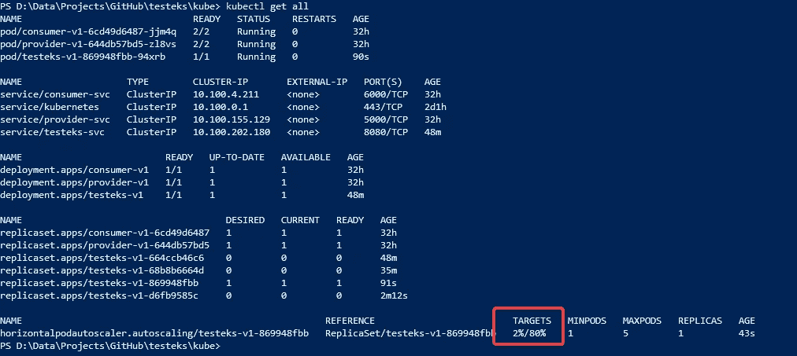

在 Kubernetes 集群上安装度量服务器后的当前资源利用率

如果可以的话，我将开始在集群内部使用负载测试发送请求。我将使用下面定义的示例应用程序:

 [## 通过 HPA - Ultimate Kubernetes Bootcamp 自动扩展容量

### 通过水平 Pod 自动扩展，Kubernetes 可以自动扩展复制控制器中的 Pod 数量…

schoolofdevops.github.io](https://schoolofdevops.github.io/ultimate-kubernetes-bootcamp/10_kubernetes_autoscaling/#load-test) 

为了进行部署，我们将使用包含以下内容的 YAML 文件:

我们将使用以下命令部署它:

```
kubectl apply -f tester.yaml
```

这样做之后，我们将看到当前的利用率正在增加。几秒钟后，它将开始旋转新的实例，直到它满足 HPA 规则中定义的最大 pod 数量。

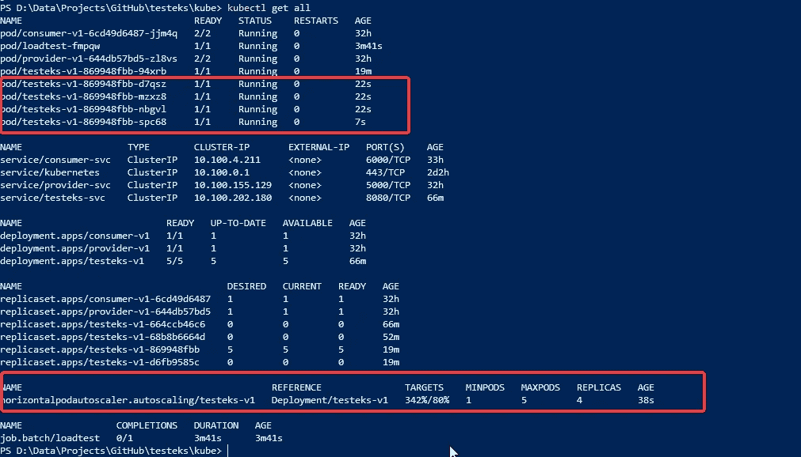

当负载超过前面步骤中定义的目标时，pod 增加。

然后，一旦负载也降低，实例的数量将被删除。

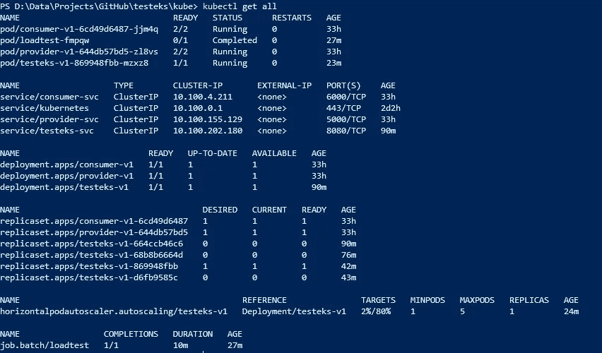

负载一减少，pod 就被删除。

## 聚类自动缩放

现在，我们需要看看如何使用 EKS 实现集群自动伸缩。我们将使用亚马逊提供的信息:

 [## 集群自动缩放器

### 当 pod 无法启动时，Kubernetes 集群自动缩放器会自动调整集群中的节点数量…

docs.aws.amazon.com。](https://docs.aws.amazon.com/eks/latest/userguide/cluster-autoscaler.html) 

第一步是部署集群自动扩展，我们将使用以下命令来完成:

```
kubectl apply -f https://raw.githubusercontent.com/kubernetes/autoscaler/master/cluster-autoscaler/cloudprovider/aws/examples/cluster-autoscaler-autodiscover.yaml
```

然后，我们将运行以下命令:

```
kubectl -n kube-system annotate deployment.apps/cluster-autoscaler cluster-autoscaler.kubernetes.io/safe-to-evict=”false”
```

我们将编辑部署，以提供我们正在管理的群集的当前名称。为此，我们将运行以下命令:

```
kubectl -n kube-system edit deployment.apps/cluster-autoscaler
```

当您的默认文本编辑器打开并显示文本内容时，您需要进行以下更改:

*   在可用的占位符中设置集群名称。
*   添加这些附加属性:

```
- --balance-similar-node-groups
- --skip-nodes-with-system-pods=false
```


配置集群自动缩放器所需的部署编辑

现在我们需要运行以下命令:

```
kubectl -n kube-system set image deployment.apps/cluster-autoscaler cluster-autoscaler=eu.gcr.io/k8s-artifacts-prod/autoscaling/cluster-autoscaler:v1.17.4
```

唯一剩下的事情就是定义自动缩放策略。为此，我们将使用 AWS 服务门户:

*   进入我们部署了集群的地区的 EC 服务页面。
*   选择自动缩放组选项。
*   选择在 EKS 集群创建过程中创建的自动扩展组。
*   转到自动缩放选项卡，并单击可用的添加策略按钮。

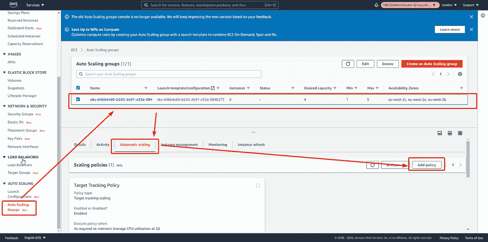

EC2 服务控制台中的自动缩放策略选项

然后我们应该定义政策。我们将使用平均 CPU 利用率作为指标，并将目标值设置为 50%:

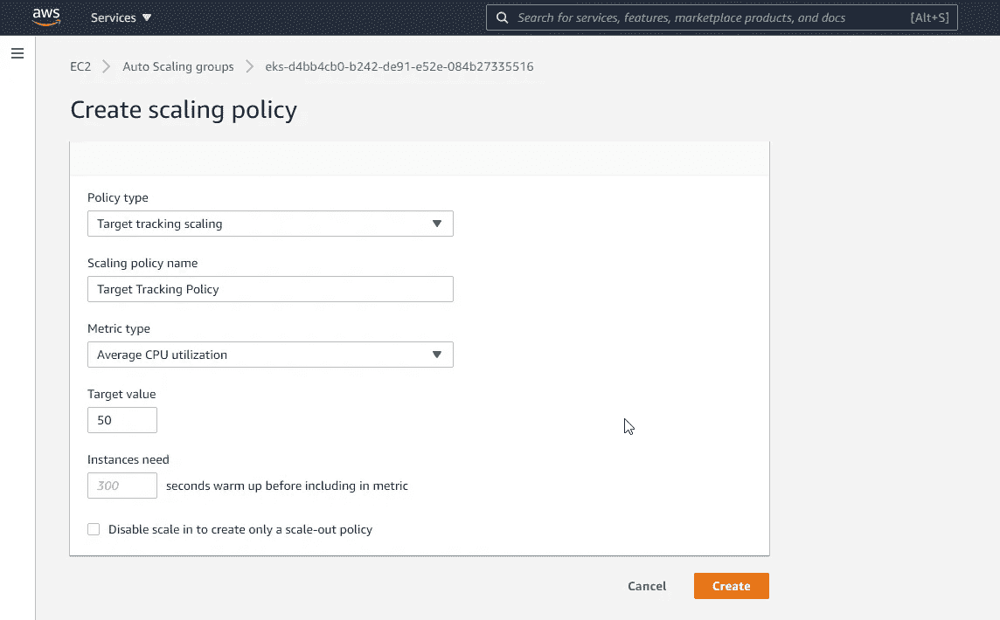

自动缩放策略创建对话框

为了验证行为，我们将使用测试器生成负载，正如我们在前面的测试中所做的那样，并使用以下命令验证节点负载:

```
kubectl top nodes
```

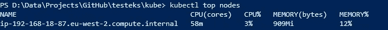

kubectl 顶级节点的示例输出

现在我们再次部署测试器。由于我们已经在该集群中部署了它，我们需要先删除它，以便再次部署它:

```
kubectl delete -f .\tester.yaml
kubectl apply -f .\tester.yaml
```

加载开始后，会立即创建新节点，如下图所示:

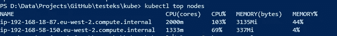

kubectl top nodes 展示了节点是如何向上扩展的

加载完成后，我们回到之前的情况:

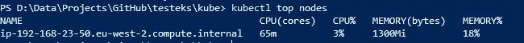

kubectl top nodes 显示了节点是如何缩减的

# 摘要

在本文中，我们展示了如何使用集群自动缩放功能在工作节点级别和使用水平 pod 自动缩放功能在 Pod 级别动态地缩放 Kubernetes 集群。这为我们提供了创建真正有弹性和灵活性的环境所需的所有选项，能够以最有效的方式适应每时每刻的需求。