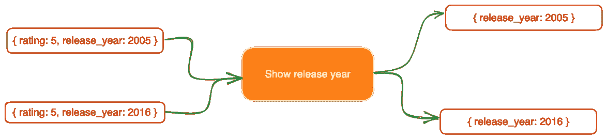

# 了解如何在 MongoDB 聚合管道中使用 Group

> 原文：<https://betterprogramming.pub/learn-how-to-use-group-in-mongodb-aggregation-pipeline-8fd007ad492f>

## 您的数据模式非常灵活，无法适应所有用例。通过 group 等工具从您的数据中获取定制见解


照片由 [Adrian N](https://unsplash.com/@anewevisual?utm_source=medium&utm_medium=referral) 在 [Unsplash](https://unsplash.com/backgrounds/nature/rainbow?utm_source=medium&utm_medium=referral) 上拍摄

这篇文章最初发表在[rrawat.com](https://rrawat.com/blog/group-in-mongodb)上。

MongoDB 聚合管道中的 group stage 帮助我们使用 MongoDB 文档中的任何字段对数据进行分组。这是 MongoDB 聚合管道中最重要和最常用的阶段之一。

在本文中，我们将看看`$group`阶段，并使用它提供的各种特性。我们将会收集一些电影样本。每个查询都有一个操场链接，这样你可以边做边练习和学习。

本文末尾还有一个练习供您尝试。一旦你完成这篇文章，它会帮助你巩固你的理解。

# 建立数据

在我们进入聚合管道和小组阶段之前，我们需要一些数据来处理。我以`Movies`系列为例来理解这里的概念。同样，整篇文章中的每个查询都有链接。

这里是只有 5 个包含随机数据的文档的`Movies`集合:

现在我们已经收集了样本，是时候探索`$group`阶段了。

# 使用分组依据查找不同的条目

要在集合中查找不同的项目，我们可以在我们想要分组的任何字段上使用 group stage。该字段在输出中是唯一的。让我们按照电影上映的年份来分类:

电影是按发行年份分组的

下面是上述查询的输出。请注意，我们在输出中只获得了唯一的发布年份值。

# 使用多个字段进行分组

与按单个字段分组类似，我们可能希望根据用例用多个字段对数据进行分组。MongoDB 聚合管道允许我们根据需要对任意多个字段进行分组。

我们在`_id`字段中输入的内容用于对文档进行分组，也就是说，它返回`_id`字段中的所有字段，并按所有字段进行分组。

让我们按照电影的发行年份和放映时间来分类:

按发布年份和运行时间分组后，我们得到了以下输出:

发布年份和运行时间的组合充当唯一键

在上面的场景中，我们没有使用单个字段进行分组，而是使用了多个字段。发布年份和运行时间的组合充当每个文档的唯一标识符。

# 累加器功能

在分组阶段有许多累加器功能可用，可用于汇总数据。它们帮助我们对分组数据执行一些最常见的操作。让我们来看看其中的一些:

## **$计数累加器**

它用于计算组中文档的数量。这可以与我们的 group-by 查询结合使用，以获得组中的文档总数。

让我们将[这个](https://mongoplayground.net/p/xq9UwbUNVSp)应用到我们的电影收藏中:

统计特定年份上映的电影

我们将得到每年发行的电影总数:

## **$总和累加器**

我们可以使用`$sum`累加器来累加一个字段中的所有值。让我们[根据电影评级对电影进行分组，并总结评论](https://mongoplayground.net/p/DapK5ScHWI7)以了解电影评级和评论数量之间是否存在相关性。

而在这里我们可以看到，影评数量和电影评分之间存在着轻微的相关性。对于我们的样本电影系列，它们似乎大致成正比:

## **$平均累加器**

出于分析目的，我们可能想要检查哪一年的电影平均评级最高。让我们看看如何使用 `[$avg](https://mongoplayground.net/p/CK0kacF5bK4)` [累加器](https://mongoplayground.net/p/CK0kacF5bK4)从我们的数据[中获取这些统计数据:](https://mongoplayground.net/p/CK0kacF5bK4)

我们首先按照发行年份对电影进行分组，然后计算每个发行年份的平均评分。以下是上述查询的输出:

## **$推动累加器**

我们想看看每一个发行年度的所有收视率。我们可以用这些数据来分析哪一年的电影收视率有很大的变化。让我们使用`[$push](https://mongoplayground.net/p/XQgtC8oT1_E)` [蓄能器](https://mongoplayground.net/p/XQgtC8oT1_E)来完成这项工作:

每个发行年份的所有电影评级都被放入一个数组中:

## **$addToSet 累加器**

你可以认为这就像是`$push`累加器。`$addToSet`仅在数组不存在时将值添加到数组中。这是两个累加器之间的唯一区别。

让我们[根据电影](https://mongoplayground.net/p/1BL_71aFt4s)的评级对它们进行分组，并根据每个评级收集所有独特的上映年份:

我们根据其独特的发行年份进行评级:

## **$最小累加器**

假设我们想找出电影成功发行的年份。如果一年中发行的所有电影的评分都大于 7，那么这一年就被认为是成功的。让我们用`[$min](https://mongoplayground.net/p/S9CWxKB3GAc)` [累加器](https://mongoplayground.net/p/S9CWxKB3GAc)得到成功年份:

*   我们已经使用`release_year`字段对电影集合进行了分组。
*   `minRating`字段维护每个发布年度的最低评级。
*   最后，一个`$match`阶段过滤掉最低评级不大于 7 的年份。

## **$第一累加器**

这个累加器与给出数组中第一个元素的`$first`数组操作符略有不同。对于每个分组的文档，`$first` accumulator 给出第一个。

让我们为每一个发行年取最高等级的电影。因为我们希望从每个组中获得最高评级的文档，所以我们需要在将文档传递到 group stage 之前对它们进行排序。

我们在这里使用两个字段进行排序，`release_year`和`rating`。先来了解一下 `[$sort](https://mongoplayground.net/p/6aQNPVcPFXJ)` [级](https://mongoplayground.net/p/6aQNPVcPFXJ)的[输出:](https://mongoplayground.net/p/6aQNPVcPFXJ)

输出首先基于发行年份的升序排序，然后对于每一年，电影以分级的降序排序。

这个排序后的输出然后被传递到`$group`阶段，该阶段根据发布年份对文档进行分组。例如，`$group`阶段正在处理 2005 年发布的两个文档:

让我们称这些*为 2005 年发布的入围文档*。所有**独特的**发布年份都会发生这种情况。`$group`阶段从这些*入围文档*中挑选第一个元素(该元素具有最高评级，因为评级是按降序排列的)。

结合`$sort`和`$group`阶段，下面是[查询](https://mongoplayground.net/p/vSb0y0kiAjv)的最终输出:

> **注意:**将排序后的文档传递到`$group`阶段并不保证顺序会被保留。

## 将$group 阶段与$project 相结合

电影分级是一个浮点数。我们将把它四舍五入到最接近的整数，得到电影评级的整数。最后，我们将根据电影修改后的分级对电影进行分组。

[查询](https://mongoplayground.net/p/OxX7-dQE22L)给出了具有特定(修改后)评级的电影数量:

*   我们使用`$project` stage 将评级四舍五入为最接近的整数。
*   然后，进入`$group`阶段，根据修改后的评分对电影进行分组。

以下是上述查询的输出:

可能性是无限的。您可以组合许多其他阶段，执行一些过滤，放置条件，甚至是`[$$REMOVE](https://docs.mongodb.com/manual/reference/operator/aggregation/project/#conditionally-exclude-fields)`文档。

## **用$sort 对结果进行排序**

电影分钟数最高的一年可能会让我们对电影制作及其与观众注意力的相关性有所了解。因此，让我们通过下面的[查询](https://mongoplayground.net/p/eoHglgc0A6G)来了解如何实现这一点:

我们正在获取特定年份发行的所有电影的总运行时间，然后在`$sort` stage 的帮助下按降序对它们进行排序:

从这个问题中可以明显看出，目标受众的注意力持续时间多年来一直在以不一致的方式减少。

## $组 vs $项目阶段

在`$group`阶段，我们在输入和输出文档之间有一个 n:1 的关系。但是，我们在`$project`阶段有 1:1 的关系。

在`$group`阶段，我们通常基于分组键(或`_id`)获得文档的计数、总和、平均值，甚至构建一个数组。所有这些操作需要 *n* 个文档，该组的输出是一个包含聚合值的文档。


MongoDB 聚合管道中的$group 阶段

另一方面，我们包含/排除字段，在聚合管道中的[项目阶段](https://rrawat.com/blog/mongo-aggregation-project-stage)的情况下，在单个文档中执行字段转换:



MongoDB 聚合管道中的$project 阶段

# **注意事项**

## **$group stage 的内存限制为 100 兆字节**

如果您正在处理一个大规模数据集，并且在组阶段执行期间收到一个错误，则您可能会达到内存限制。如果你想增加它，使用`allowDiskUse`选项使`$group`阶段能够写入磁盘上的临时文件。

这个问题的原因在 MongoDB 官方文档中有很好的说明:

> 流水线阶段对文档流进行操作，每个流水线阶段接收文档，处理它们，然后输出结果文档。
> 
> 有些阶段在处理完所有传入的文档之前不能输出任何文档。这些管道阶段必须将其阶段输出保存在 RAM 中，直到处理完所有传入的文档。因此，这些管道阶段可能需要超过 100 MB 限制的空间。“— [*MongoDB 文档*](https://docs.mongodb.com/manual/core/aggregation-pipeline-limits/#memory-restrictions)

# 结论

就是这样！这是对 group stage 如何在 MongoDB 聚合管道中工作的介绍。我们了解了如何使用单个字段(非重复计数)、多个字段对数据进行分组、排序，如何通过向`$group`阶段添加条件来执行复杂的计算，以及`$group`和`$project`阶段之间的细微差异。

最后，我要感谢您花时间阅读并理解这个概念。我希望这有助于加深您对 MongoDB 中组聚合的理解。

```
**Want to Connect? Here's an excercise**To solidify your understanding, I have curated a couple of questions related to what we’ve learned in this article. You can download the exercise PDF below. It contains MongoDB playground links containing the answers to all the questions:[5 quick questions on the group stage with answers](https://rrawat.com/static/images/group-in-mongodb/5-quick-questions-on-group-stage-with-answers.pdf)
```