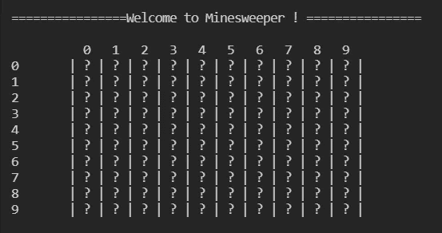
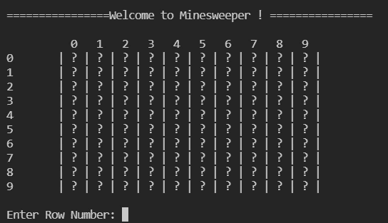
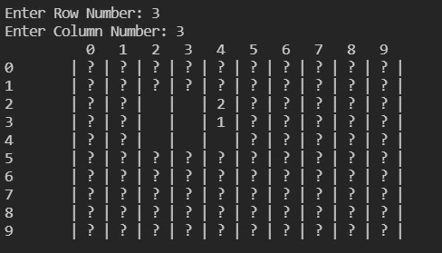
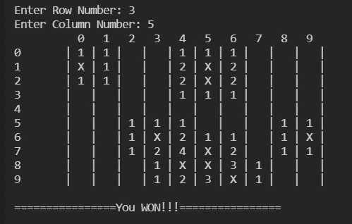
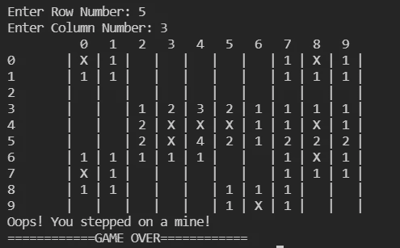

# 通过构建扫雷游戏学习 Java

> 原文：<https://betterprogramming.pub/learn-java-by-building-the-minesweeper-game-98f20a510254>

## 如果你是一个 Java 初学者，想要一些实践，制作一个游戏可能是一个有趣的学习方式

这篇文章包含了一步一步的指南来构建一个基于命令行的扫雷游戏！

如果你是一个 Java 初学者(就像我开发这个游戏时一样)并且想要一些实践，制作一个游戏可能是一种有趣的学习方式！这段代码将是初学者友好的，所以享受:)

我希望你熟悉扫雷舰的规则，如果没有你可以先检查一下[这个](https://www.wikihow.com/Play-Minesweeper)。

# **逻辑**

1.  众所周知,“扫雷”是由一系列细胞组成的，细胞后面隐藏着几枚地雷。我们的目标是找出所有不携带炸弹的细胞。为了制作矩阵(或游戏区域),我们将使用两个 2D 数组——第一个包含所有的数字和炸弹，第二个只包含要在屏幕上显示的数据。
2.  炸弹的安装和放置将以随机的方式进行。
3.  在每一回合，玩家/用户将被提示输入行号和列号。选定的细胞会暴露出来，如果后面有炸弹，游戏就结束了。如果没有，该细胞的邻居将显示在屏幕上，根据这一点，用户可以发挥他的下一次机会。

# **我们来编码吧！**

第 1 步——让我们从创建一个“扫雷”类开始，并向它添加下面的主函数。除了 main 函数之外，我们还要初始化两个 2d 数组，如逻辑点 1 所述。

“扫雷舰”级和“主”方法

每次我们运行代码时，main 方法都会创建一个属于类`MineSweeper`的对象。这个类将包含决定游戏的方法和规则。

步骤 2——现在让我们继续向游戏中添加方法。您可以添加的第一个方法是`startGame`方法。

开始游戏()

这种方法将:

*   显示入门级游戏/介绍消息。
*   设置扫雷操场。
*   运行游戏，直到玩家赢/输。
*   显示最终消息。

第三步——`setupField`方法将被用来在游戏区设置地雷。目前，我已经在战场上放置了 10 枚炸弹。

正如逻辑点 2 中所解释的，我们将为行和列值选择 0–9 的随机整数，并在每个位置放置一个炸弹。

设置字段()

在这个方法的最后，我们将调用`buildHidden`来构建隐藏矩阵。

步骤 4-设置地雷后，我们将建立我们的隐藏矩阵，包括地雷邻近邻居编号和地雷。

buildHidden()

这背后的逻辑非常简单。我们将选择每个单元，并计算其所有相邻单元中存在的炸弹数量。该值将保存在隐藏的矩阵单元格中。

步骤 5 —回头看看步骤 2，我们现在可以完成`displayVisible`方法了。这个方法的目标是向玩家显示游戏的当前进度(每次移动后)。

显示可见()

步骤 6—`playMove`方法将允许玩家选择一个单元格，并显示所选单元格及其邻居。如果选定的单元格包含地雷，将显示“游戏结束”消息。这个方法将在每回合后被调用。

playMove()

第 7 步-接下来的两个函数:'`fixVisible`'和'【T3]'将有助于改变我们隐藏和可见的二维数组。

fixVisible()和 fixNeighbours()

第 8 步——现在是倒数第二步，让我们构建`checkWin`方法。这个方法将被用来检查玩家是否躲避了游戏场上的所有地雷。

checkWin()

它将返回一个布尔值给步骤 2 中的`startGame`函数。

步骤 9——最后，让我们构建`displayHidden`方法。每当玩家在游戏中输了或赢了，都会调用这个方法。

显示隐藏()

将显示我们隐藏的二维数组，其中将包含所有的地雷和地雷附近的邻居号码。

现在，您只需保存文件，编译代码，执行它并开始播放！！

[这里](https://github.com/SohamBhure/Minesweeper)是完整代码，供参考。

# 输出

这里有一些输出图像，让你了解一下游戏编译和执行后的样子。

执行代码后的游戏视图

玩家可以通过选择矩阵中的一个单元开始游戏

经过一系列准确的选择，玩家可以赢得游戏！

不正确的选择会导致失败！

# 未来新增内容

虽然这个游戏是可玩的，但我们可以添加多种增强功能来改善逻辑和游戏体验。以下是一些建议:

1.  根据难度等级改变游戏区域；可以提示玩家输入难度级别，根据该难度级别可以增加地雷的数量或游戏场地的大小。
2.  改善逻辑，从而提高游戏体验。可以做一些更改来提高代码的逻辑效率。通过玩游戏和仔细检查代码来找出它们！
3.  想到添加一个 UI。目前，这个游戏是在命令行上玩的。您可以添加一个漂亮的 UI 来改善用户体验。

这些只是几个明显值得注意的建议。但是，记住*天空才是极限*！

希望你喜欢这篇文章！您可以在这里找到完整的代码:

 [## GitHub-sohambure/扫雷

### 此时您不能执行该操作。您已使用另一个标签页或窗口登录。您已在另一个选项卡中注销，或者…

github.com](https://github.com/SohamBhure/Minesweeper)