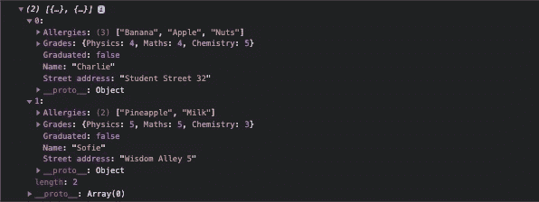
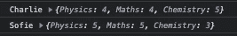

# 4 分钟学会 JSON

> 原文：<https://betterprogramming.pub/learn-json-in-5-minutes-49c0a0bfd845>

## JSON 到处都在用。让我们通过理解它来提高我们的编码技能


由[欧文·史密斯](https://unsplash.com/@mr_vero?utm_source=medium&utm_medium=referral)在 [Unsplash](https://unsplash.com?utm_source=medium&utm_medium=referral) 上拍摄的照片。

JSON 代表 JavaScript 对象符号。

简单地说，JSON 是一种基于文本的数据格式。它用于表示基于 JavaScript 对象语法的结构化数据。有效的 JSON 同时总是有效的 JavaScript。

在您作为软件开发人员的职业生涯中，您将会一直使用 JSON。做好准备！

今天，您将了解 JSON 是什么，为什么它如此流行，如何产生 JSON，以及如何在 JavaScript 中使用它。

# 是什么让 JSON 如此受欢迎？

JSON 如此受欢迎是因为:

*   由于文件很小，所以它非常轻便。
*   人类读/写 JSON 很容易。
*   JSON 和 JavaScript 配合得非常好。任何有效的 JSON 也是自动有效的 JavaScript。
*   几乎每种编程语言都以某种方式支持解析 JSON。

厉害！让我们更深入地了解 JSON 的世界。

# 使用 JSON

## JSON 支持不同的数据类型

JSON 帮助您表示结构化数据，因此它需要能够处理不同类型的数据。

JSON 本身支持以下数据类型:

*   琴弦:`"Cat"`、`"Dog"`、`"How are you?"`
*   任意格式的数字:`1000`、`3.141`、`6.022e23`
*   布尔值:`true`或`false`
*   Null(没有任何意义):`null`
*   数组(即可以包含上述任何内容的列表):`[3, 2, 1]`，`["Banana", "Apple", "Orange"]`
*   对象(即花括号内逗号分隔的*键-值对*):键必须用双引号括起来，但是值可以是任何类型。例如:`{"name": "Matt"}`、`{"rainy": true, "precipitation": 1.22}`。

使用 JSON 最常见和实用的方法是存储数组、对象或对象数组。

下面你会看到一些有用的例子。

## 如何制作 JSON

在编写 JSON 之前，您需要一个 JSON 文件。

为了创建一个 JSON 文件，给一个文件命名，并确保扩展名是`.json`。比如`student.json`。

接下来，让我们为文件创建一个简单的 JSON 对象(在`{}`之间用逗号分隔的键值对)。在这个对象中，您存储了学生的一些基本信息:

作为 JSON 对象存储在 JSON 文件中的学生信息。注意 JSON 的可读性有多强！

看看 JSON 的可读性有多强！

在跳到下一部分之前，让我们快速浏览一下与上面的 JSON 对象相关的几个要点:

*   上面是一个 JSON 对象。因此，它需要用花括号(`{}`)括起来。
*   该对象只能存储逗号分隔的*键-值*对(例如`"Name": "Charlie"`)，其中键必须用双引号括起来！例如，编写类似`{name: "Jack"}`的 JSON 对象是不可能的。
*   注意如何在对象中创建 JSON *对象(例如，请看`"Grades"`)*。*这是 JSON 的一个强大特性，要牢记在心！*

现在您知道了 JSON 是什么，它是如何工作的，以及如何生成 JSON。

接下来，让我们用一个如何在 JavaScript 中使用 JSON 的例子来完成本教程。

# 例如:JSON 和 JavaScript

让我们创建另一个 JSON 文件。这次它包含了两个学生的信息，因此得名`students.json`。

因为您希望在 JSON 文件中存储多个 student 对象，所以您创建了一个包含两个对象的 JSON 数组:

关于学生 Charlie 和 Sofie 的信息，以 JSON 数组的形式，包含两个对象。

最酷的部分来了:正如我前面提到的，*有效的 JSON 自动成为有效的 JavaScript* 。这意味着您可以直接复制上面的所有内容，并将其粘贴到您的 JavaScript 文件中。

例如，让我们通过将上面的 JSON 复制粘贴到一个名为`students.js`的新文件来创建一个 JavaScript 数组(您也可以[打开开发人员控制台](https://balsamiq.com/support/faqs/browserconsole/#:~:text=To%20open%20the%20developer%20console,(on%20Windows%2FLinux).)，粘贴下面的 *JavaScript* 代码并在那里执行):

现在您可以在 JavaScript 端使用`students_data`了。例如，您可以通过运行以下命令来打印`students_data`:

```
console.log(students_data)
```

输出:



学生登录 JavaScript 控制台的 JSON 数据。

例如，您也可以打印学生的成绩列表:

```
students_data.forEach(stud => console.log(stud.Name, stud.Grades))
```

输出:



JavaScript 控制台登录的学生成绩的 JSON 数据。

# 在 JavaScript 中使用 JSON 字符串

完成之前的最后一件事:在 JavaScript 中使用 JSON 时，大多数情况下，JSON 数据*是以字符串*的形式给出的。但是，在处理 JSON 时，字符串是没有用的。

幸运的是，JavaScript 有一个名为`JSON.parse`的内置特性，允许您轻松地将 JSON *字符串*转换为 JSON *对象*。例如，让我们创建一个 JSON 字符串:

```
**const** data_str = `[{"name": "Jack"}, {"name": "Matt"}]`
```

由于`data_str`是一个字符串中的 JSON 对象，您不能对它做太多事情。它现在像 JavaScript 中的常规字符串一样工作。此时，您将其转换为实际的 JSON 对象:

```
**const** data_JSON = JSON.parse(data_str)
```

现在数据被转换为 JSON，例如，您可以打印第一个人的姓名，以查看转换是否成功:

```
console.log(data_JSON[0].name)
```

输出:

```
Jack
```

现在，您已经了解了 JSON 的所有重要内容。恭喜你。

# 结论

JSON 是一种轻量级的可读数据格式，可以很好地与 JavaScript 一起工作。JSON 是一种流行的表示结构化数据的方式。

有效的 JSON 是*总是*自动有效的 JavaScript。

您几乎可以将任何东西存储为 JSON:字符串、布尔值、数字、数组、对象和一个`null`。最常见的方法是存储数组、对象或对象数组。

JSON 几乎随处可见，因为几乎每种编程语言都支持解析 JSON。

我希望这篇文章对你有用。感谢阅读。

# 资源

[](https://www.json.org/json-en.html) [## JSON

### 编辑描述

www.json.org](https://www.json.org/json-en.html) [](https://developer.mozilla.org/en-US/docs/Learn/JavaScript/Objects/JSON) [## 使用 JSON

### 在本文中，我们给出了在程序中使用 JSON 的简单指南，包括如何创建和解析 JSON…

developer.mozilla.org](https://developer.mozilla.org/en-US/docs/Learn/JavaScript/Objects/JSON)