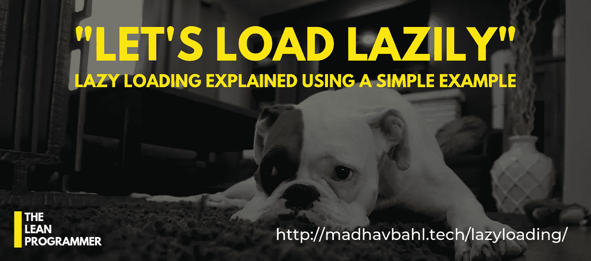
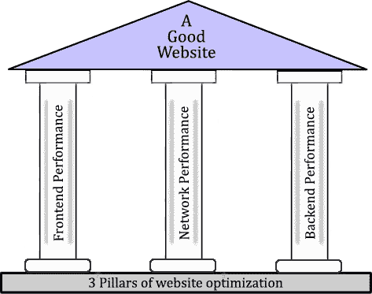
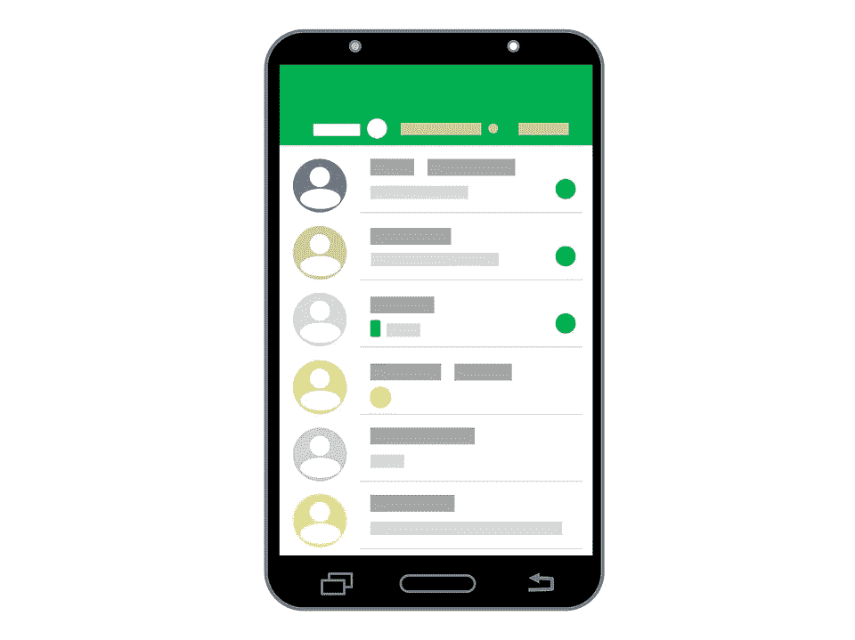
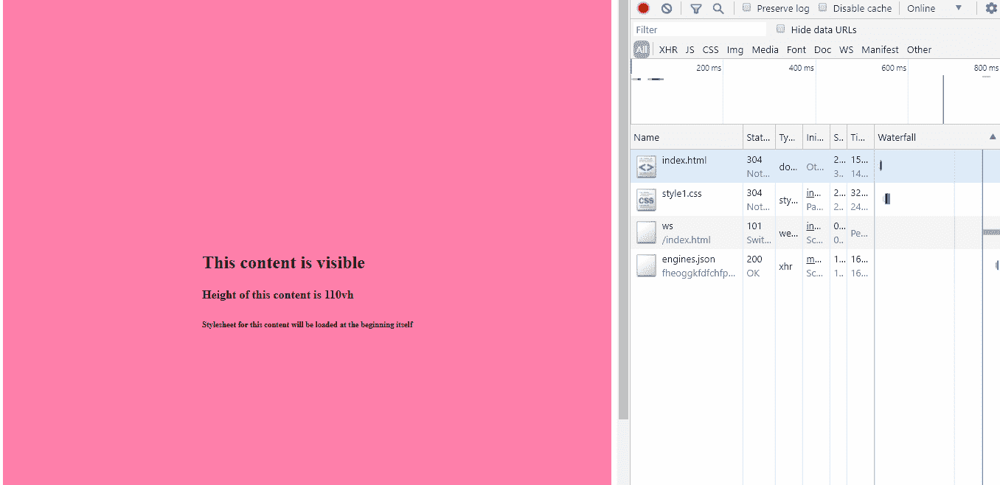

# 通过一个简单的例子学习延迟加载

> 原文：<https://betterprogramming.pub/learn-lazy-loading-through-a-simple-example-b2c318aa0624>

## 让我们只在用户向下滚动后加载第二个沉重的 CSS 文件

说到优化网站以获得更好的性能，懒加载是我们不能忽视的一个概念。但是在开始之前，我们先来了解一些性能提升的背景。

# 网站优化的三大支柱

网站优化是一个庞大的概念，包括优化前端，后端，和网络。

优化这三个支柱中的每一个都是非常重要的，如果我们想让我们的网站在性能方面做得更好，我们在优化它们时应用的每一个概念都是非常重要的。

前端性能可以通过各种技术来提高，如优化代码、最小化文件、缩小 CSS、丑化 JS、缩小图像、延迟加载、缓存等。

所以你可能已经猜到，在优化前端以获得更好的性能时，延迟加载是一个重要的概念。

# 我和你之间的秘密

好吧，我要告诉你一个小秘密，我能指望你会保守这个秘密吗，就在我和你之间？

酷，我相信你！所以，我没有为我的新博客找到灵感，昨天，我的一个朋友(他在一家远程创业公司工作)问我:

“嘿 Madhav，我的老板希望我在为他们的网站获取数据时应用延迟加载，我谷歌了延迟加载的定义，但没有理解它，你能以外行的术语解释给我听吗？”

惰性加载，作为一个概念，非常容易理解，但是它可以根据你的用例以不同的方式实现。所以，我向他解释了这个概念，在这之间，我有一个顿悟的时刻。

我想，为什么不写一个关于它的博客，以便更多正在与这个概念作斗争的人可以得到帮助？

很抱歉突然写下这个故事，但我希望你明白我想说的。

我在这里想表达的是，如果你在谷歌上搜索后仍然不理解一个概念，为什么不去尝试一下呢？我也许可以用更简单的术语来解释，这样你就能理解这个概念，我也可以为我的新博客出个主意！

所以，是的，如果你觉得我可以帮助你，伸出手，我很乐意帮助(除非答案可以很容易地在谷歌上找到，如果是这样的话，谷歌一下！)

好了，马达夫，你让我厌烦了，现在回到正题！

啊，不好意思，给你。

# 延迟加载的概念

暂时，忘掉你在大学时塞进去的那些大定义，试着去理解这个概念。(别担心，我们也会回到定义上来。)

我们举个例子，假设你在做一个聊天应用(就像 Whatsapp 一样)，想法很简单；用户可以进行任意数量的对话(取决于他们有多少联系人)。

因此，每当他们打开应用程序，他们的对话就会加载每个对话中的最新消息，并显示在列表中。

事情很简单，对吗？我们所要做的就是将完整的对话列表存储在数据库中，一旦用户打开应用程序，我们就获取该对话列表。

生活没那么容易吧？如果用户是一个巨大的名人呢？如果他们有成千上万的联系人，并且和他们都有联系呢？

在这种情况下，只要他们打开应用程序，整个对话列表就会从数据库中提取出来，这显然非常大，需要很长时间才能加载。用户对此很恼火，卸载了我们的 app，使用了更好的应用。

这是一个相当严重的问题，我们能做什么？

好问题。我料到你会问这个问题，想一想，我们如何解决这个问题？(显然，答案是:“通过使用延迟加载”，但我需要考虑我们如何在这个场景中应用它。)

好吧，我给你五分钟时间考虑，同时，我去喝杯茶。(是的，我不太喜欢咖啡。)

解决方法很简单，因为加载整个会话列表需要很多时间，所以我们不会加载整个会话列表。

是的，就是这样，这就是懒惰装载背后的整个概念。一旦用户打开我们的应用程序，我们将只加载我们需要的东西。不多不少。

因此，在这种情况下，我们将加载，比方说，用户屏幕上可以显示的聊天项目的三倍(取决于它们的屏幕大小)，并呈现它。

一旦呈现出来，我们将再次请求加载更多的项目，一旦它们被加载，我们将请求更多的项目，以此类推，直到所有的项目都被加载。

现在，由于我们不是一次请求所有的对话，而是只请求 10-12 个项目(例如)，用户将很快得到响应，他们可以开始与应用程序进行交互。现在他们不用等那么久了，对吗？

哇，马达夫，这太简单了！

我知道，我是一个好老师。

哈哈，开个玩笑。既然我们已经理解了它的意思，让我们也来看看它的定义。

惰性加载是计算机编程中常用的一种设计模式，它将对象的初始化推迟到需要它的时候。

我希望这个定义现在看起来也很简单，因为你知道这个概念。这个定义基本上是说，我们只在实际需要的时候才加载资源。

唷，马达夫，这很简单，但我想看到它的实际应用，帮我一下。

是的，是的，冷静下来，我们会谈到它，但首先，让我们快速看看为什么我们需要惰性加载。

# 为什么偷懒装？

让我们假设你正在加载用户当前看不到的东西，用户可能永远也看不到它，你不知所措，

1.  您正在浪费宝贵的时间，这些时间本可以用来只呈现当前显示给用户的数据。他们可能会对缓慢的加载感到恼火，甚至离开网站或卸载应用程序。
2.  你在浪费宝贵的数据。我同意现在很多人有无限的数据，但应用程序必须为所有用户优化，假设某个特定的用户群正在使用有限的数据计划，加载他们可能永远不会看到的东西将是浪费他们的钱。
3.  处理能力的浪费，我同意它可能相对较小，但是，为什么要浪费它呢？
4.  在网站或 web 应用程序的情况下，CSS 是渲染阻塞的，直到 CSSOM 被完全创建，渲染树才会被创建，所以只加载真正需要的。

现在我想你真的明白了它的重要性，所以让我们转到这个博客的最后也是最有趣的部分。

# 编码时间到了

现在，我们已经从理论上理解了延迟加载的概念，让我们试着实现它，看看它实际上是如何工作的。

耶，我太兴奋了，在那个巨大的理论之后，我们终于要编码了。

因此，为了了解事情是如何工作的，我们将创建一个非常简单的网站，它将有两个部分。

一个主要部分(高度:110vh)，它将在网站加载时对用户可见，另一个次要部分(高度:110vh)，只有当用户向下滚动时才可见。

在这个例子中，我们将为它们中的每一个提供两个单独的样式表，并且只在用户开始向下滚动时才加载第二个样式表。

请注意，这只是一个例子，在现实世界中，我们不会为用户滚动时必须显示的内容创建两个单独的样式表。

为什么？因为，如果出现网络连接错误，用户就无法获得第二个样式表，第二部分的内容就会以非常糟糕的方式出现。

但是，我们可以使用相同的原理来延迟加载图像，或者延迟加载页面加载后用户不直接交互的数据，这些数据必须从服务器获取(就像我们在开始时看到的聊天应用程序示例中的对话列表一样)。)

# 第一部分。编码我们的 HTML

正如我们所讨论的，我们将添加两个部分，一个包含类`primary`，另一个包含类`secondary`，我们只需要添加到第一个样式表的链接。

代码如下:

Gist 网址:[https://gist . github . com/MadhavBahlMD/4a 8 f 8d 77d 7 bb 29 fa 089 b 9 BF 52 b 865540](https://gist.github.com/MadhavBahlMD/4a8f8d77d7bb29fa089b9bf52b865540)

如你所见，我们这里有两个部分，每个部分的高度为 100vh，每个部分内部有一个内部 div，其内容将居中。

另外，在`<head>`中，您可能已经注意到我们只包含了`style1.css`文件。当用户向下滚动时，我们将动态获取`style2.css`。

# 第二部分。让我们添加第一个样式表

这个样式表将使`primary`部分的高度`110vh`和背景颜色`ff80ab`。

此外，我们必须将内部 div 垂直和水平居中。

Gist 网址:[https://gist . github . com/MadhavBahlMD/ECB 00 b 01 aafa 72 B2 F2 c 49 AFE 8 aad ce1 e](https://gist.github.com/MadhavBahlMD/ecb00b01aafa72b2f2c49afe8aadce1e)

# 第三部分。添加第二个样式表

这将类似于`style1.css`，但背景颜色`d1c4e9`。

Gist 网址:[https://gist . github . com/MadhavBahlMD/2e 10 FFE 7159144590276 FB 4848 e 63147](https://gist.github.com/MadhavBahlMD/2e10ffe7159144590276fb4848e63147)

好了，现在我知道你们所有人会问我为什么我没有给 secondary 部分的内部 div 相同的类，`primary-inner`，尽管它们有相同的风格。

这只是因为我想为每个示例演示两个完全不同的样式表，当然，在现实世界的场景中，我们会尽可能地重用代码。

好了，现在是展示时间了，我们最后要添加负责动态加载第二个样式表的 JS。

# 第四部分。添加脚本

这是主要部分。想法是懒惰地加载“最初不可见”的内容，我们开始吧。

Gist 网址:[https://gist . github . com/MadhavBahlMD/e 5 C2 de 2d 705650 AE 047 C2 b 23255 C5 D4 b](https://gist.github.com/MadhavBahlMD/e5c2de2d705650ae047c2b23255c5d4b)

因此，如果我们仔细阅读代码，很容易理解我们基本上是在用户向下滚动后动态添加新的样式表。

为了检测向下滚动，我们使用了`window.onscroll`事件，并确保调用只进行一次，我们维护了一个标志变量`scrollFlag`，它在第一次调用`onscroll`时被设置。

为了加载样式表，我们创建了一个函数来检查是否支持 direct `document.createStylesheet`方法。如果是，那么我们使用它，否则，我们创建链接标签并把它附加到`<head>`标签中。

# 就这样，让我们看看它的实际效果

所以，我们完成了代码。现在，要查看它的运行情况，请在 web 浏览器中打开`index.html`,检查 element，并转到 networks 选项卡。

在这里，您会注意到只调用了`style1`样式表，一旦您向下滚动，`style2`样式表也会被调用。

给你:

注意我们滚动后“style2.css”是如何加载的

所以，差不多就是这样！希望这篇博客对你有所帮助。