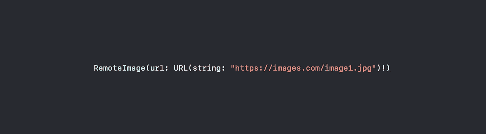
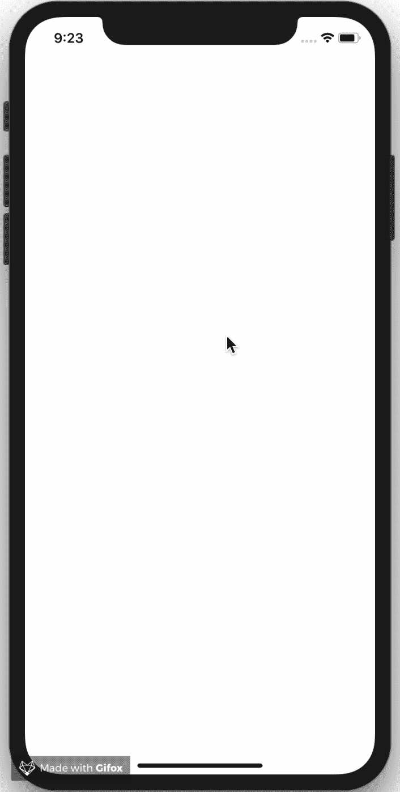

# 学习和掌握 SwiftUI 中的远程图像视图

> 原文：<https://betterprogramming.pub/learn-master-%EF%B8%8F-remote-image-view-in-swiftui-854f8fde592c>

## 获取、缓存、错误和加载视图



虚构`*RemoteImage*` *初始值设定项*

**更新 2019/08/14:** 现作为 [Swift 包](https://github.com/crelies/RemoteImage)提供🚀

我想实现一个 [SwiftUI](https://developer.apple.com/documentation/swiftui) 挂件的 UIKit 远程图像视图，我们在我目前的雇主创建。我不能分享代码，但请相信我，与下面的 SwiftUI 实现相比，我们的 UIKit 代码更复杂，使用外部框架，并且有更多的代码行。

# 目标

让我们先简要描述一下这篇文章的目标:

我们的目标是创建一个在给定 URL 获取图像的视图，在获取过程中显示加载视图，缓存图像，使用现有的 SwiftUI 图像视图，并在需要时显示错误视图。

考虑到这一点，我们开始编码吧。

# 实施

该代码主要由三部分组成。

## 1.RemoteImageState

远程图像视图可以有三种不同的状态:错误、图像和加载。它应该能够使自己依赖于它的当前状态。

```
enum **RemoteImageState** {
    case error(_ error: Error)
    case image(_ image: UIImage)
    case loading
}
```

## 2.RemoteImageService

我们需要一个服务来获取和缓存图像。除此之外，它还应该管理相关远程映像的当前状态。

**获取图像**

HTTP 请求是使用标准工具(`URLSession`和`URLRequest`)结合简单数据任务发布者和接收器订阅者(结合框架)完成的。

**缓存图像**

用`NSCache`完成缓存。简单吧？一个 SwiftUI 应用程序中的所有远程图像应该共享同一个缓存，因此缓存是静态的。缓存可以通过它的`removeAllObjects()`功能轻松清除。

**状态变化**

该服务符合`ObservableObject`协议，并通过简单的`PassthroughSubject` 将在`fetchImage`功能中做出的状态改变传播给每个订户。

```
final class **RemoteImageService**: **ObservableObject** {
    private var cancellable: AnyCancellable?

    **static let cache = NSCache<NSURL, UIImage>()**

    var state: RemoteImageState = .loading {
        didSet {
            objectWillChange.send()
        }
    }

    let objectWillChange = **PassthroughSubject**<Void, Never>()

    **func fetchImage(atURL url: URL) {**
        **cancellable?.cancel()**

        **if let image = RemoteImageService.cache.object(forKey: url as NSURL) {**
            **state = .image(image)**
            **return**
        **}**

        let urlSession = URLSession.shared
        let urlRequest = URLRequest(url: url)

        cancellable = urlSession.dataTaskPublisher(for: urlRequest)
            .map { UIImage(data: $0.data) }
            .receive(on: RunLoop.main)
            .sink(receiveCompletion: { completion in
                switch completion {
                    case .failure(let failure):
                        **self.state = .error(failure)**
                    default: ()
                }
            }) { image in
                if let image = image {
                    **RemoteImageService.cache.setObject(image, forKey: url as NSURL)**
                    **self.state = .image(image)**
                } else {
                    **self.state = .error(RemoteImageServiceError.couldNotCreateImage)**
                }
            }
    **}**
}
```

## 3.远程图像

最后一个组件是视图本身。它使用`RemoteImageService`的一个实例，并使自己依赖于服务中的状态。

初始化器期望每个状态(错误、图像和加载)都有一个 URL 和一个`ViewBuilder`块。

**获取图像**

一旦`LoadingView`出现在屏幕上，就会触发`RemoteImageService`实例的`fetchImage`功能。

**定制图像外观**

在内部,`RemoteImage`视图使用 SwiftUI 的现有图像视图。为了能够定制图像视图的外观，它通过相关的`ViewBuilder` 块暴露出来。

**出现错误**

如果出现错误，则调用错误视图`ViewBuilder`。该错误被传递到`ViewBuilder`模块，并可用于创建一个错误视图。

**任意视图**

在这个实现中，我必须使用类型擦除包装器`AnyView` 来擦除开关中返回的不同类型的视图。

正常情况下，的群体观点可以解决那种问题。但是组视图的内容块是一个`ViewBuilder`块，你不能在`ViewBuilder`块中使用下面的 switch 语句(一个带有相关值的枚举)。

```
struct **RemoteImage<ErrorView: View, ImageView: View, LoadingView: View>**: View {
    private let url: URL
    private let errorView: (**Error**) -> ErrorView
    private let imageView: (**Image**) -> ImageView
    private let loadingView: () -> LoadingView
    [@ObservedObject](http://twitter.com/ObservedObject) private var service: RemoteImageService = RemoteImageService()

    var body: **AnyView** {
        switch service.state {
            case .error(let error):
                return **AnyView**(
                    errorView(**error**)
                )
            case .image(let image):
                return **AnyView**(
                    **self.imageView(Image(uiImage: image))**
                )
            case .loading:
                return **AnyView**(
                    loadingView()
                    **.onAppear {
                        self.service.fetchImage(atURL: self.url)
                    }**
                )
        }
    }

    init(url: URL, [**@ViewBuilder**](http://twitter.com/ViewBuilder) errorView: [@escaping](http://twitter.com/escaping) (**Error**) -> ErrorView, **@ViewBuilder** imageView: [@escaping](http://twitter.com/escaping) (**Image**) -> ImageView, [**@ViewBuilder**](http://twitter.com/ViewBuilder) loadingView: [@escaping](http://twitter.com/escaping) () -> LoadingView) {
        self.url = url
        self.errorView = errorView
        self.imageView = imageView
        self.loadingView = loadingView
    }
}
```

# 例子

最后但同样重要的是，我们来看一个使用示例。

创建的远程图像视图易于使用。只需将一个 URL、你的错误视图、你的图像和你的加载视图传递给初始化器。

```
struct ContentView: View {
    private let url = URL(string: "[https://images.unsplash.com/photo-1524419986249-348e8fa6ad4a?ixlib=rb-1.2.1&ixid=eyJhcHBfaWQiOjEyMDd9&auto=format&fit=crop&w=1950&q=80](https://images.unsplash.com/photo-1524419986249-348e8fa6ad4a?ixlib=rb-1.2.1&ixid=eyJhcHBfaWQiOjEyMDd9&auto=format&fit=crop&w=1950&q=80)")!

    var body: some View {
        **RemoteImage(url**: url, **errorView**: { error in
            Text(error.localizedDescription)
        }, **imageView**: { image in
            image
            **.resizable()
            .aspectRatio(contentMode: .fit)**
        }, **loadingView**: {
            Text("Loading ...")
        }**)**
    }
}
```

看看我是如何定制图像的外观的:我使它可调整大小，并改变内容模式以适应它。



显示 iPhone XR 模拟器结果的动画图像

# 结论

恭喜你！您已经完成了关于创建远程图像 SwiftUI 视图的课程。

感谢阅读这篇文章。我希望你继续阅读我的文章。敬请关注。

在 https://github.com/crelies/RemoteImage-SwiftUI 的 GitHub 上看到