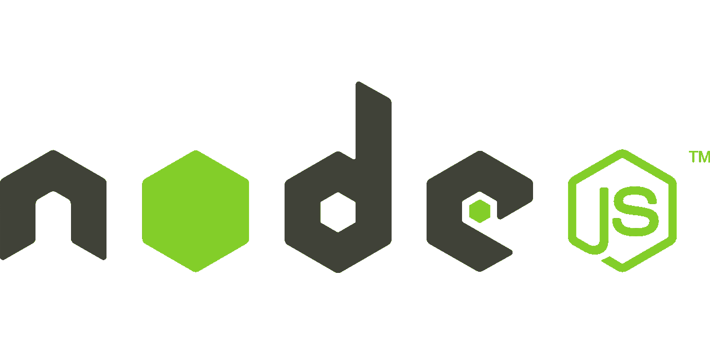
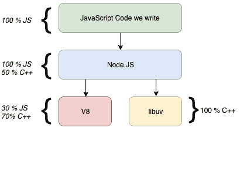
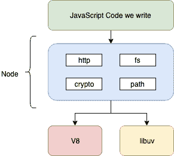
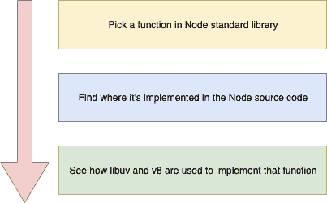
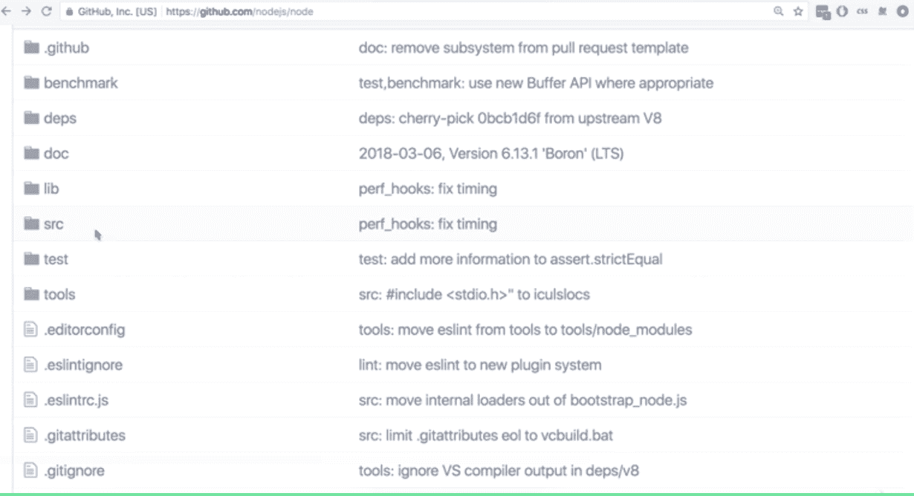
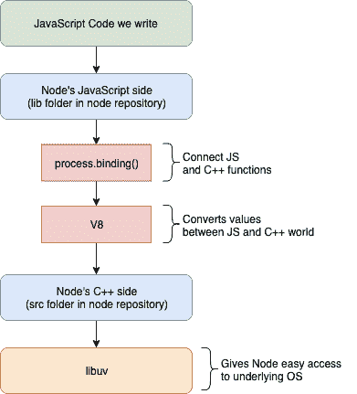

# 节点。引擎盖下的 Js

> 原文：<https://betterprogramming.pub/learn-node-js-under-the-hood-37966a20e127>

## 节点是由什么构成的。Js 可能吗？



## 误解

节点。Js 只是另一个基于 JavaScript 框架的前端浏览器，像 Angular JS 和 React JS。

## **现实**

节点。Js 是*跨平台 JavaScript 运行时环境*，它在服务器端脚本的浏览器之外执行 JavaScript 代码*。*

够了吗？绝对不会。

编写 JavaScript 代码，让操作系统神奇地编译并执行您的代码，然后让它监听 http 请求和许多其他服务器端作业，这并不像看起来那么简单。

操作系统最重要的是，它连 JavaScript 和 Node.Js 都不懂，它只懂 C++，可能会给你一个大学考通宵的甜蜜回忆！

你可能会想节点是如何？Js 在操作系统上执行 JavaScript 代码？是节点。Js a " *撒旦"*还是"*救世主"？*

节点是什么？Js do？请看下图:



V8 和 libuv 看起来像是大字预警吗？

让我们来理解他们。

节点中有三个领域。Js 应用程序:

1.  我们编写的 JavaScript 代码。
2.  V8 是由 Google 开发的，它基本上是在执行之前将 JavaScript 代码直接编译成本机 C++代码。
    libuv 是一个多平台 C++库，支持基于异步 I/O 的操作，如文件系统、网络和并发。
3.  节点。Js world，它作为一个接口，执行我们在 C++的帮助下编写的 Js 代码，并让我们访问用 libuv 和 v8 库编写的 API

下图将帮助您理解这三个组件是如何交互并生成 Node 的。有可能。它还展示了 Node。Js 集成了一些常见的模块，如 http、fs、crypto 等，这些模块实际上是在 libuv 库中编写的，并为 JavaScript 提供 API。



让我们深入这个概念，尝试更好地理解事物。



我们要检查节点。Js 的 [crypto](https://nodejs.org/api/crypto.html) 库。

在下图中，您可以看到[节点的目录结构。GitHub 上的 Js 项目](https://github.com/nodejs/node)。



有两个主要目录:

1.lib 是我们在开发应用程序时可以访问的 js 领域。

2. **src** 是内部使用 libuv 和 v8 库的 c++世界。

我们以 crypto 中用于密码加密的 pbkdf2 库为例。

我们的主要目标是了解节点。Js 将 JS 代码与 C++连接起来，在内部使用 libuv 和 v8 库来做事。

遵循以下建议，确保你不会远离本文的主题:

*   不要详细讨论这个 pbkdf2 方法是如何工作的。
*   看到 C++代码不要大惊小怪。
*   不要纠结于 **libuv** 和 **v8** 库的字面用法。

下面是加密库 [pbkdf2](https://github.com/nodejs/node/blob/master/lib/internal/crypto/pbkdf2.js) 的 JS 版本。

下面用 JavaScript 在 lib 目录 pbkdf2 中编写的方法调用 src 目录的 _pbkdf2，它是用 c++编写的:

```
const { pbkdf2: _pbkdf2 } = internalBinding('crypto');

function pbkdf2(password, salt, iterations, keylen, digest, callback) {
  if (typeof digest === 'function') {
    callback = digest;
    digest = undefined;
  }

  ({ password, salt, iterations, keylen, digest } =
    check(password, salt, iterations, keylen, digest));

  if (typeof callback !== 'function')
    throw new ERR_INVALID_CALLBACK(callback);
  //calling the src c++ version of pbkdf2
  handleError(_pbkdf2(keybuf, password, salt, iterations, digest, wrap),
              digest);
}
```

这张图表准确地解释了正在发生的事情:



`Process.binding`是 JavaScript 世界连接 C++代码的桥梁。

下面是[加密库](https://github.com/nodejs/node/blob/master/src/node_crypto.cc)的 c++版本。

src 目录的 node_crypto.cc C++文件中下面的方法被上面 lib 目录的 pbkdf2 调用。

SetMethod 正在将方法 pbkdf2 作为“PBKDF2”向外界导出。

```
inline void PBKDF2(const FunctionCallbackInfo<Value>& args) {
  auto rv = args.GetReturnValue();

  CHECK(args[4]->IsString());  // digest_name
  std::unique_ptr<PBKDF2Job> job(new PBKDF2Job(env));

  env->PrintSyncTrace();
  job->DoThreadPoolWork();
  rv.Set(job->ToResult());
}
env->SetMethod(target, "pbkdf2", PBKDF2);
env->SetMethod(target, "generateKeyPairRSA", GenerateKeyPairRSA);
```

永远记住*不要*；我们是学习节点。Js，*而不是*加密库。

那么被大肆宣传的 **libuv** 和 **v8** 库在哪里呢？

```
using v8::Array;
using v8::Boolean;
using v8::Exception;
using v8::External;
using v8::False;
using v8::Function;
using v8::Int32;
using v8::String;

#include <uv.h>

int main() {
  loop = uv_default_loop();

  uv_tcp_t server;
  uv_tcp_init(loop, &server);

  struct sockaddr_in bind_addr = uv_ip4_addr("0.0.0.0", 7000);
  uv_tcp_bind(&server, bind_addr);
  int r = uv_listen((uv_stream_t*) &server, 128, on_new_connection);
  if (r) {
    fprintf(stderr, "Listen error!\n");
    return 1;
  }
  return uv_run(loop, UV_RUN_DEFAULT);
}
```

这个 libuv 片段正在初始化一个新的 tcp 连接。如前所述，它可以执行与操作系统相关的任务。

这个 V8 代码片段导入 JS 对象的 c++定义，比如 Array 和 Boolean。V8 引擎将 JS 对象翻译成它们的 C++等价物。

# 下一步是什么？

我们需要详细讨论更多的话题。跟着我，看着这个地方。在接下来的几篇文章中，我将详细介绍以下主题:

*   节点事件循环的内部工作方式
*   是节点。Js 真的单线程吗？
*   你的创业公司是哈比神还是快递？