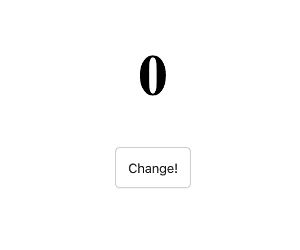
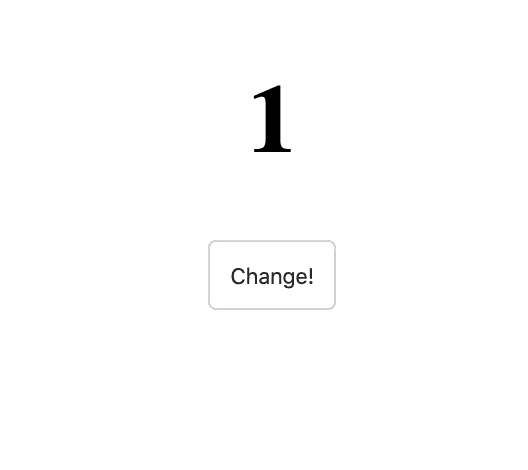
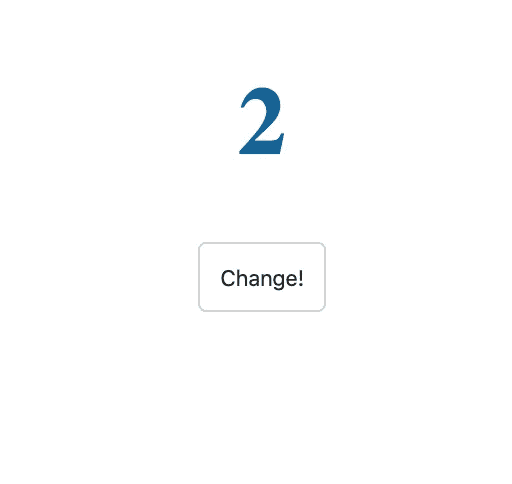

# 在 5 分钟内学会反应钩子

> 原文：<https://betterprogramming.pub/learn-react-hooks-in-5-minutes-f600113e4424>

## React 中最常用的两个钩子:useState 和 useEffect


在这篇文章中，我们将看看 React 中最常用的两个钩子:`useState`和`useEffect`。

如果你不熟悉钩子，这里有 TL；DR:因为钩子，几乎不再需要基于类的组件。钩子允许您“钩入”功能组件中组件的底层生命周期和状态变化。不仅如此，它们还提高了组件的可读性和组织性。

*如果你想对这个主题有一个适当的介绍，你可以在 Scrimba 上查看我们的* [*高级反应课程*](https://scrimba.com/g/greact?utm_source=medium.com&utm_medium=referral&utm_campaign=hooks_article) *。或者，如果你还是初学者，报名参加我们的* [*免费课程*](https://scrimba.com/g/glearnreact?utm_source=medium.com&utm_medium=referral&utm_campaign=hooks_article) *学习 React。*

# 使用状态

让我们从一个功能组件开始。

```
import React from 'react'; 
function App() { 
  return (
    <div> 
      <h1>0</h1> 
      <button>Change!</button> 
    </div>
  ); 
}
```



如你所见，目前还没有什么新奇的东西。我们只是渲染一些文本和一个(无用的)按钮。

现在，让我们导入我们的第一个钩子`useState`，并学习如何在我们的函数组件中处理状态。

由于这个钩子是一个函数，让我们`console.log`我们从它那里得到什么返回。

```
import React, { useState } from 'react'; function App() { 
  const value = useState(); 
  console.log(value); 
  return ( 
    <div> 
      <h1>0</h1> 
      <button>Change!</button> 
    </div>
  ); 
}
```

在控制台中，我们得到一个数组。

当我们把一个论点传递给`useState`时:

```
const value = useState(true);
```

在控制台中，我们得到一个数组，我们的值作为第一个成员:

```
> [true, ƒ()]
```

现在，在我们的组件中，我们可以在`value[0]`访问我们的状态，并在`<h1>`中呈现它，而不是硬编码的值。

```
import React, { useState } from 'react';

function App() {
  const value = useState(0);
  console.log(value); // [0, ƒ()]

  return (
    <div>
      <h1>{value[0]}</h1>
      <button>Change!</button>
    </div>
  );
}
```


我们可以通过使用数组析构来存储来自`useState`钩子的值来改进代码。这类似于更常见的对象析构。如果你不太熟悉对象析构，这里有一个快速回顾:

```
const person = {
  name: 'Joe',
  age: 42
};

// creates 2 const values from person object
const { name, age } = person;
console.log(name); // 'Joe'
console.log(age); // 42
```

数组析构几乎相同，但是使用方括号`[]`代替花括号`{}`。

快速提示:在对象析构中，所创建变量的名称必须与对象中属性的名称相匹配。对于数组析构来说，情况并非如此。一切都是为了秩序。这里的好处是我们可以随意命名这些项目。

使用数组析构，我们可以从`useState()`钩子中获得状态的初始值。

```
import React, { useState } from 'react';

function App() {

  // remember, there's a second item from the array that's missing here, but we'll come right back to use it soon

  const [count] = useState(0);  

  return (
    <div>
      <h1>{count}</h1>
      <button>Change!</button>
    </div>
  );
}
```

好了，我们已经得到了初始状态值。我们如何用钩子改变状态中的值？

还记得`useState()` hook 返回一个有两个成员的数组吗？第二个成员是更新状态的函数！

```
const [count, setCount] = useState(0);
```

当然，您可以随意称呼它，但是按照惯例，它通常以前缀“set-”命名，然后是我们希望更新的状态变量的名称。所以在这种情况下，`setCount`就是。

使用这个功能很简单。只需调用它并传递您希望该状态拥有的新值！或者，就像类组件中的`this.setState`一样，可以传递一个接收旧状态并返回新状态的函数。经验法则:当您需要依靠过去的状态来确定新状态时，请随时这样做。

为了调用它，我们将把它传递给`onClick`事件监听器。就像基于类的组件中的常规`setState`一样，我们可以将状态更新传递给`setCount`。

```
function App() {
  const [count, setCount] = useState(0);

  return (
    <div>
      <h1>{count}</h1>
      <button onClick={() => setCount(prevCount => prevCount + 1)}>
        Change!
      </button>
    </div>
  );
}
```

我们可以通过将状态更新提取到一个单独的函数中来稍微清理一下。

```
function App() {
  const [count, setCount] = useState(0);

  function change() {
    setCount(prevCount => prevCount + 1);
  }

  return (
    <div>
      <h1>{count}</h1>
      <button onClick={change}>Change!</button>
    </div>
  );
}
```

太好了！现在，当我们点击按钮时，我们可以看到计数器在上升。



当然，`useState`可以比这复杂得多，但是我们只有五分钟的时间，所以现在让我们进入下一个钩子。

# 使用效果

与基于类的组件相比，钩子简化了很多事情。以前，我们需要了解一些生命周期方法，以及哪种方法最适合哪种情况。`useEffect` hook 简化了这种情况。如果您希望执行副作用、网络请求、手动 DOM 操作、事件监听器或超时和间隔。

`useEffect`钩子可以像`useState`一样导入。

```
import React, { useState, useEffect } from 'react';
```

为了让`useEffect`做点什么，我们给它传递一个匿名函数作为参数。每当 React 重新渲染这个组件时，它都会运行我们传递给`useEffect`的函数。

```
useEffect(() => { 

  /* any update can happen here */ });
```

整个代码可能是这样的:

```
import React, { useState, useEffect } from 'react';

function App() {
  const [count, setCount] = useState(0);

  function change() {
    setCount(prevCount => prevCount + 1);
  }

  useEffect(() => {
    /* any update can happen here */
  });

  return (
    <div>
      <h1>{count}</h1>
      <button onClick={change}>Change!</button>
    </div>
  );
}

export default App;
```

例如，我们将使用一个漂亮的`npm`包来生成随机颜色。如果你愿意的话，你可以自由地写你自己的，但是对于这个教程，我们只是安装它，`npm i randomcolor`，然后导入。

```
import randomcolor from 'randomcolor';
```

现在让我们用我们关于`useState`钩子的知识在状态中存储一些随机颜色。

```
const [color, setColor] = useState(''); 
// initial value can be an empty string
```

然后，我们可以分配我们已经拥有的计数器的颜色。

```
<h1 style={{ color: color }}>{count}</h1>
```

现在，为了方便起见，让我们在每次点击`Change!`按钮时改变计数器的颜色。`useEffect`每次组件重新渲染都会运行，每次状态改变组件都会重新渲染。

这意味着如果我们编写下面的代码，我们将陷入一个无限循环！这是`useEffect`的一个常见问题

```
useEffect(() => { 
  setColor(randomcolor()); 
});
```

`setColor`更新状态，重新呈现组件，组件调用`useEffect`，运行`setColor`更新状态，重新呈现组件...呀！

当变量`count`改变时，我们大概只有*想要运行这个`useEffect`。*

为了告诉`useEffect`要跟踪哪些变量，我们给出一个这样的变量数组作为第二个参数:

```
useEffect(() => { 
  setColor(randomcolor()); 
}, [count]);
```



这基本上是说“只有当状态改变时，才运行这个效果*。这样，我们可以改变颜色，而不会影响到无限运行。*

# 结论

关于钩子还有很多东西要学，但是我希望你喜欢这五分钟的快速浏览。

要了解更多关于 React 挂钩和 React 的其他强大功能，您可以加入我们[即将推出的高级 React 课程](https://scrimba.com/g/greact?utm_source=medium.com&utm_medium=referral&utm_campaign=hooks_article)的等候名单。或者，如果你正在寻找一个对初学者更友好的方法，你可以看看我们关于 React 的入门课程。