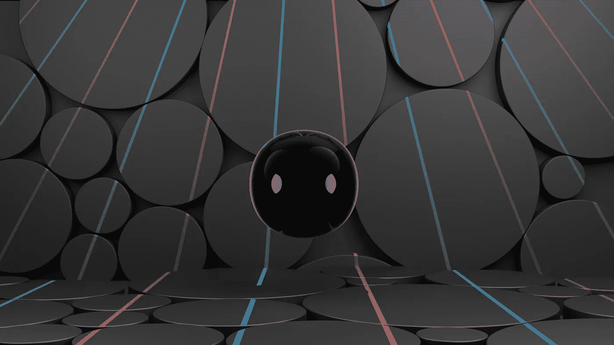
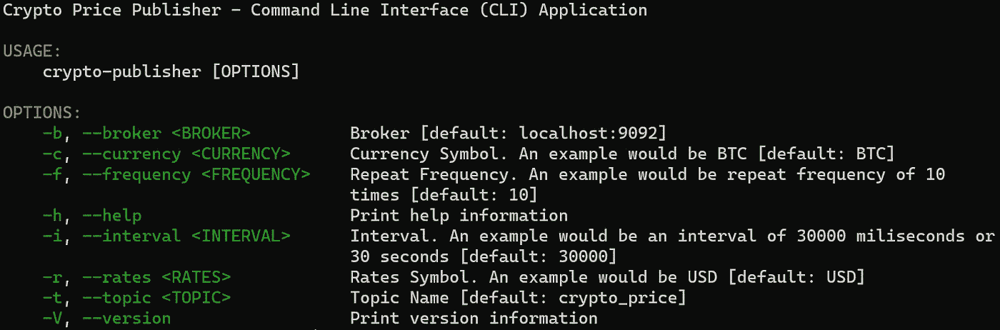

# 通过开发一个加密发行商“Apache Kafka”应用程序来学习 Rust

> 原文：<https://betterprogramming.pub/learn-rust-by-example-develop-crypto-publisher-apache-kafka-application-16b22ab88199>

## 向 Apache Kafka 服务生成或发布 JSON 格式的加密价格消息



图片来自 [Unsplash](https://unsplash.com/@theshubhamdhage)

我总是发现，当学习一门编程语言时，从头开始开发一个应用程序是很有帮助的，一步一步来。本课建立在上一课[的基础上，通过开发应用程序学习 Rust:Crypto Publisher CLI](https://medium.com/geekculture/learn-rust-by-example-develop-crypto-publisher-cli-application-be5af17e03ae)向 Apache Kafka 发布/生成加密价格(如以美元或 BTC-美元表示的比特币价格)。

在开始撰写文章之前，让我们先做一些内务处理，提供一个到 GitHub 资源库的链接，在那里可以找到所有源代码= >[https://github.com/sungkim11/crypto-publisher](https://github.com/sungkim11/crypto-publisher)。

此外，我想展示一下你将使用 Rust 开发什么样的应用程序，如下所示。



# 先决条件

## 阿帕奇卡夫卡

您的计算机上应该安装了 Apache Kafka，或者可以访问 Apache Kafka 服务。我已经用 [APACHE KAFKA 快速入门](https://kafka.apache.org/quickstart)在 Windows 10/11 WSL(Linux 的 Windows 子系统)上安装了 APACHE KAFKA。

## 铁锈板条箱

在我们开始开发应用程序之前，我们需要添加七个 Rust 板条箱:

*   这是一个有效和通用地序列化和反序列化 Rust 数据结构的框架。他们的 crates.io 网址是[https://crates.io/crates/serde](https://crates.io/crates/serde)。Serde 用于将 JSON 数据映射到 Rust 数据结构或 Struct。它用于将 JSON 反序列化或转换为 struct，并将 struct 序列化或转换为 JSON。
*   `Reqwest`:是 Rust 的 HTTP 客户端。他们的 crates.io 网址是[https://crates.io/crates/reqwest](https://crates.io/crates/reqwest)。`Reqwest`是用来向比特币基地发出 HTTPS 请求的 REST API。
*   `Tokio`:是一个编写异步应用的平台。他们的`crates.io`网址是[https://crates.io/crates/tokio](https://crates.io/crates/tokio)。开发异步应用程序需要 Tokio。
*   Clap:它是 Rust 的命令行参数解析器。他们的 crates.io 网址是[https://crates.io/crates/clap](https://crates.io/crates/clap)。开发命令行界面应用需要 Clap。
*   **(新)** `rdkafka`:基于`librdkafka`的完全异步的、支持未来的 Apache Kafka 客户端库 Rust。他们的 crates.io 网址是[https://crates.io/crates/rdkafka](https://crates.io/crates/rdkafka)。
*   **(新)**`log`:Rust 库，提供轻量级日志门面。他们的 crates.io 网址是[https://crates.io/crates/log](https://crates.io/crates/log)。日志用于提供信息性消息。
*   **(新)** `serde_json` : Serde 是一个高效通用地序列化和反序列化 Rust 数据结构的框架。他们的 crates.io 网址是[https://crates.io/crates/serde_json](https://crates.io/crates/serde_json)。Serde_json 用于将 struct 转换回 json。

最后，`Cargo.toml`修改为包括如下七个板条箱:

```
[package]
name = "rust-struct"
version = "0.1.0"
edition = "2021"# See more keys and their definitions at [https://doc.rust-lang.org/cargo/reference/manifest.html](https://doc.rust-lang.org/cargo/reference/manifest.html)[dependencies]
# CLI
serde = { version = "1.0.136", features = ["derive"] }
reqwest = { version = "0.11", features = ["json"] }
tokio = { version = "1.17.0", features = ["full"] }
clap = { version = "3.1.2", features = ["derive"] }# Apach Kafka
rdkafka = { version = "0.25", features = ["cmake-build"] }
log = "0.4.14"
serde_json = "1.0"
```

# 我们要建造什么？

在本文中，我们将开发一个简单的应用程序，然后在应用程序的基础上添加更多的功能:

1.  向 Apache Kafka 服务生成或发布加密价格消息
2.  向 Apache Kafka 服务生成或发布 JSON 格式的加密价格消息

## 1:向 Apache Kafka 服务生成或发布加密价格消息

我们将创建一个新的异步函数来向 Apache Kafka 服务发布或生成消息。

**发布(消息)——**首先，我们为 Kafka producer 客户端配置了设置，其中我定义了最小数量的设置，如下所示:

*   `broker`
*   `message.timeout`
*   安全性(无安全性)

```
let producer: &FutureProducer = &ClientConfig::new()
     .set("bootstrap.servers", broker)
     .set("message.timeout.ms", "5000")
     .set("security.protocol", "plaintext")
     .create()
     .expect("Failed to create producer");
```

配置属性的完整列表可在此处获得= >[https://github . com/Eden hill/librdkafka/blob/master/configuration . MD](https://github.com/edenhill/librdkafka/blob/master/CONFIGURATION.md)。

其次，我们定义了密钥和有效负载(例如消息)，如下所示:

```
let payload = format!("message {}", pub_message);
let key = format!("key {}", count);
```

最后，我们将消息发送到 Apache Kafka 服务，如下所示:

```
let status = producer.send(
    FutureRecord::to(topic)
         .payload(&payload)
         .key(&key)
         .headers(OwnedHeaders::new().add(
              &format!("header_key_{}", count),
              &format!("header_value_{}", count)
         )),
    Duration::from_secs(0)
).await;
```

async `fn publish()`的完整代码如下:

接下来，我们修改 clap 配置以包括:

*   broker，它定义了 Apache Kafka 服务在哪里运行。
*   主题，它定义存储和发布记录的类别。

最后，我们修改 pub fn `crypto_publisher()`来调用新函数:

```
publish(broker, topic, &price_message, count);
```

名为`crypto_publisher_6.rs`的完整代码可以在 GitHub 资源库(【https://github.com/sungkim11/crypto-p】T4ublisher)上找到。

## 2:向 Apache Kafka 服务生成或发布 JSON 格式的加密价格消息

在上一课中，我们以单行字符串的形式发送了一条带有加密价格的消息，如下所示:

```
2022-03-28T02:22:11Z: BTC-USD SPOT Price: 46811.21 | BUY Price: 47048.86 | SELL Price: 46575.70 | Price Spread: 473.16016
```

在本课中，我们将使用 serde 的 serialize 特性将消息转换为 JSON 格式。

首先，我们创建一个结构来保存 JSON 格式的消息，如下所示:

```
#[derive(Serialize, Debug)]
pub struct CryptoPriceData {
   pub data: CryptoPrice
}#[derive(Serialize, Debug)]
pub struct CryptoPrice {
   pub quote_time: String,
   pub currency: String,
   pub rate: String,
   pub spot_price: String, 
   pub buy_price: String, 
   pub sell_price: String,
   pub spread_price: String,
}
```

然后，我们用加密价格数据填充该结构，如下所示:

```
let price_struct = CryptoPriceData {
   data: CryptoPrice {
      quote_time: quote_time.unwrap().to_string(),
      currency: currency.to_string(),
      rate: rates.to_string(),
      spot_price: spot_price.unwrap().to_string(),
      buy_price: buy_price.unwrap().to_string(),
      sell_price: sell_price.unwrap().to_string(),
      spread_price: spread_price.to_string(),
   }
};
```

最后，我们将结构转换成 JSON，然后调用 async `fn publish()`,如下所示:

```
let price_json = serde_json::to_string(&price_struct).unwrap();
publish(broker, topic, &price_json, count);
```

名为`crypto_publisher_7.rs`的完整代码可以在 GitHub 资源库([https://github.com/sungkim11/crypto-p](https://github.com/sungkim11/crypto-publisher)ublisher)上获得。

在下一课中，我们将创建一个加密订阅者来使用消息并以 Apache Parquet 格式存储消息。通常，我们使用 Apache Spark 来处理来自 Apache Kafka 的这些数据流(即消息),但我想演示一下，您也可以使用 Rust 来完成类似的任务。不过，我还是推荐使用 Apache Spark。

我希望这篇文章是有帮助的！感谢阅读。