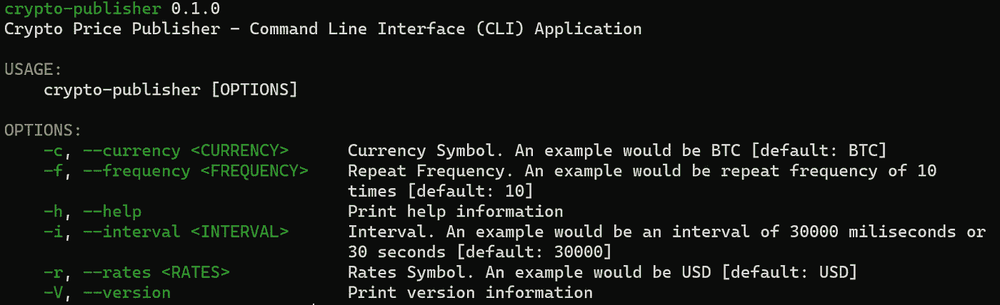

# 通过开发 Crypto Publisher CLI 应用程序了解 Rust

> 原文：<https://betterprogramming.pub/learn-rust-by-example-develop-crypto-publisher-cli-application-be5af17e03ae>

## 简化命令行界面应用程序的构建


照片由 [Charl Folscher](https://unsplash.com/@charlfolscher?utm_source=medium&utm_medium=referral) 在 [Unsplash](https://unsplash.com?utm_source=medium&utm_medium=referral) 上拍摄

我总是发现，当学习一门编程语言时，从头开始开发一个应用程序是很有帮助的，一步一步来。甚至在你完成了 Rust 编程语言的书之后，你可能会对从哪里开始感到不知所措。

本教程假设您在开始开发一个简单的命令行界面(CLI)应用程序来显示加密价格(例如，以美元或 BTC-美元表示的比特币价格)之前，至少已经浏览了这本书。

在开始撰写文章之前，让我们先做一些内务处理，提供一个到 GitHub 资源库的链接，在那里可以找到所有源代码= >[https://github.com/sungkim11/crypto-p](https://github.com/sungkim11/crypto-publisher)ublisher。此外，我想向您展示您将使用 Rust 开发什么应用程序，如下所示。



# 先决条件

## 比特币基地价格数据剩余 API

我们将使用比特币基地 REST API 来获取比特币的美元或 BTC 美元价格([https://developers.coinbase.com/api/v2#data-endpoints](https://developers.coinbase.com/api/v2#data-endpoints))。

要调用比特币基地 REST API，只需将以下 URL 复制并粘贴到您的浏览器中:

```
[https://api.coinbase.com/v2/prices/BTC-USD/spot](https://api.coinbase.com/v2/prices/:currency_pair/spot)
```

以 JSON 格式返回或下载包含以下内容的`response.json`文件为例，该文件既提供现货价格，也提供`base-currency`或`BTC-USD`。

```
{
     "data":{
          "base":"BTC",
          "currency":"USD",
          "amount":"40731.94"
     }
}
```

## 铁锈板条箱

在我们开始开发应用程序之前，我们需要添加四个 Rust 板条箱:

*   Serde:它是一个有效和通用地序列化和反序列化 Rust 数据结构的框架。他们的 crates.io 网址是[https://crates.io/crates/serde](https://crates.io/crates/serde)。Serde 用于将 JSON 数据映射到 Rust 数据结构或 Struct。它用于将 JSON 反序列化或转换为 struct，并将 struct 序列化或转换为 JSON。
*   `Reqwest`:是 Rust 的 HTTP 客户端。他们的 crates.io 网址是[https://crates.io/crates/reqwest](https://crates.io/crates/reqwest)。`Reqwest`是用来向比特币基地发出 HTTPS 请求的 REST API。
*   Tokio:它是一个编写异步应用程序的平台。他们的 crates.io 网址是[https://crates.io/crates/tokio](https://crates.io/crates/tokio)。开发异步应用程序需要 Tokio。
*   Clap:它是 Rust 的命令行参数解析器。他们的 crates.io 网址是[https://crates.io/crates/clap](https://crates.io/crates/clap)。开发命令行界面应用需要 Clap。

最后，`Cargo.toml`修改为包括如下四个板条箱:

```
[package]
name = "rust-struct"
version = "0.1.0"
edition = "2021"# See more keys and their definitions at [https://doc.rust-lang.org/cargo/reference/manifest.html](https://doc.rust-lang.org/cargo/reference/manifest.html)[dependencies]
serde = { version = "1.0.136", features = ["derive"] }
reqwest = { version = "0.11", features = ["json"] }
tokio = { version = "1.17.0", features = ["full"] }
clap = { version = "3.1.2", features = ["derive"] }
```

# 课程

在本文中，我们将开发一个简单的应用程序，然后在应用程序的基础上添加更多的功能:

*   第 1 课:调用比特币基地 REST API 的简单异步应用程序
*   第 2 课:将对 REST API 的异步调用转移到不同的函数中
*   第 3 课:添加命令行界面
*   第 4 课:添加时间、加密买价、加密卖价和更多 CLI 参数

## 第 1 课:调用比特币基地 REST API 的简单异步应用程序

我们将开发一个简单的异步应用程序，使用提供的 URL 调用比特币基地价格数据 REST API，然后将 JSON 文件处理(即反序列化)为可编程对象(即结构)，这样我们就可以打印加密价格。

您可能会问——为什么要开发异步应用程序？这是因为后续文章将增强该应用程序，使用 rdkafka crate 向 Apache Kafka 发布加密价格，因此该应用程序的名称是 Crypto Publisher。

**JSON (response.json)**

以下 JSON 具有如下所示的层次结构或嵌套结构:

```
{
     "data":{
          "base":"BTC",
          "currency":"USD",
          "amount":"40731.94"
     }
}
```

**锈蚀结构**

Rust Struct 通过创建两个 Struct 来支持嵌套结构，其中数据类型*“coin price”*用于复制 JSON 的嵌套结构。最后，它实现 Serde 的反序列化，将 JSON 数据映射到 Rust Struct。从 JSON 文件创建 struct 的最简单的方法是转到 quick type([https://app.quicktype.io/](https://app.quicktype.io/))，然后复制 JSON 作为源，并指定 Rust 作为目标。我修改了结构名以满足我的需要。

```
#[derive(Serialize, Deserialize, Debug)]
pub struct CoinbasePrice {
    pub data: **CoinPrice**
}#[derive(Serialize, Deserialize, Debug)]
pub struct **CoinPrice** {
    pub base: String,
    pub currency: String,
    pub amount: String,
}
```

**REST API 请求**

在我们定义了结构之后，我们将需要发出 REST API 请求。这是在 async/之后完成的。使用 Tokio 运行时进行 await 构造，这在代码中反映为:

*   REST API 请求，它返回一个 future，然后等待它完成(Client::new()。获取(&spot_url)。发送()。等待？)
*   解析对 ConibasePrice 结构的 JSON 响应，它返回一个 future，然后等待它完成(json:: <coinbaseprice>()。等待？；)</coinbaseprice>

```
let resp_spot_price = Client::new().get(&spot_url).send().await?.json::<CoinbasePrice>().await?;
```

**打印出加密价格**

最后，我们使用 struct 打印出加密价格，最后返回 Ok。请注意，CoinbasePrice 结构的结构如下:

```
CoinbasePrice
     data
          base
          currency
          amount
```

由于 CoinbasePrice 结构被赋给 resp_spot_price，base = resp_spot_price.data.base。

```
println!("SPOT: {base}-{currency}: {amount}",
     base=resp_spot_price.data.base,
     currency=resp_spot_price.data.currency,
     amount=resp_spot_price.data.amount);Ok(())
```

**完成代码**

最后，下面提供了完整的代码，其中有两个文件:

*   main.rs:它只是调用 crypto_publisher_1.rs 中的 crypto_publisher 函数，请注意由于 fn crypto_publisher()返回一个结果类型，所以增加了 unwrap()。
*   加密发布者 1.rs

main.rs

加密发布者 1.rs

## 第 2 课:将对 REST API 的异步调用转移到不同的函数中

在本课中，我们将完成以下任务:

*   将异步调用 REST API 转移到一个新的异步函数中，因为我们需要调用这个函数三次来获得现货价格、买价和卖价。
*   将`crypto_publisher`函数转换为一个函数，该函数调用新的异步函数。

**创建一个新的异步函数**

创建了一个新的异步函数，因此我们可以使用同一个函数获得三个价格:

*   现货价格
*   购买价格
*   销售价格

因此，名为`get_coin_price()`的新异步函数有三个输入参数:

*   类型(现货、购买和出售)
*   货币(如 BTS)
*   汇率(例如，美元)

并返回一个带有字符串值的结果类型，用`Ok(resp_price.data.amount)`表示。所有其他代码与上一课类似。

将`crypto_publisher`功能转换为同步功能

fn crypto_publisher 已经简化为只调用 get_coin_price()，然后打印出解析后的返回值。

**完成代码**

最后，下面提供了完整的代码，其中有两个文件:

*   main.rs:它只是调用`crypto_publisher_2.rs.`中的`crypto_publisher`函数
*   `crypto_publisher_2.rs`

`main.rs`:

`crypto_publisher_2.rs`:

## 第 3 课:添加命令行界面

在本课中，我们将完成以下任务:

*   使用 Clap 为命令行界面(“CLI”)创建 struct，这是一个简单易用、高效且功能全面的命令行参数解析器。
*   添加 CLI 代码功能`crypto_publisher()`

**为命令行界面创建结构**

Clap 有一个构建器 API，它利用 struct 上的属性来构建命令行界面。下面的结构添加了两个参数:

*   货币(如 BTC)
*   汇率(例如，美元)

**添加 CLI 代码函数 crypto_publisher()**

我们已经将 CLI 代码添加到 async fn crypto_publisher()中，以接受命令行界面值。

```
let args = Cli::parse();
let currency = &args.currency;    
let rates = &args.rates;
```

**完成代码**

最后，下面提供了完整的代码，其中有两个文件:

*   `main.rs`:它只是调用`crypto_publisher_3.rs`中的`crypto_publisher`函数。
*   `crypto_publisher_3.rs`

`main.rs`:

`crypto_publisher_3.rs`:

## 第 4 课:添加时间、加密买价、加密卖价和更多 CLI 参数

最后，我们通过将所有这些整合在一起来完成应用程序。我们增加了以下功能:

*   添加一个函数来获取时间
*   添加加密买价和卖价以及买价和卖价之间的价差
*   再添加两个参数:重复频率(或者应用程序应该运行的次数)和时间间隔(或者时间间隔——例如:30 秒)

**添加获取时间的函数**

新函数`get_coin_time()`与`get_coin_price()`非常相似，只是它没有输入参数。

添加加密买价和卖价以及买价和卖价之间的价差

我们增强了`crypto_publisher()`来添加额外的函数调用，用于:

*   时间
*   购买价格
*   销售价格

然后，我们将所有数据汇总，打印出现货价格、买价、卖价以及买价和卖价之间的价差。

**增加两个参数:重复频率和重复间隔**

使用 Clap 的构建器 API，该 API 利用结构上的属性来添加两个命令行接口参数。

*   间隔(例如，10)
*   频率(例如，30000 或 30 秒)

然后我们添加一个循环来合并两个额外的 CLI 参数。

**完成代码**

最后，下面提供了完整的代码，其中有两个文件:

*   `main.rs`:它只是调用`crypto_publisher_5.rs`中的`crypto_publisher`函数。
*   `crypto_publisher_5.rs`

main.rs

`crypto_publisher_5.rs`:

我希望这篇文章对你有帮助！感谢阅读。