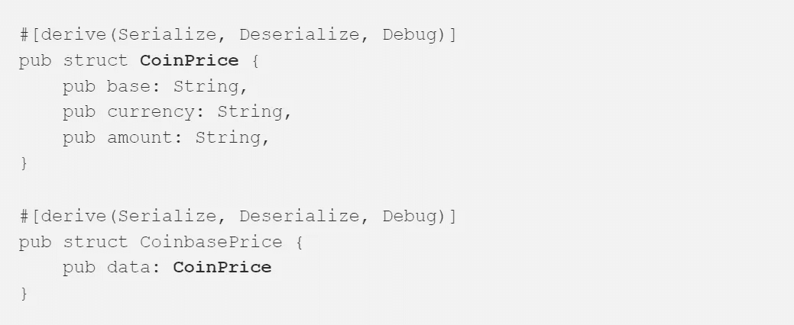

# 举例说明如何使用 Rust 结构、方法(Impl)和特征

> 原文：<https://betterprogramming.pub/learn-rust-by-example-structs-methods-impl-and-traits-de11e8d02b68>

## 生锈的例子


由[菲利斯](https://unsplash.com/@miniminion?utm_source=medium&utm_medium=referral)在 [Unsplash](https://unsplash.com?utm_source=medium&utm_medium=referral) 上拍摄的照片

我总是发现，当学习一门编程语言时，如果所提供的例子反映了真实世界的用例，会很有帮助。不幸的是，这类例子没有提供或者很难找到。

例如，Rust 编程语言手册中的“[定义和实例化结构](https://doc.rust-lang.org/book/ch05-01-defining-structs.html)”一节提供了一个例子，其中定义了结构，然后通过为代码本身中的每个字段指定一个值来创建该结构的实例。在现实世界中，没有一个程序员会因为一个显而易见的原因而这样做。它也没有解释如何在代码中使用结构。

因为我需要这篇文章的特色图片，下面是一个结构的例子。



在开始撰写文章之前，让我们先通过提供结构的概述和在代码中使用结构的用例来了解一些日常工作。所有源代码也可以在 GitHub = >[https://github.com/sungkim11/rust-struct](https://github.com/sungkim11/rust-struct)上获得。

# 结构

结构是用户定义的类型，我们可以用它来存储一个或多个不同类型的变量。一个结构允许我们将相关的代码组合在一起，并按照[https://www.koderhq.com/tutorial/rust/struct/](https://www.koderhq.com/tutorial/rust/struct/)按照现实世界中的实体来建模我们的应用程序。

结构的一个例子是:

```
struct User {
     active: bool,     
     username: String,     
     email: String,     
     sign_in_count: u64, 
}
```

## 你会在哪里使用结构？

使用结构的一个很好的用例是调用 REST API，其中响应以 JSON 格式返回。JSON 格式的一个例子是:

```
{
  **"active"**: true
  **"username"**: "user",
  **"email"**: "user@user.com", 
  "**sign_in_count"**: 2
}
```

正如您从上面看到的，Struct 类似于 JSON，您可以将 JSON 值映射到 Struct。在现实世界中，结构用于解析 JSON 值。通常称为反序列化/解码将 JSON 转换为 struct，序列化/编码将 struct 转换为 JSON。

# 先决条件

## 比特币基地休息 API

我们将开发一个应用程序，通过 https://developers.coinbase.com/api/v2#data-endpoints 的比特币基地 REST API()获得比特币的美元或 BTC 美元价格。

这是一个简单的应用程序，调用比特币基地 REST API，解析 REST API 响应，然后打印出 BTC-美元价格。

要调用比特币基地 REST API，只需将以下 URL 复制并粘贴到您的浏览器中:

```
[https://api.coinbase.com/v2/prices/BTC-USD/spot](https://api.coinbase.com/v2/prices/:currency_pair/spot)
```

例如，它应该返回或下载包含以下内容的 JSON 格式的`response.json`文件，该文件提供了即期价格以及“基础货币”或“BTC-美元”。

```
{
     "data":{
          "base":"BTC",
          "currency":"USD",
          "amount":"40731.94"
     }
}
```

## 铁锈板条箱

在我们开始开发应用程序之前，我们需要添加两个 Rust 板条箱:

*   Serde:它是一个有效和通用地序列化和反序列化 Rust 数据结构的框架。他们的 crates.io 网址是[https://crates.io/crates/serde](https://crates.io/crates/serde)。Serde 用于将 JSON 数据映射到 Rust 数据结构或 Struct。它用于将 JSON 反序列化或转换为 struct，并将 struct 序列化或转换为 JSON。
*   `Reqwest`:是 Rust 的 HTTP 客户端。他们的 crates.io 网址是[https://crates.io/crates/reqwest](https://crates.io/crates/reqwest)。`Reqwest`是用来向比特币基地发出 HTTPS 请求的 REST API。

最后，`Cargo.toml`被修改为包括如下两个板条箱:

```
[package]
name = "rust-struct"
version = "0.1.0"
edition = "2021"# See more keys and their definitions at [https://doc.rust-lang.org/cargo/reference/manifest.html](https://doc.rust-lang.org/cargo/reference/manifest.html)[dependencies]
serde = { version = "1.0.136", features = ["derive"] }
reqwest = { version = "0.11", features = ["blocking", "json"] }
```

# 学习如何使用 Rust 结构、方法(Impl)和特征

在本文中，我们将使用现实世界中的例子来说明以下教训:

*   第 1 课:定义结构
*   第 2 课:将结构传递给函数
*   第 3 课:将方法(impl)定义为结构
*   第 4 课:将特征定义为结构
*   第五课:结合所有课程

## 第 1 课:定义结构

我们通过镜像 JSON 数据结构来定义 Rust Struct。

**JSON (response.json)**

以下 JSON 具有如下所示的层次结构或嵌套结构:

```
{
     "data":{
          "base":"BTC",
          "currency":"USD",
          "amount":"40731.94"
     }
}
```

**锈蚀结构**

Rust Struct 通过创建两个结构来支持嵌套结构，其中数据类型*“coin price”*用于复制 JSON 的嵌套结构。

最后，它实现 Serde 的反序列化，将 JSON 数据映射到 Rust Struct。从 JSON 文件创建 struct 的最简单的方法是转到 quick type([https://app.quicktype.io/](https://app.quicktype.io/))然后复制 JSON 作为源并指定 Rust 作为目标。我修改了结构名以满足我的需要。

```
#[derive(Serialize, Deserialize, Debug)]
pub struct CoinbasePrice {
    pub data: **CoinPrice**
}#[derive(Serialize, Deserialize, Debug)]
pub struct **CoinPrice** {
    pub base: String,
    pub currency: String,
    pub amount: String,
}
```

**REST API 请求**

在我们定义了结构之后，我们将需要发出 REST API 请求。这是通过 reqwest::Client 完成的，在代码中反映为:

*   创建一个新的客户端— `let client = Client::new();`
*   发出 REST API 请求— `let resp_spot_price = client.get(&spot_url).send();`

其中它将响应分配给一个变量，称为`resp_spot_price`。

```
let spot_url = format!("https://api.coinbase.com/v2/prices/{currency}-{rates}/spot",          
     currency = "BTC",
     rates = "USD"); let client = Client::new();    
let resp_spot_price = client.get(&spot_url)        
     .send();
```

**解析 REST API JSON 响应**

在我们发出 REST API 请求后，我们使用

```
match {
     Ok()
     Err ()
} 
```

因为`resp_spot_price`是一个值，所以它被包装在`Result`类型中。

然后，我们可以通过将 JSON 响应分配给 CoinbasePrice 类型的变量，将 JSON 响应(即值)解析为一个结构。

```
match resp_spot_price {        
     Ok(parsed_spot_price) => {
          let coinprice = parsed_spot_price.json::<CoinbasePrice>().unwrap(); 
```

**将 JSON 响应分配给结构**

请注意`CoinbasePrice`结构的结构如下:

```
CoinbasePrice
     data
          base
          currency
          amount
```

在我们解析了对`CoinbasePrice`结构的 JSON 响应之后，我们可以将来自`CoinbasePrice`结构的值赋给`CoinPrice`结构。

```
let spot_price = CoinPrice {
     base: coinprice.data.base,
     currency: coinprice.data.currency,
     amount: coinprice.data.amount            
};
```

**打印加密价格**

最后，使用`CoinPrice` struct 打印出加密价格，这意味着 base = spot_price.base。

```
println!("SPOT: {base}-{currency}: {amount}",
     base=spot_price.base,                   
     currency=spot_price.currency,                
     amount=spot_price.amount);
```

**完成代码**

最后，下面提供了完整的代码，其中有两个文件:

*   `main.rs`:只调用`rust_struct_1.rs`中的`rust_struct_1`函数
*   `rust_struct_1.rs`

`main.rs`的代码是

```
//Lesson 1: Structs
//Declare Modules
mod rust_struct_1;
//Call Lesson 1: Structs
fn main() {
       rust_struct_1::rust_struct_1(); 
}
```

`rust_struct_1.rs`:

## 第 2 课:将结构传递给函数

我们详细阐述了上一课添加一个函数，其中我们将 struct 实例传递给一个函数。

这个函数只是将打印功能从主代码块转移到一个函数中，以演示如何将 struct 实例传递给一个以 struct name ( `CoinPrice`)作为参数的函数。

主代码块中的代码片段:

```
println!("SPOT: {base}-{currency}: {amount}",
     base=spot_price.base,
     currency=spot_price.currency,
     amount=spot_price.amount);
```

将结构名(`CoinPrice`)作为参数的函数`print_coin_price`:

```
fn print_coin_price(coin_price:CoinPrice) {
     println!("SPOT: {base}-{currency}: {amount}",
          base=coin_price.base,
          currency=coin_price.currency,
          amount=coin_price.amount);
}
```

**完成代码**

最后，下面提供了完整的代码，其中有两个文件:

*   `main.rs`:只调用`rust_struct_2.rs`中的`rust_struct_2`函数
*   `rust_struct_2.rs`

`main.rs`:

```
//Lesson 2: Pass Structs to Function
//Declare Modules
mod rust_struct_1;
//Call Lesson 2: Pass Structs to Function
fn main() {
       rust_struct_2::rust_struct_2(); 
}
```

`rust_struct_2.rs`:

## 第 3 课:将方法(impl)定义为结构

我们可以在结构中增加一个函数。这些函数通常被称为方法，并且仅可用于结构的实例。为了定义一个方法，我们使用关键字`impl` 用 struct*(*`CoinPrice`*)*的包装器修改了函数`print_coin_price`，并将参数改为 self。

```
impl CoinPrice {
     fn print_coinprice(self) {
          println!("SPOT: {base}-{currency}: {amount}",
               base=self.base,
               currency=self.currency,
               amount=self.amount);
    }
}
```

因为我们已经向 struct 添加了一个方法，所以要调用这个方法，我们只需使用:

```
pot_price.print_coinprice();
```

**完成代码**

最后，下面提供了完整的代码，其中有两个文件:

*   `main.rs`:它只是调用`rust_struct_3.rs`中的`rust_struct_3`函数
*   `rust_struct_3.rs`

`main.rs`:

```
//Lesson 3: Define Method (impl) to Struct
//Declare Modules
mod rust_struct_1;
//Call Lesson 3: Define Method (impl) to Struct
fn main() {
       rust_struct_3::rust_struct_3(); 
}
```

`rust_struct_3.rs`:

## 第 4 课:将特征定义为结构

一个结构可以有多个方法。特征用于声明和分组这些方法。

**定义特性**

```
pub trait Price {
     fn format_coinprice(&self) -> String;
     fn return_coinprice(&self) -> String;
}
```

**为 Struct 实现 Trait(*coin price*)**

```
impl Price for CoinPrice {
     fn format_coinprice(&self) -> String {
          return format!("SPOT: {base}-{currency}: {amount}",
               base=self.base,
               currency=self.currency,
               amount=self.amount);
}
     fn return_coinprice(&self) -> String {
          return format!("SPOT: {amount}",
               amount=self.amount);
     }
}
```

**调用特征**中的 Struct (" *CoinPrice* ")方法

```
println!("{}", spot_price.format_coinprice());
println!("{}", spot_price.return_coinprice());
```

## **完成代码**

最后，下面提供了完整的代码，其中有两个文件:

*   `main.rs`:只调用`rust_struct_4.rs`中的`rust_struct_4`函数
*   `rust_struct_4.rs`

`main.rs`:

```
//Lesson 4: Define Trait to Struct
//Declare Modules
mod rust_struct_1;
//Call Lesson 4: Define Trait to Struct
fn main() {
       rust_struct_4::rust_struct_4(); 
}
```

`rust_struct_4.rs`:

## 第五课:结合所有课程

最后，我们结合前面的所有课程来实现结构、方法(Impl)和特征。代码已经过修改，包含了所有比特币基地价格数据 API，可以在一行中打印出现货、买入和卖出的 BTC-美元价格以及买入和卖出之间的价差。

下面提供了完整的代码，其中有两个文件:

*   `main.rs`:只调用`rust_struct_5.rs`中的`rust_struct_5`函数
*   `rust_struct_5.rs`

`main.rs`:

```
//Lesson 5: Combine all lessons
//Declare Modules
mod rust_struct_1;
//Call Lesson 5: Combine all lessons
fn main() {
       rust_struct_5::rust_struct_5(); 
}
```

`rust_struct_5.rs`:

我希望这篇文章是有帮助的！感谢阅读。