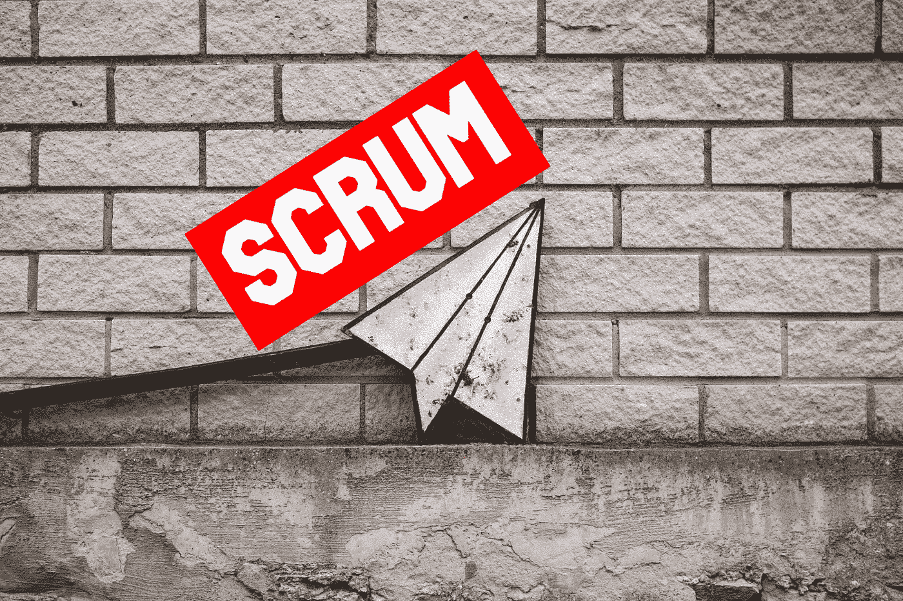
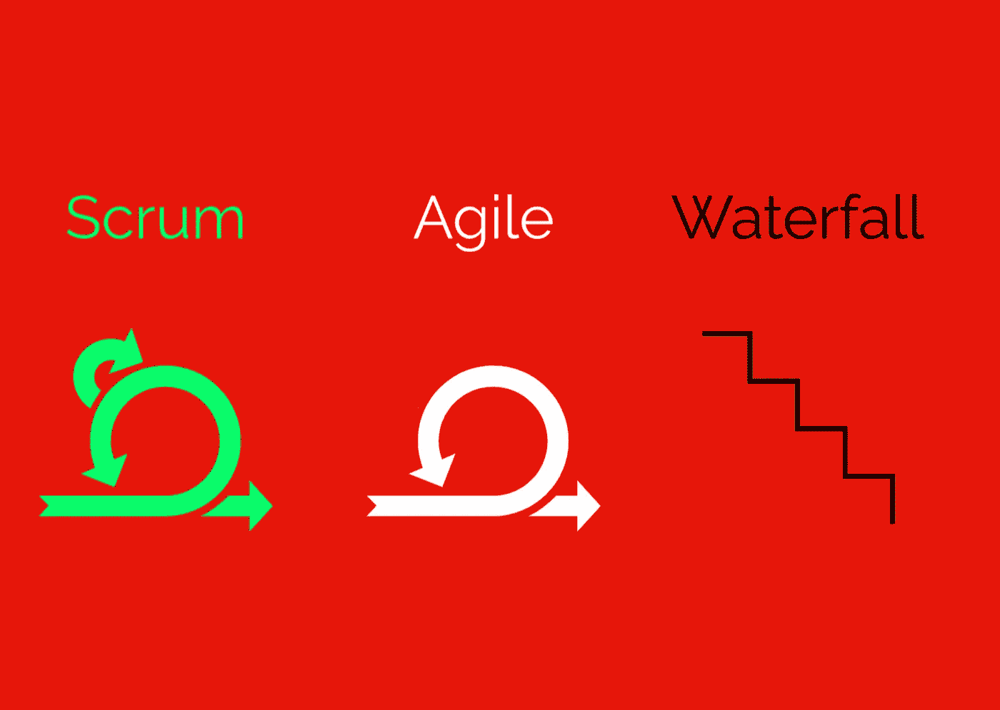
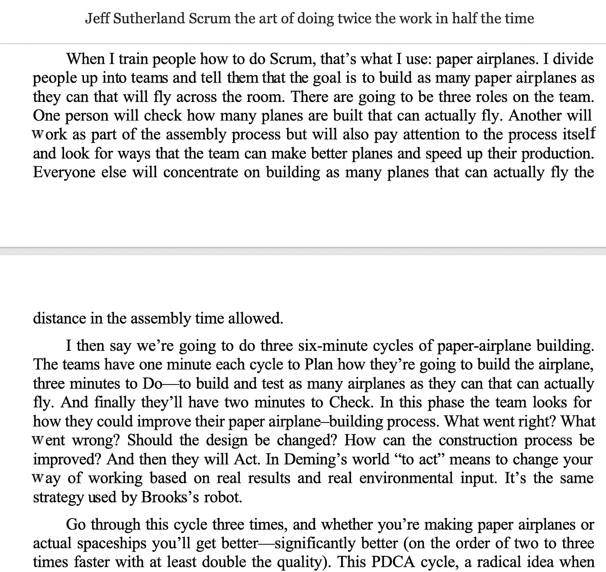
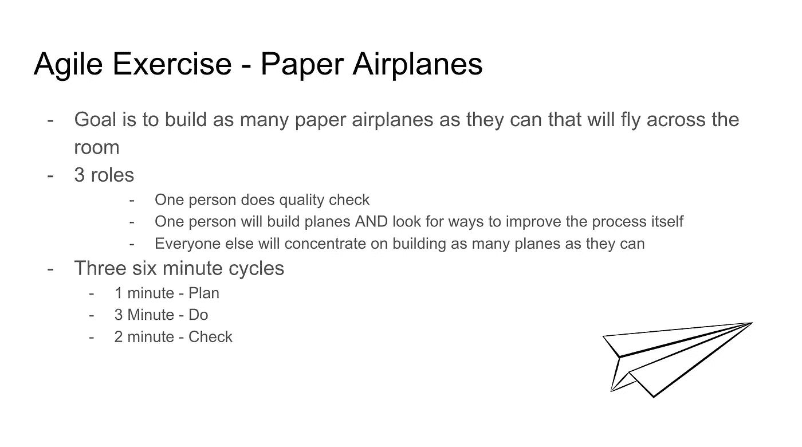
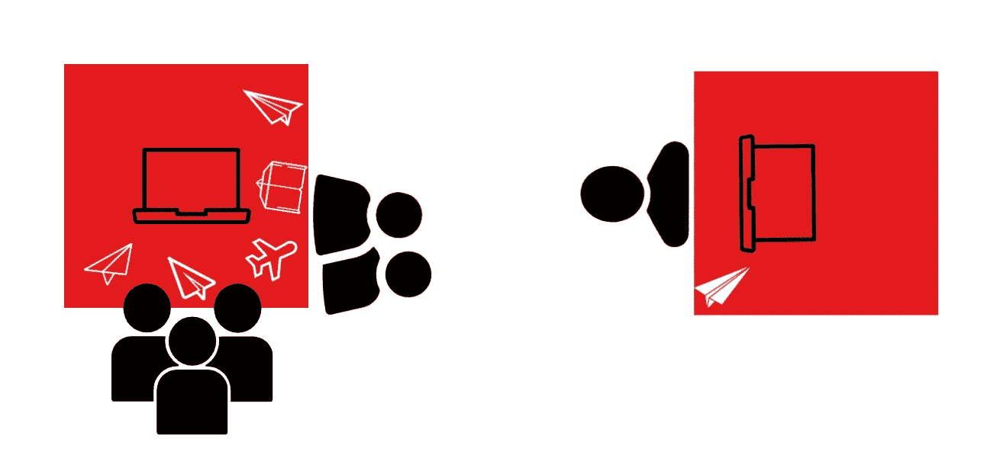
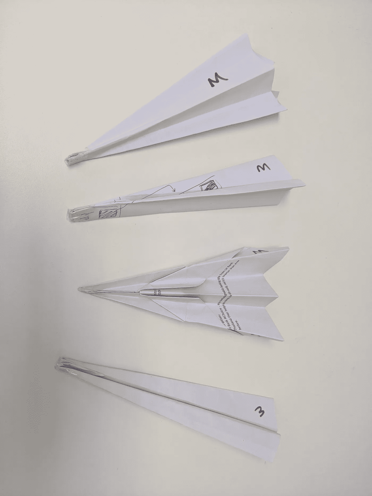
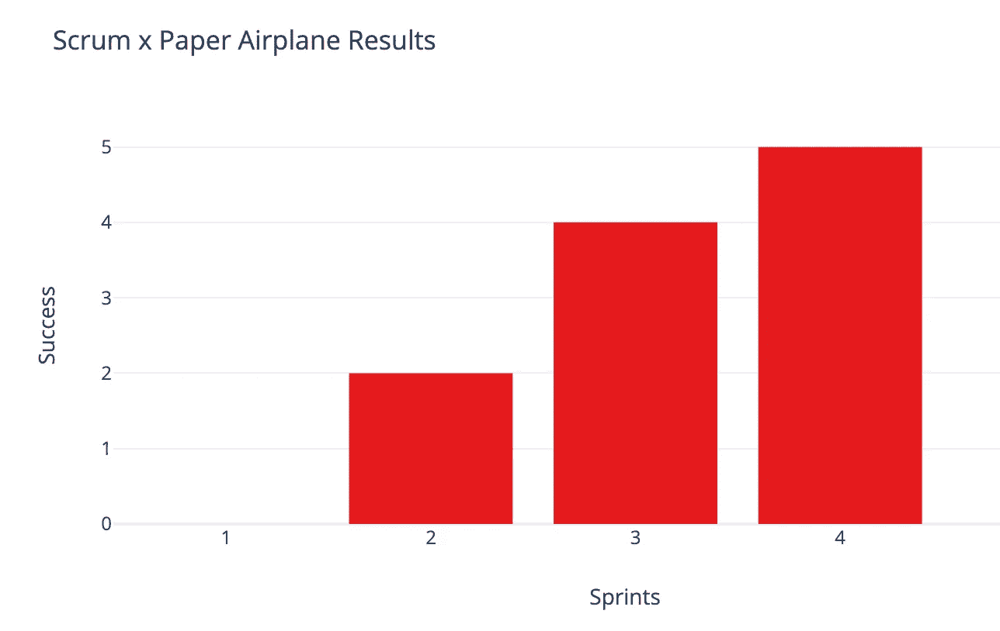
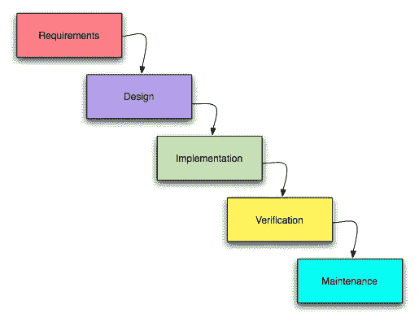
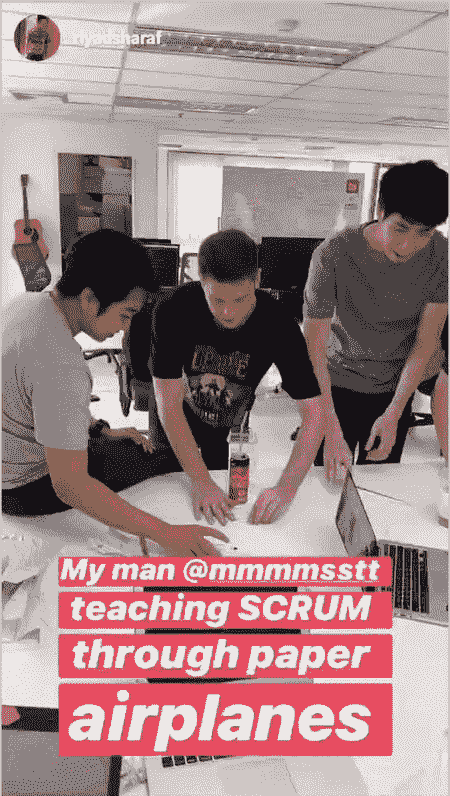

# 使用纸质 Airplanes️学习 Scrum 和敏捷

> 原文：<https://betterprogramming.pub/learn-scrum-and-agile-using-paper-airplanes%EF%B8%8F-d54a12e3cdd8>

## 构建、飞行、审查和迭代

[Daria Nepriakhina](https://unsplash.com/@epicantus?utm_source=medium&utm_medium=referral) 在 [Unsplash](https://unsplash.com?utm_source=medium&utm_medium=referral) 上的原始照片。由[song tham Tungkitkancharoen](http://www.songthamtung.com)修改。

我是在阅读了 Scrum 最初的创造者之一 Jeff Sutherland 自己写的一本关于 Scrum 的书[后，受到启发写下这篇文章的。虽然这本书主要关注为什么团队应该使用 Scrum，但是作者确实提到了他是如何使用纸飞机来教授 Scrum 的。](https://www.amazon.com/Scrum-Doing-Twice-Work-Half/dp/038534645X)

当我读到这些话时，我想起有一天我的一个同事在办公室里做纸飞机。我还记得我的季度 okr 之一是介绍敏捷方法。

所以，我把两者结合起来，在接下来的周一和我的团队一起尝试，结果令人震惊。

博客的其余部分讲述了我用纸飞机向我的团队介绍 Scrum 的经历，并介绍了你可以怎样做。

# 概述

1.  定义
2.  如何开始
3.  到底发生了什么
4.  关键要点
5.  结论

# 1.定义

注意:这些是教科书上的定义，仅仅触及了表面。要真正理解它们的意思，你必须在实践中学习。

Scrum vs 敏捷 vs 瀑布[song tham Tungkitkancharoen](http://www.songthamtung.com)

*   Scrum:用于实现敏捷方法的框架。
*   敏捷:用连续迭代管理项目的方法。
*   瀑布:一种在线性阶段管理项目的方法。

项目管理是这里的主线。

# 2.如何开始

所需的材料是一叠最好用过的纸和一个计时器。

## 萨瑟兰的指示

下面是这本书的摘录，作者谈到了他是如何使用纸飞机来教授 Scrum 的。

第二章:Scrum 的起源

## TL；速度三角形定位法(dead reckoning)

我将这些说明总结成一张幻灯片，并与下面的团队分享。

Songtham Tungkitkancharoen 用纸飞机学习 Scrum

主要思想是有一个要实现的目标，实现这个目标的方法是通过 **p** 计划、 **d** 实施、 **c** 检查、 **a** 行动和重复的 PDCA 循环。

虽然我在幻灯片中没有明确提到“行动”，但可以推断出，行动——或根据结果改变工作方式——是检查和计划之间的自然过渡。

总是反思什么是有效的，什么是无效的，并问自己如何才能做得更好。这是持续改进的关键。

> “跌倒七次，爬起来八次。”—日本谚语

# 3.到底发生了什么

向团队展示完幻灯片后，我问他们是否有任何问题或顾虑。没有。所以我开始分配角色。

## 分配角色

除我之外，这个队由六名成员组成。

虽然没有明确提到，但是主持这个练习的人是主持人。作为主持人，您的角色是保持团队一致，记录时间，并帮助回答研讨会期间可能出现的任何问题。

丹尼尔·麦金尼斯在 [Unsplash](https://unsplash.com?utm_source=medium&utm_medium=referral) 上的照片

为了分配角色，我使用“eeny meeny miny moe”随机选择了一个负责质量检查的人和一个负责流程改进的人。随意使用其他随机选择技术，如选卡、掷骰子等等。

你也可以接受志愿者，但我更喜欢听天由命。你很快就会发现，角色可以而且确实会发生变化，最终会出现适合合适工作的合适人选。

太好了！既然我们已经选好了角色，下一步就是开始 PDCA 循环。

## 第一次迭代

至少可以说，第一次迭代开始得有点慢。

我告诉每个人，他们有一分钟的时间来计划，并提醒他们，他们的目标是制作可以飞过房间的纸飞机。讨论开始时，我站在后面，远远地看着。

一些人开始制作原型，而其他人则在绘制各种模型。从现在开始，我称为 QA 的质量检查人员问我他们应该做什么，因为他们还不能测试任何东西。我笑着告诉他们加入团队做策划。

由[卢卡斯·布拉塞克](https://unsplash.com/@goumbik?utm_source=medium&utm_medium=referral)在 [Unsplash](https://unsplash.com?utm_source=medium&utm_medium=referral) 上拍摄

一分钟到了，我向团队宣布他们有三分钟的时间。团队中的每个人都从这个时候开始制造飞机，除了 QA。

他们的任务是验证飞机是否能穿过房间。一些人将他们的模型交给 QA 测试，而另一些人，无法抑制在办公室扔纸飞机的兴奋，决定自己测试一下。

该团队制作了大约六架纸飞机进行测试。他们都没能穿过房间。

我告诉团队在 do 阶段结束时停止，他们现在有两分钟的检查阶段。

有趣的是，这个团队问我的第一个问题是他们是否可以使用电脑进行研究。我说:“当然，为什么不呢？”

团队开会地点

所以他们开始工作。一个人在小组中央打开笔记本电脑，而另一个人背对着团队回到自己的办公桌前。

QA 然后告诉团队其中一个模型可能是好的，因为它飞得最远，如果它被优化，他们认为它可以穿过房间。

其他人正在制作新型号的原型。没有讨论如何改进这一进程本身。

## 第二次迭代

是时候进行第二次迭代了。

当我告诉团队从检查过渡到计划时，我没有注意到团队的行为有任何不同。一个人甚至指出，检查和计划在实际工作中没有区别。

他们在回顾、研究和策划如何最好地完成这两个阶段的目标。

凯利·西克玛在 [Unsplash](https://unsplash.com?utm_source=medium&utm_medium=referral) 上的照片

他们计划的时间到了，现在他们还有三分钟的时间。你可以感觉到动量转移，凹槽开始形成。团队成员更致力于制作最好的纸飞机，QA 试图完善他们的测试技术。

为了增加赌注，我开玩笑地向团队宣布，如果有五个模型在最后的演示中成功穿过房间，我 Songtham Tungkitkancharoen 将投资他们的纸飞机公司。令我惊讶的是，这使得团队更加努力。

纸飞机飞过房间，有些甚至飞到了房间的另一边。你可以听到周围的欢呼声和击掌声。我看了看计时器，还有大约 90 秒。

突然，我开始看到纸团被扔过房间。

照片由[图林博伊](https://www.flickr.com/photos/turinboy/)在 [Flickr](https://www.flickr.com/photos/18922948@N08/2946943615) 上拍摄

一名团队成员问我这样做是否可以，我停顿了一下。然后我说:“当然，为什么不呢？”要求里没有阻止你做纸团。

事实上，需求中并没有具体说明纸飞机是什么。

于是，他们出发了，纸飞机，纸球，最终一架纸飞机和一个长毛绒球连在了一起。这一次，该团队制作了大约九架飞机，其中两架穿过了房间。

在检查阶段变化不大。QA 继续给出他们关于哪架飞机飞得最好的意见。你可以在小组笔记本电脑上看到一篇“如何制作最好的纸飞机”的文章。

桌子和地板上散落着各种各样的模型。一名团队成员回到自己的办公桌前，背对着团队，仍然在那里，独自专注于 YouTube 上一个关于制作完美纸飞机的视频。

时间到了，我们现在正在进行第三次迭代。

## 第三次迭代

我开始第三次迭代，宣布需求已经发生了变化。

*   纸飞机必须是飞机形状。(提示:不要纸团！)
*   纸飞机不能附着在其他物体上。
*   纸飞机不能扔过指定区域。
*   所有的纸飞机都必须使用胶带。
*   所有的纸飞机都必须有“M”写在上面。

这一次，在计划阶段，负责改进流程的人建议最终确定最佳变化，并组成装配线进行大规模生产。

QA 被赋予了新的职责，确保生产的每件产品上都有胶带和“M”字样。

Georgie Cobbs 在 [Unsplash](https://unsplash.com?utm_source=medium&utm_medium=referral) 上的照片

在 do 阶段，生产的产品比一个人可以测试的要多，所以团队成员开始自己测试他们的产品。一个成功了。然后是两个。然后三个然后四个！

大约生产了十几架纸飞机，其中四架到达了对岸。

然而，他们仍然没有达到他们的目标。QA 扔出的那架没能穿过房间的飞机和被其他人扔出时成功穿过房间的飞机是同一架飞机。

就生产的模型而言，它们仍然相差两到三种类型，这使得结果不一致。孤独成员制造的飞机从未穿过房间。

时间到了，最后的演示就在眼前。团队集体要求再来一次“冲刺”，这是迭代的敏捷代名词，我同意了。

## 最后一次迭代

最后一次迭代是我见过的团队中最专注的。

这个孤独的成员重新加入了这个团体。然后，他们集体决定最佳变化，并在计划阶段划分任务，在实践阶段大规模生产一种产品，并在检查阶段在不同的投掷者中进行测试。

简而言之，这些团队是自组织的，并且表现出色。

在练习中建立的实际飞机模型

## 演示日

最后，是最后一次演示的时候了。

我提醒团队，如果他们的五个模型能穿过房间，我会投资他们的纸飞机公司。任何人都可以扔出去，但是一旦扔出去，就再也收不回来了。这就是成功的定义。

斯蒂芬·以赛亚在 [Unsplash](https://unsplash.com?utm_source=medium&utm_medium=referral) 上拍摄的照片

有一种诡异的寂静，就像棒球比赛的最后一局，当满垒时，你的球队落后几分，而你只剩下最后一击。剩下要做的就是打一个本垒打，胜利就是你的了。

我深吸了一口气，问谁想站到盘子上挥杆。回应是民主的。人民已经选择了，他们选择了其作用是改进这一进程的成员。我看着他们摆好姿势，而其他成员把完成的模型放在他们旁边。

他们连续投掷了五架纸飞机。一个接一个。你猜怎么着？他们都飞到了房间的另一边。每架飞机都成功了。

当我宣布我将非常乐意投资他们的纸飞机公司时，团队爆发出笑声和掌声，激动不已。

一些成员想继续在更具挑战性的地方投掷他们的最终产品，看看它是否也能成功地飞到那里。于是我说:“当然，为什么不呢？”

你可以感觉到空气中的电流。经过几次尝试后，我带团队回到会议室，回顾了他们从这次经历中学到的东西。

# 4.关键要点

照片由[戴戟梅本](https://unsplash.com/@daijiumemoto?utm_source=medium&utm_medium=referral)在 [Unsplash](https://unsplash.com?utm_source=medium&utm_medium=referral) 上拍摄

也许我从中学到的最重要的一课是，你做得越多，你就变得越好。然而，挑战在于以一种连接到敏捷方法和项目管理的更大图景的方式来传达这一点。

我开始问团队一个简单的问题:“什么是敏捷？”我们在创业场景中经常听到这个术语，但是我们真的了解它是什么吗？

有人提到敏捷正在快速响应变化。其他人补充说，这是周期性的。这样做的好处是，我们可以从错误中学习，并在下一次迭代中改进。

是啊！是啊！更多的是！你们都是正确的。敏捷是每个人所说的，甚至更多。

因为我们使用 Scrum，这个框架的一个关键元素是 Scrum Master，也就是寻找方法来改进流程本身的角色。这个过程确实得到了改善(QA 转换角色，组成流水线，教授最好的设计等等)。

这在“Scrum vs. agile vs .瀑布”图中用附加的循环来表示。敏捷是一个过程，而 Scrum 是让这个过程变得更好的方法。

纸飞机结果

之后，我给团队一个每次迭代或冲刺的回顾:

*   第一次冲刺——生产了六架飞机。六种变化。零成功。
*   第二次冲刺——生产了 9 架飞机。四个变奏。两次成功。
*   第三次冲刺——生产了 12 架飞机。三个变奏。四成功。
*   第四次冲刺——生产了八架飞机。一个变化。五成功。

虽然生产的数量有波动，但总的趋势是变化减少了，因为较弱的设计被排除了，而增加的是每次迭代的成功飞行。

换句话说，团队制造的飞机越多，质量就越高。他们的生产速度也提高了，但在第四次冲刺时略有下降，因为一名成员必须教其他人如何使用他们的产品设计生产飞机。

这还不是全部。为了说明这一点，我描绘了一个将敏捷和瀑布并置的场景:想象一下，如果我们必须使用瀑布方法来完成同样的目标，会是什么样子？

[瀑布图](https://th.m.wikipedia.org/wiki/%E0%B9%84%E0%B8%9F%E0%B8%A5%E0%B9%8C:Waterfall_model.png)

虽然图表看起来不错，但是计划、执行和检查被分成不同的阶段。一旦你进入下一个阶段，就像时间一样，你就不能回头了。

这意味着，举例来说，在实现阶段没有从你的错误中学习，然后在设计阶段回头去修正它们。

这个过程是线性的。你必须在每个阶段提前做好每件事，希望它是完美的，并把它传递给下一个人，希望他们也做对了。

这里有很多希望，我不喜欢将我的项目交付依赖于希望。这是一个灾难的配方。

> “很多时候，直到你展示给他们看，他们才知道自己想要什么。”—史蒂夫·乔布斯

相反，我更愿意将我的项目交付成果押在高效的自组织团队上，这些团队能够快速响应变化，并在每次冲刺中都有所展示，而不是在最后才展示一次。

通过在短周期内交付，客户可以告诉你你生产的产品是否是他们真正想要的。而很多时候，人们并不知道自己想要什么。

回想一下，由于第二次迭代中引入的纸团，需求在第三次迭代中发生了变化。在瀑布方法中，如何应对变化？

# 5.结论

感谢里亚德·沙拉夫捕捉到这一刻

如果你做到了这一步，恭喜你——这并不容易。

我们已经通过制作纸飞机学习了敏捷和 scrum 项目管理方法，这些纸飞机可以通过几次冲刺飞过房间。看似简单，这个概念可以应用到你的实际工作中。

不要将长期项目视为只交付一次且在最后完成的项目，你可以将它分成更小的、可行的部分，并逐步交付成果。你的顾客会为此感谢你的。

感谢阅读！请在下面的评论区告诉我你的感受。我很想了解更多你在敏捷、scrum 和/或瀑布方面的经验。

也许有一天，我们也可以像埃隆·马斯克一样，建造能够穿越宇宙的火箭飞船。

SpaceX 从他们的错误中学习