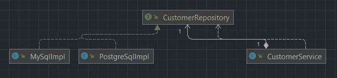

# 通过编写 Java 来学习坚实的设计原则

> 原文：<https://betterprogramming.pub/learn-solid-design-principles-in-java-by-coding-it-dcbf64a17b53>

## 对所有可靠设计原则的深入解释，包括真实世界的用例及代码示例

在 [Unsplash](https://unsplash.com/s/photos/programming?utm_source=unsplash&utm_medium=referral&utm_content=creditCopyText) 上由 [Max Duzij](https://unsplash.com/@max_duz?utm_source=unsplash&utm_medium=referral&utm_content=creditCopyText) 拍照

# 目录

1.  什么是固体，为什么你要费心使用它
2.  单一责任原则
3.  开闭原理
4.  利斯科夫替代原理
5.  界面分离原理
6.  从属倒置原则

在本文中，我们将讨论固体设计原则。首先我们会明白它们为什么会出来，然后我们会明白如何用代码例子实现每一个原理。

# 1.什么是固体，为什么你要费心使用它

在他的论文[设计原则和设计模式](http://staff.cs.utu.fi/~jounsmed/doos_06/material/DesignPrinciplesAndPatterns.pdf)中，Robert C. Martin 介绍了这些原则，后来，Michael Feathers 介绍了这个缩写。

一般来说，设计原则鼓励我们写出更好的软件，更易维护，更易理解，更灵活。它也改善了那些将来会成为你团队一部分的人的开发体验。

*S.O.L.I.D* 代表:

1.  单一责任原则
2.  **O** 笔关闭原理
3.  **L** 伊斯科夫替代原理
4.  **I** 界面偏析原理
5.  **D** 依赖反转原理

# 2.单一责任原则

这个原则规定一个类应该只有一个责任，换句话说，*一个类应该只有一个改变的理由*。

这意味着只有当我们的类的功能发生变化时，它才应该发生变化。

你可以从中受益，比如，加入新成员会更容易，测试会更容易，等等。

许多框架和库都遵循这个原则。例如，[crud repository](https://docs.spring.io/spring-data/commons/docs/current/api/org/springframework/data/repository/CrudRepository.html)from Spring Data，[验证](https://www.baeldung.com/javax-validation) API，[日期/时间](https://www.baeldung.com/java-8-date-time-intro) API。

*用例*

假设我们有一个类产品服务，它有两个关注点和责任:

1.  操纵产品上的 crud 操作。
2.  基于 crud 操作发送短信和电子邮件通知。

*SingleResponsibility.java*

如果这个类的需求改变了，现在我们要发送一封文本邮件和一封 HTML 邮件，它们需要不同的`sendEmail()`方法的实现，会发生什么呢？

之后，我们可能会有一个不同的产品操作要求，也需要改变。

随后，`ProductService`类基于通知相关原因和产品相关原因发生变化。

最好将这些问题分开:

*SingleResponsibility.java*

即使我们在每个需求变更上创建不同的方法，这里的想法是分离关注点，解决这种问题的解决方案是一个完全不同的主题。

## *常见讨论*

每个工程师/团队都有自己的改变理由。当决定一门课程的目的时，没有严格的概念可以遵循。这完全取决于你自己的商业规则、你的项目、你的团队等等。

关键是不要想太多。试着想象一个单一的责任，即使方法执行不同的操作，它们的目的是一样的吗？

# 3.开闭原理

这个原则规定软件实体(类、模块、函数等)。)应该对扩展开放，但对修改关闭。

这意味着，当组件不断增长时，您应该避免修改系统中某些东西的逻辑。在真实的例子中更容易形象化。

## *用例*

想象一下，我们有一个著名的计算几何图形面积的问题。

*AreaCalculator.java*

即使是一个基本的例子，每次需要计算一个新的形状面积时，都必须改变`AreaCalculator`，用一个新的方法，这可能是很无聊的，因为逻辑每次都会改变。

我们可以利用简单的抽象和多态来处理这个问题。

`AreaCalculator.java`

这样，`AreaCalculator`就不知道要处理哪个和多少个形状，也不知道它自己的实现。

现在那个班开放延期(`Triangle`、`Circle`、`Rectangle`等)。)并关闭以进行修改(不会有每次出现新形状时都添加不同逻辑的方法)。

# 4.利斯科夫替代原理

这个原则规定了一个类通过它的子类的可替换性，所以在所有实际的使用场景中，一个类可以被它的子类替换，这意味着你应该只为可替换性使用继承。

> *“子类型必须可以替换其基本类型。”*
> 
> 罗伯特·马丁
> 
> *“如果对于 S 类型的每个对象 o1，存在 T 类型的对象 o2，使得对于根据 T 定义的所有程序 P，当 o1 替换 o2 时，P 的行为不变，则 S 是 T 的子类型。”*
> 
> *——芭芭拉·利斯科夫*

简而言之:

如果我们可以在不改变程序行为的情况下用一个`ChildClass`对象替换一个`ParentClass`对象，那么`ChildClass`应该只扩展一个`ParentClass`，否则我们应该使用组合或委托。

## *用例*

想象我们有一个父类`Bird`。我们可以有很多子类，比如麻雀，鸵鸟，老鹰，猎鹰等。

有一个`Sparrow`和一个`Ostrich`类，扩展一个`Bird`类对吗？根据利斯科夫替代原理，它不是。

即使鸵鸟也是一种鸟，让它的对象能够飞也没有意义，因为它不能。

我们可以将继承分解成一个更小的层次来遵循这个原则。

这样，在任何情况下，Bird 类都不会被 Sparrow 类错误地替换。

# 5.界面分离原理

这个原则表明，客户不应该被迫实现一个它不使用的接口。

这有点像单一责任原则，但是在接口层次上。

*用例*

想象一下，如果我们有一个接口工作器，它有两个方法，work()和 sleep()。这样，每个混凝土工人阶层都可以工作和睡觉。

让机器人工人实现 sleep()方法有意义吗，即使我们知道它不能？

我们可以通过将接口分解成更小、更具体的接口来解决这个问题。

这样，我们可以减少使用更大的通用接口的副作用，让每个接口服务于一个目的。

# 6.从属倒置原则

> *“高层模块不要依赖低层模块。两者都应该依赖于抽象。*
> 
> 罗伯特·马丁
> 
> 抽象不应该依赖于细节。细节应该依赖于抽象。
> 
> 罗伯特·马丁

这个原则表明，我们应该通过抽象高层模块和低层模块之间的交互，来颠倒它们之间的传统依赖关系。

它通过在高级模块和低级模块之间引入接口或抽象类来分离它们之间的依赖关系。

最终，你会得到一个依赖于抽象的高级模块和一个依赖于抽象的低级模块。

*用例*

*UML 图*

我们的高层是 CustomerService，低层是 MySqlImpl 和 PostgreSqlImpl，我们的抽象是 CustomerRepository。

*客户服务(高级别)*

*客户仓库(抽象)*

*MySqlImpl(低级)*

*PostgreSqlImpl(低级)*

这样，您与 CustomerService 一起使用的 CustomerRepository 的任何实现都将独立于唯一的数据库例如，如果您最终需要更改为 SqlServer，您将依赖于另一个实现，而您的高级 CustomerService 不知道正在发生什么。

与本文相关的所有代码都可以在 [Project GitHub Repo](https://github.com/pedroluiznogueira/java/tree/master/src/designprinciples/solid) 中找到。也可以以任何方式在 GitHub 上投稿，我们非常欢迎投稿。

# 参考

1.  [*头像第一个图案*](https://www.amazon.com/dp/0596007124/?tag=javamysqlanta-20) ，卡西塞拉和伊丽莎白罗布森
2.  [*Java 中的设计模式*](https://www.amazon.com/Design-Patterns-Java-paperback-Software/dp/0134277880/?tag=javamysqlanta-20) ，威廉·c·威克
3.  [*设计原则和设计模式*](http://staff.cs.utu.fi/~jounsmed/doos_06/material/DesignPrinciplesAndPatterns.pdf) ，罗伯特·c·马丁
4.  [*干净的建筑*](https://www.youtube.com/watch?v=cPH5AiqLQTo) ，汤姆·洪伯格