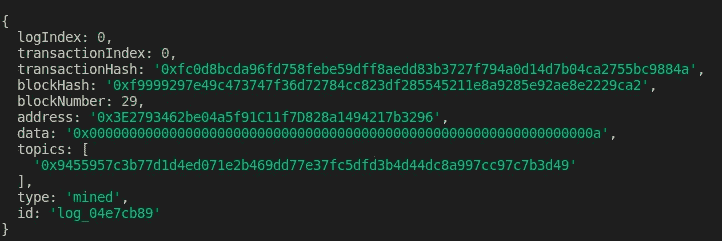
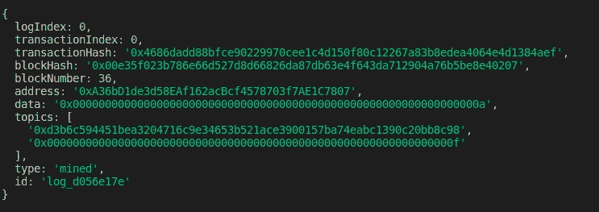

# 学习可靠性:事件

> 原文：<https://betterprogramming.pub/learn-solidity-events-2801d6a99a92>

## 如何使用事件进行日志记录


[伊曼纽尔](https://unsplash.com/@axville?utm_source=unsplash&utm_medium=referral&utm_content=creditCopyText)在 [Unsplash](https://unsplash.com/?utm_source=unsplash&utm_medium=referral&utm_content=creditCopyText) 上的照片

欢迎阅读 Learn Solidity 系列的另一篇文章，这篇文章旨在向您介绍[以太坊](https://ethereum.org/en/)编程。

在[上一篇文章](https://medium.com/better-programming/build-your-first-dapp-with-web3-js-9a7306d16a61)中，我们已经看到了如何使用 [web3.js](https://web3js.readthedocs.io/en/v1.3.0/) 来构建一个 dapp。在今天的文章中，我们将看到如何使用 web3.js 从区块链读取事件。

Solidity 中的事件就像您在其他语言中使用的日志功能一样，只是日志不是记录到控制台或文件中，而是保存在以太坊区块链中。在以下几节中，我们将看到:

*   如何声明和触发事件
*   什么是`logsBloom`以及它如何帮助有效搜索区块链
*   如何解读区块链的一个事件
*   如何订阅活动

# 如何声明和触发事件

为了声明事件，您需要使用以下语法:

事件的定义包含事件的名称和触发事件时要保存的参数。

一旦声明了事件，就可以从函数中发出事件，如下所示:

```
emit MyEvent(block.timestamp, 'hello');
```

让我们构建一个例子来看看这实际上是如何工作的。

在您的终端中，创建一个新目录并使用`truffle init`构建一个新的 truffle 项目。使用您最喜欢的代码编辑器打开项目，在 contracts 文件夹中创建一个名为`EventExample.sol`的新合同，然后复制粘贴以下代码:

创建相应的迁移文件`2_deploy_eventExample.js`:

```
const EventExample = artifacts.require("EventExample");module.exports = function (deployer) {
   deployer.deploy(EventExample);
};
```

现在让我们使用`truffle migrate`来部署契约，但是在迁移之前，不要忘记编辑您的`truffle-config.js`文件来配置网络和编译器。

在您的终端中，使用`truffle console`启动松露控制台。
我们将调用`storeData`函数并检查创建的事务的日志。让我们从获取已部署契约的实例开始:

```
let eventExample = await EventExample.deployed()
```

我们现在可以使用以下方式调用该函数:

```
let tx = await eventExample.storeData(10)
```

如果打印事务接收日志`tx.receipt.rawLogs`的内容，它存储了事务执行期间发生的触发事件的数组，您将得到一个包含一个对象的数组，如下所示:



事项登记

您可以看到事件数据以十六进制存储在数据字段下。

# logsBloom 如何帮助**高效搜索区块链**

为了有效地扫描区块链以查找具有特定数据的事件，您可以在想要用来过滤区块链中记录的事件的事件数据前添加`indexed`关键字。

```
event DataStored(uint256 data1, uint256 indexed data2)
```

让我们在刚刚构建的示例中尝试一下:

您需要使用`migrate --reset`重新部署合同。

重复前面相同的步骤，获取已部署契约的实例，并调用`storeData`函数:

```
> eventExample = await EventExample.deployed()
> tx = await eventExample.storeData(10, 15)
```

然后考察`tx.receipt.rawLogs`。您将看到以下结果:



事项登记

`data1`字段显示在`data`下，而索引字段`data2`显示在`topics`字段下。通常，索引参数放在`topics`下，非索引参数放在`data`下。

第一个主题是事件签名的散列，在[可靠性文档](https://docs.soliditylang.org/en/v0.8.0/abi-spec.html#events)中有描述:

> `topics[0]` : `keccak(EVENT_NAME+"("+EVENT_ARGS.map(canonical_type_of).join(",")+")")`
> ( `canonical_type_of`是一个简单地返回给定参数的规范类型的函数，例如对于`uint indexed foo`，它将返回`uint256`)。如果事件被声明为`anonymous`，则不产生`topics[0]`；

**注意:**一个事件中最多可以索引三个参数。

每个块头包含一个名为`logsBloom`的字段，这是由块的事务列表部分中每个事务的收据中包含的可索引信息(日志地址和日志主题)组成的[布隆过滤器](https://en.wikipedia.org/wiki/Bloom_filter)。

当在整个区块链或其一部分中寻找属于某个地址或包含某个数据的特定事件时，该节点检查块报头并检查每个块的布隆过滤器，以便决定该块是否包含期望的日志。

# 如何从区块链中读取一个事件

事件应该从区块链外部使用，这可以从前端或 Node.js 项目完成。

为了简化客户端，我将演示如何从节点项目中读取事件。

首先在项目中创建一个名为`client`的新文件夹，并执行以下命令:

```
> npm init -y
> npm i web3 --save
> touch index.js
```

`index.js`的内容如下:

我使用 WebSocket provider 代替 HTTP provider，因为后者不支持订阅。

实际上有三种方法可以从区块链中读取事件数据:

1.  这是我们在之前的`index.js`中所做的。如果执行`node index.js`，就会得到数据和题目。
2.  订阅活动—如 web3 文档的本节[中所述，订阅活动有三种方式:](https://web3js.readthedocs.io/en/v1.3.0/web3-eth-contract.html#events)

*   `[once](https://web3js.readthedocs.io/en/v1.3.0/web3-eth-contract.html#once)`:订阅一个事件，在第一个事件或错误发生后立即退订；只会在单一事件中触发。删除`index.js`文件中包含事务执行的代码，替换为:

```
eventExample.once("DataStored", (error, event) => {
    if (!error) console.log(event);
});
```

从您的终端，通过执行`node index.js`启动节点项目。你不会看到任何打印出来的东西，因为它还在等待第一个`DataStored`事件。打开另一个终端并获取部署的契约实例。然后调用`storeData`函数。现在，您将在第一个控制台中看到打印的事件。

*   `[events](https://web3js.readthedocs.io/en/v1.3.0/web3-eth-contract.html#contract-events)`:订阅活动。订阅是这样做的:`myContract.events.MyEvent([options][, callback])`。在本例中，我们将观察包含值为 5 或 9 的`data2`的`DataStored`事件。

```
eventExample.events
   .DataStored({ filter: { data2: [5, 9] } })
   .on("data", (event) => {
       console.log(event);
    });
```

*   `[events.allEvents](https://web3js.readthedocs.io/en/v1.3.0/web3-eth-contract.html#events-allevents)`:这与 events 相同，但接收来自此智能合约的所有事件。可选地，过滤器属性可以过滤那些事件。

3.获取以前的事件——这可以通过调用`[getPastEvents](https://web3js.readthedocs.io/en/v1.3.0/web3-eth-contract.html#getpastevents)`来完成，如下所示:`myContract.getPastEvents(event[, options][, callback])`。文档中描述了选项的完整列表。一个重要的选项是`fromBlock`,因为如果没有指定，您将只能获得最新块的事件。

```
eventExample.getPastEvents("DataStored", { fromBlock: 0 }).then((events) => console.log(events));
```

# 结论

作为进一步的阅读，你可以看看[可靠性文档](https://docs.soliditylang.org/en/v0.8.0/contracts.html#events)中的事件部分。

我希望你喜欢这篇文章。如果有，请继续关注即将发布的文章。