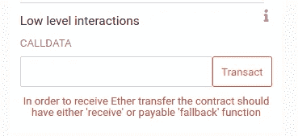

# 学习可靠性:功能

> 原文：<https://betterprogramming.pub/learn-solidity-functions-ddd8ea24c00d>

## 如何在 Solidity 中使用函数


由[凯利·西克玛](https://unsplash.com/@kellysikkema?utm_source=unsplash&utm_medium=referral&utm_content=creditCopyText)在 [Unsplash](https://unsplash.com/?utm_source=unsplash&utm_medium=referral&utm_content=creditCopyText) 上拍摄的照片

欢迎学习 Solidity 系列的另一篇文章，在之前的文章[中，我们以变量结束，今天我将向您介绍函数和修饰符，这将在本文结束时为您提供构建多签名钱包的所有部分，我们将在练习部分看到。](https://medium.com/better-programming/learn-solidity-variables-part-3-3b02ca71cf06)

Solidity 中的函数具有以下形式:

```
function function_name(<param_type> <param_name>) <visibility> <state mutability> [returns(<return_type>)]{ ... }
```

它们可以写在契约之外(自由函数)，也可以写在契约之内。

# 返回变量

函数可以返回任意数量的值作为输出。从函数返回变量有两种方法:

**1。使用返回变量的名称:**

```
function arithmetic(uint _a, uint _b) public pure
        returns (uint o_sum, uint o_product)
    {
        o_sum = _a + _b;
        o_product = _a * _b;
    }
```

**2。直接用 return 语句提供返回值:**

```
function arithmetic(uint _a, uint _b) public pure
        returns (uint o_sum, uint o_product)
    {
        return (_a + _b, _a * _b);
    }
```

对于第二种方法，您可以省略返回变量的名称，只指定它们的类型。

## 支持的参数和返回类型

为了调用智能合约函数，我们需要使用 ABI(应用程序二进制接口)规范，以便指定要调用的函数并对参数进行编码，这些参数将包含在事务的数据字段中，并将其发送到以太网来执行。
ABI 编码也用于事件和返回类型，更多细节可以在[文档](https://docs.soliditylang.org/en/v0.7.5/abi-spec.html#contract-abi-specification)中找到。

ABI 编码器的第一个版本并不支持我们在以前的文章中看到的所有类型，例如，我们不能从函数中返回结构，如果你试图这样做，你会得到一个错误，这就是为什么我们需要使用 ABI 编码器的版本 2，以便通过在文件中包含以下行来使错误消失:`pragma abicoder v2;`如果你使用的是 Solidity 版本:0.7.5。对于 0.7.5 以下的版本，我们需要使用实验版:`pragma experimental ABIEncoderV2;`

这是版本 0.7.5 的 Solidity 文档中的一个例子。

```
// SPDX-License-Identifier: GPL-3.0
pragma solidity >0.7.4;
pragma abicoder v2;

contract Test {
    struct S { uint a; uint[] b; T[] c; }
    struct T { uint x; uint y; }
    function f(S memory, T memory, uint) public pure {}
    function g() public pure returns (S memory, T memory, uint) {}
}
```

支持的 ABI 类型的完整列表可在本部分文档中找到。

# 能见度

函数有四种可见性:

*   **Private** :限制性最强的一个，这个函数只能从定义它的智能合约中调用。
*   **内部**:该函数可以从定义它的智能合约以及从它继承的所有智能合约中调用。
*   **外部**:只能从智能合约外部调用。(如果要从智能合约中调用它，必须使用它。)
*   **Public** :可以从任何地方调用。(最宽容的一个)

# 状态可变性

*   **视图**:用`view`声明的函数只能读取状态，不能修改状态。
*   **纯**:用`pure`声明的函数既不能读取也不能修改状态。
*   **应付款**:用`payable`声明的函数可以接受发送给契约的以太，如果没有指定，函数会自动拒绝所有发送给它的以太。

```
contract SimpleStorage {
     uint256 private data; function getData() external view returns(uint256) {
         return data;
     } function setData(uint256 _data) external {
        data = _data;
    }
}
```

在这里可以找到什么是读状态的意思[，在这里](https://solidity.readthedocs.io/en/v0.7.4/contracts.html#pure-functions)可以找到详细的写状态的意思[。](https://solidity.readthedocs.io/en/v0.7.4/contracts.html#view-functions)

## 交易与呼叫

用`view`和`pure`关键字定义的函数不会改变以太坊区块链的状态，这意味着当您调用这些函数时，您不会向区块链发送任何事务，因为事务被定义为将区块链从一个状态转换到另一个状态的状态转换函数。取而代之的是，您所连接的节点通过检查自己的区块链版本在本地执行该函数的代码，并返回结果，而不向以太网广播任何事务。

在本节中，我们将看到一些您可以使用的特殊功能。

# 吸气功能

定义为 public 的状态变量有一个由编译器自动创建的 getter 函数。该函数与变量同名，并且具有外部可见性。

```
contract C {
    uint public data;
    function x() public returns (uint) {
        data = 3; // internal access
        return this.data(); // external access
    }
}
```

# 接收以太功能

一个合同最多可以有一个`receive`功能。这个函数不能有参数，不能返回任何东西，并且必须有`external`可见性和`payable`状态可变性。

它在对发送 Ether 且未指定任何函数的协定的调用中执行(空调用数据)。这是在普通以太网传输上执行的功能(例如通过`.send()`或`.transfer()`)。
该功能声明如下:

```
receive() external payable {
   ...
}
```

# 后退功能

一个合同最多可以有一个`fallback`功能。这个函数不能有参数，不能返回任何东西，并且必须有`external`可见性。如果**没有其他函数与给定的函数签名**匹配，或者如果**没有提供任何数据**并且**没有接收以太函数**，则在调用契约时执行。
您可以如下声明这样一个函数:

```
fallback() external [payable]{
     ...
}
```

> “没有通过`send`或`transfer`的函数调用直接接收以太网并且没有定义`receive`函数或可支付回退函数的契约将抛出一个异常，将以太网发送回去。”— [坚固性文件](https://docs.soliditylang.org/en/v0.7.5/abi-spec.html#contract-abi-specification)

在 Remix 中自己尝试一下，创建一个没有`receive`或`payable fallback`的契约，然后给它发送一些以太。在点击**交易**后，您应该会看到类似这样的消息。



示例消息

# 功能修饰符

当你想在函数执行前检查某个条件时，需要使用修饰符。例如，如果您想检查发送者是否是合同的所有者，您可以这样写:

```
function selectWinner() external {
    require(msg.sender == owner, "this function is restricted to the owner);
    ...}
```

有了修饰符，我们可以隔离这段代码，这样我们就可以在其他函数中重用它，我们只需要如下声明一个修饰符:

```
modifier onlyOwner(){
   require(msg.sender == owner, "this function is restricted to the owner);
  _; // will be replaced by the code of the function
}
```

我们将修饰符名称添加到函数中:

```
function selectWinner() external onlyOwner {

    ...}
```

通过在一个空格分隔的列表中指定多个修饰符，可以将它们应用于一个函数，并按照给出的顺序进行计算。

# 练习:Multisig 钱包

在本练习中，我们将为多签名钱包构建一个智能合约:
多签名钱包是一种需要多个密钥来授权交易的钱包。关于这种钱包及其使用案例的更多信息可以在[比特币文档](https://en.bitcoin.it/wiki/Multisignature)中找到。

我们首先需要的是批准者列表和授权交易所需的法定人数(所需的最少用户数，如果我们有两个或三个 multisig wallet，这意味着法定人数是两个)。
您还需要创建一个结构来记录与转账相关的信息，包括要支付的金额、收款人、已经批准转账的批准人数量及其状态(是否已发送或仍在等待批准人的确认)。

流程如下:其中一个批准人将创建转移，转移将保存在智能合同的存储器中，等待其他批准人的确认，一旦达到所需的确认数量，乙醚将转移给接收人。

解决方案可以在 Github 的找到。

这就是 Solidity 中的函数，我希望这篇文章对你有用。
在 Solidity 方面，我们还有很多需要发现的:智能合约之间的交互、继承、事件和异常处理、部署到公共测试网，等等。所以像往常一样，如果你想了解更多，请继续关注即将到来的文章。