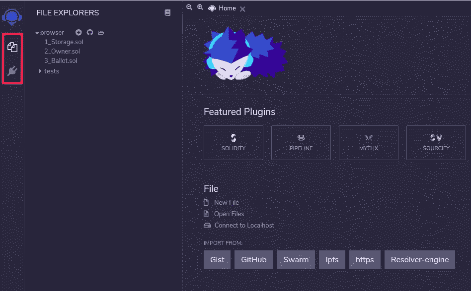
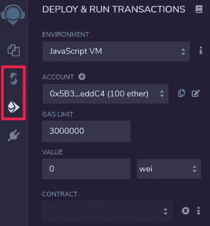
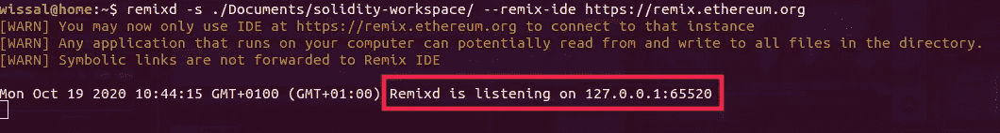
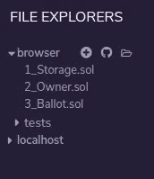
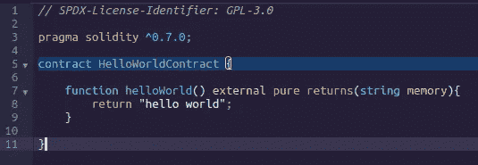
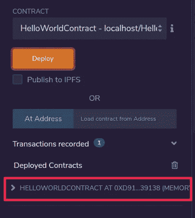
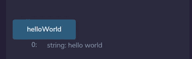

# 学习可靠性:简介

> 原文：<https://betterprogramming.pub/learn-solidity-introduction-327b1f9eb30e>

## 立即开始在以太坊上编写智能合同


[Cytonn 摄影](https://unsplash.com/@cytonn_photography?utm_source=medium&utm_medium=referral)在 [Unsplash](https://unsplash.com?utm_source=medium&utm_medium=referral) 上拍摄。

[Solidity](https://solidity.readthedocs.io/en/v0.7.4/) 是用于开发以太坊智能合约的最流行的语言之一，所以作为一个想成为区块链开发者的人，我决定学习如何使用 Solidity 开发智能合约。

但是由于我找不到我想要的质量的教程(一个让初学者以简洁的方式轻松学习基础知识的教程)，我决定创建这个系列，我希望它能非常快速有效地向您介绍 Solidity 编程。尽情享受吧！

# **设置开发环境**

我们将使用的 IDE 是 [Remix](https://remix-ide.readthedocs.io/en/latest/) 。你所需要做的就是输入这个 URL。完成后，您应该会看到如下所示的屏幕:



在左侧，我选择了两个主要组件。第一个图标是文件资源管理器，您可以在其中看到所有的 Solidity 文件，第二个图标是插件管理器，您可以在其中添加新的插件。我们将需要添加两个插件，因此单击插件管理器图标并键入“Solidity compiler”然后点击“activate”来激活它，并做同样的事情来添加“Deploy and run transactions”插件。

“Solidity compiler”选项卡将允许您配置编译器参数并编译您的智能合约，而“Deploy and run transactions”选项卡将允许您在区块链中部署您的智能合约并与之交互。图标列表现在应该如下所示:



您现在应该做的第一件事是检查编译器选项卡中的自动编译选项。接下来，我们将配置 Remix 来使用本地存储中的文件。
您需要使用以下命令安装 remixd:

```
npm install -g remixd
```

安装完成后，您可以创建一个文件夹来存放您的 Solidity 文件，然后运行以下命令来告诉 Remix 使用您文件夹中的文件:

```
remixd -s <shared folder> — remix-ide [https://remix.ethereum.org](https://remix.ethereum.org)
```



现在转到 Remix 的主页，点击“连接到 localhost”，然后在弹出窗口中选择“连接”，你应该会在“文件资源管理器”选项卡下看到一个名为 localhost 的区域。如果您展开它，您将看到您从本地存储共享的文件夹中包含的所有文件:



恭喜你！现在你有工具开始写你的第一份智能合同。

等等…我们不应该安装一些东西来和以太坊区块链互动吗？暂时没有。我们会从简单开始。Remix 将为您提供一个沙盒区块链，它运行在您的浏览器中，用于部署您的合同并与之交互。只要确保在“部署和运行”选项卡中选择 Javascript VM 作为环境。

# **撰写你的 Hello World 合同**

让我们看看我们的第一个智能合同是什么样的:



## **SPDX 许可证标识符**

如果源代码可用，可以更好地建立对智能合约的信任。由于提供源代码总是会涉及版权方面的法律问题，Solidity 编译器鼓励使用机器可读的 [SPDX 许可证标识符](https://spdx.org/)。每个源文件都应该以一个注释开始，说明它的许可。TK([https://solidity . readthedocs . io/en/v 0 . 7 . 3/layout-of-source-files . html](https://solidity.readthedocs.io/en/v0.7.3/layout-of-source-files.html))

## **版本杂注**

源文件可以(也应该)用版本杂注进行注释，以拒绝用将来的编译器版本进行编译，因为将来的编译器版本可能会引入不兼容的更改。TK([https://solidity . readthedocs . io/en/v 0 . 7 . 3/layout-of-source-files . html](https://solidity.readthedocs.io/en/v0.7.3/layout-of-source-files.html))

有重大变更的版本总是以`0.x.0`或`x.0.0`的形式出现。在我们的例子中，可以使用的编译器版本应该是大于等于 0.7.0 小于 0.8.0(这第二个条件是用`^`加上的)。可以为编译器版本指定更复杂的规则。这些语法与 [npm](https://docs.npmjs.com/misc/semver) 使用的语法相同。

前两行应该出现在所有智能合约文件中。
为了开始编写您的智能合同，您需要使用关键字`contract` 后跟合同名称，然后您可以将您的代码放在花括号之间。

说够了，让我们创建这个 hello world 契约。

在您的共享文件夹中创建一个名为`HelloWorldContract.sol`的新文件，并复制粘贴前面的代码。如果您选中了自动编译选项，它将自动编译代码。如果没有，那么一定要检查它并编译代码。

现在是时候部署我们的第一个契约并与之交互了。
单击“部署和运行事务”选项卡，然后确保在环境中选择了 JavaScript VM，并且在合同区域中选择了您的合同名称。完成后，点击“部署”



现在，您应该可以在“已部署的合同”区域看到您的合同。
展开就会看到`helloWorld`功能。点击它以发送调用该函数的事务，您将看到打印的`hello world`字符串。



# **智能合约的结构**

现在让我们看看你可以在你的智能合约中放入什么(下面直接引自[https://solidity . readthedocs . io/en/v 0 . 6 . 7/structure-of-a-contract . html](https://solidity.readthedocs.io/en/v0.6.7/structure-of-a-contract.html)):

1.  状态变量:其值永久存储在契约存储中的变量。
2.  函数:函数是代码的可执行单元。函数通常在契约内部定义，但也可以在契约外部定义。
3.  函数修饰符:函数修饰符可以用来以声明的方式修改函数的语义。
4.  事件:事件是与 EVM 日志记录工具的便利接口。
5.  结构类型:结构是自定义的类型，可以将几个变量组合在一起。
6.  枚举类型:枚举可用于创建具有有限“常数值”集的自定义类型。

稍后我们将更详细地了解这些组件。

介绍到此为止。下一篇文章再见！

# 参考

*   [https://remix-ide.readthedocs.io/en/latest/](https://remix-ide.readthedocs.io/en/latest/)
*   [https://solidity.readthedocs.io/en/v0.7.3/](https://solidity.readthedocs.io/en/v0.7.3/)