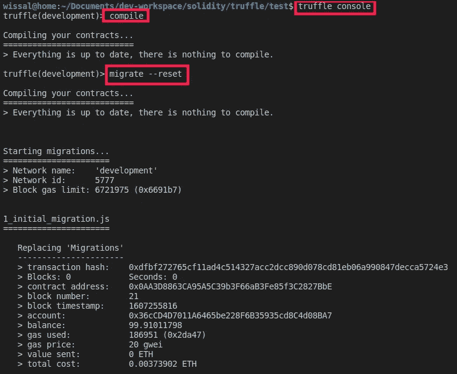
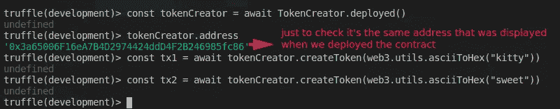
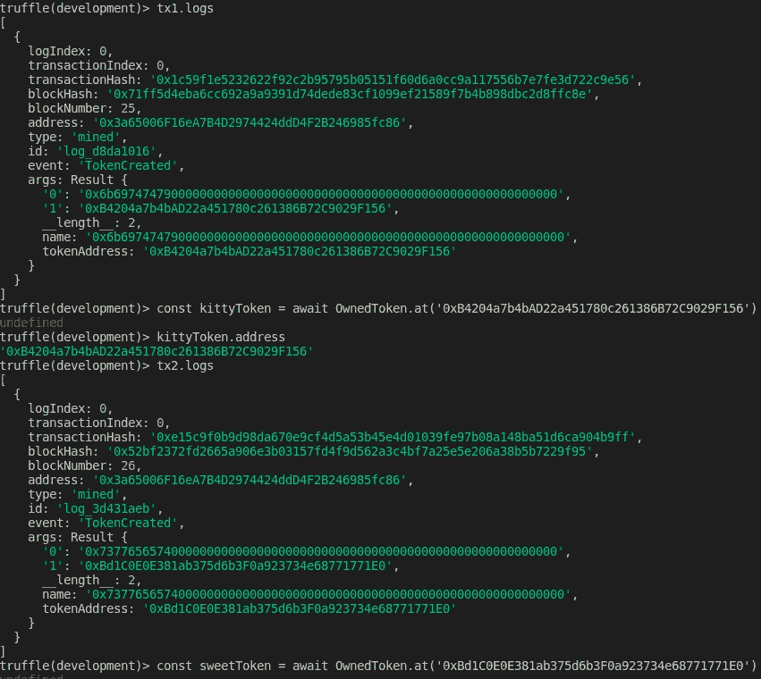
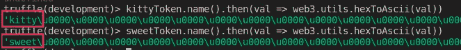

# 学习可靠性:智能契约创建和继承

> 原文：<https://betterprogramming.pub/learn-solidity-smart-contract-creation-and-inheritance-8424adac3570>

## 如何从合同中创建合同


[Akson](https://unsplash.com/@akson?utm_source=unsplash&utm_medium=referral&utm_content=creditCopyText) 在 [Unsplash](https://unsplash.com/s/photos/communication?utm_source=unsplash&utm_medium=referral&utm_content=creditCopyText) 上拍照

欢迎阅读“学习可靠性”系列的另一篇文章。在[上一篇文章](https://medium.com/better-programming/learn-solidity-functions-ddd8ea24c00d)中，我们看到了如何使用函数，并应用我们目前所学的一切来构建一个多签名钱包。

在本文中，我们将了解如何从另一个契约中创建一个契约，以及如何定义抽象契约和接口。

# 合同创建

契约可以通过以太坊交易来创建，也可以在 Solidity 契约中使用`new`关键字来创建，它会部署该契约的一个新实例并返回其地址。

让我们通过检查 Solidity 文档中给出的例子来更仔细地看看这实际上是如何工作的。我创建了`name`变量`public`，这样我们就可以检查它的值，并创建一个事件来读取`createToken`函数的返回值(我们将有另一篇文章讨论事件):

这一次，我将使用 [Tuffle 框架](https://www.trufflesuite.com/docs/truffle/overview)——您可以通过遵循他们制作的[快速入门指南](https://www.trufflesuite.com/docs/truffle/quickstart)来了解它。

首先，我们将创建一个新项目，并通过执行以下命令来初始化它:

```
> mkdir token
> cd token
> truffle init
```

打开项目，更新`truffle-config.js`文件以使用网络 IP 和端口，您将在那里部署合同和您正在使用的 Solidity 编译器版本。在我的例子中，我使用 [Ganache](https://www.trufflesuite.com/ganache) 来运行网络。

现在我们可以在`contracts`文件夹中创建我们的合同。复制并粘贴代码后，您需要在`migrations`文件夹中创建一个迁移文件来部署`TokenCreator`契约。命名为`2_deploy_token.js`，复制粘贴以下代码。

```
const TokenCreator = artifacts.require("TokenCreator");module.exports = function (deployer) {
     deployer.deploy(TokenCreator);
};
```

现在回到命令行，键入`truffle console`启动 Truffle 控制台——在这里您可以编译和部署合同:



我们现在要做的是检索已经部署的`TokenCreator`的实例。然后，我们将调用`createToken`函数两次，并保存每个新创建合同的地址。



如果您使用的是 Ganache，您可以看到两个事务代表一个添加到事务列表中的契约调用，其中数据字段被设置为函数选择器的四个字节，参数被传递。如果你想知道到底发生了什么，这些合同是如何产生的，请继续关注我。

正如我们所知，合同只是另一种类型的帐户，所以当我们调用`createToken`函数时，真正发生的是状态数据库被更新，以包括新创建的帐户，其中每个帐户存储的四个变量(`nonce`、`balance`、`storage_root`、`code_hash`)被正确初始化。

如果您现在回到 Truffle 控制台，您可以检查每个事务的日志以获得每个合同的地址，然后您可以调用名称 getter 来验证它们确实是两个独立的实体。



更多关于 web3.js 的信息可以在[这里](https://web3js.readthedocs.io/en/v1.3.0/)找到。

# 构造函数声明

合同的构造函数在合同创建时被调用，并且不与合同代码的其余部分一起存储在区块链上。
构造函数是可选的。只允许一个构造函数，这意味着不支持重载。

使用`constructor`关键字声明一个构造函数:

```
contract A {
     uint a;
     bool b; constructor(uint _a, bool _b){
        a = _a;
        b = _b;
   }
   ...
}
```

# 抽象合同

当至少有一个功能没有实现时，契约需要标记为`abstract`。即使所有功能都已实现，合同也可能标记为`abstract`。

这可以通过对契约使用`abstract`关键字来完成，未实现的函数应该使用`virtual`关键字来允许多态性。

```
abstract contract A {
    function f() public pure virtual;
}
```

抽象契约不能直接实例化，即使所有的功能都实现了。它们可以作为基础契约，定义由其他契约继承的特定行为。实现的函数应该有`override`关键字。

```
abstract contract A {
    function f() public pure virtual;
}abstract contract B is A {
    function f() public pure override {
       //function body
    }
}
```

如果一个派生契约没有实现所有未实现的功能，它也需要被标记为`abstract`。

# 接口

接口类似于抽象契约，但是它们不能实现任何功能。还有进一步的限制:

*   它们不能从其他契约继承，但是可以从其他接口继承
*   所有声明的函数都必须是外部的
*   他们不能声明构造函数
*   他们不能声明状态变量

使用关键字`interface`声明接口。

```
interface A {
    function f() external pure;
} 
```

接口中声明的所有函数都是隐式的`virtual`。

# 结论

本文到此为止。在接下来的文章中，我们将深入探讨智能合约的开发。敬请关注。