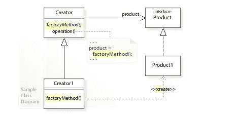
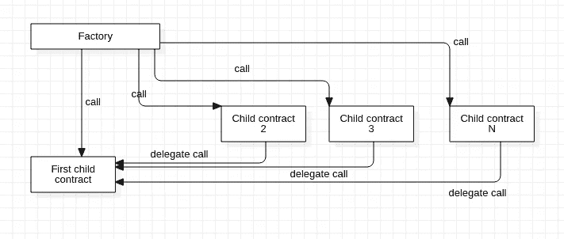

# 学习可靠性:工厂模式

> 原文：<https://betterprogramming.pub/learn-solidity-the-factory-pattern-75d11c3e7d29>

## 如何在智能合约中使用工厂模式

安特·罗泽茨基在 [Unsplash](https://unsplash.com?utm_source=medium&utm_medium=referral) 拍摄的照片。

欢迎来到学习可靠性系列的另一部分。在[上一篇文章](https://medium.com/better-programming/learn-solidity-smart-contract-creation-and-inheritance-8424adac3570)中，我们讨论了如何从另一个智能合约中创建一个智能合约。今天，我们将看一下这一场景的典型使用案例。

# 工厂模式是什么？

工厂模式的思想是拥有一个契约(工厂),它将承载创建其他契约的使命。在基于类的编程中，这种模式的主要动机来自于单责任原则(一个类不需要知道如何创建其他类的实例)，这种模式为构造函数提供了一种抽象。

图片来自[维基百科](https://en.wikipedia.org/wiki/Factory_method_pattern)。

# 为什么在 Solidity 中使用工厂模式？

在 Solidity 中，出于以下原因之一，您可能希望使用工厂模式:

*   如果您想要创建同一契约的多个实例，并且您正在寻找一种方法来跟踪它们并使它们的管理更容易。

*   节省部署时间:您可以只部署工厂，稍后使用它来部署其他合同。
*   提高合同安全性(参见[本文](https://consensys.net/diligence/blog/2019/09/factories-improve-smart-contract-security/))。

# 如何与部署的智能合约交互

在深入讨论如何实现工厂模式的细节之前，我想先弄清楚我们与已部署的智能契约交互的方式。工厂模式是关于创建子契约的，为了更好地管理这些契约，我们可能需要调用它们的一些函数。

当我们想要调用已部署的智能合约时，需要两件事情:

1.  协定的 ABI(提供有关函数签名的信息)。如果合同在同一个项目中。您可以使用`import`关键字导入它。
2.  已部署协定的地址。

让我们举个例子:

在 Remix 中，从部署契约 B 开始，然后复制它的地址，在部署的时候给 A 的构造函数。你现在可以调用`callHello()`函数，你将得到契约 b 的`sayHello()`函数的结果

# 正常工厂模式

在这个模式中，我们创建一个工厂契约，其中包含一个处理子契约创建的函数，我们还可能添加其他函数来有效管理这些契约(例如，查找特定的契约或禁用契约)。在 create 函数中，我们使用`new`关键字来部署子契约。

# 克隆工厂模式

前一种模式的问题是它浪费了大量的时间，因为所有的子契约都有相同的逻辑，我们每次都重新部署几乎相同的契约——相同的代码，但不同的上下文。我们需要一种方法，只部署一个具有所有功能的子契约，并让所有其他子契约充当代理，将调用委托给我们创建的第一个子契约，并让功能在代理契约的上下文中执行。

作者照片。

幸运的是，EIP-1167 规范定义了如何廉价地实现代理契约。该代理将所有调用和 100%的 gas 转发给实现契约，然后将返回值转发给调用者。根据规范代理契约的字节码是
`363d3d373d3d3d363d73bebebebebebebebebebebebebebebebebebebebe5af43d82803e903d91602b57fd5bf3`。索引 10-29(包括 10-29)处的字节被替换为主功能契约(我们将向其委托调用的契约)的 20 字节地址。

代理合同的全部魔力都是通过使用`delegatecall`完成的。你可以通过阅读这篇文章来了解它是如何工作的。

现在让我们来看看如何实现这一点。首先，你需要获取这个规范的实现，你可以在 [GitHub](https://github.com/optionality/clone-factory/blob/master/contracts/CloneFactory.sol) 上找到。将`CloneFactory`的代码复制粘贴到您的项目中。

我们这次要用的代码如下:

这一次，我们使用 GitHub 存储库中的`createClone`函数来创建子契约，而不是使用`new`关键字。

您可以通过在 Truffle 中创建新的迁移文件来部署合同，如下所示:

为了测试代码是否工作，我创建了一个测试文件，您可以自己尝试，以确保一切都按预期工作:

# 结论

本文到此为止。请继续关注智能合约开发的更多信息！