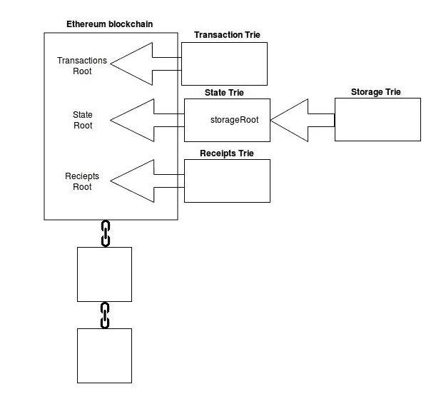
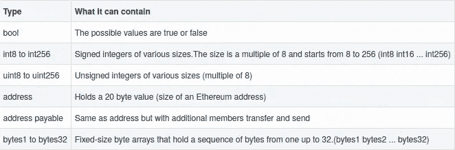
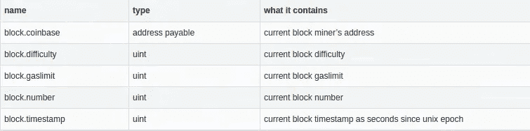
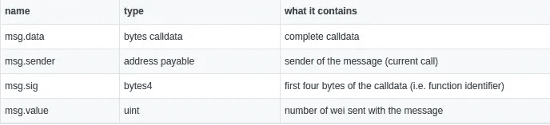
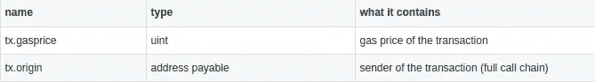

# 学习可靠性:变量(第 1 部分)

> 原文：<https://betterprogramming.pub/learn-solidity-variables-part-1-657fc27c2cc1>

## 开始在以太坊上写智能合同

照片由[照片爱好](https://unsplash.com/@photoshobby?utm_source=unsplash&utm_medium=referral&utm_content=creditCopyText)在 [Unsplash](https://unsplash.com/?utm_source=unsplash&utm_medium=referral&utm_content=creditCopyText) 上拍摄

欢迎阅读学习可靠性系列的第二篇文章。如果您还没有阅读第一篇，我强烈建议您阅读，以便设置您的开发环境，并编写和部署您的第一份合同。在这篇文章中，我们将看看 Solidity 中的变量，它们的类型，它们是如何存储的，以及如何使用它们。

在[实度](https://solidity.readthedocs.io/en/v0.7.4/)中，我们有两种类型的变量:

## 状态变量

这些变量是在函数之外声明的(就像类的属性一样)，并永久存储在以太坊区块链中，更具体地说是存储在 Merkle Patricia 树中，这是形成帐户状态的信息的一部分(这就是为什么我们称之为状态变量)。

以太坊 Merkle 帕特里夏树:[来源](https://medium.com/cybermiles/diving-into-ethereums-world-state-c893102030ed)

你可以在本文中找到更多关于以太坊区块链[中数据存储方式的信息。](https://medium.com/cybermiles/diving-into-ethereums-world-state-c893102030ed)

状态变量可以在声明时进行初始化，并具有以下可见性:

*   `private`:状态变量只对定义它的契约可见。
*   `public`:状态变量也可以从定义它的契约外部访问，因为编译器会自动创建一个与变量同名的 getter 函数。
*   `internal`:state 变量对于定义它的契约以及继承它的所有其他契约都是可见的。

可见性说明符在状态变量的类型之后给出，如果没有指定，状态变量将被认为是内部变量。

## 局部变量

这些是在函数内部声明的变量，它们的生存期仅限于在。

和其他语言一样，我们有基本类型和复杂类型。当用作函数参数或在赋值中使用时，基元类型总是通过值传递，而复杂类型(如数组和结构)则通过引用传递。

## **原始数据类型**

坚固性基本类型

[关于地址类型的更多信息:](https://solidity.readthedocs.io/en/v0.7.4/types.html#address)

*   地址文字:通过地址校验和测试的十六进制文字，例如`0xdCad3a6d3569DF655070DEd06cb7A1b2Ccd1D3AF`属于`address payable`类型。
*   类型转换:`address payable`可以隐式地转换成一个简单的`address`，这意味着您可以将一个可支付的地址分配给一个地址，而无需显式地转换它。

整数、[整数文字、](https://solidity.readthedocs.io/en/v0.7.4/types.html#rational-and-integer-literals)和`bytes20`允许使用以下语法显式转换为地址:`address(x)`。这种转换将产生一个`address payable`类型。

*   [地址成员:](https://solidity.readthedocs.io/en/v0.7.4/units-and-global-variables.html#address-related)地址类型的两个重要成员是`balance`和`transfer`，前者允许查询一个地址的余额，后者允许发送以太(以卫为单位)到一个可支付的地址。
*   [契约和地址类型:](https://solidity.readthedocs.io/en/v0.7.4/types.html#contract-types)
    您可以使用我们之前看到的语法:`address(x)`显式地将契约转换为地址类型，这里的 x 是契约的一个实例。如果契约定义了一个[接收](https://solidity.readthedocs.io/en/v0.7.4/contracts.html#receive-ether-function)或一个[应付回退函数](https://solidity.readthedocs.io/en/v0.7.4/contracts.html#fallback-function)(我们将在后面更详细地讨论函数)，这将导致一个`address payable`，如果没有定义，则导致一个`address`，在这种情况下，如果您希望它是应付的，您将必须使用`payable(address(x))`。

# 全局可用变量

有一些特殊变量总是存在于全局名称空间中，主要用于提供有关区块链的信息。

我们可以将这些变量分为三类:

1.  块属性

2.邮件属性

3.交易属性

我们将大量使用的两个属性是`msg.sender`，它可以为我们提供发送者的地址，从而可以存储合同所有者的地址，以及`msg.value`来获取随消息发送的金额。

让我们举一个例子，我们存储合同创建者的地址并修改`HelloWorldContract`，这样如果消息是由创建者发送的，我们就用“你好，爸爸否则，我们用“你好，世界”来问候发送者

如果您像我们在上一篇文章中看到的那样部署契约，然后单击`sayHell`，您将得到“hello Daddy ”,因为您用于部署契约的地址与您用于调用该函数的地址相同。

我们换个账号再调用函数吧。要更改您的帐户，您需要点击帐户部分的下拉列表，并选择不同的地址。

如果你这次打电话给`sayHello`，你应该会得到“你好世界”太好了，我们学到了一些东西。

在给你留下一个应用你所学知识的练习之前，我想提一下，Solidity 中的`[this](https://solidity.readthedocs.io/en/latest/units-and-global-variables.html#contract-related)`关键字引用了当前契约的类型，并且可以显式地转换为地址，就像我们在契约实例中看到的那样。

现在，我将留给您以下任务作为练习:

*   合同的寄信人地址。
*   合同所有者的寄信人地址。
*   寄件人的回邮地址。
*   返回合同的余额。
*   返回合同所有者的余额(仅当发送方是所有者时)。
*   返回发送方的余额。

你可以在 GitHub 上找到解决方案[。](https://gist.github.com/wissalHaji/43ba02467834e5d07e42fa3a1978d15c)

我希望你喜欢这篇文章。下一次我们将讨论复杂类型，并揭示我在前面的代码中在`string`旁边使用的`memory`关键字背后的秘密。所以，如果你想了解更多，请留下来，下一篇文章再见。