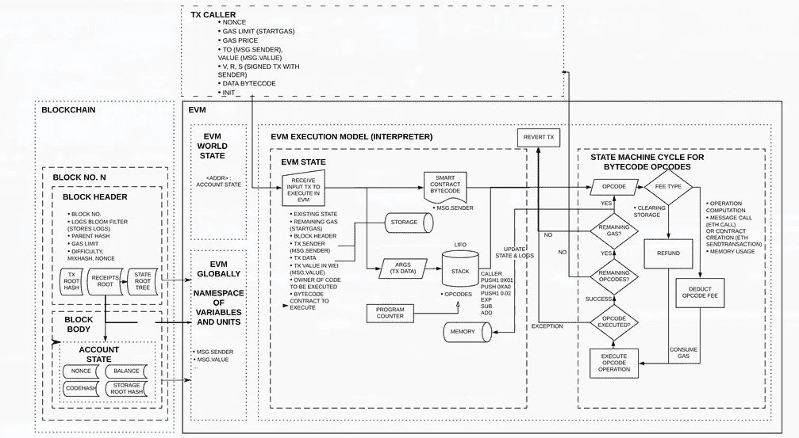
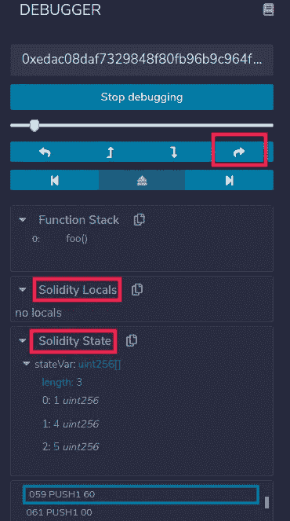

# 学习可靠性:变量(第二部分)

> 原文：<https://betterprogramming.pub/learn-solidity-variables-part-2-f3b842f5bfb8>

## 数据存储如何工作


杰西·奥里科在 [Unsplash](https://unsplash.com/?utm_source=unsplash&utm_medium=referral&utm_content=creditCopyText) 上的照片

欢迎阅读学习可靠性系列的另一篇文章。正如我在[的上一篇文章](https://wissal-haji.medium.com/learn-solidity-variables-part-1-657fc27c2cc1)中承诺的，我们将看到数据存储如何在 Solidity 中工作。

# 以太坊虚拟机(EVM)

在讲 [Solidity](https://solidity.readthedocs.io/en/v0.7.4/) 中的数据存储之前，我先介绍几个关于以太坊虚拟机的事情，让事情更清晰。

EVM 的内部运作:



fullstacks.org EVM 背景(图片来源:)

当我们安装以太坊客户端时，它会附带 EVM，这是一个轻量级的操作系统，专门用于运行智能合约。EVM 的架构基于一个[堆栈机器](https://igor.io/2013/08/28/stack-machines-fundamentals.html)的模型，这意味着指令集被设计为使用一个堆栈而不是[寄存器](https://en.wikipedia.org/wiki/Processor_register)。黄皮书中描述了 EVM [操作码](https://en.wikipedia.org/wiki/Opcode)的列表，可以在[以太坊 VM (EVM)操作码和指令参考](https://github.com/crytic/evm-opcodes)中找到

代码执行如下开始:当事务导致智能合约代码执行时，EVM 被实例化，并且 EVM 的 ROM 加载有被调用的合约的代码。将程序计数器设置为零，从合同帐户的存储中加载存储，将内存全部设置为零，并设置所有块和环境变量。然后代码被执行。

# **数据位置**

现在让我们回到记忆关键词，正如 [Solidity 文档](https://solidity.readthedocs.io/en/v0.7.4/types.html#data-location)中提到的。从版本 0.5.0 开始，所有复杂类型都必须给出一个明确的数据存储位置，有三个数据位置:`memory`、`storage`和`calldata`。

**注意:**唯一可以省略数据位置的地方是状态变量，因为它们总是存储在帐户的存储器中。

1.`**storage**`

*   `storage`中的数据被永久保存。存储是一个键值存储。
*   `storage`中的数据被写入区块链(因此它们改变了状态)，这就是为什么存储使用起来非常昂贵。
*   占据一个 256 位的槽要花费 2 万[气](https://ethereum.org/en/developers/docs/gas/)。
*   改变一个已经被占用的槽的值花费 5000 汽油。
*   当清除存储槽(即，将非零字节设置为零)时，会退还一定量的气体。
*   存储器将数据保存在 256 位大小的字段中(32 字节=字)。每个使用的插槽都会产生成本，即使它没有被完全占用。

2.`**memory**`

*   `memory`是一个字节数组，槽大小为 256 位(32 字节)。这里，数据仅在函数执行期间存储。之后，它们会被删除。他们没有被拯救到区块链。
*   读或写一个字(256 位)要花 3 个气。
*   为了避免矿工过多的工作，在 22 次操作后，每次操作的成本开始上升。

3.`**calldata**`

*   `calldata`是一个不可修改的、非持久的存储函数参数的区域，它的行为很像`memory`。
*   `calldata`是[外部函数](https://solidity.readthedocs.io/en/v0.7.4/contracts.html#visibility-and-getters)的参数所必需的，但也可用于其他变量。
*   它避免了拷贝，也确保了数据不能被修改。
*   带有`calldata`数据位置的数组和结构也可以从函数中返回，但是不能分配这样的类型。

## 数据位置和分配行为

如果您不想出现意外行为，那么理解数据位置分配的工作方式非常重要。

分配之间应用以下规则:

*   在`storage`和`memory`(或来自`calldata`)之间的分配总是创建一个独立的副本。
*   从`memory`到`memory`的分配仅创建参考。这意味着对一个内存变量的更改在引用相同数据的所有其他内存变量中也是可见的。
*   从`storage`到本地存储变量的赋值也只分配一个引用。
*   所有其他分配给`storage`的任务总是复制。这种情况的例子是对状态变量或`storage`结构类型的局部变量成员的赋值，即使局部变量本身只是一个引用。

让我们用 [Remix 调试器](https://remix-ide.readthedocs.io/en/latest/debugger.html)更详细地检查一下。

创建一个新文件，复制上面的代码，然后部署契约。
现在尝试调用函数`foo`。您将在控制台中看到事务的详细信息，在它旁边有一个 debug 按钮。点击它。


现在，您应该会看到如下所示的调试器区域:



要跳过代码，请单击我选择的红色箭头。

你应该注意的第一件事是`storage`装载了`stateVar`的内容，正如我们在 EVM 部分提到的，当然没有局部变量。

当你单步执行时，你应该看到变量`y`出现在局部变量(实性局部变量)部分。继续往下走，你会注意到，为了分配必要的内存空间和从`storage`加载每个单词，然后在`memory`中复制它，需要很多字节码。这意味着要支付更多的汽油，因此从 `storage`到`memory`的分配是昂贵的。

让我们检查第二种情况:从`memory`到`storage`的赋值。
当您完成了对保存在`memory`中的副本的修改，并且您想将修改保存回 `storage`时，可以使用它。也很耗气；17，083 气体，如果我们从调试器计算步骤细节部分指示的剩余气体的差异。该操作使用了四个存储操作码:第一个用于存储保持不变的数组大小(消耗 800 gas)，另外三个用于更新数组的值(每个消耗 5,000 gas)。

现在我们来看第三种情况:从仓库到仓库的分配。这一次创建了一个新的局部变量，它包含了与`stateVar`相同的内容。如果我们查看代码执行，我们会注意到 Solidity 所做的是将包含数组长度的第一个存储槽的地址推入。根据[文档](https://solidity.readthedocs.io/en/v0.6.8/internals/layout_in_storage.html#mappings-and-dynamic-arrays)，对于动态数组，包含数组长度的槽的位置用于计算包含数组数据的槽的位置。

如果我们现在比较一下将数据复制到`memory`，然后更新数据并将其复制回存储器的成本(21，629 gas)与创建引用并直接更新状态的成本(5，085 gas)，很明显第二种方法要便宜得多。

但是如果我们像这样直接更新状态变量会怎么样呢:

```
stateVar[0] = 12;
```

也有可能。但是如果您正在处理映射和嵌套数据类型(正如我们将在后面看到的)，使用`storage`指针可以产生更可读的代码。

为了使这篇文章简短，并且不会让您被过多的信息淹没，我决定将复杂的变量留到下一篇文章中。我希望这篇文章对你有用，和往常一样，如果你想了解更多，请继续关注即将到来的文章。

# 参考

[](https://dlt-repo.net/storage-vs-memory-vs-stack-in-solidity-ethereum/) [## Solidity 和以太坊中的存储与内存和堆栈- DLT-Repo

### 在本文中，我们将重点讨论以太坊中存储、内存和堆栈之间的区别。我们也将给出一个实度…

dlt-repo.net](https://dlt-repo.net/storage-vs-memory-vs-stack-in-solidity-ethereum/) [](https://fullstacks.org/materials/ethereumbook/14_evm.html) [## 以太坊虚拟机

### 编辑描述

fullstacks.org](https://fullstacks.org/materials/ethereumbook/14_evm.html) [](https://ethereum.org/en/developers/docs/gas/) [## 汽油和费用| ethereum.org

### ░░░░░░░░░▄░░░░░░░░░░░░░░▄░░░░ ░░░░░░░░▌▒█░░░░░░░░░░░▄▀▒▌░░░ ░░░░░░░░▌▒▒█░░░░░░░░▄▀▒▒▒▐░░░ ░░░░░░░▐▄▀▒▒▀▀▀▀▄▄▄▀▒▒▒▒▒▐░░░…

ethereum.org](https://ethereum.org/en/developers/docs/gas/)