# 了解登录 Web 浏览器控制台的不同方式

> 原文：<https://betterprogramming.pub/learn-the-different-ways-of-logging-to-the-web-browser-console-940a44c81370>

## 用于更好调试的 Web 控制台功能


照片由[努贝尔森·费尔南德斯](https://unsplash.com/@nubelsondev?utm_source=medium&utm_medium=referral)在 [Unsplash](https://unsplash.com?utm_source=medium&utm_medium=referral) 上拍摄

我必须承认，当我刚接触 JavaScript 时，每当我想在 web 控制台上记录一些东西时，它看起来就像这样:

```
console.log('log message ...!')
```

在本指南中，我将讨论登录到 web 控制台的替代方法，以便您可以在开发工作流中更加高效，尤其是出于调试目的。

在我们看替代方案之前，让我们看看`console.log()`真正擅长的是什么。

# console.log()

登录 web 控制台最常见的方法是通过`console.log()`方法。它只是向 web 控制台输出一个字符串消息或一些 JavaScript 对象。

对于简单的字符串消息，`console.log()`为王。

例如，要输出消息“Hello World”，只需执行以下操作。

```
console.log(‘Hello World’);
```

在浏览器控制台中，上述内容的输出如下所示。

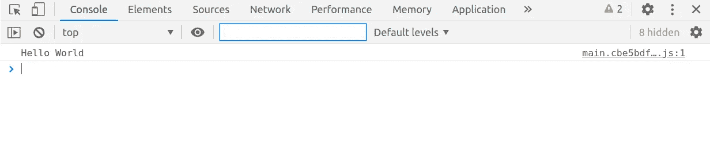

`console.log()`的另一个特性是打印 DOM 元素的输出或网站的一部分的结构——例如，body 元素和其中的所有内容。

```
console.log(document.body)
```

输出是打印成 HTML 树的 DOM 元素的集合，如下所示。

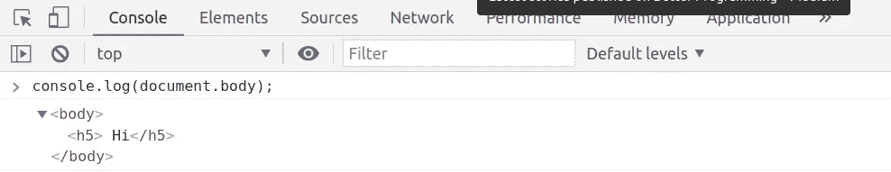

# console.dir()

`console.dir()`方法用于显示 JavaScript 对象的交互属性，例如，查看网页中 DOM 元素的完整表示。

`console.dir()`的输出是某个指定 JavaScript 对象的所有属性。

`console.dir()`的输出是 JSON 格式的。例如，要打印 HTML 页面正文中元素的属性，可以执行以下操作。

```
console.dir(document.body);
```

输出片段如下所示:

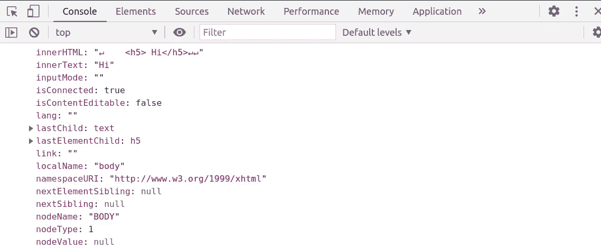

# 清除控制台输出

在我们继续之前，让我们清除刚刚创建的控制台输出混乱。

要清除控制台输出，只需执行以下操作。

```
console.clear();
```

您也可以使用键盘快捷键清除 web 浏览器控制台。web 浏览器控制台必须在焦点上，快捷方式才能工作。

铬:`Ctrl + L`

火狐:`Ctrl + Shift + L`

**提示**:在 chrome 中，你可以通过如下方式启用保留日志功能来禁止清除 web 控制台输出。

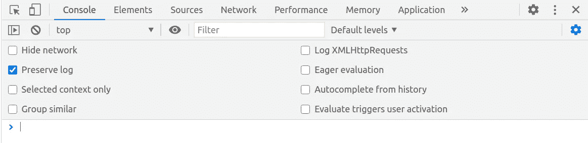

# console.assert()

你可以使用`console.assert()`方法来计算一些表达式或者条件。该方法有两个参数:求值表达式和断言失败时输出的字符串消息。

当 assert 评估失败时，会将一条错误消息打印到 web 控制台。

假设你要评价一个人的年龄是否大于 18 岁。

```
let ageLimit = 18;
let myAge = 15;
const assertMessage = 'expected your age to be greater than 18';console.assert(myAge > ageLimit , assertMessage);
```

上面断言的输出如下所示。

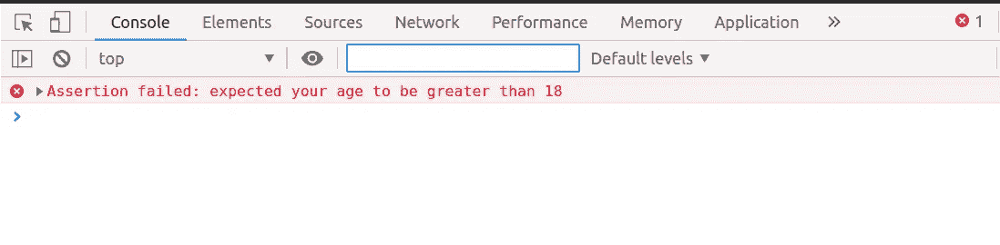

注意，使用`console.assert()`方法，只有当断言失败时，您才能获得 web 控制台的输出。如果是`true`，什么都不打印。

# console.table()

要以表格格式显示数据，可以使用`console.table()`方法。表格增强了数据的组织。

要以表格格式打印的数据必须是数组或对象。

如果数据是对象，数组或属性中的每个元素将在表中显示为一行。

大多数浏览器对可以显示的行数有限制。例如，在 Firefox 中，一个表格可以显示的最大行数是 1，000。

```
public people: any[] = [{name:'Linga', age: 2, gender:'Male'},
 {name:'Tehillah', age: 5, gender:'Female'}
 {name:'Eliza', age: 6, gender:'Female'},
 {name:'Tadala', age: 12, gender:'Female'},
]console.table(people);
```

记录上面的 people 数组的输出如下。

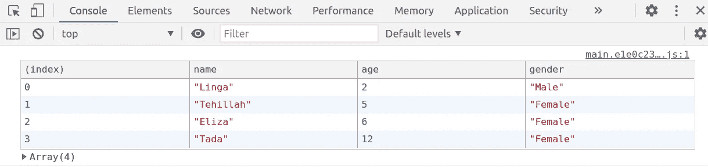

# 按类别记录消息

web 浏览器的控制台日志消息大致分为错误、警告或信息。

要将错误消息打印到 web 控制台，请使用`console.error()`方法。错误信息以红色字体显示。

```
console.error('This is an error message');
```

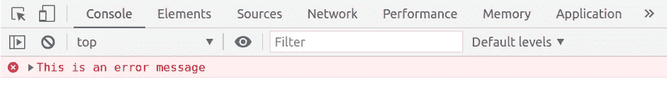

辛品

要打印警告，只需使用`console.warn()`方法。正如您可能猜到的那样，警告以橙色显示。

```
console.warn('This is a warning message');
```

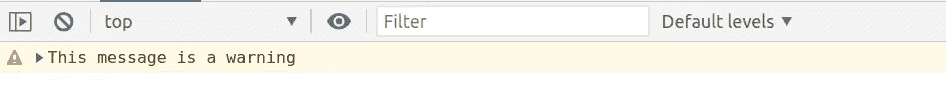

要将一般信息打印到控制台，使用`console.info()`方法。

```
console.info('This is general console information');
```

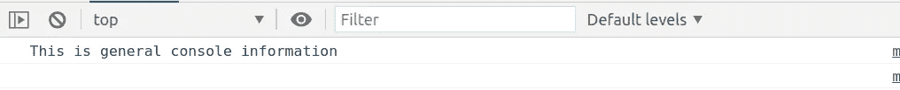

# console.trace()

web 控制台是一个真正强大的调试工具。您可以使用 web 控制台通过`console.trace()`方法打印堆栈跟踪。

堆栈跟踪对于调试很重要，因为它列出了程序或函数的执行顺序。

为了看到`console.trace()`的运行，我们将创建三个函数。第一个函数将调用第二个函数，第二个函数又调用第三个也是最后一个函数。在最后一个函数中，我们如下调用`console.trace()`。

```
ngOnInit(){
    this.functionOne()
}private functionOne() {
    this.functionTwo();
}private functionTwo(){
    this.functionThree();
}private functionThree(){
    console.trace();
}
```

假设上面的`ngOnInit()`函数在页面初始化时被调用。

堆栈跟踪将按照“后进先出”的顺序(LIFO)打印函数调用的输出，这是堆栈的本质。`console.trace()`的输出通常如下。

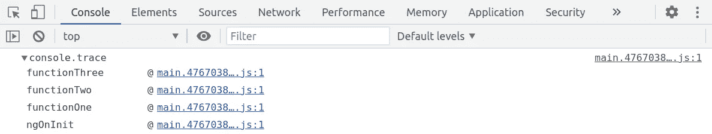

# console.time() & console.timeEnd()

要跟踪某个操作执行需要多长时间，可以使用`console.time()`方法。要结束计时器，请使用`console.timeEnd()`方法。

每个网页最多可以运行 10，000 个计时器。因此，给每个计时器一个唯一的名称或标签是很重要的。

让我们计算一下一个函数从 0 到 50，000 循环需要多长时间。

```
private loop() {
   console.time('loop timer'); for(let i=0; i < 50000; i++){ }

   console.timeEnd('loop timer');
}
```

下面是该函数遍历所有数字所用的总时间。

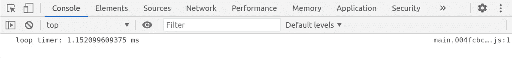

# console . count()& console . count reset()

使用`console.count()`方法跟踪一个方法或代码行在执行过程中被调用的次数。

例如，要找出下面的函数循环了多少次，可以执行以下操作。

```
private loop() {
   for(let i=0; i < 5; i++){
       console.count();
   }
}
```

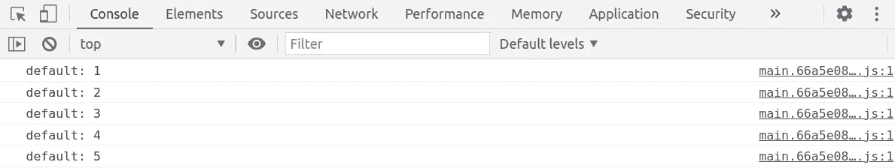

如果您有几个`count()`功能，您可以给每个`count()`方法一个唯一的标签，例如`console.count('count')`。

要重新开始计数，您可以使用以下方法重置计数器。

```
console.countReset();
```

# console . group()& console . groupend()

为了更好地组织日志消息，您可以使用`console.group('label')`方法将日志消息分组到某个特定的标签下。要结束分组，使用`console.groupEnd()`方法。

例如，我们可以在标签***“***警告”下创建一组`console.warn()`消息，如下所示。

```
console.group('warnings')
 console.warn('another warning');
 console.warn('This is a warning')
console.groupEnd()
```

上面的输出将类似于此。

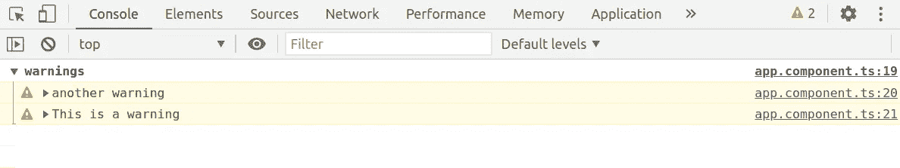

# 最后的想法

毫无疑问，`console.log()`是登录浏览器控制台最常用的方法。但是，在本指南中，我们研究了登录 web 控制台的几种替代方法。

现在，您可以充分利用 web 控制台来执行调试任务并增强您的工作流程。