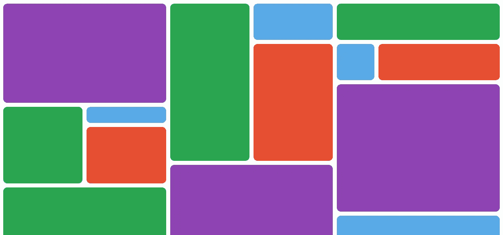
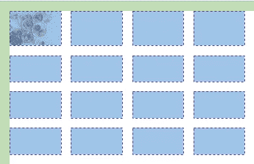
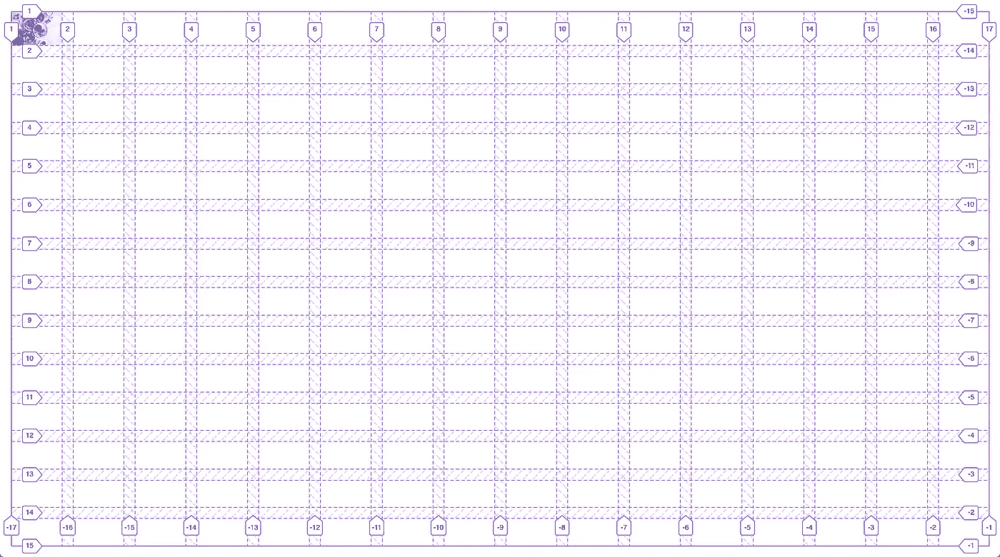

# 学习使用纯 CSS 建立一个石工画廊布局

> 原文：<https://betterprogramming.pub/learn-to-build-a-masonry-gallery-layout-using-pure-css-50331dbc1e15>

## 像 Pinterest 一样构建 CSS 网格

今天，我将向您展示如何使用 CSS Grid 构建一个复杂的砖石网格。CSS Grid 改变了我们设计布局的方式，我们将利用它的特性来构建一个有趣的项目。

如果你对 CSS 网格感到生疏或者你觉得需要温习，我建议你通读这篇[文章](https://css-tricks.com/snippets/css/complete-guide-grid/)。无论如何，我将解释我将引入的每一个代码来构建我们的项目。

好吧。让我们开始吧。

# **我们将建造什么**

这就是我们的布局在文章末尾的样子。

看起来很有趣？如果是，继续。

这是 CSS Grid 真正闪耀的地方，因为它允许你放置和对齐你喜欢的网格项目，并且它可以变得像你喜欢的那样复杂。

# 在我们开始构建网格之前需要记住的事情

1.  计算您希望在网格中包含的最小网格`cell`，即您希望在网格中包含的最小图像。
2.  单元格由它跨越的行数(高度)和列数(宽度)决定。
3.  最小的单元大小将决定网格的复杂程度。
4.  基于最小单元格计算`columns`和`rows`的数量

# 让我们开始建造吧

让我们首先创建一个准系统 HTML 文件，它将最终包含我们的砖石网格。你可以从 [GitHub](https://github.com/KaushikShivam/masonry-grid/tree/02f3e1a189f0c00ab36edb70c2dd65e67aad6e5b) 中派生出基础项目。

现在让我们看看基本的声明。

出于可读性的目的，我们将只查看 body 标记内的代码

第一个代码片段包含了基本的 CSS 重置，它定义了作为`grid`显示的`.masonry`选择器。第二个代码片段包含一个`section`，它将作为一个网格，并最终包含所有的网格项。

让我们在这里做一些观察。

1.  我们已经将网格`height`和`width`分别设置为`100vh`和`100vw`，所以我们的网格占据了所有可用的屏幕尺寸。您可以根据自己的需要进行定制。
2.  网格列/行声明:
    `grid-template-columns: repeat(16, 1fr)` —定义网格将有多少列。repeat 函数允许我们创建多个相同大小的列(在我们的例子中是 16 个)。`1fr`表示 16 列中的每一列都有 1 个可用宽度的`fraction (fr)`。
    这同样适用于`grid-row-columns: repeat(14, 1fr)`申报。
    所以，现在我们有一个 16 列 14 行的网格。你可以根据你的需要来改变它。
3.  在我们的 HTML 文件中，我们只有一个网格单元，即`figure`元素。我们将`img`标签嵌套在了`figure`标签下。稍后会详细介绍。

这是我们现在的网格图。由于图像过大，图像与网格容器重叠。

这就是为什么我们将图像包装在一个图形标签中。图像不能很好地与网格单元一起工作，因为它们具有它们所符合的纵横比。标签现在将作为网格单元，我们可以设置图像在其中进行调整。

将上述样式添加到`img`会调整图像以符合单元格的边界。

# 最后，让我们布置网格单元

定义网格的列和行使我们能够访问网格(列和行)轨迹，我们现在可以用它来任意跨越单元格。

使用 CSS 网格检查器可以更好地可视化它。你可以用这个 [Mozilla 文档](https://developer.mozilla.org/en-US/docs/Tools/Page_Inspector/How_to/Examine_grid_layouts)打开它。

如您所见，网格列轨迹从 1 到 17，总共有 16 列。类似地，网格行轨迹跨度从 1 到 15，给我们 14 行。

让我们布局我们的第一个网格单元。

现在，我们希望我们的单元格跨越五列宽和五列高。我们可以使用 CSS 网格的`grid-row`和`grid-column`属性来定义它。

我们先来看一下`grid-column`属性。我们给它提供了两个值。

第一个属性定义了我们希望单元格开始跨越的列轨道，第二个值定义了结束位置。这同样适用于`grid-row`属性。

该单元格现在横跨五列宽和五列高。向`grid-column`和`grid-row`提供值有很多不同的方法，你可以在 CSS 技巧上读到它们[。](https://css-tricks.com/snippets/css/complete-guide-grid/)

类似地，我们可以对其余的单元格进行布局。作为一项挑战，您可以在标记中添加更多的网格单元，并尝试对它们进行布局。

为了简洁起见，我包含了我为构建我在开始时展示的砖石画廊而编写的代码。

这是现在的布局。利用当前的知识，您可以构建更复杂的网格。这只是说明 CSS 网格基础的一个例子。

你可以在 GitHub 上找到这个项目[的回购。如果你有任何问题，请随时联系我。](https://github.com/KaushikShivam/masonry-grid)

就这些了，伙计们。