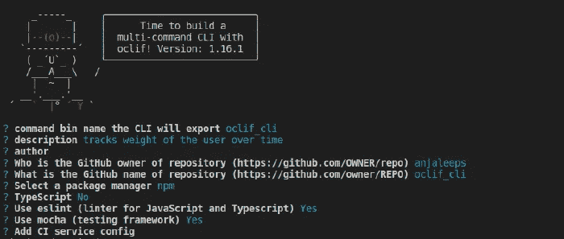
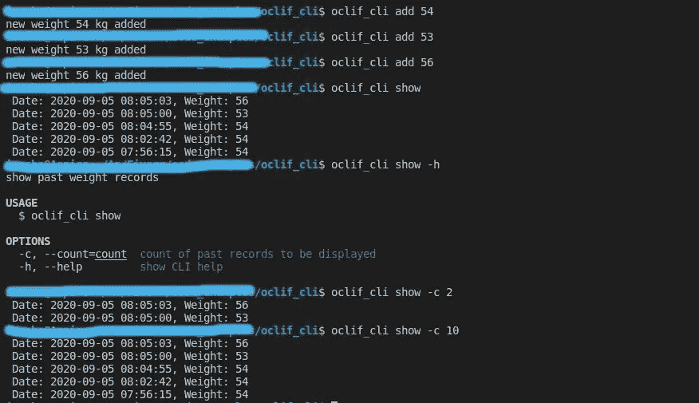
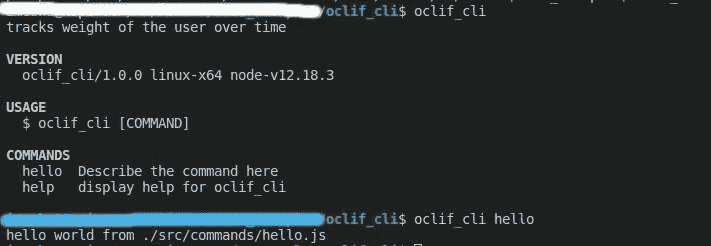

# 学习使用 Node.js 构建 CLI 自动化工具

> 原文：<https://betterprogramming.pub/learn-to-build-cli-automation-tools-with-node-js-fcca4c0418cb>

## 在节点中使用 oclif 构建一个重量跟踪 CLI 工具


[晨酿](https://unsplash.com/@morningbrew?utm_source=unsplash&utm_medium=referral&utm_content=creditCopyText)在 [Unsplash](https://unsplash.com/?utm_source=unsplash&utm_medium=referral&utm_content=creditCopyText) 上的照片。

开发人员喜欢 CLI 工具！以至于我确信我们会欣然接受这个机会，在一台舒适的命令行电脑上做任何事情。为什么不这样做呢？在现代库和框架的帮助下，构建我们自己的 CLI 只需几个小时甚至几分钟。尤其是在 Node 中，您可以使用 [oclif](https://oclif.io/) 框架轻松构建令人兴奋的命令行界面。

在本文中，我们将创建一个简单的 CLI 工具来帮助我们跟踪体重随时间的变化。它具有简单的功能，如添加新的体重记录和显示过去的记录。

既然我们使用 oclif 来轻松完成这个任务，那么让我们试着去理解它到底是什么。

# Oclif 是什么？

Oclif 是一个用于在 Node 中创建 CLI 工具的框架。它支持 JavaScript 和 TypeScript 实现。Oclif 提供了一组丰富的特性来设计和实现命令行程序，这些程序很容易用插件和钩子来扩展。

# 单命令与多命令

我们可以在 Oclif 中创建两种类型的命令行工具:单命令和多命令。单命令 CLI 只提供一个命令选项(类似于 Linux 中的`ls`和`curl`命令)。多命令程序支持执行主命令的子命令。`git`和`npm`是多命令工具的好例子。

在本教程中，我们正在构建一个多命令程序，该程序支持`add`和`show`子命令来添加新的重量记录和显示旧的记录。

# 初始化项目

我们可以使用一个简单的命令来初始化项目:

```
npx oclif multi [project name]
```

这里，我们使用 npm 包运行程序`npx`，用 oclif 初始化项目。命令`multi`指定我们的项目是一个多命令 CLI。当您运行这个命令时，您将被提示输入关于这个项目的几个细节，这将帮助 oclif 创建初始项目文件，包括`package.json`。



oclif 项目生成器

因为我们在这个项目中使用 JavaScript，所以确保在 TypeScript 字段中输入“No”。

当这一步完成时，您将看到 oclif 已经为我们的项目创建了一个新目录，包含以下子目录:

```
├── README.md
├── bin
│   ├── run
│   └── run.cmd
├── package.json
├── node_modules
├── src
│   ├── commands
│   │   └── hello.js
│   └── index.js
├── test
│   ├── commands
│   │   └── hello.test.js
│   └── mocha.opts
└── package-lock.json
```

这是 oclif 为我们创建的初始 CLI。我们可以添加新的命令将它转换成我们需要的程序。如您所见，我们的项目已经有了一个预定义的命令`hello`。我们可以使用命令行运行以下命令:

```
./bin/run hello
```

如果您想使用`oclif_cli`命令(这是我们 CLI 的项目名称)从全局范围访问这个应用程序，请使用`npm link`命令:

```
npm link
```

现在，我们可以在命令行上使用`oclif_cli`命令运行我们的应用程序:



运行 oclif 应用程序

# 向我们的应用程序添加新命令

正如我前面提到的，我们的体重跟踪工具有两个主要命令:add 和 show。`add`命令让我们添加新的`weight`记录，而`show`命令显示过去的`weight`记录。

在创建这些命令时，您会遇到诸如标志和参数之类的术语。我们先明确一下这些术语的含义。

## 标志和参数

如果您有一些使用命令行程序的经验，您可能已经知道什么是标志和参数。

标志提供了一种方式来指定运行特定命令的选项。例如，考虑以下命令:

```
npm install -g oclif
```

这里，我们使用标志`-g`来指定我们需要全局安装 oclif。但是没有必要在每个命令中都包含这个标志。如果你想激活它所代表的选项，你只需要使用一个标志。

参数由外部提供，通常由用户提供。在上面的 npm 命令中，oclif 是用户提供的参数。当我们将它作为参数传递时，我们告诉命令行运行`npm install`命令来安装所提供的包。类似地，我们可以在命令中接受参数，并在运行程序时将它们用作输入或目标。

## 创建应用程序的第一个命令

我们可以使用以下命令向我们的程序添加新命令:

```
npx oclif command [command-name]
```

它创建新命令所需的所有文件，并更新自述文件。

我们将按照以下格式添加第一个命令`add`:

```
npx oclif command add
```

向 CLI 添加新命令就是这么简单。现在，`oclif_cli` `add`命令可以使用了。但是，我们还是要实现它的内在逻辑。为此，我们应该更改 src 目录中已经创建的`add.js`文件。

完全实现的`add`命令应该能够接受指定用户体重的参数，并用时间戳记录下来。因此，代码应该能够读取一个`weight`参数，并将其保存在一个文件中，其中包含添加记录的日期和时间。

为此，我们更改了`AddCommand`类(已经由 oclif 定义)以包含以下实现:

这里，我们对`add`命令进行了描述，并定义了它接受的参数。我们声明了参数名(`weight`)并添加了一个描述，向用户说明如何传递参数。由于我们已经将参数定义为“required”，如果不提供权重值，用户将无法运行`oclif_cli add`命令。

实现中最重要的部分是异步`run`函数内部的代码。每次用户运行`add`命令时都会调用它。它读取命令传递的参数，并使用`Weight`类的`add`方法(我们将在后面实现)将数据保存到文件中。保存成功完成后，它会向控制台记录一条成功消息。

# 创建显示命令

现在，让我们创建程序的第二个命令:`show`。它用于在命令行上显示已经保存在文件中的重量数据。

我们可以像创建`add`命令一样创建`show`命令:

```
npx oclif command show
```

让我们像以前一样执行`show`命令。这里唯一的区别是`show`命令接受一个可选标志。这个可选标志允许用户指定他们想要查看多少过去的记录。

我们可以这样定义标志(名为`count`):

```
ShowCommand.flags = {
  count: flags.string({char: 'c', description: 'count of past records to be displayed'}),
  help: flags.help({char: 'h'})
}
```

使用创建新标志的`flags.string`函数，我们可以传递一个用于标志的字符和描述。当使用 string 函数创建标志时，用户可以传递一个参数。对于我们的程序，我们已经声明这个参数是必需的。因此，当使用`count`标志时，这个参数是必不可少的。

你可以在官方文档中找到更多关于 oclif 的不同类型的标志和接受的选项。

我们还使用 oclif 内置的`flags.help`函数创建了一个帮助标志，这样用户就可以使用该命令获得帮助。

我们程序的完整的`showCommand`类如下所示:

同样，在`run`函数中，我们定义了当用户运行这个命令时会发生什么。它解析我们传递的标志(如果有的话)，并读取用`count`标志传递的参数。它调用`Weight`类的`show`方法来检索必要数量的过去记录。最后，它根据记录创建时间以降序将检索到的数据记录到控制台。

## 实现权重类

在之前的实现中，我们在程序中使用了来自`Weight`类的两个方法。我们现在将在 src 目录中一个名为`api`的新目录中创建这个类。在`api`目录中，我们还创建了一个名为`weightTracker`的文件夹来保存 JSON 文件，我们在其中存储我们的体重记录。JSON 文件被命名为`weights.json`。

关于这个类是如何实现的，我就不赘述了。抽象地说，我们在这里所做的是:

*   读取`weights.json`文件的内容，并在类构造函数中将它解析成一个数组。
*   向`weights`数组添加新的重量记录，并调用`saveWeight`方法在`add`方法中保存新的记录数组。
*   在`show`方法中返回所有或给定数量的过去记录(作为`count`参数传递)。
*   将对象数组转换成 JSON，并在`saveWeight`方法中将其写入`weights.json`文件。

# 测试我们的体重跟踪 CLI 工具

我们现在已经完全实施了我们的计划。剩下要做的就是摆弄它，看看它是如何协同工作的:



测试我们的重量跟踪器应用程序

# 摘要

正如我们在本教程中看到的，oclif 使我们最喜欢的编程语言中的任务自动化变得非常容易。它自己处理枯燥的部分，如文档，并让我们在命令的实际实现中获得乐趣。

所以，我希望我已经说服你给 oclif 一个机会，让它成为你在 Node 中最喜欢的 CLI 框架。如果你更深入地研究这个主题，你将能够意识到一个 CLI 框架 oclif 是多么强大。

下次你计划自动化一个无聊的任务时，记得使用 oclif。不要忘记通过在 npm 上发布您的包来与世界[分享它。](https://medium.com/better-programming/publish-your-first-node-library-using-npm-ee6bb7052187)

感谢阅读！