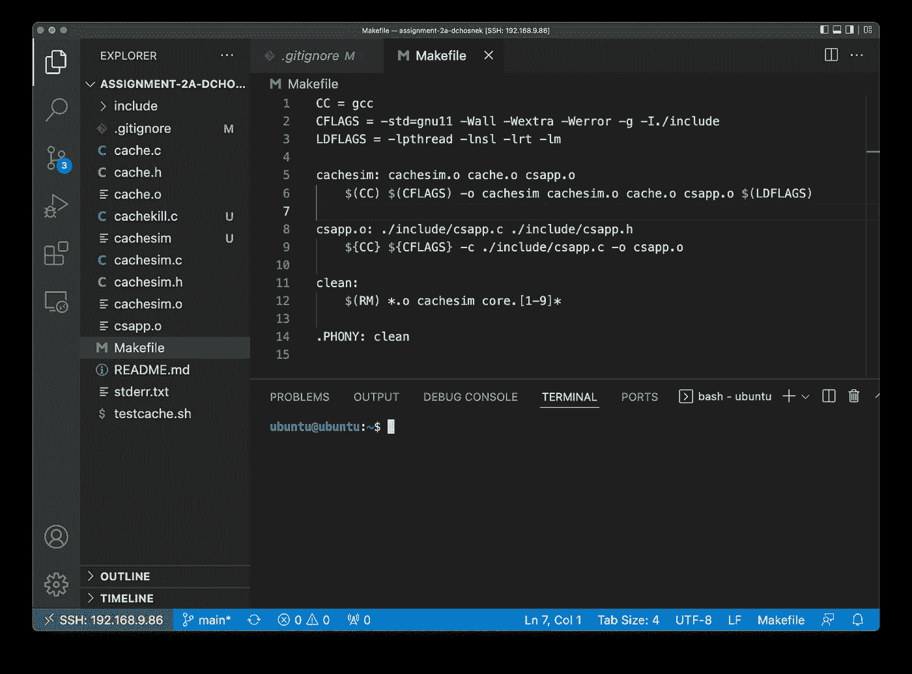
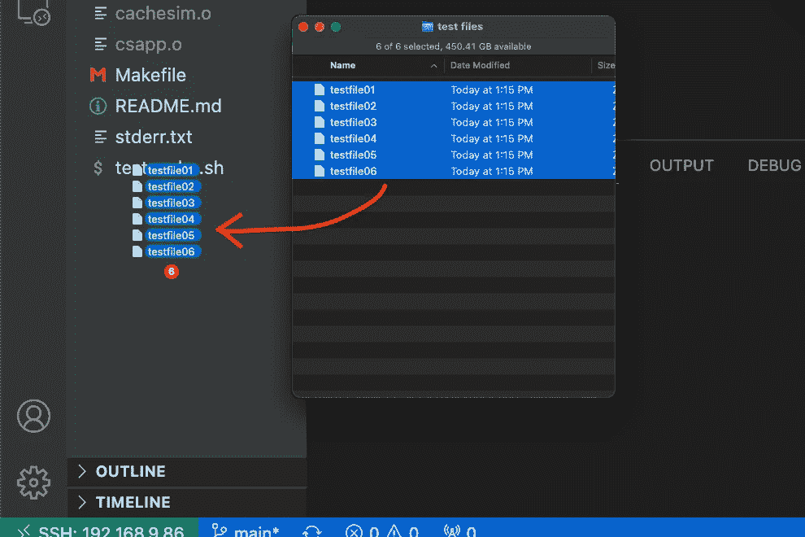
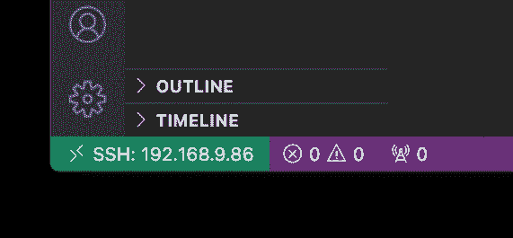
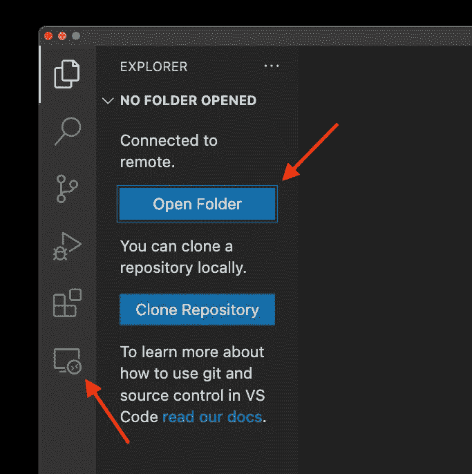
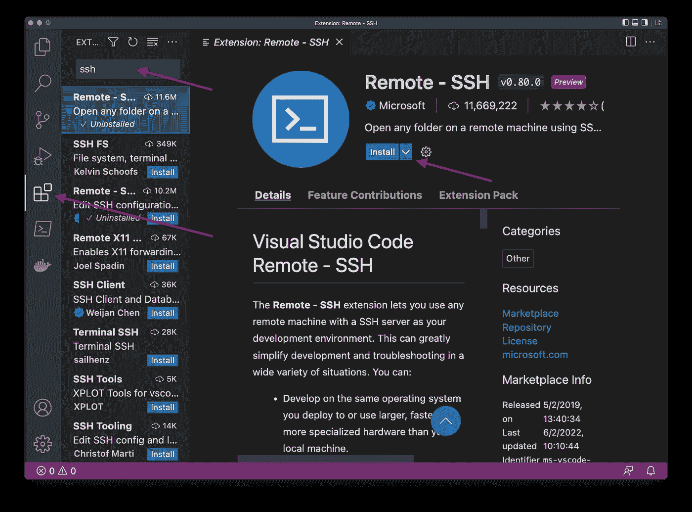
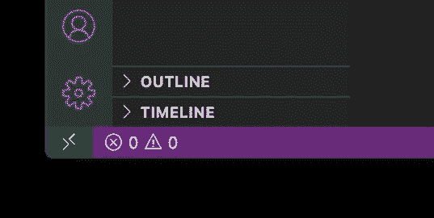
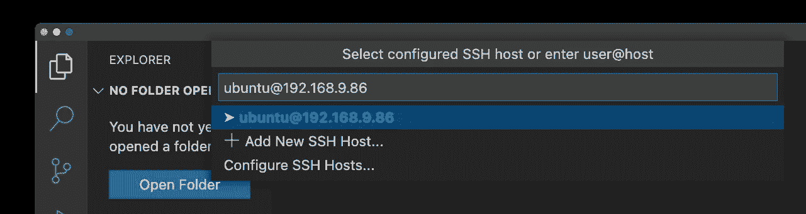

# 学习用 VS 代码和 SSH 远程编码

> 原文：<https://betterprogramming.pub/learn-to-code-remotely-with-vs-code-and-ssh-68c630759279>

## 不要被 nano 和 vi 限制

照片由[伊莫·威格曼](https://unsplash.com/@macroman?utm_source=medium&utm_medium=referral)在 [Unsplash](https://unsplash.com?utm_source=medium&utm_medium=referral) 拍摄

你曾经不得不在 Raspberry Pi 或者其他没有 GUI 的 Linux 系统上写代码吗？对于那些不经常使用的人来说，试图记住`vi`中的复制和粘贴命令几乎是不可能的。您还会错过语法高亮、林挺等功能，甚至错过并排查看两个文件等基本功能。

令人欣慰的是，现在有一个连接到远程/无头系统的 VS 代码扩展，使您能够在桌面上使用 VS 代码来编辑远程文件系统上的文件。

如果我正在编写打算在 Raspberry Pi 上运行的代码，那么在那个 Pi 上而不是在我的 PC 上进行开发工作是有意义的。有一些语言和平台依赖性，我不想在最后一刻才发现。

许多 Linux 系统没有图形控制台，所以如果我试图在那个远程系统上进行开发工作，我最终会错过 VS 代码中的一些特性，这些特性我已经习惯了，比如特定于语言的扩展以及与 git 和 GitHub 的极好的图形集成。

但是有一个 VS 代码扩展可以解决这个难题。

# 它看起来像什么？

SSH 上的 VS 代码 remote 看起来就像您熟悉的 VS 代码，因为它就是您熟悉的 VS 代码。在下面的截图中，注意左边熟悉的文件树。这些是远程系统上的文件！您可以在远程系统上使用您熟悉的 VS 代码控件打开、编辑、保存或删除这些文件。

带有 SSH 扩展的 VS 代码—作者截图

还要注意，在这个屏幕截图中有一个打开的终端会话。这是远程系统上的终端会话。您可以从这个终端编译和执行代码，就像从任何 SSH 窗口一样！

额外的好处是，您可以使用 VS 代码将文件安全地复制到您的远程系统。如下图截图所示，只需将文件从你的电脑拖到 VS 代码文件树中，文件就会通过`scp`(安全复制)进行复制！

将文件复制到远程系统—作者截图

# 有什么不同？

在 VS 代码中安装 SSH 扩展后，您会注意到在 VS 代码窗口的左下角有一个绿色条。单击此按钮将显示一个菜单，用于连接或断开与远程主机的连接。如果你愿意，VS 代码甚至可以跟踪你的收藏夹。这个截图显示了我的 VS 代码窗口连接到位于`192.168.9.86`的 Linux 主机。

连接到远程主机—作者截图

一旦连接到远程系统，您将有机会单击“打开文件夹”来打开远程系统上的任何目录。另外，请注意侧边栏中有一个新图标，提供了最近连接和远程目录的列表。

打开远程目录—作者截图

# 安装并开始使用

安装这个扩展并开始使用很简单。只需进入 VS 代码中的“扩展”，搜索“SSH”并在名为`Remote-SSH`的微软扩展上点击“安装”。就是这样！你甚至不用重启 VS 代码。

安装扩展—作者截图

一旦安装了扩展，只需点击 VS 代码窗口左下角的绿色条即可启动连接。

点击绿条连接—作者截图

然后，您可以手动输入`user@host`或点击“添加新的 SSH 主机…”来创建一个经常访问的主机的书签，如下图所示。

指定用户名和主机名—作者截图

# 结论

为了学校，我每周都在树莓 Pi 上做小 C 项目，但是自从安装了这个 VS 代码扩展后，我一次都没用过`vi`或`nano`。

我真的很重视对语言扩展的访问，对 git 和 GitHub 的集成，甚至只是使用鼠标的奢侈！

VS 代码的`Remote-SSH`扩展对我来说是一个有价值的工具，我希望你能发现它同样有价值。