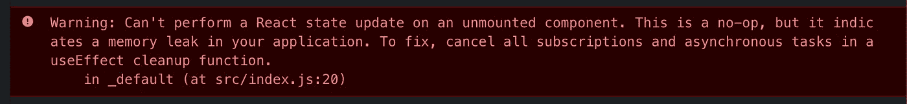

# 学习创建自己的 useFetch() React 钩子

> 原文：<https://betterprogramming.pub/learn-to-create-your-own-usefetch-react-hook-9cc31b038e53>

## 仅仅五分钟后


[Yuki Dog](https://unsplash.com/@adventure_yuki?utm_source=medium&utm_medium=referral) 在 [Unsplash](https://unsplash.com?utm_source=medium&utm_medium=referral) 上的照片

钩子是 React 16.8 中增加的一个很好的工具。它们让你不用写类就能写有状态的组件。这是迄今为止我最喜欢 React 的一点。

React 附带了很多这样的工具——已经内置在库中。这些包括，例如，`useState`、`useEffect`、`useContext`和[更多的](https://reactjs.org/docs/hooks-reference.html)。

它们非常适合许多一般用例，更棒的是，您可以为自己的项目需求创建自己的挂钩。

# 它们是如何工作的

一个*钩子*是一个简单的函数，它可以接受你需要的任意多的参数，并返回你想要它返回给你的组件的内容。

下面是有史以来最简单的钩子的例子:

```
function useYear() {
  return new Date().getFullYear();
}export default useYear;
```

嘣，就这样。看起来像一个常规函数，对吗？

它可以按如下方式使用:

```
// ...import useYear from "./useYear";function App() {
  const year = useYear(); return (
    <div className="App">
      <h1>Year: {year}</h1>
    </div>
  );
}// ...
```

这是一个伟大的钩子，但让我们现在工作在更有用的东西。

# 创建一个 useFetch 挂钩

钩子对于避免应用程序中的代码重复非常有用。我们经常做的事情是获取数据。

让我们看看如何编写一个具有以下特征的钩子:

*   它可以获取数据
*   它返回一个加载状态
*   它返回一个错误状态

## 1.创建一个获取数据的基本钩子

```
import React, { useState, useEffect } from "react";const useFetch = (url, options) => {
  const [response, setResponse] = useState(null); useEffect(() => {
    const doFetch = async () => {
      const res = await fetch(url, options);
      const json = await res.json();
      setResponse(json);
    }
    doFetch();
  }, []); return response;
};export default useFetch;
```

我们的钩子有两个参数:一个 URL 和一个 options 对象。options 参数可以包含本机`fetch()` API 用作第二个参数的任何内容。[点击这里查看选项的完整列表](https://developer.mozilla.org/en-US/docs/Web/API/WindowOrWorkerGlobalScope/fetch)。

它使用`useEffect`获取数据并将数据设置为响应状态(使用`useState`)。

注意作为`useEffect`的第二个参数传递的空数组。根据设计，当组件安装和组件更新时会触发`useEffect`。

但是如果我们只想让它执行一次呢？`useEffect`接受第二个参数，我们可以将其设置为我们希望它观察的变量数组。通过传递一个空数组，我们确保`useEffect`只会被触发一次——当它挂载时。

## 2.让它处理错误

有时事情没有按计划进行，我们必须让我们的组件意识到这一点。

让我们将代码包装在一个`Try… Catch`中，并使用`useState`来存储一个潜在的错误:

```
import React, { useState, useEffect } from "react";const useFetch = (url, options) => {
  const [response, setResponse] = useState(null)
  **const [error, setError] = useState(null);** useEffect(() => {
    const doFetch = async () => {
      **try {**
        const res = await fetch(url, options);
        const json = await res.json();
        setResponse(json);
 **} catch (e) {
        setError(e);
      }**    };
      doFetch();
  }, []); return **{ response, error }**;
};export default useFetch;
```

## 3.使其返回加载状态

我们希望在获取发生时在主组件中显示一个加载器。正如我们处理错误一样，让我们添加一个加载状态。

```
import React, { useState, useEffect } from "react";const useFetch = (url, options) => {
  const [response, setResponse] = useState(null)
  const [error, setError] = useState(null);
  **const [loading, setLoading] = useState(false);** useEffect(() => {
    const doFetch = async () => {
      **setLoading(true);**
      try {
        const res = await fetch(url, options);
        const json = await res.json();
        setResponse(json);
      } catch (e) {
        setError(e);
      } **finally {**
        **setLoading(false);**
      **}**
    };
    doFetch();
  }, []);return { response, error, **loading** };
};export default useFetch;
```

很多人忽略了这一点，但是`Try… Catch`做了一个叫做`finally`的总结。`finally`被执行，不管是否有错误——这正是我们想要的。

获取完成后，将加载的状态设置为 false。

## 4.清除

如果请求很慢，并且在异步请求完成时组件已经卸载了，该怎么办？您将得到以下错误:



为了防止这种内存泄漏的发生，一个解决方案是结合使用 useEffect 的清理函数和 [AbortController](https://developer.mozilla.org/en-US/docs/Web/API/AbortController) 内置对象:

```
import React, { useState, useEffect } from "react";const useFetch = (url, options) => {
  const [response, setResponse] = useState(null)
  const [error, setError] = useState(null);
  const [loading, setLoading] = useState(false);useEffect(() => {
    **const abortController = new AbortController();
    const signal = abortController.signal;**
    const doFetch = async () => {
      setLoading(true);
      try {
        const res = await fetch(url, options);
        const json = await res.json();
        **if (!signal.aborted) {**
          setResponse(json);
        **}**
      } catch (e) {
        **if (!signal.aborted) {
**          setError(e);
        **}**
      } finally {
**if (!signal.aborted) {**
          setLoading(false);
 **}**
      }
    };
    doFetch(); **return () => {
      abortController.abort();
    };**
  }, []); return { response, error, loading };
};export default useFetch;
```

# 使用

我们使用它的方式和使用其他钩子完全一样。

请记住，它需要一个 URL 作为第一个参数，如果需要，您可以为它提供选项:

```
import React from "react";
import ReactDOM from "react-dom";
import useFetch from "./useFetch";function App() {
  const { response, loading, error } = useFetch(
    "https://jsonplaceholder.typicode.com/todos/1"
  ); return (
    <div className="App">
      <h1>useFetch Usage</h1>
      {loading && <p>Loading...</p>}
      {error && <p>Something went wrong...</p>}
      {response && <p>{response.title}</p>}
    </div>
  );
}const rootElement = document.getElementById("root");
ReactDOM.render(<App />, rootElement);
```

用这个 [CodeSandbox](https://codesandbox.io/s/boring-currying-7dicl) 进行现场测试。

# 如何改进？

在实际项目中，当我们获取数据时，我们可能想要做额外的事情。我们的钩子可以通过实现以下特性来改进:

*   **缓存:**在获取之前，它会检查您选择的缓存中的数据是否已经被获取，以及是否需要(重新)获取
*   **记录错误**:如果有错误，它会将错误分派给服务/第三方应用程序，这样开发人员就可以知道这些错误
*   **React suspension:**`<Suspense>`组件让您等待一些代码加载，并在等待时声明性地指定加载状态(像一个微调器)。这很好，但不推荐，因为它是一个实验性的功能。[此处查看更多](https://reactjs.org/docs/concurrent-mode-suspense.html)。
*   **效果:**当它完成或接收到一个错误(一个通过`onComplete`或`onError`参数提供的动作)时，它可以向一个商店发送一个动作，比如 Redux

# 最后的想法

有很多库在做我们在本文中所做的事情。

如您所见，创建我们自己的`useFetch`挂钩非常容易。知道如何创建定制挂钩，除了将我们的项目从另一个依赖中拯救出来之外，还能让我们完全控制我们需要什么。

自己能做到的，就去做！(嗯，这取决于上下文，但以这句话结束这篇文章很酷。)

觉得这篇文章有用？下面是我最受欢迎的文章…

[](https://medium.com/better-programming/everyday-activities-to-become-a-better-developer-3d00ec8d14a5) [## 帮助你成为更好的开发者的日常活动

### 每天都变得更好是许多开发人员的目标

medium.com](https://medium.com/better-programming/everyday-activities-to-become-a-better-developer-3d00ec8d14a5) [](https://medium.com/better-programming/build-your-very-own-react-component-library-and-publish-it-to-github-package-registry-192a688a51fd) [## 构建您自己的 React 组件库，并将其发布到 GitHub 包注册表

### 当跨多个项目工作时，它总是很方便

medium.com](https://medium.com/better-programming/build-your-very-own-react-component-library-and-publish-it-to-github-package-registry-192a688a51fd) [](https://medium.com/better-programming/create-a-chrome-extension-using-react-and-typescript-50e94e14320c) [## 使用 React 和 TypeScript 创建一个 Chrome 扩展

### 在本文中，我们将使用 Typescript 创建一个 Chrome 扩展，并为弹出窗口使用 React。你不…

medium.com](https://medium.com/better-programming/create-a-chrome-extension-using-react-and-typescript-50e94e14320c)