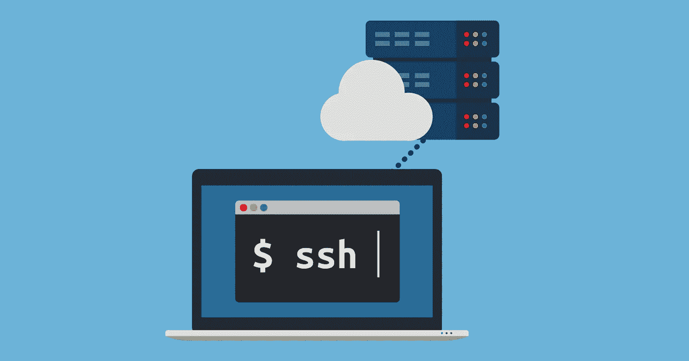

# SSH 初学者指南

> 原文：<https://betterprogramming.pub/learn-to-ssh-go-to-guide-9d525eb83f15>

## 按键、配置和快捷键



图片来源:[https://atulhost.com/how-to-connect-to-an-ssh-server](https://atulhost.com/how-to-connect-to-an-ssh-server)

当我开始实习的时候，我不确定我会遇到什么样的挑战。作为一名软件工程实习生，我每天都面临着我甚至不知道的新东西的挑战。

弹出的话题之一就是宋承宪。在这篇文章中，我将讨论我所学到的东西。

# 什么是宋承宪？

> SSH 或 Secure Shell 是一种远程管理协议，允许用户通过互联网控制和修改他们的远程服务器。该服务是作为未加密的 Telnet 的安全替代而创建的，它使用加密技术来确保与远程服务器之间的所有通信都以加密的方式进行。
> 
> 它提供了一种对远程用户进行身份验证、将输入从客户端传输到主机以及将输出转发回客户端的机制。"—参考:[https://www . hosting er . com/tutorials/ssh-tutorial-how-does-ssh-work](https://www.hostinger.com/tutorials/ssh-tutorial-how-does-ssh-work)

# 如何 SSH 到服务器

```
ssh user@server
```

# 如何生成 SSH 密钥

## Windows 操作系统

1.  检查现有的 SSH 密钥。

打开命令提示符并运行以下命令:

```
cd %userprofile%/.ssh
```

*   如果您没有看到这样的文件夹，则没有 SSH 密钥。您可以创建一个 SSH 密钥。
*   如果有一个文件夹，您可以使用下面的命令检查是否已经有一个键。

```
dir id_*
```

如果有钥匙，你可以用它！

2.备份旧的 SSH 密钥。

如果您不希望使用旧的 SSH 密钥，您应该这样做。

```
mkdir key_backup
copy id_rsa* key_backup
```

这会将您的旧 SSH 密钥移动到一个名为`key_backup`的文件夹中。

3.生成新的 SSH 密钥。

您可以创建一个与您的电子邮件相关联的 SSH 密钥，以便以后识别。

为此，您必须在 Windows PC 上安装 [Git BASH](https://gitforwindows.org/) 。

以管理员身份在命令提示符下运行此命令。

```
ssh-keygen -t rsa -C "user_email@example.com"
```

按 ENTER 键接受默认位置和文件名。如果没有创建`.ssh`文件夹，系统会为您创建一个。

接下来，系统会要求您输入一个密码并重新输入，您可以按两次 enter 键跳过这一步。这将创建您的 SSH 密钥。

在`.ssh`文件夹中，你会发现两个名为`id_rsa`和`id_rsa.pub`的文件。您可以使用`id_rsa.pub`，这是您的公共密钥，用于 SSH 目的。不要暴露你的私钥！

## Ubuntu 还是 macOS

1.  检查现有的 SSH 密钥。

打开命令提示符并运行以下命令:

```
cd ~/.ssh
```

*   如果您没有看到这样的文件夹，则没有 SSH 密钥。您可以创建一个 SSH 密钥。
*   如果有一个文件夹，您可以使用下面的命令检查是否已经有一个键。

```
ls id_*
```

如果有钥匙，你可以用它！

2.备份旧的 SSH 密钥。

如果您不希望使用旧的 SSH 密钥，您应该这样做。

```
mkdir key_backup
cp id_rsa* key_backup
```

这会将您的旧 SSH 密钥移动到一个名为`key_backup`的文件夹中。

3.生成新的 SSH 密钥。

您可以创建一个与您的电子邮件相关联的 SSH 密钥，以便以后识别。

以管理员身份在命令提示符下运行此命令。

```
ssh-keygen -t rsa -C "user_email@example.com"
```

按 ENTER 键接受默认位置和文件名。如果没有创建`.ssh`文件夹，系统会为您创建一个。

接下来，系统会要求您输入一个密码并重新输入，您可以按两次 enter 键跳过这一步。这将创建您的 SSH 密钥。

在`.ssh`文件夹中，你会发现两个名为`id_rsa`和`id_rsa.pub`的文件。您可以使用`id_rsa.pub`，这是您的公共密钥，用于 SSH 目的。不要暴露你的私钥！

我已经讲述了如何为您正在使用的相关操作系统生成 SSH 密钥。如果您有许多服务器都使用的 SSH 密钥，该怎么办？您如何知道哪个使用哪个 SSH 密钥进行认证？

当我遇到这个问题时，我想我们可以维护一个配置文件来帮助解决这个问题。

您必须在您的`.ssh`文件夹中创建一个配置文件。为此，您可以使用任何代码编辑器。我更喜欢用 [vim](https://www.vim.org/) 。

```
vim config
```

您可以看到文件已创建并打开进行编辑。您可以如下定义您的主机服务器。

```
Host devloot
     User user
     HostName blaaa.compute.amazonaws.com
     IdentityFile ~/.ssh/hoot.pubHost devgroot
     User user
     HostName blaaakaaa.compute.amazonaws.com
     IdentityFile ~/.ssh/dev.pub
```

保存后，您可以 SSH 任何服务器，如下所示:

```
ssh devloot
```

这比使用以下代码要简单得多:

```
ssh user@blaaa.compute.amazonaws.com -i ~/.ssh/hoot.pub
```

关于我对宋承宪的了解，我只能教你这么多。希望这篇文章对你有帮助！

如果您想详细了解 SSH，可以通读以下参考资料。

# **参考文献**

[](https://searchsecurity.techtarget.com/definition/Secure-Shell) [## 什么是安全外壳(SSH ),它是如何工作的？

### 了解 SSH，也称为安全 Shell。了解如何使用 SSH 连接来保护…

searchsecurity.techtarget.com](https://searchsecurity.techtarget.com/definition/Secure-Shell) [](https://www.hostinger.com/tutorials/ssh-tutorial-how-does-ssh-work) [## SSH 初学者教程——SSH 是如何工作的

### SSH 或 Secure Shell 是一种远程管理协议，允许用户控制和修改他们的远程服务器…

www.hostinger.com](https://www.hostinger.com/tutorials/ssh-tutorial-how-does-ssh-work)