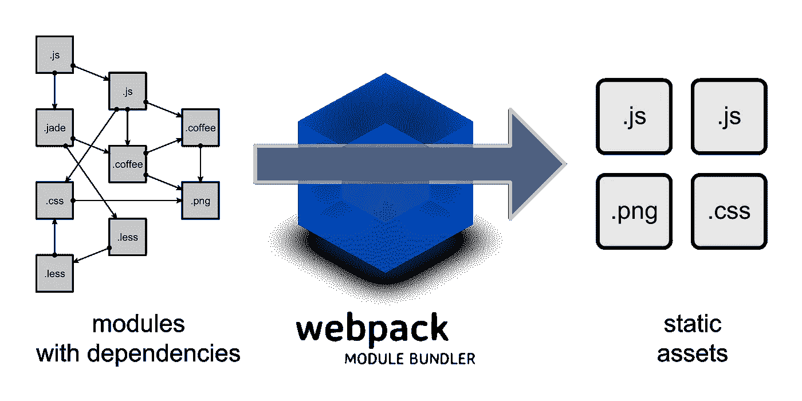
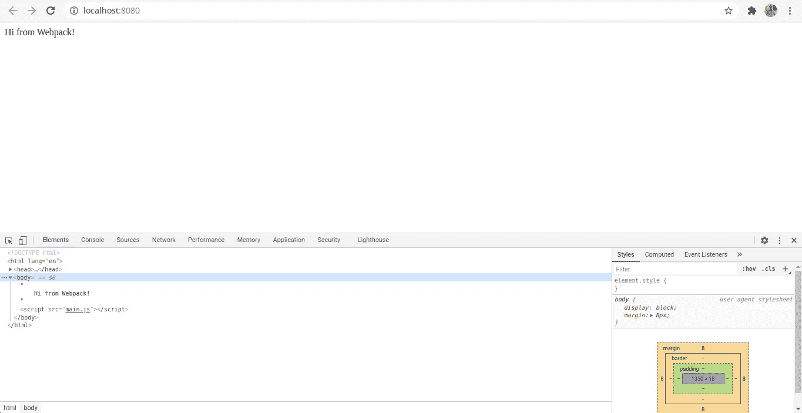
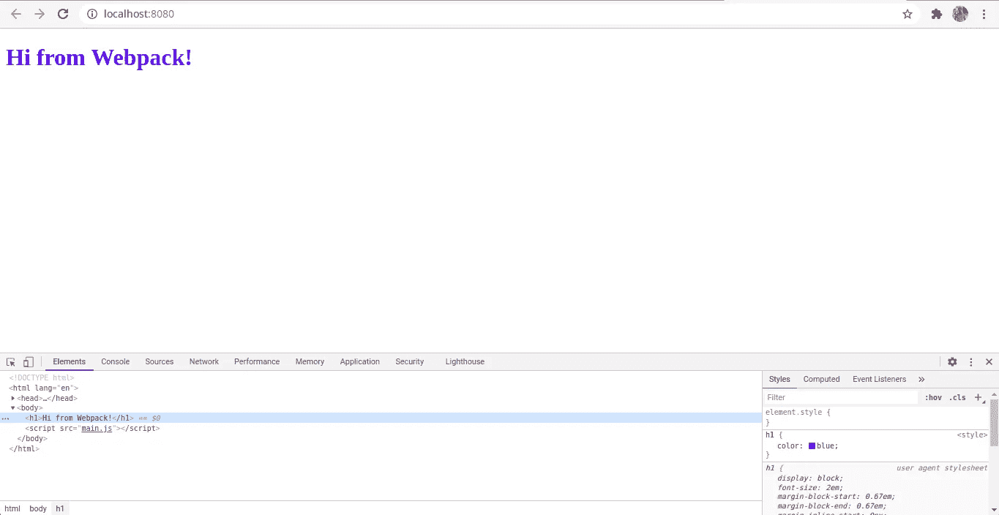
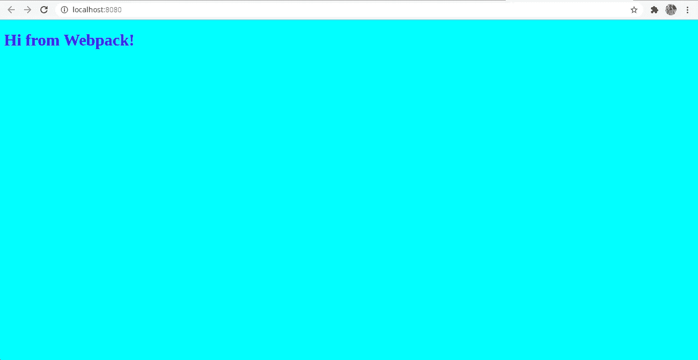
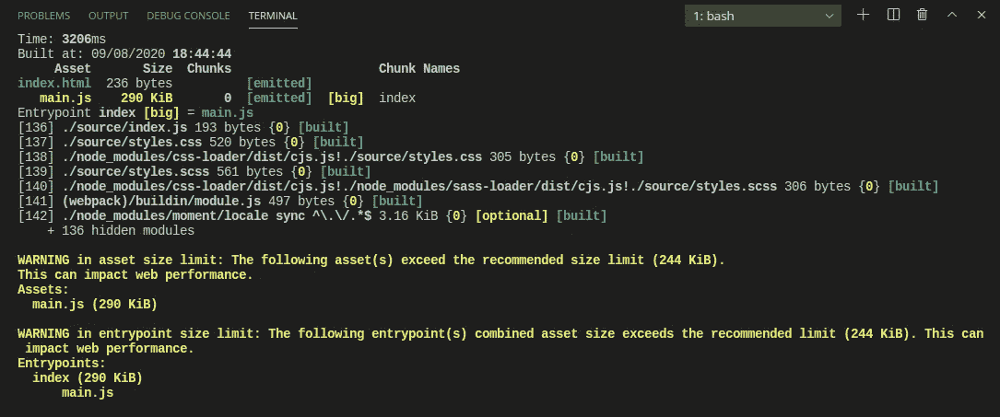
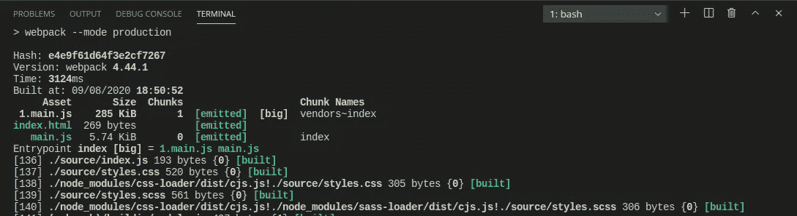
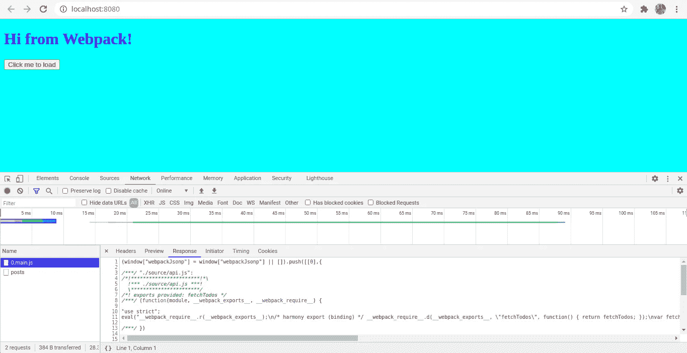

# 10 分钟内学会网络包

> 原文：<https://betterprogramming.pub/learn-webpack-in-under-10-minutes-efe2b2b10b61>

## webpack 可能有点混乱。让我们解开它



图片来源:[https://webpack.github.io/](https://webpack.github.io/)

# 什么是 webpack？

根据官方[文件](https://webpack.js.org/concepts/):

> " webpack 是一个用于现代 JavaScript 应用的静态模块捆绑器."

作为 JavaScript 开发人员，我们知道什么是模块，但是在 webpack 中，模块有点不同。他们包括 **:**

*   **ES 模块** — `import`声明
*   **常见 JS 模块** — `require()`语句
*   **AMD 模块** — `define`和`require`声明
*   **CSS 导入** — `@import`任何 css/sass/less 文件内的语句
*   **图片网址** — `url(...)`或``

webpack 以这样一种方式统一了所有这些不同的模块，使得将所有内容导入 JavaScript 代码成为可能。

# 该不该学 webpack？

今天，大多数应用程序都是使用 React/Vue 或任何其他库构建的。他们提供 CLI 工具(例如 create-react-app、@vue/cli)来创建应用程序。这些 CLI 工具抽象出大部分配置并提供默认值。但是对于作为开发人员的您来说，了解这是如何工作的是有益的，因为迟早您可能想要对默认值进行一些调整。

# 我们开始吧

我们将创建一个简单的应用程序来演示 webpack 的工作。让我们首先创建一个新目录并初始化一个 npm 项目。假设您在新创建的目录中，键入以下命令:

```
npm init -y
```

现在让我们安装所需的 webpack 包。

```
npm install --save-dev webpack webpack-cli webpack-dev-server
```

让我们打开`package.json`文件，删除已经存在的`test`脚本，并添加一个新脚本`dev`以在开发模式下运行 webpack。当我们在本地工作时，这个脚本很方便。您的程序包文件应该如下所示:

现在如果你运行`npm run dev`，你会得到一个讨厌的错误:`Entry module not found`。这是因为，默认情况下，webpack 期望将`src/index.js`中的一个文件作为入口点。另外，缺省情况下，webpack 将构建文件输出到一个名为`dist`的目录中。

好了，让我们通过创建一个新目录`src`和一个名为`index.js`的文件来解决这个问题。现在，让我们在`index.js`文件中键入一个`console.log('hello');`语句。

现在让我们运行`npm run dev`。您将不会发现任何错误，还会在名为`dist`的目录下找到构建文件`main.js`。

# 配置 webpack

要配置 webpack，我们需要在根目录下创建一个名为`webpack.config.js`的文件。在这个文件中，我们需要导出一个配置对象。webpack 运行在 Node.js 这样的无头 JavaScript 环境上。

一些最广泛使用的术语是:

*   **入口点** —指定 webpack 的入口点，从该入口点收集所有依赖项。这些依赖关系形成了依赖关系图。
*   **输出** —指定在构建过程中收集结果 JS 和静态文件的位置
*   加载器 —帮助 webpack 处理各种文件扩展名的第三方扩展。它们将 JS 以外的文件转换成模块。
*   **插件** —可以改变 webpack 工作方式的第三方扩展
*   **模式** —指定两种模式:开发和生产。默认情况下，它是生产。

现在让我们配置基本的入口点和输出目录。

## 更改入口点

如果我们需要 webpack 查看`source/index.js`而不是默认的`src`文件夹，我们需要在导出的对象中添加一个属性`entry`。

您也可以使用替代的条目语法:

## 更改输出目录

假设我们想要将构建的文件输出到另一个名为`build`的目录中，而不是默认的`dist`目录中。我们可以像这样设置输出属性:

# 将构建的文件包含在 HTML 文件中

在每个 web 应用程序中，至少有一个 HTML 文件。为了处理 HTML，我们必须使用一个叫做`html-webpack-plugin`的插件。让我们使用以下命令开始安装该插件:

```
npm install --save-dev html-webpack-plugin
```

## 这个插件到底是做什么的？

它加载我们的 HTML 文件，并在同一个文件中注入包。

让我们创建一个简单的 HTML 文件，并在 webpack 配置中对其进行配置。

我将在`source`目录下创建一个名为`index.html`的文件，并在其中插入一些样板代码。现在让我们在 webpack 文件中对此进行配置。

既然我们的文件已经准备好了，我们需要一个服务器来服务这个文件，对吗？所以让我们使用之前安装的`webpack-dev-server`来启动服务器。

# webpack 开发服务器

为了配置`webpack-dev-server`，我们需要打开`package.json`文件并添加一个新的脚本来帮助我们启动服务器。我们已经有了`dev`，我们用它来构建文件。现在让我们创建如下所示的`start`。

现在尝试从您的终端运行这个命令。

```
npm start
```

导航到您的浏览器并检查`localhost:8080`。您会发现那里提供了`index.html`,您可以打开开发工具，看到捆绑的`main.js`文件也包含在其中。



自动包含 main.js 文件

# 使用 webpack 加载器

如前所述，webpack 中的加载器是处理各种其他文件扩展名的第三方扩展。webpack 有很多可用的加载器。

让我们继续在 webpack 配置文件中配置加载器。加载器有一个奇怪的语法。我们使用一个名为`module`的键，它由另一个名为`rules`的属性组成，这是一个加载器数组。对于我们希望作为模块对待的每个文件，我们将其作为对象放在这个`rules`数组中。每个对象由两个属性组成:`test`定义文件类型，`use`是由加载器组成的数组。请注意，这里定义的加载器在`use`数组中从右向左加载。定义装货人时，顺序很重要。在使用它们之前，请参考加载程序的文档。

配置文件中加载程序的一般语法如下所示:

# 使用 CSS

为了在 webpack 中使用 CSS，我们需要两个加载器:`css-loader`和`style-loader`。让我们使用这个命令来安装它们。

```
npm install --save-dev css-loader style-loader
```

让我们在`source`目录中创建一个新文件`styles.css`。添加任何基本样式，以便它们在服务器启动时反映在`index.html`中。接下来，我们需要将文件包含在我们的`index.js`文件中，并将**而不是**包含在`index.html`中。记住，这个教程是基于捆绑和学习 webpack 的。所以现在我们的`index.js`文件应该是这样的:

还有最后一步要做。也就是在我们的`webpack.config.js`文件中配置加载程序。我们的配置文件应该是这样的:

`css-loader`用于加载 CSS 文件，`style-loader`用于加载 DOM 中的样式表。

当您重启服务器并再次运行`npm start`时，您应该会发现浏览器中反映出的变化。



# 使用 SASS

使用 SASS(。scss)文件，我们将需要三个加载器，`sass-loader`、`css-loader`和`style-loader`，外加节点所需的一个额外的包`sass`。这里的`sass-loader` 用于导入加载 SASS 文件。因为我们已经安装了另外两个，现在让我们安装剩下的包。

```
npm install --save-dev sass-loader sass
```

让我们在`source`目录下创建一个新文件`styles.scss`，并添加这些线条或任何基本样式。

让我们通过在文件开头使用`import './styles.scss'`将这个文件也包含在我们的`index.js`文件中。

现在是时候在我们的`webpack.config.js`文件中添加加载器了。我们的加载程序应该如下所示:

让我们重新启动服务器并检查更改。



# 使用现代 JavaScript

webpack 本身并不知道如何将现代 JavaScript 转换成可以在任何浏览器中运行的兼容代码。所以它用[巴别塔](https://babeljs.io/) 来达到同样的目的。我们来安装以下几个包:`@babel/core`，这是实际的引擎；`babel-loader`，是 webpack 需要的加载器；和用于将 JavaScript 向下转换成 ES5 的`@babel/preset-env`。让我们安装依赖项:

```
npm install --save-dev @babel/core babel-loader @babel/preset-env
```

下一步是通过在我们的根目录下创建一个名为`babel.config.json`的新文件来配置 Babel。这里，我们配置 Babel 使用我们安装的`preset-envm`。

现在让我们将安装的加载程序添加到我们的`webpack.config.js`文件中。

现在让我们在 JS 代码中使用 ES6 和上述语法，在我们使用`npm run dev`再次构建它之后，我们可以检查构建的`main.js`文件，并看到它自动转换成浏览器兼容的代码。

# 在 webpack 中指定模式

webpack 中有两种模式:开发和生产。

在**显影**模式下，没有缩小。webpack 只需将我们编写的所有 JS 代码加载到浏览器中，这样就可以更快地重新加载应用程序。

在**生产**模式下，webpack 应用了很多优化。它会自动使用`terser-webpack-plugin`进行缩小，以减小束尺寸。它还将`process.env.NODE_ENV`设置为`production`。这个环境变量很有用，因为我们可以有条件地在生产和开发中执行事情。

要在生产模式下使用 webpack，让我们向`package.json`文件添加另一个脚本。我们将把它命名为`build`。我们的脚本应该是这样的:

# 优化—代码拆分

*代码分割*或*延迟加载*是一种避免大捆绑包的优化技术。它还避免了依赖性重复。通过使用这种机制，我们可以按需加载一段代码，例如，每当用户点击一个按钮时，当路线改变时，等等。被分割的代码片段被称为*块*。

webpack 中有一个限制，即应用程序初始包的最大文件大小应小于 244 KiB。有三种方法可以在 webpack 中实现代码拆分:

1.  具有多个入口点
2.  使用`optimization.splitChunks`
3.  动态导入

第一种方法适用于较小的项目，但在复杂的项目中不可伸缩。我们在 webpack 配置文件中指定了多个入口点。

## 使用优化. splitChunks

有时候，我们在应用程序中使用了大量的依赖项。举个例子，我们用一个流行的包日期:[时刻](https://momentjs.com/)。我选择这个包裹是因为它的体积有点重。让我们安装它，然后将它包含在我们的`index.js`文件中，并运行我们的`build`命令。

```
npm install moment
```

Moment 将成功安装。现在让我们将它导入到我们的`index.js`文件中。

```
import moment from 'moment'
```

现在让我们运行我们的`build`命令。

```
npm run build
```

您将在终端中看到以下警告消息:



超大 main.js 文件

那么我们如何解决这个问题呢？很简单。让我们添加一个名为`optimization`的键和另一个名为`splitChunks`的属性，如下所示:

您会发现入口点的大小大大减小了。



减小入口点文件大小

## 动态导入

动态导入用于有条件地加载代码。这种方法在 React 和 Vue 中被广泛使用。我们可以基于用户交互或者基于路线改变来加载代码。

为了演示，让我们在页面上添加一个按钮，点击它可以获取文章列表。这个获取逻辑的代码存在于一个单独的文件中。它被动态导入到我们的`index.js`文件中。

让我们在`source`文件夹中的一个名为`api.js`的文件中单独调用一个`fetch` API。这里，我们导出一个向公共 API 发出请求并返回响应的函数。

让我们在`index.html`文件中创建一个按钮，并将`id`属性设置为`btn`。

```
<button id="btn">Click me to load</button>
```

在我们的`index.js`文件中，让我们通过使用一个函数来导入我们的`api.js`文件来进行动态导入。

```
const getTodos = () => import('./api')
```

同样，让我们通过在文件末尾添加这个逻辑来记录获取的数据。

```
const btn = document.getElementById('btn');btn.addEventListener('click', () => {
    getTodos().then(({fetchTodos}) => {
        fetchTodos().then(resp => console.log(resp))
    })
})
```

这个代码片段调用了`getTodos`函数，它为我们导入了文件。然后在导入之后，我们从其中析构`fetchTodos`属性，调用该函数，然后记录成功的响应。

让我们构建我们的文件，运行我们的服务器，并确保打开开发工具并保持网络选项卡打开。你会发现，点击一下，就有一个新的 JS 文件被动态加载。



动态导入

`0.main.js`是动态加载的文件。如果您希望这个文件有一个可读的名称，您只需要在动态导入期间添加一个注释，如下所示:

```
const getTodos = () => import(/* webpackChunkName: "postsAPI" */ './api')
```

现在，当你重复同样的过程时，它将加载一个名为`postsAPI.js`而不是`0.main.js`的文件。

# 还好奇？

这只是对 webpack 的简单介绍。正如我前面说过的，这篇文章的目标读者是希望开始学习 webpack 的初学者或中级开发人员。当然，webpack 中的主题要多得多。我刚刚经历了最基本的。如果你对学习更多关于 webpack 的知识很感兴趣，请参考[文档](https://webpack.js.org/concepts/)，因为那里有很多有趣的主题的详细解释。

**Git 回购**——[https://github.com/harshaktg/webpack-demo](https://github.com/harshaktg/webpack-demo)

感谢阅读！