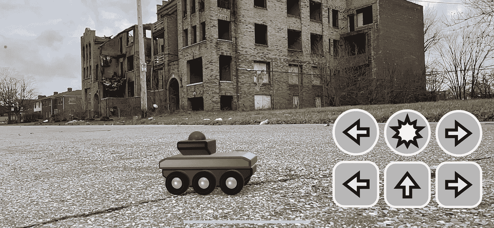
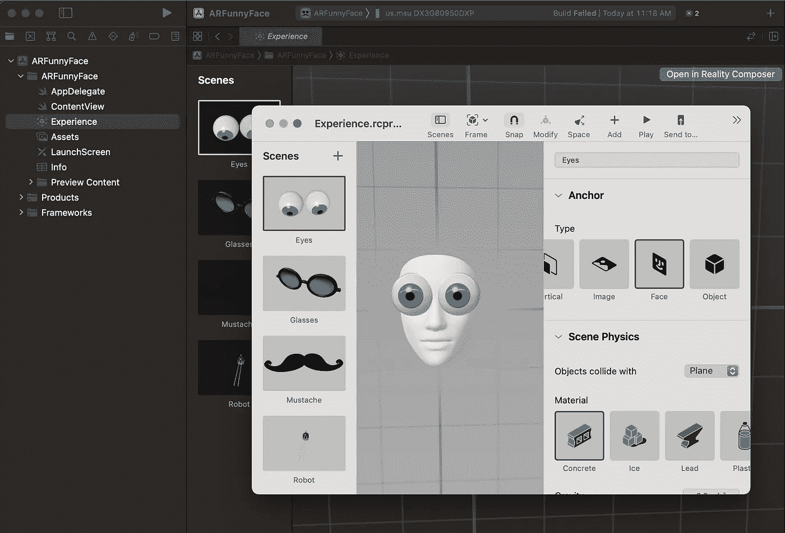
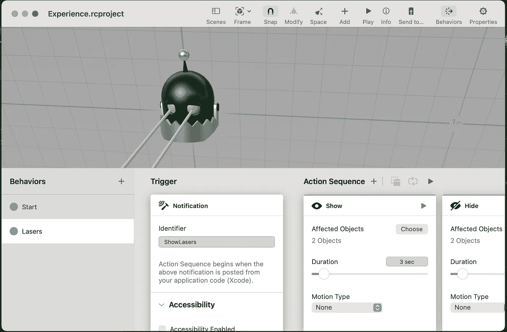

# 使用 SwiftUI、ARKit 和 RealityKit 在 iOS 设备上学习增强现实

> 原文：<https://betterprogramming.pub/learning-augmented-reality-on-ios-devices-using-swiftui-arkit-and-realitykit-d12321d1addd>

## 使用 Reality Composer 和 Xcode 构建您的第一个 AR 应用程序


由[本杰明·沃罗斯](https://unsplash.com/@vorosbenisop?utm_source=medium&utm_medium=referral)在 [Unsplash](https://unsplash.com?utm_source=medium&utm_medium=referral) 拍摄的照片

问候各位学习者！你对增强现实感到兴奋吗？！这篇文章旨在从一个初学者到另一个初学者，快速介绍为 iPhone 或 iPad 开发增强现实应用程序。

首先，简单介绍一下我自己。过去几个月，我一直在学习使用 Mac 和 Xcode 的基础知识，专注于开发 Swift 和 SwiftUI 的基础知识。

在涉猎了一点 UI 创建和 PencilKit 之后，我决定挑战自己，学习我能想到的最新、最酷的技术，增强现实(AR)。

这项技术看起来相当复杂，但实际上能有多难呢？让我们来了解一下！

# 要求

我建议使用苹果专有的硬件和软件:

*   装有 macOS Catalina 10.15 或更高版本的 Mac
*   Xcode 11 或更高版本(在 MAC 上免费)
*   iOS 13 或更高版本的辅助 iOS 设备([列表](https://developer.apple.com/forums/thread/122664))

# 结构

如果你还没有发现，苹果提供了一个详尽的[框架列表](https://docs.elementscompiler.com/Platforms/Cocoa/Frameworks/iOSSDKFrameworks/)，使得复杂的活动对于所有经验水平的开发者来说都是可接近的。

其中两个框架 ARKit 和 RealityKit 使 AR 应用的创建变得更加容易，让开发人员专注于他们想要创建的内容，而不是检测现实世界中的内容并做出反应所需的复杂算法。

## 阿尔基特

ARKit 框架于 2017 年底首次发布，使每个 iOS 设备都能跟踪周围的世界并理解它。

它通过检测摄像机输入中的`anchors`(水平和垂直平面、面部、图像和对象)并显示所述锚点周围的动态内容来发挥作用。

ARKit 现已发布第五版，其最新功能包括:

*   同时跟踪多达三张人脸
*   同时使用前后摄像头
*   通过纬度、经度和高度在特定位置锚定体验
*   能够使用新 iOS 设备中嵌入的激光雷达扫描仪来测量周围环境的深度
*   能够“用标识地板、墙壁、天花板、窗户、门和座位的标签创建空间拓扑图”
*   动作捕捉

想法并不会因为这种可能性而停止！

与其他框架一样，该工具包在文件开头加载了一行简单的脚本。

```
import ARKit
```

增强现实体验是在一个`[ARView](https://developer.apple.com/documentation/realitykit/arview)`中创建的，它可以通过以下代码导入到一个跨越屏幕的 SwiftUI `ContentView`中:

```
**return** ARViewContainer().edgesIgnoringSafeArea(.all)
```

鉴于`ARViewContainer`在别处被定义为:

```
**struct** ARViewContainer: UIViewRepresentable { **func** makeUIView(context: Context) -> ARView { **let** arView = ARView(frame: .zero) // Load the "Box" scene from the "Experience" Reality File **let** boxAnchor = **try**! Experience.loadBox() // Add the box anchor to the scene arView.scene.anchors.append(boxAnchor) **return** arView } **func** updateUIView(_ uiView: ARView, context: Context) {}}
```

将最初的`ARViewContainer`行放在`ZStack`中，你可以很容易地在它上面创建一个界面。

ARKit 不包括的是渲染器。为此，我们需要一个现实工具包。

## 现实工具包

RealityKit 于 2019 年首次发布，是苹果公司为 AR / VR 开发制作的最新 3D API。

它不仅是基于 ARKit 构建的，还可以执行多线程渲染，以创建令人瞠目结舌、响应迅速的 AR 体验。字面上。

RealityKit 集成了许多苹果的其他框架，ARKit 和 Metal 在其核心部分进行理解和可视化。

该框架通过其实体组件系统(ECS)运行，该系统管理诸如动画、物理交互、播放声音和网络同步等任务。

目前，最多 6 个人可以同时分享一次 AR 体验！

在 Xcode 中创建的每个增强现实项目都包括一个`Experience.reality`文件，该文件默认显示一个带有微薄立方体的场景。

您会注意到视图右上角有一个小按钮，上面写着“在 Reality Composer 中打开”点击它！

## 现实作曲家

Reality composer 是 Xcode 附带的软件，允许用户围绕 ARKit 检测到的锚点创建“场景”。

Reality Composer 还被设计成可以在任何 iOS 设备上完全运行，正如你将看到的那样，界面非常友好。


打开时，请注意右侧显示的属性栏。您看到的立方体是“Object”类型的锚点，并且当前没有定义 AR 对象资产。

RealityKit 和 Reality Composer 都依赖于`.usdz`(由皮克斯团队开发)、`.rcproject`和`.reality`文件格式来显示 3D 内容。

从 iOS 12 开始。所有 iOS 设备原生支持 usdz 格式。如果你正在寻找转换一个. obj 或其他 3D 文件格式，我建议下载[现实转换器](https://developer.apple.com/augmented-reality/tools/#:~:text=objects%20on%20Mac.-,Download%20(43.3%20MB),-USDZ%20Tools)。

通常，模型作为模型实体(有时带有许多可以单独设置动画的组件)加载到 Reality Composer 中，然后配置为在相对于锚点的指定位置显示，并指定具有不同触发器和动作的特定行为。更多关于这个很快！

# 我的学习经历

我从一开始的计划就是在两周的时间里尽可能多的做一些指导。

最终，我选定了[苹果增强现实教程](https://www.raywenderlich.com/books/apple-augmented-reality-by-tutorials)，这是 Raywenderlinch 团队的一本书。它充满了精心解释的创建应用程序的教程，我可以在我的手机上测试。第一章指导我创建了一个应用程序，它可以和用户一起将一个小玩具坦克放入房间。

虽然我不打算学习 UIKit (SwiftUI 的前身)，但我很高兴完成这个，以获得对 UIKit 如何与 AR goodies 一起工作的基本理解。

提供了坦克模型(以. reality 文件的形式),教程带我创建了控制坦克的按钮，方法是将它们排列在故事板上，并用一些`Control + click`和拖拽动作将它们链接到代码。

尽管我正在努力学习 SwiftUI，但我确信学习 UIKit 语法将有助于我翻译 UIKit 的代码，ui kit 已经存在了很长时间。最后，一切都成功了！嘣！



在熟悉了 Reality Composer 之后，我开始了下一个主要任务。

这一次利用 SwiftUI 创建了一个界面，该界面使用用户的面部作为锚点，在滑稽的面部道具之间切换。

为了这个教程，我在 Reality Composer 和 Xcode 之间来回切换，在 Reality Composer 中创建了一系列场景，并使用一个名为`propID`的整数变量通过一些简单的按钮在不同的场景之间切换。

我的现实作曲家的工作流程如下所示。其中导入的每个对象都可以单击进入，改变右边的属性栏来编辑对象属性。



除了上面显示的左侧的场景栏和右侧的属性栏，Reality Composer 还有一个触发一系列动作的行为栏。



触发器可以来自内置定时器、用户点击和手势、靠近检测到的对象和/或应用内部指定的任何自定义分配的命令。

动作包括显示、隐藏、强调、移动、旋转、缩放、加力、环绕、旋转、改变场景、播放声音、暂停、将对象对准摄像机、注视摄像机以及播放. usdz 文件中定义的任何动画。

这一次，我学会了如何放置一个按钮来拍摄照片并保存到我的照片应用程序中。

是时候干掉邻居了！


作者图片

眼睑甚至旋转来模仿我的面部表情！这个世界没有机会了

总而言之，我从这次学习冒险中获得了大量的乐趣，并将很快回来！我在下面列出了一些有用的资源，可能会对你的学习冒险有所帮助。

# 苹果资源

*   [增强现实系统能力](https://developer.apple.com/design/human-interface-guidelines/ios/system-capabilities/augmented-reality/)
*   [ARKit 文档](https://developer.apple.com/documentation/arkit/)
*   [现实工具包文档](https://developer.apple.com/documentation/realitykit/)
*   [认识真人秀作曲家](https://developer.apple.com/videos/play/tech-talks/610/)
*   [使用 Reality Composer 创建 3D 内容](https://developer.apple.com/documentation/realitykit/creating_3d_content_with_reality_composer)
*   [配置场景中的元素](https://developer.apple.com/documentation/realitykit/creating_3d_content_with_reality_composer/configuring_elements_in_a_scene)
*   [快速查看图库](https://developer.apple.com/augmented-reality/quick-look/)(带动画的 3D 对象示例)
*   [使用 Core ML 和 ARKit 创建优秀的应用](https://developer.apple.com/videos/play/wwdc2019/228/)

# 额外资源

*   [AR 的未来:10 个牛逼用例](https://www.youtube.com/watch?v=WxzcD04rwc8)，[现实派](https://www.youtube.com/user/ryankopinsky)
*   [手机增强现实设计快速指南](https://medium.com/@goatsandbacon/a-quick-guide-to-designing-for-augmented-reality-on-mobile-part-1-c8ecaaf303d5)——[布什拉·马哈茂德](https://medium.com/u/6a2a03dc72ad?source=post_page-----d12321d1addd--------------------------------)
*   [使用 Reality Composer 和 RealityKit 构建 3D AR 应用](https://www.appcoda.com/reality-composer/)
*   [用 RealityKit 搭建 AR app](https://www.ralfebert.com/ios/realitykit-dice-tutorial/)——[ralfebert.com](http://www.ralfebert.com)
*   [如何使用 ARImageTrackingConfiguration 检测图像](https://www.hackingwithswift.com/example-code/arkit/how-to-detect-images-using-arimagetrackingconfiguration)