# 这是一个我，一个核心 ML 对象检测器模型

> 原文：<https://betterprogramming.pub/learning-coreml-with-fun-6e4b0fdfbbd>

## 如何使用 Turi Create、注释工具和 Python 识别世界上最著名的水管工

Cláudio Luiz Castro 在 [Unsplash](https://unsplash.com/s/photos/mario?utm_source=unsplash&utm_medium=referral&utm_content=creditCopyText) 上拍摄的照片

从游戏的第一个街机版本开始，我就是一个马里奥迷。自从 iPhone 时代开始以来，我一直是一名移动应用软件开发人员。而且我一直对机器学习这样的新技术很感兴趣。本教程将结合所有这些兴趣，使用 [Turi Create](https://apple.github.io/turicreate/docs/api/) 、注释工具和 Python，带您从零开始了解一个可用的 [Core ML](https://developer.apple.com/machine-learning/) 对象检测器模型。

# 开始

Core ML 是苹果公司在 2017 年推出的一种新的机器学习框架。开发人员现在只需几行代码就可以在他们的应用程序中实现机器学习，这使得 Core ML 成为向您介绍使用它的最佳框架。就我个人而言，自从 2017 年 WWDC[第一次核心 ML 会议以来，我就对机器学习着迷了。](https://developer.apple.com/videos/wwdc2017/)

在过去的两年里，我跟踪了所有的核心 ML 会议，并做了一些基于核心 ML 框架进展的概念证明，主要是关于图像和对象检测。

当然，当我使用各种来源的预编译模型时，一切都很顺利。这是一个经常更新的列表:

 [## likedan/Awesome-CoreML-Models

### Core ML 最大型号列表(iOS 11 以上)。通过创建……为 likedan/Awesome-CoreML-Models 开发做出贡献

github.com](https://github.com/likedan/Awesome-CoreML-Models) 

但几个月前，我决定深入调查。我的目标是从头开始创建一个自定义模型，以便在 iOS 应用程序中使用。经过几天的学习，我学会了如何用“简单的方法”来做这件事:使用 Core ML 2 和 [Swift Playgrounds 创建一个苹果教程中看到的图像检测器模型。](https://www.apple.com/swift/playgrounds/)

[这个](https://developer.apple.com/documentation/createml/creating_an_image_classifier_model)对于“图像分类”来说是一个非常简单明了的解决方案，但是一个能够从视频流中实时检测出一些东西的模型怎么样呢？我意识到我需要一个物体探测器模型！关于这个还有另一个很好的教程，但是我想要的东西不见了…

 [## 在实时拍摄中识别对象

### 借助视觉框架，您可以识别实时捕捉中的对象。从 iOS 12、macOS 10.14 和 tvOS 12 开始…

developer.apple.com](https://developer.apple.com/documentation/vision/recognizing_objects_in_live_capture) 

该模型已经完成并经过测试，但没有关于如何从头构建您自己的模型的具体信息。

经过几天的研究，我终于找到了正确的道路:[turi create](https://github.com/apple/turicreate)+[turi annotate OD](https://github.com/VolkerBb/turi-annotate-od)+[PyCharmCE](https://www.jetbrains.com/pycharm/download/)=马里奥模型。

让我们通过一步一步的指导来深入创建我们的第一个定制模型。

# 准备您的图像数据集

创建一个名为`MarioML`的目录来保存您想要用来训练您的模型的所有图像，并划分到每个主题的子文件夹中。在这个例子中，我选择了马里奥、桃子、布瑟和蟾蜍。

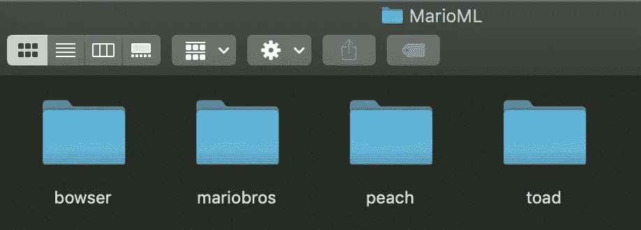

创建`MarioML`目录，为我们想要识别的每个主题创建一个文件夹

重要提示:使用最大 1024x768 的 JPEGs，每组至少 20 张不同角度和位置的图像。

识别马里奥的一个很好的“开始集”

# 为您的图像添加注释以进行对象检测

没有快速的解决方案来做到这一点。有一些商业选项，如 [RectLabel](https://itunes.apple.com/us/app/rectlabel-for-object-detection/id1210181730?mt=12) 、 [Diffgram](http://diffgram.com) 和 [Labelbox](https://labelbox.com) ，但是我想要完全免费、简单、即时的东西，不需要订阅或应用内购买:一个简单的对象注释器。

[Turi Annotated OD](https://github.com/VolkerBb/turi-annotate-od) ， [Volker Bublitz](https://github.com/VolkerBb) 的“一个简单的 Mac 应用程序，使用 Turi Create 为对象检测训练创建注释和准备图像”很好地满足了需求。

现在，克隆 repo，打开 Xcode 项目，编译应用程序，然后运行。您应该有这样的用户界面:

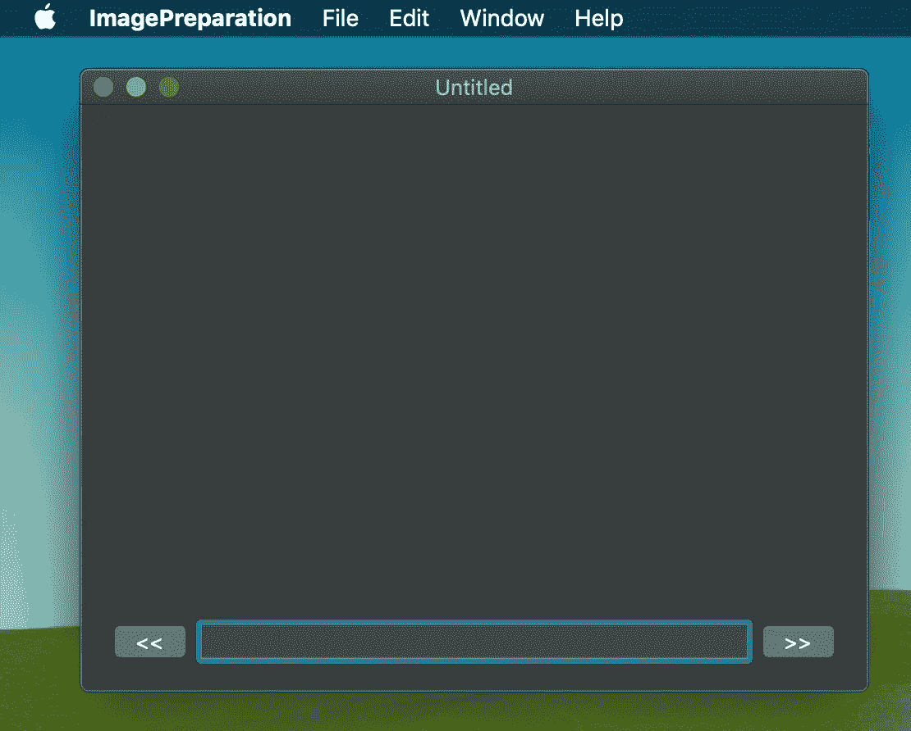

这款 Mac OS 应用非常简单，而且运行正常

点击“文件”>“导入图片”并选择正确的文件夹，开始在`mario`文件夹中添加标签和注释。

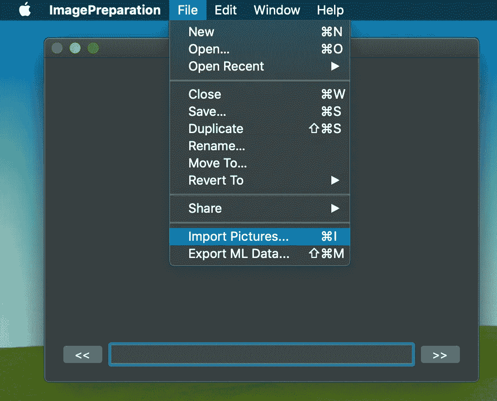

从 mario 文件夹导入图片

之后，您必须为每个图像标记并创建一个正确的边界框注释，如下所示:

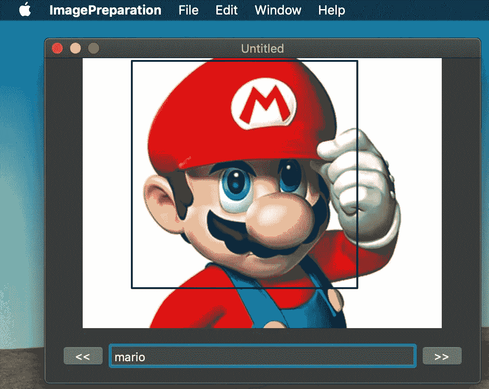

模型数据准备:标签和注释。

当您完成所有的图像(您可以使用左右箭头轻松地从一个图像移动到另一个图像)时，您就可以导出您的数据了！

导出 ML 数据过程自动创建所有必要的文件来完成我们的定制模型

点击“导出 ML 数据”并选择一个项目名称。之后，您应该有一个名为`MLExport`的新文件夹，其中包含所有正确的文件，可以继续创建模型。

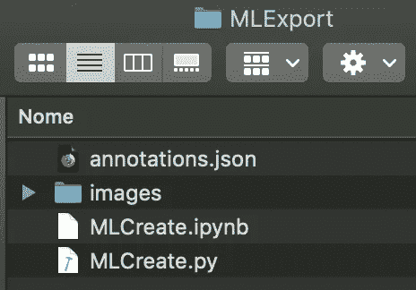

MLExport，为我们的定制核心 ML 模型准备好所有文件

关于`MLExport`目录内容的说明:

*   `annotations.json`包含我们之前定义的带有标签和边界框的 JSON 文件；
*   `images folder`是创建模型所需图像的原始副本；
*   `MLCreate.ipynb`是一个[项目 Jupyter](https://jupyter.org) 笔记本模板。它可以用于运行所有 Python 代码的逐步调试；
*   `MLCreate.py`是我们将用来创建定制模型的 Python 代码。

# 运行 Python 代码

下载 [PyCharm CE](https://www.jetbrains.com/pycharm/download/) ，这是一个 Python 的 IDE，它有一个很好的 UI 来管理插件、模板和 Python 虚拟环境。

 [## py charm:JetBrains 为专业开发人员提供的 Python IDE

### Python & Django IDE 具有智能代码完成、动态错误检查、快速修复等等...

www.jetbrains.com](https://www.jetbrains.com/pycharm/) 

安装完成后，打开创建的`MLCreate.py`文件或将其与 PyCharm CE App 关联。双击该文件，PyCharm 将打开以下屏幕:

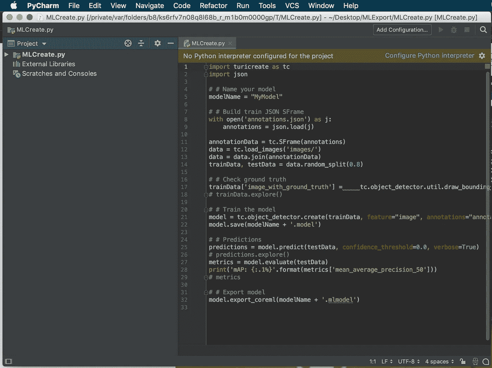

如果您没有配置 Python 解释器，不要担心！只需双击“配置 Python 解释器”，选择 Python 2.7 版或以上作为虚拟环境。有了这个特性，您可以轻松地为演示更改 Python 版本，而无需修改操作系统上的 Python 版本。

如果您在导入行中出现错误，请打开 PyCharm 首选项，转到“Project Interper”，添加所有需要的包。管理包和版本的 UI 很简单。

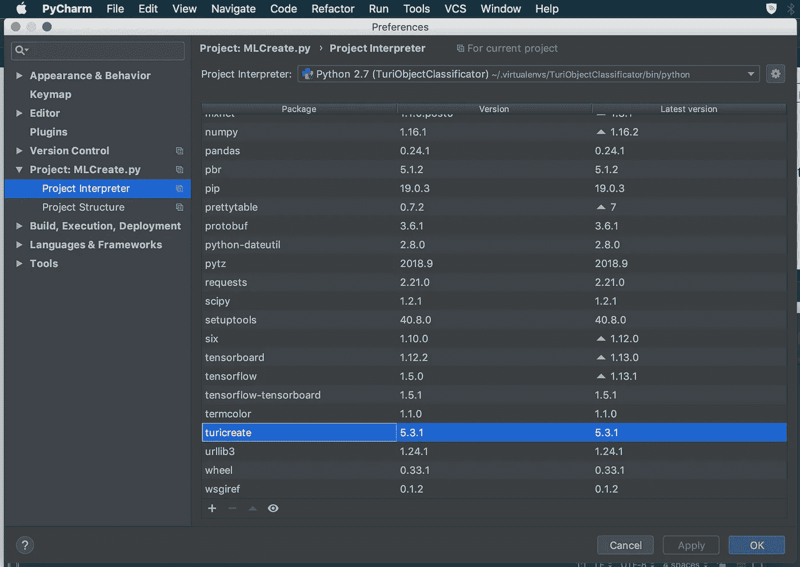

现在单击“确定”并选择 Python 文件来运行脚本:

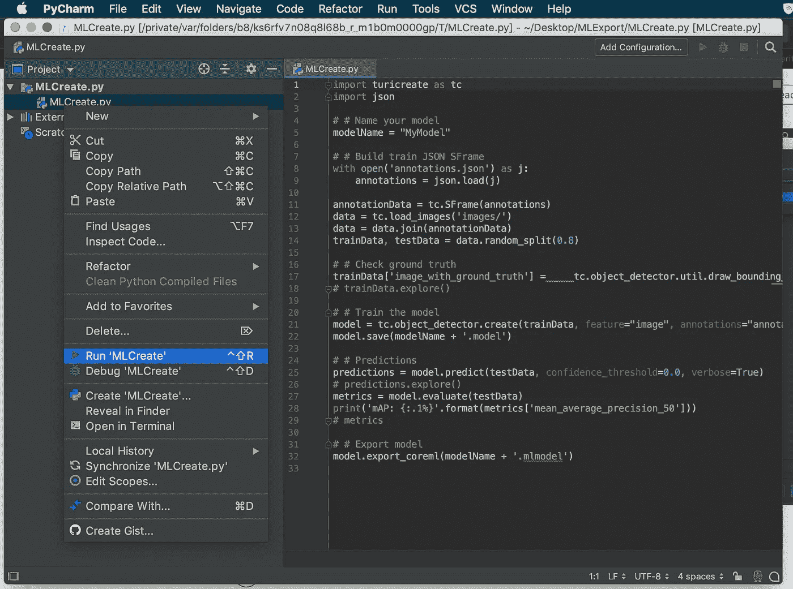

运行 MLCreate 启动脚本

这个演示只有 20 次迭代。然而，为了达到最佳效果，我的建议是从 100 个或更多的开始训练(取决于你的范围)。通过改变迭代次数和测试数据的百分比来尝试不同的设置，以优化您的最终模型。

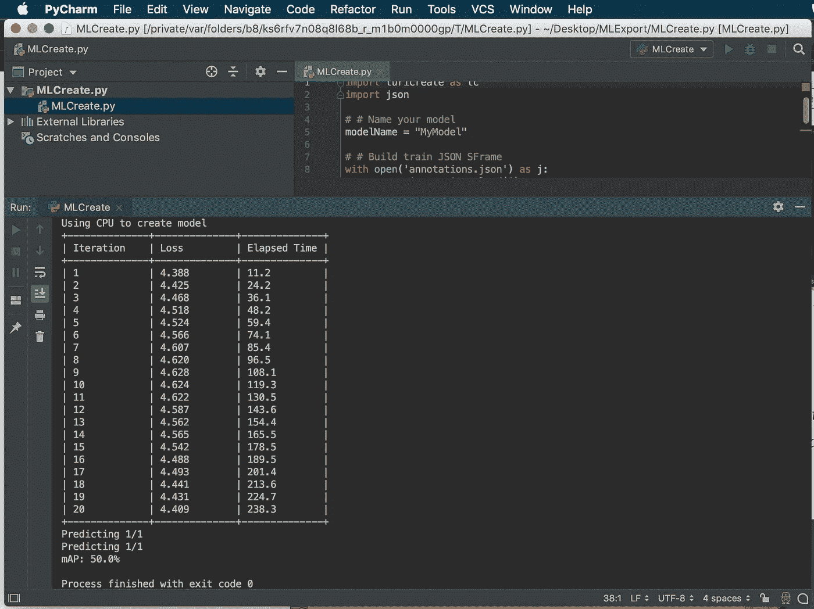

运行 Python 脚本

从日志中可以看出，MAP(平均精度)不高。一个建议是增加迭代次数。最后，您应该在同一个目录中找到生成的核心 ML 模型`Mymodel.mlmodel`，准备集成到您的 iOS 项目中。**Turi Create 生成的模型是一个流水线[暗网 YOLO](https://towardsdatascience.com/yolo-you-only-look-once-real-time-object-detection-explained-492dc9230006) :**

**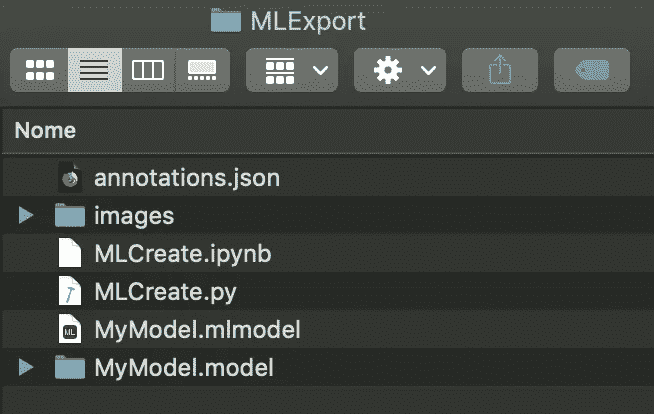**

**MyModel.mlmodel 已准备好用于 iOS 项目集成**

# **将您的定制模型集成到现有的 iOS 项目中**

**对于这个演示，我使用了前面提到的由苹果公司使用 [Vision](https://developer.apple.com/documentation/vision) 框架和核心 ML 对象检测制作的演示项目:**

 **[## 在实时拍摄中识别对象

### 借助视觉框架，您可以识别实时捕捉中的对象。从 iOS 12、macOS 10.14 和 tvOS 12 开始…

developer.apple.com](https://developer.apple.com/documentation/vision/recognizing_objects_in_live_capture)** 

**下载示例代码，并通过将文件拖放到主项目目录中，将您的定制核心 ML 模型导入到这个项目中。如果一切顺利，您应该在项目中拥有新的模型和新生成的模型类，如下所示:**

**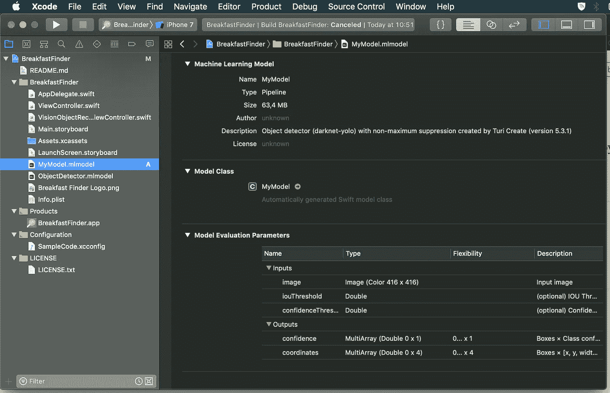**

**将 mlmodel 拖放到您的 xCode 项目中**

**在您的设备上运行演示之前的最后一件事，打开文件`VisionObjectRecognitionViewController.swift`并找到从`Bundle`示例中加载模型的行:`guard let modelURL = Bundle.main.url(forResource: “ObjectDetector”, withExtension: “mlmodelc”)`。**

**将资源名替换为您的模型名:`guard let modelURL = Bundle.main.url(forResource: “MyModel”, withExtension: “mlmodelc”)`，并在您的设备上编译。演示的结果将类似于下面的视频:马里奥的面部被检测到，置信度为 1.0。**

**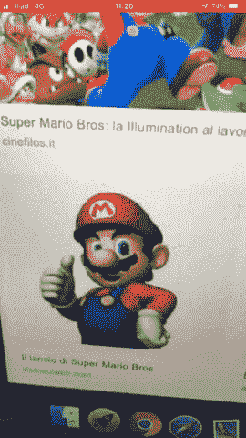**

**探测马里奥！妈妈咪呀！**

****版权说明**:马里奥和本演示中提到的所有角色都是[任天堂](https://www.nintendo.com)的财产，仅用于在机器学习上创造一个有趣的旋转。**